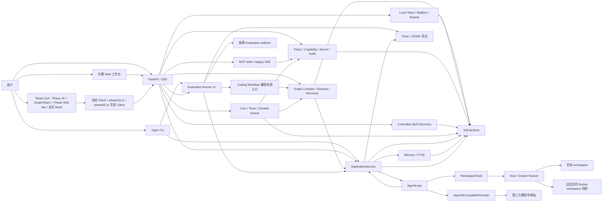
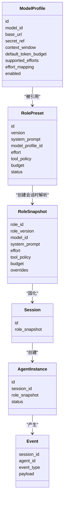
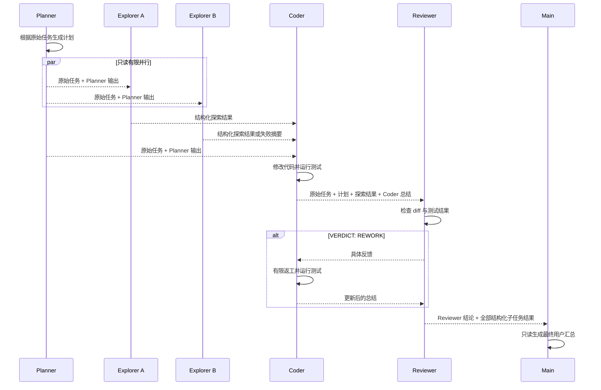

# Operant 项目架构与实现说明

> 文档状态：持续维护
>
> 最后更新：2026-09-16
>
> 对应版本：B2-4 / MP-3 本地交付（SQLite v16；additive `b2-4.v1`；User接受Host性能限制）

本文档是 Operant 当前架构、模块边界和实现状态的唯一权威说明。README 只保留项目简介和
常用命令，学习资料和个人规划不作为项目实现依据。

`docs/项目架构.md` 描述中长期 Harness Kernel 目标，`docs/UI_UX_DESIGN_SPECIFICATION.md`
描述目标客户端设计。两者都是规划文档，不代表对应能力已经实现；如与本文、源码或测试冲突，
当前实现以本文、源码和测试为准。

## 仓库检查与源码发布

日常 CI 对 PR 和 main 提交运行，保留 Python 3.10/3.12，补充 TUI 定向测试，并加入 GUI 测试、类型检查和构建。
按变更范围选择检查，明确的文档改动轻量结束，SDK、工作流、脚本及未知路径保守运行两侧检查；
必需检查名保持稳定，范围判断失败会阻断检查。新 PR 提交取消旧运行，避免重复消耗。
CodeQL 使用默认配置提供扫描结果，不增加额外硬性合并门槛。桌面/分发候选的完整构建保持手动触发；
GitHub Beta 源码预发布固定 Git 标签，不代表签名、公证、自动更新或公网部署验收。

## 1. 项目定位

Operant 是一个由角色预设驱动的多模型 Coding Agent Runtime。

用户可以创建 Model Profile 和 Role Preset，再用指定角色创建 Session。Session 创建时会
保存不可变的 `RoleSnapshot`，因此后续修改角色不会改变历史任务的执行配置。

项目当前的核心目标是打通以下流程：

1. 配置多个真实模型；
2. 创建带有提示词、模型、effort、工具权限和预算的角色；
3. 使用角色启动 Agent Tool Calling Loop；
4. 让 Agent 在选定 workspace 中读取、修改代码并运行命令；
5. 保存 Session、Agent、Snapshot 和运行事件；
6. 按 Planner → 只读 Explorer → Coder → Reviewer → Main 汇总运行相互隔离的 Agent。
7. 以 SQLite 任务记录和阶段检查点支持基础恢复，并用 Web 工作台观察完整任务。
8. 用可复现快照、隔离 artifact、外部验证、指标聚合和 Trace 根因分析对 Session/Workflow 做评测。
9. 通过单一 Schema 生成客户端，并让 React GUI 在明确的 live 模式中连接本地 Core；Mock 仅作为
   明确标识的演示模式保留。
10. 把 Workflow Definition、发布 Revision、Graph Run、NodeRun 与 NodeAttempt 分开持久化，以编译期
    校验、运行边界和已提交事实支持 Graph 恢复；现有 Coding Workflow 作为兼容入口投影到同一运行时。
11. 用本地 Team、Roster、定向 Mailbox、Task/Artifact Board 和幂等 Ack 支持单 Core 内协作；消息只做
    投影与上下文输入，不裁决 Graph、Approval 或副作用。
12. 用统一 Policy、Capability Lease、Secret Lease 和只追加 Audit 在副作用前失败关闭，并把
    受控 Skill Discovery 与 MCP 工具调用纳入同一 Action Gateway。
13. 用 Cron/一次性 Timer 生成持久 RunRequest，由单 Scheduler Leader 和单 Runtime Writer
    通过带 fencing 的 Job Lease 幂等地启动已发布 Graph Workflow。
14. 把 Remote Control 与 Remote Execution Target 分成两个领域：前者让已配对设备控制本地 Core，
    后者让本地 Core 把受控 Job 派给授权 Target；二者都不能绕过 Action Gateway。
15. 以短时配对、设备身份、应用层端到端加密、Host Ack 和短 TTL opaque Envelope 提供单 Host
    Remote Control 与自托管 Relay MVP，本地 SQLite 继续是恢复权威。
16. 以独立 Writer Workspace、哈希化 Lease、所有权、Patch/Commit Artifact、冲突与显式 Merge Node
    支持多个 Writer；真实 Git 修改只在管理员映射的隔离 worktree 内验证和合并。
17. 通过受限生产启动器提供 TLS/WSS 直连 Gateway、HTTPS Host/Target Connector，并将连接与
    Container Writer 生命周期事实继续落到本地 SQLite 权威。
18. 让 React PWA、Textual TUI 与 Tauri 薄壳统一消费生成 Client；客户端只保存有限 UI 状态，断线后
    仍以 Query、Cursor 和服务端 Projection 校正。
19. 为私有网络部署提供单用户 OAuth 2.0 Authorization Code + PKCE；Token 只在当前 Core 进程内存中
    保存，重启后必须重新登录。
20. 交付可复现的候选构建、依赖闭包 SBOM、安装 smoke 与发布检查；候选产物未签名时明确标记为
    `unsigned_candidate_not_for_release`，不能冒充正式发布物。

## 2. 当前完成度

### B2-5 / MP-4 整理与治理（集成验收中）

本批唯一范围和证据入口为 [B2-5任务包](design/b2-5/task-package.md)。当前源码已增加以下能力；完整门禁、原生最终验收与独立审查尚须以该包逐项结果为准，不能把代码存在视为本批完成。

SQLite v17 在冻结的 v1～v16 上追加治理来源、关系/依赖、候选期限/复核、维护作业与水位、命令和事件表；唯一正式发布头和不可变版本仍在 Memory Ledger。迁移拒绝篡改旧校验值，非空治理证据禁止降级清表。数据集删除在 Host 清理屏障后清理 dataset-owned 新表，原始 Item 与已发送 Context 按既有历史保留规则处理。

`memory_plugins/governance.py` 提供项目 canonical Item 历史搜索与按需展开，固定 Cursor 分页，区分当时记录和当前约定；不读取或复制私人 Mailbox。治理来源仍校验当前项目、版本摘要、可用性及权限；原始来源被不同记忆摘要引用时递归去重，不增加独立证据数。冲突/替代关系只记录精确版本，Proposal 未确认不移动发布头。有效时间与复核期限在服务端检查，来源撤销传播到派生依赖；正式 Runtime、Host 授权和兼容查询均阻断失效来源。已有 Run 的知识截止点仍可引用历史版本，但当前撤销与时效优先；已发送内容保留，污染历史的后续发送失败关闭。

B2-5 批量审阅携带精确 proposal_id、proposal_revision、proposed_version（含摘要）和 base_head_revision，先核对整批再同事务接受/拒绝、写审阅审计，不能部分确认。接受前重新检查复核期限与来源；未解决conflicts_with拒绝发布，supersedes接受时原子退役目标head，目标已变化则整批回滚。过期或head已变化的精确候选仍可被用户拒绝。B2-3 老确认入口拒绝带治理元数据的候选，要求使用新契约。人工修正同样先形成候选；后台语义提取固定为 inferred，不可自我确认。

`memory_plugins/maintenance.py` 通过已发布的有限单节点 Workflow 和原 Scheduler RunRequest/租约调度执行。每个 ModelProfile 的定义锁定其摘要；仅 B2-5 已登记的精确 RunRequest、Workflow版本和完整快照可进入维护执行器，随后仍经过原 Graph Action Gateway。发布定义含明确维护执行标记，已入队但登记缺失时进入manual reconcile，不回退普通Graph；未知模型结果不能因数据库提交幂等而自动重试。真实 GraphRun/NodeAttempt 保存运行与终态；不存在以 Relay/本地任务ID冒充 GraphRun 的路径。源码/插件包、绑定与权限 epoch、Host配置、模型、来源 Cursor 与预算在作业创建时固定，Host RunLease 跨越模型调用，在提交前重新验证；候选版本/Proposal、来源依赖及处理水位同事务提交。

维护模型通过无工具正式 Session 调用，维护自身 Thread 从后续提取来源中排除。有限来源批次只推进到实际处理截止点，无新来源不调用模型或产生例行候选通知。前台已有 Session 租约时后台让步，维护调用全局并发为一，输入预算在模型调用前检查；Token按实际usage单独计量，未知美元成本保留未知。失败不改写原始任务结果，未完成提交不推进水位；失败与取消使用持久 Scheduler/Graph 状态及原 DLQ 显式重试，关闭/重开不能使旧租约恢复有效。默认 Host 后台开关关闭，B2-5治理入口显式设置；旧插件配置中的维护关闭也同步到Host开关。

Additive `b2-5.v1` 由 `api_b2_5.py` / `contracts/b2_5.py` 生成 OpenAPI、digest、Python/TypeScript Client。Query包括当前知识/候选、历史/详情、增量治理事件和实际Context的当前来源/时效影响；副作用命令经 Action Gateway 与持久幂等journal。事件只包含对象引用与动作，重复命令不重复通知，未知写结果不能自动重放。完成回执与事件同事务；业务提交后崩溃、回执未完成时，持久journal及Projection显式保留待核对command id，启动恢复一次性发出outcome_unknown事件，不推测成功、不重放业务。GUI通过生成 Client 接入候选/冲突收件箱、精确批量确认、历史、来源/有效时间、后台开关/作业/Token/DLQ；断线保留只读投影，状态和确认范围以 Core 为准。上下文检查器保留原始实际发送内容，另显示当前失效或冲突提示。

真实 `gpt-5.6-luna` 验收已证明后台候选、人工确认、正式 Session 召回、无新来源零调用和撤销下一发送阻断；当前证据 `live-05.json` 固定全部src摘要，原始失败与脚本误判仍保留。原生治理与实际上下文走查见 `native-acceptance.json`；完整门禁首轮与受影响补跑见任务包。独立审查尚待收口，后续改动按输入摘要核对证据适用范围。

### B2-4 / MP-3 本地交付（含明确性能限制）

唯一状态与验收入口为 [B2-4任务包](design/b2-4/task-package.md)。B2-3的已完成事实保留；下述是当前源码，不能替代最终J2、性能门及独立审查。

SQLite v16 在原v15之上增加发布事件历史、trigram FTS索引、Run Manifest和Context Memory使用附表，保留v1—15的冻结校验值。旧库导入时只将当前head作为迁移截止点可知事实，不推断更早发布历史。Memory Ledger每次发布/停用由同事务trigger保存序号；Run按截止点选版本，但当前停用、删除、撤销与权限仍阻断。

`memory_plugins/retrieval.py`将任务拆成有限中文短词、标识符和普通词组；`MemoryManager.search`批量合并FTS/短词候选后按scope、role、agent、sensitivity、条件、来源和历史发布状态复核。候选去重后再排序并限制同来源占比。`recall.py`通过实际PluginHost调用安装的引擎，自动召回和显式引用合成同一Memory Pack；Session、Coding Workflow及本批Graph Agent经同一正式Session入口调用。Manifest事务合并各Session所用版本并保留较新的显式刷新，每次发送重新核对该Session已有历史权限；外部新增知识不进入既有Run；安全回合结束后可显式刷新或移出后续请求。撤销污染无法可靠剥离时拒绝继续旧上下文，需干净Baseline；不改写已经发送的历史。

Context Composer将普通记忆作为明确不可信证据加入实际Provider消息，记录包版本/来源/条件/原因；Memory使用附表与ContextRevision在同一事务保存并核对正文一致性，冻结旧Context协议保持原结构。新的`b2-4.v1`检查器Query返回最近50个typed扩展记录；共享Graph清单的控制在Graph终态执行，运行中拒绝刷新。总预算包括技能、历史、工具Schema和包装/输出预留；`token_counting.py`仅在模型ID精确匹配且有完整Provider wrapper时报告精确，否则明确保守UTF8估算，模型切换重新计数。

`api_b2_4.py`补充实际模板/Team/Role目录、从角色创建版本化编排及自动Roster绑定，新增命令走Action Gateway与持久幂等journal。GUI使用生成B24Client，协作页提供模板/成员选择、编辑发布运行、定向/群聊、任务/工件板与Agent信息；会话检查器显示实际Context/Memory Pack并控制后续选择。`BoundedGraphExecutor`首期驱动明确标记的Agent节点图，绑定真实Session/Thread/Agent与NodeAttempt，支持独立节点并行及依赖输入；其他节点在此驱动入口明确拒绝，不宣称通用Graph全节点执行。运行合计预算和节点预算分别约束，Team终态写入服务端投影。无记忆插件时普通任务可运行，声明强依赖的Graph启动拒绝。

Graph 重试保留原 Session/Thread，分配新的 Agent 并收窄剩余预算；旧 Roster 留作历史，新 Roster 与任务板受让人在同一事务更新。每次 Provider 请求重新读取该成员可见的消息、任务与工件，折叠工具结果按 tool_call_id 匹配；已终止成员不能接收新消息。工件发布的非空 recipient_ids 对应 recipients 可见性，空列表对应 Team 可见性。

协作目录在服务端按显式workspace过滤Graph运行，每页最多100条摘要，稳定Cursor携带前页排序值以继续读取；没有workspace时仅返回既有定义目录，不返回全局运行。GUI可加载更早运行并去重，正式B2-4运行不依赖legacy关联。摘要提供状态与Team关联，不返回运行输入/输出。生成契约digest为619168f06db1d9df2ba24403a3c29d662a6daa467a4a8d0d065693d04ade1933  operant-b2-4.openapi.json；目录分页已通过定向API/GUI检查，原生已通过第二页找回真实Graph/Team；Team仅通过显式按钮准备，已绑定或已结束的Graph禁用准备，Enter不重复提交。工作区过滤是发现范围，不额外宣称多租户授权隔离。

B2-4 当前补验：固定源码下正式gpt-5.6-luna/low在同Session验证显式记忆进入请求、移出/刷新后新Pack生效，撤销已使用记忆后在Provider前PermissionError停止，保留历史而不重放污染上下文。默认memory_plugin_mode=True且零安装时普通Session成功，Graph强依赖memory-standard明确拒绝。证据见本批j2-current/nextsend-real.json；此证据不替代Host性能或最终独立审查。

B2-4 命令使用自己的持久幂等 journal，避开通用投影条目数裁切；当前结果以 b24-public-result.v1 包络保存已脱敏的类型化投影，旧 journal 在重放时脱敏。空 Idempotency-Key 拒绝，重放返回同一公开结果及重放响应头。

标准记忆插件的可信进程内召回使用Python值传递，省去JSON值往返；请求和结果仍dump后按完整Schema重验，model_copy/model_construct产生的非法嵌套字段不会直接接受，配置、取消与正式Host检查保持执行。

Host继续检查当前租约、epoch、认证、包身份与来源授权；包digest缓存按完整目录inventory及device/inode/size/mtime/ctime/mode/nlink变化失效，正文变化重新流式hash。认证状态每次复核，校验过的不可变metadata按包digest复用，不扩大权限。保留目录逐项身份核验，未采用跳过检查的性能捷径。

本批已有 gpt-5.6-luna 正式 Session/Graph 单、双 Agent 记忆与只读工具调用的历史验收记录。原临时实施树和环境缺失后，源码已恢复到持久隔离工作树；恢复清单中的 172 个 Core/SDK/工件增量文件及 GUI 主入口产物与原版本哈希一致。历史数据和截图尚须按证据索引核对，不把恢复过程当作新的真实模型验收。当前恢复树已通过完整基础门禁969项、1项Docker条件跳过，GUI110项/typecheck/build及SDK确定生成；证据见本批gates/current-04-results.json和j2-current/evidence-index.json。当前固定环境J2单/双Agent、原生GUI及下一发送补证已经完成；gpt-5.6-luna/max独立Reviewer已关闭原目录P1/P2，当前产品增量无新增P1/P2，见review-current-closure.md。

性能历史报告保留集召回率0.9167高于旧基线0.75、禁用样例零泄漏，但Host性能门尚未满足；工件可见性增量的独立审查已关闭，见本批 review-artifact-closure.md。性能脚本将timing、allocation、observation放入独立库/Registry/Host；正式时延/CPU不启用额外计时或RPC编码统计，分配轮只增加tracemalloc，观测轮单独报告重建字节与调用计数。配置/POLICY、逻辑请求、每个结果和所有重复轮次的forbidden命中互校，未改冻结阈值，也不扣除观测耗时。该重构经独立审查和18项回归验证，见[观测分离验证](design/b2-4/gates/observation-split-results.json)；旧失败报告仍保留。当前产品性能门仍未通过，C完整扫描仅为诊断原型，尚未接入产品。2026-09-15 User指示停止微小性能优化，本批按[性能限制决定](design/b2-4/performance-scope-decision.md)收尾；功能/J2/独立审查完成，原Host性能比例未达仍如实保留，详见[交接](design/b2-4/handoff.md)。当前没有推送、合并、部署或迁移用户库。


### B2-3 / MP-2 记忆与管理集成（2026-09-13，已完成本批验收）

范围与门禁见 [任务包](design/b2-3/task-package.md)。以下描述当前源码；真实 gpt-oss-20b 正式任务/read_file/Context 与原生历史已通过（见本批 model-context-acceptance.json）。J1 生命周期/删除、基础管理、宽窄与错误重连已完成；冻结代码4678b40的完整门禁及指定Luna/max独立复核通过，见本批handoff.md与review-closure.md。

`memory_plugins/manager.py` 通过正式 PluginHost 安装目录中的两个独立包。`memory-standard` 使用来源提取与 Host 搜索，`memory-notebook` 使用键值笔记；认证进程内支持独立私有索引，隔离模式与索引重建通过Host受控读取当前发布版本后执行键名精确过滤；配置分别来自包内 Schema。两者共享 MP-0 Host DTO 与包内标准库 SDK，支持认证进程内与未认证隔离 stdio。Core 负责来源授权和唯一发布 head，插件不能自行发布、越过 scope 或把候选当成正式召回。

SQLite v15 增加 dataset-owned `memory_ledger_*` 与 `b23_*`，不改 v1—v14 migration checksum。Ledger 保存不可变版本、Proposal、CAS head、完整请求幂等摘要和来源。显式用户保存记录为 `user_asserted`；修改提议等待确认，旧版本保留。来源保存为当前项目的 canonical Item；旧数据显式迁入时标记 `legacy_unverified`，Core 映射 scope，旧 payload 不得覆盖。

HTTP/CLI 正式启动启用插件记忆模式：旧记忆写入口明确要求升级，旧读入口惰性初始化 Manager 并只代理已启用项目的已发布记录。旧 Workflow 的自动记忆注入与候选生成关闭；自动召回、压缩和索引调度优化属于 MP-3，尚未实现。直接构造 Python Service 的旧兼容模式仅保留历史调用与测试，不代表生产默认策略。

全局关闭先禁止新访问，再收集 Host 停止回执；未收束 Run 或插件返回 blocked/restart_required，不能报告全部完成。项目关闭、切换、归档与卸载同样经过停止屏障。重新开启只恢复显式操作能力，不补扫历史。keep 卸载保留 dataset，允许独立导出、同插件重新安装接回或显式删除。delete 必须先持久化清理计划，经 Host 资源/活动 Run 屏障后，Core 才清除该 dataset 的专属版本、提议、来源副本和结果缓存；保留 dataset tombstone。普通 Ledger delete 不提供物理清理权限，未知/共享/受保护资源保持阻断。历史 Item、Context、Skill、Artifact 和外部导出副本不随 dataset 删除，也不宣称磁盘安全擦除。

`api_b2_3.py` 提供协议协商、管理 Query 与 typed Command。每个命令经过 Action Gateway；自己的幂等 journal 保留完整业务结果，删除数据后旧数据结果明确不可再取。响应保留类型结构并脱敏，超预算显式失败。`generate_b2_3.py` 从同一 Pydantic/FastAPI 源生成 `b2-3.v1` OpenAPI/digest 与 Python/TypeScript Client；CLI `operant memory manage` 使用生成 Client。

GUI 的项目、知识、插件、记忆设置、Skill、保留与审计页消费同一管理投影。项目注册绑定绝对 Workspace，编辑、归档或解除关联不删除源码。设置按作用域与字段保留值/来源实际变化的独立时间，旧记录无法追溯时显示 unknown；Role 使用其不可变版本的创建时间，变更只影响新 Session 快照。解除关联只清除所选记忆插件，不改变归档状态；归档由独立命令负责。Skill 经发现、显式安装、项目启用、停用和卸载，安装副本校验 digest；运行时以单独 guidance 加入正式 Context，不扩大 Tool Policy。Artifact 页调用既有 Pin/归档/宽限期/Trash/恢复与审计，并呈现正式审计扫描数和发现详情，保留受保护引用屏障，不提供清空全部或物理 purge。

### B2-2 / MP-1 与基础任务接入（2026-09-12，已完成本批验收）

本批从 `8851a23` 独立实施，验收范围和当前证据见 [任务包](design/b2-2/task-package.md)。
`src/operant/plugins/` 提供显式安装与 Registry、受控认证记录、配置绑定、Run fencing、资源登记及
keep/delete 清理续做。Registry 使用单写文件锁和原子 JSON journal；重启使旧活动 lease 失效，不重放
RPC或自动重装插件。此版本不改 SQLite v14，不实现 MP-2 记忆引擎、数据迁移或新召回。
Run释放按lease身份和fencing清除活动标记，终态释放幂等；迟到旧lease不会解除新Run的停止/卸载屏障。

插件共用 `contracts/b2_1.py` 的 typed Host API。认证进程内方式加载已核对包的 `create_plugin()`；
它是认证信任边界，不是沙箱。未认证 stdio 使用 macOS sandbox-exec、独立目录及隔离Python参数
`-I -S`，启动前真实检查受控 Home 文件、目录外写入与回环网络拒绝；沙箱不可用则拒绝。
受管私有索引的读写删与资源登记逐级持有目录句柄并拒绝符号链接；写入前校验普通文件及单链接，读取按响应预算限量，防止路径校验后中间目录替换与无界读取。首版依赖限定为标准库/包内代码，不安装环境任意依赖，不宣称跨平台沙箱或线上CA。
包、依赖/权限文件指纹、认证撤销与epoch在调用/提交时复核；资源预算、取消、迟到拒绝和未知清理
状态不因cleanup Hook缺失而绕过。stdio 复用进程按并发准入、RPC超时、采样RSS/CPU执行预算；空闲复用不视为请求超时；超限停止独立进程组并标记失败。采样允许短暂超调，认证进程内插件仍是合作式资源边界。当前issuer、scope、存储lease与全局启用状态在Host回调入口复核。`create_app(plugin_host=...)` 是显式受信任启动注入面，由Core负责
shutdown关闭；普通启动默认无Host/无引擎，插件HTTP管理与默认记忆绑定仍属B2-3。
Host回调要求Core提供来源/记忆引用授权器，按真实记录核对dataset、scope、revision/digest和可用性；缺少授权器时拒绝。
Host另行强制来源与当前scope/permission epoch一致、记忆引用属于当前dataset，模型Profile仅来自绑定的提取/重排配置。
异步回调返回后重查lease及来源授权并验证结果关联。MP-1不隐式授予跨scope来源；尚未接入生产记忆检索/模型回调。
直接engine入参及返回值也经过同一Core授权边界：来源、记忆引用、Head与Proposal逐项核对，缺少对应授权器拒绝；结果须关联request/event及watermark。
Manifest能力限制嵌套Host API：recall才可search，extract/recall/maintain可请求授权来源。模型Profile还绑定当前engine操作：extract仅可用提取配置，recall仅可用重排配置；同时声明两能力也不能跨阶段使用Profile。仅索引通知不授予外部读/搜索/模型访问。
停止、卸载和Host关闭先阻止新运行，再对在途调用及关闭/清理钩子作有界等待。未收束的可信代码保留task/engine/资源并返回restart_required，禁止同Host重新启用；同步关闭/清理钩子在工作线程执行，不能物理强杀线程。清理使用目录句柄递归删除，不跟随symlink；路径异常形成可续做blocked条目。
同一安装的stop/uninstall/resume_cleanup使用生命周期锁，Host关闭自身也互斥；关闭期间排队的新请求返回明确restart_required回执。绑定配置在入口生效：maintenance_enabled关闭则拒绝maintain，recall及嵌套search不得超过recall_token_budget；默认零预算允许零分配请求，实际召回内容编排/后台调度仍属后续阶段。

`api_b2.py` 将已提交 Session/WorkflowRun 投影为保留来源身份、动作与明确Workspace关联的任务。
精确任务Query不受列表分页影响，跨来源同ID必须消歧。历史来自canonical Item、AgentInstance与
不可变Session snapshot；已绑定当前Session的Thread在正式运行时保存用户/模型消息、工具及生命周期事实，Runtime Event与对应Item同事务提交。每轮固定此前Item cursor，避免当前轮历史重复进入上下文；普通引用Thread保持只读，旧事件不批量迁移。未绑定Thread不生成消息，Task不伪装成TeamTask。
Agent创建失败时保留无Agent的`session.run_failed`事实并在绑定Thread写入系统Item；Task按该失败与后续新Agent的时间顺序显示失败或新轮状态，不伪造Agent行。
Additive `b2.v1` 从FastAPI/Pydantic经 `sdk/protocol/generate_b2.py` 生成Schema/digest及Python/TS Client，
补模型/角色配置、已登记Workspace首个Thread创建、任务/历史与取消；旧五协议和MP-0契约不变。安装环境可用绝对路径
`OPERANT_B2_SCHEMA_DIGEST_PATH` 提供digest，不用常量伪造协商。

GUI通过生成Client接入模型/角色配置、分页AgentInstance及真实状态、Task/Run详情、分页历史和取消；Core Projection与epoch清理
防止旧请求覆盖新选择。取消终态从Session Task读取，Thread生命周期不冒充运行状态。AgentInstance/Task投影优先读取已提交的Agent终态事件，避免流关闭中断cleanup后显示过时running行；cleanup状态更新放在不可跳过的finally内。历史Query逐字段脱敏保留类型结构；只读历史错误不创建命令结果未知状态。模型ID来自Discovery，secret_ref只存引用名；新Role默认无工具权限，编辑
既有Role不改变tool_policy；Role新版本不回写已创建Session快照。取消accepted是请求接收，不能
标为执行完成。Workflow详情链接既有Graph监控/安全恢复，仍保留未知写入人工核对边界。
会话取消按钮读取B2 Task的服务端动作权限，Agent启动/审批/终态后刷新；已结束或无活动lease时不因Thread仍active而启用。
Antigravity的任务行样式来自 `a0a4a5d`，Codex按原生窄屏结果补断点修复；B2配置表单使用Modal显式portal，默认其他调用不变，Live对话历史按正常文档流避免窄屏重叠。HTTP开发WebView使用同源Vite代理，正式Tauri协议及
`tauri.localhost`保持固定本机Core；`OPERANT_CORE_URL`仅控制开发代理目标。

本批真实桌面、完整门禁和指定Reviewer已通过，代码518bb3f；准确覆盖与未覆盖项见本批交接和验收记录。
B2-3/MP-2、项目CRUD、后续Graph/Team交互及发布签名不在本次授权范围。

### B2-1 / MP-0 增量（2026-09-09）

基于 main `ecb0043` 新增离线契约 `src/operant/contracts/b2_1.py`：Project/Workspace、Task 来源、
Agent 配置与实例、插件数据集/资源/认证、Memory Head/Proposal/CAS、Manifest/Context 使用和 Host RPC。
`sdk/protocol/generate_b2_1.py` 从同一 Pydantic 源生成两份独立版本的 JSON Schema/digest 与
Python/TypeScript Client 接口声明；**未注册运行 API、未实现 PluginHost、未执行用户库迁移**。
当前数据库仍为 SQLite v14；实际 Beta 协商字符串为 `beta.v1`，现有五个协议保持不变。

源码核对、迁移映射、合成 fixture、旧直接策略评测与限制见 [B2-1 契约边界](design/b2-1/contract-boundaries.md)
和 [源码基线](design/b2-1/source-baseline.md)。新契约 workspace 引用只返回 hash；旧 ProjectProjection
仍可能返回绝对 workspace_ref，不以新契约声明反推旧实现已完成路径隐藏。
本批完成状态及验证结果见 [交接](design/b2-1/handoff.md)，不得将契约准备等同于 MP-1 或产品验收。
GUI-L0 集成 Antigravity `ce2ab66` 的嵌套路由、旧深链和 Demo Hook 隔离，模式切换清空演示选择。
旧 HttpClient 的合成 Thread/消息/Context/审批/Graph/Workflow/Remote 与伪造 SSE Cursor 路径显式失败；
已有协商生成 Client 继续承载受支持 Live 功能。真实 Tauri debug WebView 已验证本批隔离、别名、嵌套深链与刷新，见 [原生证据](design/b2-1/tauri-native-evidence.md)。
Core 预检失败明确显示；本批没有成功模型链路或打包发布产物验收。


### 已实现

- Pydantic 领域模型；
- Model Profile 创建、查询、更新、停用和健康检查；
- Role Preset 创建、复制、停用和版本记录；
- Main、Planner、Explorer、Coder、Reviewer 默认角色；
- 不可变 Role Snapshot；
- 会话级模型、effort 和 budget 覆盖；
- Session、Agent 和 Event 的 SQLite 持久化；
- 正式 Thread、Turn、Item Canonical History：父子关系、Workspace 绑定、终态/归档、稳定 Cursor 与
  Thread 内 position；Turn/Item 只追加且不可原地改写或删除；
- User Message、Agent Message、Tool Call、Tool Result Ref、Artifact Ref、Approval Link、Steering 和
  System Event 八类类型化 Item；
- 内容寻址 Artifact Store：SHA-256、media type、size、sensitivity、source refs、retention policy ref，
  原子写入、并发去重、读取校验和路径/软链接边界；公开领域对象与 API 不暴露 storage key 或本地路径；
- Artifact 内容通过短时、对象级、操作级 capability 执行完整性校验后的脱敏文本读取、原文下载和
  绑定 Workspace 目录身份的显式导出；HTTP 不签发 capability，物理修改还要求独立 trusted bootstrap；
- 对象级 Artifact Retention Policy、Pin、归档、宽限期、计划删除、可恢复 Trash、恢复和显式物理删除；
  Canonical History、Approval/Audit/Memory、可恢复执行与未知副作用证据作为保守删除阻断项；
- Artifact Store 与 SQLite 引用的零写审计，识别孤儿、缺失、损坏、非安全对象和已删除内容残留；
  修复只接受重新核验后仍成立的精确 finding，并继续使用 M0 Receipt/Action Hash/人工核对边界；
- Provider `CacheObservation` 只追加记录 hit/miss/unknown、显式 Token、请求/前缀 hash 和失效原因，
  不复制 Provider Cache；缺失 usage 保持 unknown，不按 0 处理；
- 每次模型请求前生成不可变 `ContextRevision`，保存实际发送的安全 Message/Tool 快照、版本化
  `PromptLayout`、有序 `PromptBlock`、类型化 Reference Binding、动态 Context Watermark 与来源证据；
- 追加式 Compaction 与可恢复 Tool Result Stub：压缩记录只覆盖同 Agent 已提交的 ContextRevision
  Cursor，或同 Thread 中按真实 `items.sequence` 精确列出的 Canonical Item；不删除或改写 Canonical
  History；大 Tool Result 先进入内容寻址 Artifact，再向模型提供安全 Stub；
- Phase 1B 最小类型化引用：Thread、同 Thread Item、普通 Artifact 和当前 Session/Workspace 可读的
  active Memory；引用在 Provider 调用前完成作用域、敏感级别、完整性与 redaction 校验；
- 冻结版本 `phase1d.v1` 的 Slash Command Registry，把 `/init`、`/review`、`/清空上下文`、
  `/压缩上下文` 及英文别名解析为类型化 Command；Registry 只描述路由，不授予 Workspace、工具或
  审批能力；
- `/init` 只校验并登记一个绝对、存在且可读的 Workspace 到当前 Core SQLite，不创建第二套数据库、
  不复制 Secret/Role/Model；公开 API 只返回身份 hash 和可读写事实，不返回真实本地路径；
- 追加式 Context Baseline：清空只把后续 Context 的起点推进到当前 `items.sequence`，压缩先保存精确
  `THREAD_ITEMS` Compaction 再推进基线；两者都不删除、不更新或伪造 Canonical Thread/Turn/Item；
- `/review` 创建严格只读 Reviewer Session，仅开放 `read_file/search_files/git_diff`，复用 Session
  预算、租约、取消和 Action Gateway，并把结果保存为不可变 sensitive Review Artifact；
- BTW Sidecar 使用启动时已提交 Item Cursor 的冻结视图、独立 Agent/ContextRevision 和空 ToolPolicy，
  不取得主 Session 执行租约、不写主 Session Event/Thread；只有显式 promote 才原子追加一个 Steering
  Turn/Item，重复或并发 promote 返回同一结果；
- Phase 1E 冻结 `phase1e.v1` 单一 OpenAPI Schema，离线生成 TypeScript/Python 类型和 Client；正式 live
  面只保留 8 个 operation，统一版本协商、Schema digest、Receipt、幂等键、类型化错误、`int64`
  Cursor、SSE 增量解析和同 scope 回放，重复生成可得到完全相同的产物；
- `GET /v1/protocol` 严格协商版本和生成物 digest；`GET /v1/projects` 将已登记 Workspace 聚合成只读
  Project Projection，`GET /v1/workspaces/{workspace_id}/files` 使用逐组件 no-follow 校验返回有界、安全的
  目录 metadata，不返回正文、绝对路径、inode 或敏感文件；
- `POST /v1/sessions` 可选接收 `thread_id`，提供时在一个 `BEGIN IMMEDIATE` 事务内创建 Session 并写入
  唯一 `thread_legacy_refs(session)`；不存在、非 active 或已绑定的 Thread 会安全失败且不留下孤儿
  Session，未提供该字段的旧 CLI/API 行为继续兼容；
- React GUI 已建立明确分离的 Mock/live 模式；Phase 1E 表面只调用冻结的生成 Client，Graph/Team 表面
  只调用 additive Phase 23 生成 Client，均经同源 `/v1` 连接 Core。请求或重连失败会显式显示，
  不静默回退或混入 Mock 数据；
- Phase 2 新增 Graph IR 与 Compiler：严格区分 Draft Definition、Published Revision、Graph Run、
  NodeRun 和 NodeAttempt；校验端口、边、条件、Loop 上限、并行/递归/子 Agent 上限、写入幂等等级和
  插件/Scheduler 排除项，发布后的版本不可变；
- Graph Runtime 持久化运行、节点、尝试和只追加事件；以已提交输出做 fixed-point 依赖推进，明确
  区分未选 Condition 分支、ALL/ANY Join、timeout/Loop limit 路由，并在开始 Attempt 时强制
  `max_parallel_nodes`。节点进入 Human Input/Approval 等边界时会聚合检查其他 READY/RUNNING/
  RETRY_WAIT 节点，不会把可运行的并行兄弟一起冻结；只有没有其他活跃节点时 Run 才进入等待。
  Entry、实际下游输入和成功输出都会在任何状态写入前校验 required port、声明类型和有限 JSON；
  缺失的可选源输出会禁用对应边，不以 `None` 冒充值。Condition DSL 只按 Token 转换布尔字面量，
  不改写字符串内容；Loop 成功输出与时间、Token、费用、子 Agent、递归遥测均 fail-closed 校验。
  Graph Timer 节点仍保留为 IR 枚举但 Compiler 拒绝；Phase 5A 已实现与 Graph 节点分离的
  Cron/一次性 Timer Scheduler，它只调度已发布的 Graph Workflow，不是通用节点执行器；
- Graph 恢复只从已提交事实重算派生 READY/SKIPPED 状态：Attempt 已提交成功但尚未推进下游的崩溃
  窗口可恢复；幂等未知结果沿用首次逻辑动作键安全重试，未知非幂等写节点进入
  `manual_reconcile_required`，API 不提供强制重放开关。取消、失败或预算超限会在同一收口中终结其他
  未完成节点；迟到的边界输入不能复活终态 Run，同时保留未知非幂等副作用的人工核对状态；
- 既有 `SequentialCodingWorkflow` 已迁移为 Graph Runtime 的兼容协调入口。每个 legacy WorkflowRun
  绑定一个 GraphWorkflowRun，Planner、Explorer、Coder、Reviewer、Main 和有限返工都形成 NodeRun/
  Attempt；Attempt 只绑定实际持久化的 AgentInstance ID，不用 RolePreset ID 冒充。Coder 在调用现有
  Application Service 前记录副作用开始，仍由 Action Gateway 执行工具；
- Phase 3 新增本地 Team Definition/Run、Roster、单条 canonical Message 与逐接收人 Mailbox Delivery。
  消息正文按显式接收人投影为不可信上下文；消息或 `ApprovalRequested` 通知不能改写 Graph 状态或
  代替 Approval 决定；
- Team Run、初始非空 Roster、Team Event、Graph 绑定回填与 Graph Event 在同一事务创建，并以
  `BEGIN IMMEDIATE` + `team_run_id IS NULL` CAS 保证单 Core 下一个 Graph 只绑定一个 Team；冲突、
  并发竞争或后续写入失败会整体回滚。该入口受 `max_active_agents` 约束。消息时间线要求明确
  viewer，在 SQLite 分页前过滤：定向消息仅发送者与接收者可见，owner/audit 行不进入普通 UI；
  Task/Artifact Board 使用 revision 和幂等键更新，Mailbox Ack 持久保存首次事实，同 key 重试返回
  完全相同的 Ack；
- 新增 `phase23.v1` additive OpenAPI Schema 和确定性 TypeScript/Python Client，共 25 个 Graph/Team
  operation；两个生成器共同维护兼容的 Python 包入口，Phase 1E 的 Schema、digest、专属 TS/Python
  Client 文件和 8-operation 行为保持逐字冻结。Graph/Team Event 固定公开 `event_id`、
  `schema_version=phase23.v1`、资源内 `run_sequence`、Cursor 和 scope；Graph 先创建，Team 再通过唯一
  原子入口绑定，`StartGraphRunRequest` 不暴露无法成立的反向 Team 输入；
- React GUI live 模式已接通 Graph 定义/启动、运行节点与 SSE 监控、legacy Coding Workflow Run 映射，
  以及本地 Team/Roster/消息/Mailbox Ack/Task/Artifact Board；Core Projection 与 Cursor 仍是权威，
  错误或断线不会回退 Mock。切换 Graph Run、Team Run 或 viewer 时先立即清空旧 scope 投影，再以查询
  epoch 丢弃迟到 resolve/reject，避免旧运行状态或定向消息短暂泄漏到新 scope；SSE 正常 EOF 后先做
  权威 Query 校正，只有已持久终态回到 idle，非终态 EOF 明确显示断线并保留 Cursor 重连语义；
- React GUI 通过生成的 `Phase45Client` 与同源 `/v1` 接通 Policy dry-run/解释、每个 Action Hash 最多
  100 条的安全审计事实投影、受信根 Skill 候选发现与列表，以及 MCP Server 配置/启停/删除、工具快照、
  工具调用和 durable receipt 查询；stdio 表单只能选择 Core 返回的 root ref，并校验相对 cwd、JSON argv
  与 digest-pinned Docker image。Skill 始终标为未信任候选，MCP 副作用继续由服务端 Action Gateway
  裁决，客户端不直接执行命令、不解析 Secret、不把 ASK/DENY 当作允许。Phase 45 ASK 显示绑定事实，
  允许后复用原稳定 Idempotency-Key 重试，拒绝后不执行；`outcome_unknown` 只允许人工核对。Live 加载、
  空、错误和断线状态不会回退 Demo，危险生命周期操作要求明确确认；
- Phase 4 安全控制面把 principal、tool/operation、规范化 target/arguments、capability、Secret Ref、
  sandbox/network profile、幂等等级、Policy Version 和幂等键绑定为稳定 Action Hash；
  分层 Policy 按 `DENY > ASK > ALLOW` 合成，System hard DENY 不可覆盖，无规则命中默认 DENY。
  `ApprovalReviewerAdapter` 只能把可评审 ASK 收口为 ALLOW/DENY，超时、异常或非法输出一律 DENY，
  不能覆盖 hard DENY；
- Capability Lease 绑定精确 Action Hash、principal、capability、target、Policy Version、TTL 和使用次数，
  消费用 SQLite CAS 防止过期、撤销、越目标或重复使用；Secret Broker 仅在已 ALLOW 的精确 Action
  执行时把环境变量名解析成短时 Secret Lease，真实值不持久化，输出再次脱敏；
- Skill Discovery 只扫描 Core 启动时配置的有界绝对受信根；从重新核对身份的 root FD 开始逐层
  no-follow 打开候选、resource 与嵌套目录，拒绝软链接、路径逃逸、父目录/文件替换竞态、非普通文件
  以及非法或过大 frontmatter/body/resource；仅存候选快照与 hash，默认
  `untrusted_candidate`，不自动信任、安装或执行脚本；
- MCP 支持无 Shell 的 Docker stdio JSON-RPC 与明确标注为 legacy 的 SSE+POST transport；stdio 只接受
  Core 配置的 workspace root ref 与 digest-pinned 本地镜像，使用过滤后只读快照、`--network none`、
  无环境 Secret、固定 CPU/内存/PID/capability 限制和有界快照，不回退 Host。legacy SSE 的 endpoint/
  bearer 只按 SecretBroker 60 秒 Lease 解析，Lease 到期会关闭连接并清空材料。工具必须存在于快照，
  参数先验证，再经 Action Gateway 与一次 Capability Lease 才调用；默认 stdio 的无网络只读能力可
  ALLOW，legacy SSE 的网络与 Secret 使用为 ASK；持久 Approval 可由 User 或受控 Reviewer 决定且只能
  消费一次，DENY/hard DENY 不可覆盖；
- MCP 工具调用在发出前持久保留精确配置/工具 Schema/参数绑定的 action receipt，并原子进入 `sent`；
  完成结果脱敏后持久化并可幂等回放，发送后丢失结果则进入 `outcome_unknown`，禁止自动重放。Server
  start 另用 token/fencing/TTL CAS，避免并发启动两个进程；
- Phase 5A 实现版本化 Cron/一次性 Timer、IANA 时区与 DST gap/fold 处理、`skip`/`fire_once`/
  有界 `catch_up` misfire、持久幂等 RunRequest Queue、手工触发、取消与 DLQ 显式 replay。
  Scheduler Leader 只负责具象化 due occurrence，Runtime Writer 只负责 dispatch；两者与 Job Lease 均使用
  owner/token/单调 fencing/TTL，过期执行者不能续租或提交。有界指数退避达上限后进 DLQ；
  非幂等 dispatch 在副作用已开始后丢失 lease/结果时进 `manual_reconcile_required`，不自动重放。
  调度 dispatch 经 Policy/Capability/Audit 后使用持久 `scheduler_graph_dispatches` 绑定唯一 Graph Run；
- React GUI live 已接通 Schedule 列表/创建/修改/暂停/恢复/取消、手工触发、Queue、DLQ 和显式
  replay，并保持加载/空/错误、重试幂等键与高风险操作确认；
- Phase 5B Remote Control 已实现单 Host、默认关闭、短时一次性配对、Ed25519 签名、X25519 会话密钥、
  ChaCha20-Poly1305 加密、独立设备 Scope/撤销、RemoteSession/Cursor、Command 幂等与 Host Ack；配对
  Challenge 持久绑定本机预授 Scope，设备请求只能取其子集；远程动作还必须匹配 Host 注册的
  `(tool, operation) → capabilities` 精确映射，不能靠设备自报 Capability 提权。本地
  Policy/Capability/Audit 是最终裁决，确定未配置 executor 的动作明确拒绝；Command 执行使用可续租
  owner lease，只有租约过期的 `received`/`accepted` 才会保守收口，后者进入 `outcome_unknown`；人工
  核对还要再次通过 Action Gateway，并以 CAS 落到已知终态，旧 owner 不能覆盖，不自动重放；
- 自托管 Relay MVP 只保存有 120 秒上限和大小上限的 opaque 加密 Envelope，采用独立 Bearer 运维鉴权；
  Host Connector 主动拉取、解密、重验设备签名并提交本地 Core，Relay delivery/ack 不冒充 Host Ack。
  Beta/RC 新增 TLS-only WSS 直连 Gateway：精确 Origin、Bearer、子协议、frame/pending 上限、
  Host/Device/Session 绑定与持久连接租约均失败关闭；Relay Ack 仍不冒充 Host Ack。此能力未经过公网
  部署验收，不等于允许把 `/web` 或普通 `/v1/*` 暴露到公网；
- Remote Execution Target 已与 Remote Control 分域：Target 注册、Identity/Heartbeat、Capability
  Manifest、Workspace Lease、fencing、Job/Result 幂等、取消、Artifact checksum，以及 Browser/Computer
  observe-before-act 的 target/precondition/postcondition 证据均由本地 Controller 持久裁决。Target
  凭据只保存环境变量引用，Lease token 只在首次响应返回且 SQLite 仅保存 SHA-256；非幂等运行中断线
  或租约失效进入 `manual_reconcile_required`，不自动重放；
- Beta/RC 的 Host/Target 生产 Connector 只接受 HTTPS，绑定签名、recipient、route、TTL、nonce、
  fencing 与调用方绝对 deadline；响应和流式 frame 均有界。发送后无法确认结果的非幂等操作进入人工
  核对，不能自动重放；
- Phase 6 Graph Compiler 允许带显式 `WriterNodePolicy` 的多个写节点，并强制独立 isolation ref、互斥
  ownership 和覆盖全部 Writer 的 Merge Node。运行层保存独立 Writer Workspace、token-hash + fencing
  Lease、Patch/Commit Artifact、冲突与 Merge Run；可信 Git adapter 在管理员映射的绝对 worktree 中
  重新核对 commit/patch SHA-256、base ancestry、changed paths 和 ownership；patch 只应用同一次验证
  得到的不可变内存快照，同一 target 由 SQLite `RUNNING` 唯一约束、可续租 owner lease 和 Git worktree
  文件锁串行，再经 Action Gateway 的 `workspace.write + git.commit` 审批执行 merge。Git adapter 在
  私有 checkout 先算出预期 tree，目标 index 必须逐字匹配，并用固定 tree 的 `commit-tree` + old-HEAD
  `update-ref` CAS 提交；检测到外部干扰会保留现场并转 `outcome_unknown`，不会 reset/clean 外部数据；
- additive `phase56.v1` 从同一 OpenAPI Schema 确定生成 TypeScript/Python Client，并逐字冻结 Phase
  1E/23/45 生成物。GUI live 已用该 Client 查询 Remote Host/Device、Remote Target/Job 和多 Writer
  投影，可从本机显式启用 Host、创建一次性票据和撤销设备；错误或断线保留最近投影并明确显示，
  不回退 Demo；
- additive `operant-beta.v1` 继续从单一 Schema 确定生成 TypeScript/Python Client，覆盖 WSS 连接投影
  和 Container Writer 生命周期；旧 Phase 1E/23/45/56 Schema 与生成物保持冻结。PWA、Textual TUI
  与 Tauri 薄壳都只通过生成 Client/正式 HTTP 边界访问 Core；TUI 的 Cursor tracker 按资源单调去重，
  SSE EOF 后先 Query 校正；Tauri 只负责本地 Core 生命周期与 WebView，不执行 Agent 动作；
- OAuth 2.0 Authorization Code + PKCE 支持精确 issuer/audience/subject/redirect、state/nonce、JWKS
  有界读取、回调一次性消费、登录限流、Secure/HttpOnly/SameSite Cookie 与可选撤销。Access/refresh
  Token 只保存在 Core 进程内存，退出、过期或重启即失效，不写 SQLite 或本地 token 文件；
- `operant serve` 拒绝公网、通配和含糊 hostname；私网监听必须同时启用 TLS 与 OAuth，WSS Gateway
  必须启用 TLS。运行时显式依赖 WebSocket transport；`--desktop` 只允许 loopback，并只为固定 Tauri
  Origin 和生成 Client 所需请求头开启最小 CORS；
- WorkflowRun、WorkflowRunEvent、任务状态和阶段检查点的 SQLite 持久化；
- v1—v15 单事务 SQLite Migration、逐版本冻结 manifest/checksum、完整 schema integrity 自检、
  真实 Week 1/完整 Week 1—4 数据库识别升级、精确 preview 收编和受限回滚；
- OpenAI-compatible `/v1/models` 查询和 origin 自动补全；
- 流式 `chat/completions` 与 Tool Call 分片拼接；
- Agent Loop 和 Tool Result 回写；
- 测试失败结构化反馈、有限自我修复和重复失败停止；
- workspace 文件工具、命令工具和 Git diff；
- Docker 快照 Runner、CPU/内存/PID 限制、无网络命令执行和进程清理；
- Role Tool Policy 双层校验；
- 持久化 Action Gateway：副作用 Tool Call 的规范化 Action Hash、Receipt、结果重放和未知结果保护；
- 高风险命令的持久化审批请求、单次决定、过期、审计，以及同进程暂停后继续执行；
- Token、精确费用、时间和 Tool Call 硬预算；依赖的 usage 或定价缺失时保持 unknown 并安全停止；
- 总超时和全 Workflow 协作式取消；取消会持久传播到并行 Explorer 和其他活跃 Agent；
- SQLite Session run lease：同一 Session 跨服务进程只允许一个 Agent run，持久 Pending Approval 也会
  阻止重启后误开新 run；租约以 token、generation 和 owner 防止旧执行者 ABA 释放或续期；
- 完整的 Typer CLI；
- Model、Role、Session、审批和 Workflow 的 FastAPI/SSE；REST Command 提供持久化
  `Idempotency-Key` Receipt、Action Hash、结果重放和统一错误信封；
- Planner → 只读 Explorer → Coder → Reviewer 编排，以及由明确 verdict 驱动的有限返工；
- 最多 4 个只读 Explorer 的有限并行、自定义角色替换和并行槽位权限校验；
- 每个子任务的结构化成功/失败结果，以及必需角色失败时的安全停止；
- 可替换的只读 Main Role 最终汇总，并接收全部结构化子任务结果；
- 中断任务的阶段边界恢复；Coder 写结果不明时转为人工核对，拒绝自动重放；
- Session 与 Workflow 级 Trace 摘要、Token/耗时/错误统计和脱敏 JSONL 导出；
- Working、Episodic、Project 三类 Memory、版本/来源/作用域和 SQLite FTS5；
- 任务开始前读取已确认的项目知识，任务结束后生成项目结构/编码约定、验证命令与情节候选知识；
- Memory 候选确认、保守激活和停用；
- 任务、Trace、恢复、取消与 Memory 的 CLI/API；
- 无前端框架、无 CDN 的本地 Web 工作台，支持注册表、选角、SSE、审批和任务回放；
- Provider usage 解析、模型/工具/Agent 耗时和脱敏的 Provider 异常事件；
- EvaluationSuite、EvaluationCase、EvaluationVariant、EvaluationRun、EvaluationResult 及其不可变声明/
  实际快照、验证结果、指标、聚合与失败分类领域模型；
- 顺序执行 Case × Variant × repetition 的 Evaluation Runner v1，支持单 Session/完整 Workflow、
  模型/Prompt/effort/Memory 对照，以及 Exp 19—24 的 Suite 表达；
- 每个 Evaluation Result 的隔离 artifact workspace、变更路径、外部安全验证、Trace 证据和五类根因分析；
- Session、Workflow、Evaluation 事件的 SQLite Cursor、开区间 Query 和已提交 SSE 回放；
- Evaluation Suite/Run/Result/Event 的 SQLite 持久化、CLI 和 FastAPI/SSE；
- `.env` 安全解析，不执行 shell 内容；
- Kimi K2.6、Gemini 3.7 Flash 的六角色真实多模型端到端验收；
- `SECURITY.md` 安全边界；
- 自动化测试、Ruff、mypy 和 GitHub Actions CI。

### 尚未完成

- 模型流中任意字节位置的恢复，以及结果未知 Coder 写操作的无人值守恢复；
- 审批 Future 的跨进程恢复；
- 使用真实 Provider 完成 Exp 19—24、形成统计性实验结论和用户学习验收；
- 自动模型价格发现、显著性分析，以及中断 Evaluation Run 的逐 Result 自动续跑；
- 允许公网暴露的接入网关、多租户身份系统与通用 CSRF 方案；当前 OAuth 只服务单用户私网部署，
  本地 loopback 仍可无 OAuth 运行；
- Graph Proposal/智能创建、Graph IR 中的 Timer 节点执行与任意第三方节点执行器；Phase 5A
  Scheduler 只能触发已发布 Graph Workflow，不会把任意 Graph 节点变成后台作业；
- 完整的安装向导、自动更新、代码签名/公证与移动端推送；当前 React PWA、Textual TUI 和 Tauri
  薄壳已统一使用生成 Client，但 Tauri 候选包仍要求本机已安装可执行的 `operant` Core；
- 复杂 `@` 引用、Provider Cache 的执行/复制，以及面向非可信 HTTP 客户端的 Artifact capability 签发；
- 多 Host 自动发现/通知、允许公网部署的 Gateway、真实浏览器/桌面驱动矩阵与高压容量验收；当前交付
  单 Host TLS/WSS 直连、HTTPS Host/Target Connector、Container Writer 生命周期和可信 Git worktree
  merge adapter，不建设 SaaS、多用户、分布式 Core 或高可用。

## 3. 总体架构



CLI、API 和 Workflow 只负责输入输出，不复制 Runtime 业务逻辑。它们共同调用
`ApplicationService`，由 Application Service 组织持久化、Agent Loop、Provider 和
workspace 工具。

## 4. 目录结构

```text
operant/
├── clients/gui/                  # React GUI；live 消费 Phase 1E、Phase 23 与 Phase 45 Client
├── sdk/
│   ├── protocol/schema/          # phase1e.v1 + additive phase23.v1/phase45.v1 Schema/digest
│   ├── protocol/generate_phase*.py # 三个协议面的离线确定性生成器
│   ├── python_client/            # 生成模型 + Python 传输/SSE Client
│   └── typescript-client/        # 生成模型 + TypeScript 传输/SSE Client
├── src/operant/
│   ├── api.py                    # FastAPI 主入口、Session API、SSE
│   ├── api_phase23.py            # Graph/Team REST、Projection 与 SSE
│   ├── api_phase45.py            # Security/Skill/MCP/Scheduler REST 与后台 Scheduler lifespan
│   ├── cli.py                    # Typer CLI
│   ├── settings.py               # 本地配置入口
│   ├── application/
│   │   ├── client_projection.py # 只读 Project/Thread/Workspace File 投影
│   │   ├── phase45_gateway.py # Phase 5A 经 Phase 4 Policy/Capability 的统一栅栏
│   │   ├── scheduler.py         # Cron/Timer 解析、misfire 与 RunRequest 具象化
│   │   ├── security.py          # Action 规范化、Policy、Reviewer、Capability/Secret
│   │   ├── defaults.py           # 五个稳定 ID 的默认角色
│   │   ├── evaluation.py         # Evaluation Runner、隔离 artifact、指标与 Trace RCA
│   │   ├── factory.py            # Session / Agent 创建工厂
│   │   ├── graph.py              # Graph Compiler、状态机、边界和恢复
│   │   ├── protocol_metadata.py  # phase1e.v1/phase23.v1 版本与 Schema digest
│   │   ├── service.py            # CLI/API/Workflow 共用的用例层
│   │   ├── team.py               # Team 消息、Mailbox、Task/Artifact Board 用例
│   │   ├── trace.py              # Session / Workflow Trace 与脱敏 JSONL
│   │   └── workflow.py           # Coding Workflow Graph bridge、兼容协调与 Memory 接入
│   ├── domain/
│   │   ├── actions.py            # Tool/REST Receipt、Approval 与审计领域模型
│   │   ├── scheduler.py          # Schedule、RunRequest、Authority/Job Lease 与 Attempt
│   │   ├── security.py           # Action/Policy/Capability/Secret/Audit 领域模型
│   │   ├── evaluation.py         # Suite/Case/Variant/Run/Result、快照、指标和失败分类
│   │   ├── graph.py              # Definition/IR、GraphRun、NodeRun/Attempt 与边界
│   │   ├── memory.py             # 三类 Memory、作用域和激活规则
│   │   ├── models.py             # Model、Role、Snapshot、Session、Agent、Event
│   │   ├── messages.py           # 模型消息、Tool Call、Provider usage/cache facts
│   │   ├── team.py               # Team/Roster/Mailbox/消息/Task/Artifact Board
│   │   ├── threads.py            # Thread/Item、Artifact、Retention 与 CacheObservation
│   │   └── workflow.py           # WorkflowRun、状态、阶段和任务事件
│   ├── artifacts/
│   │   ├── capability.py         # 短时对象/操作/敏感级别权限票据
│   │   ├── export.py             # Workspace 目录身份绑定的不覆盖显式导出
│   │   └── store.py              # 内容寻址 blob、审计枚举、原子发布/删除与路径边界
│   ├── persistence/
│   │   ├── graph_team.py         # Graph/Team SQLite Repository 与投影
│   │   ├── phase45.py            # Skill/MCP 持久投影与生命周期事实
│   │   ├── scheduler.py          # Schedule/Queue/Lease/Attempt 持久实现
│   │   ├── security.py           # Security Action/Capability/Audit 持久实现
│   │   └── sqlite.py             # Registry、Session、Agent、Migration 与 Event Store
│   ├── mcp/                       # stdio + legacy SSE transport 与 Gateway-fenced adapter
│   ├── providers/
│   │   ├── base.py               # ModelProvider 协议
│   │   └── openai_compatible.py  # OpenAI-compatible 实现
│   ├── runtime/
│   │   ├── feedback.py           # 测试失败反馈与无进展检测
│   │   ├── loop.py               # Agent Tool Calling Loop
│   │   ├── scheduler.py          # 带 Job Lease 的有界 Worker
│   │   └── scheduler_integration.py # Policy 栅栏、Graph 幂等绑定与 Coordinator
│   ├── skills/                    # 受信根下的有界、无软链接候选发现
│   ├── tools/
│   │   ├── execution.py          # Host / Docker 命令 Runner
│   │   └── workspace.py          # workspace 工具与权限检查
│   ├── protocol.py               # Action Hash、公开错误契约和统一脱敏
│   └── web/                      # 无 CDN 的 HTML/CSS/JS 工作台
├── tests/                        # 单元、协议、投影和真实 localhost loopback 测试
├── examples/buggy_calculator/    # 真实模型验收 fixture
├── SECURITY.md                   # 安全边界与威胁模型草案
├── docs/PROJECT_ARCHITECTURE.md  # 本文档
├── pyproject.toml
└── uv.lock
```

## 5. 分层与依赖方向

### Domain

Domain 定义数据和约束，不依赖 FastAPI、Typer、SQLite 或具体模型 SDK。

主要文件：

- `src/operant/domain/models.py`
- `src/operant/domain/messages.py`
- `src/operant/domain/context.py`
- `src/operant/domain/memory.py`
- `src/operant/domain/workflow.py`
- `src/operant/domain/evaluation.py`
- `src/operant/domain/graph.py`
- `src/operant/domain/team.py`

### Application

Application Service 负责用例编排：

- Model Profile 和 Role Preset 的注册表用例；
- 默认角色初始化；
- 创建 Session；
- 可选把新 Session 在同一 SQLite 事务中绑定到一个 active、尚未绑定的 Thread；
- 创建和更新 AgentInstance；
- 构造带 Role Tool Policy 的 WorkspaceTools；
- 启动 AgentLoop；
- 管理总超时、取消信号和待审批 Future；
- 将 RuntimeEvent 写入 SQLite 并回填持久 Cursor；
- 创建、归档和查询 Thread，追加 Turn/Item，并提供 Thread 内稳定分页与只读 SSE 回放；
- 先原子发布 Artifact blob，再事务注册不可变 metadata/source refs；单件查询执行完整 hash/size 校验；
- 在每次 Provider 请求前解析显式引用、构造动态 Watermark、必要时先折叠 Tool Result 再追加
  Compaction，并原子保存与实际 Provider 输入一致的 `ContextRevision`/Prompt 证据；
- 为副作用 Tool Call 注入持久化 Action Gateway，管理 Receipt、精确 Action Hash 与审批记录；
- 根据最终事件更新 Agent 状态；
- 持久化 Workflow 事件、推进任务状态并支持阶段边界恢复；
- 编译、启动和恢复 Graph，推进 NodeRun/Attempt、Condition/Loop/边界状态，并以 revision 防止陈旧写入；
- 维护本地 Team/Roster、定向消息投影、Mailbox/Ack 和带 revision 的 Task/Artifact Board；
- 规范化安全 Action，合成分层 Policy，发放/消费精确 Capability Lease，仅在执行时解析 Secret Ref，
  并对 DENY/审批/Capability/MCP/Scheduler 保存有界审计事实；
- 仅从配置的受信根发现 Skill 候选，管理 MCP Server/工具快照，以及版本化 Schedule、
  持久 RunRequest Queue、DLQ 和显式 replay；
- 在 FastAPI lifespan 内运行单 Leader/单 Writer Scheduler Coordinator，通过 Policy/Capability 栅栏
  和持久幂等绑定启动已发布 Graph Workflow；
- 执行 Memory 作用域、FTS 检索、候选确认和版本管理；
- 聚合 Session / Workflow Trace，并导出脱敏 JSONL。
- 生成只读 Project/Thread/Workspace File 客户端投影；
- 持久化 Evaluation Suite/Run/Result，按固定顺序运行隔离对照，核对声明快照与实际快照，执行外部
  验证并聚合指标和根因证据。

`SequentialCodingWorkflow` 保留为固定、可解释的兼容协调入口，通过 `CodingWorkflowGraphBridge`
把每个 legacy WorkflowRun 和角色阶段映射到 Graph Run/NodeRun/Attempt。Agent 实际执行仍只通过
Application Service 选择 Role Preset、创建隔离 Session 和调用 Agent Loop；Graph 记录编排状态，
不会复制 Action Gateway、Approval 或工具执行。动态模型路由和自治委派不属于当前范围。

### Runtime

Runtime 只依赖抽象的 `ModelProvider`、工具注册表和持久化无关的 `ActionGateway` 协议。它不读取
环境变量，也不直接连接 SQLite；Application Service 注入具体持久化 Gateway。

### Infrastructure

Infrastructure 包含：

- OpenAI-compatible Provider；
- SQLite Store；
- SQLite Security/Phase45/Scheduler Repository；
- MCP stdio 与 legacy SSE transport；
- 受控 Skill 文件系统扫描；
- 内容寻址 Artifact Store；
- workspace 文件和命令工具；
- Evaluation artifact 复制、清单哈希和受限外部验证进程。

### Interface

CLI、FastAPI、内置 Web 工作台和 React GUI 是外部入口。Web 只调用 FastAPI；React GUI 的 live 路径
只调用 Phase 1E、Phase 23 与 Phase 45 单一 Schema 生成的 Client，并以 Core Query/SSE Projection 为权威。CLI/API 的业务
用例调用 Application Service，不自行实现 Agent 循环。FastAPI 的协议中间件会直接使用 SQLiteStore
保存 REST Command Receipt；CLI 是本地进程内入口，不经过该 REST 中间件。

依赖方向保持为：

```text
CLI / API / Workflow
          ↓
Application Service
          ↓
Domain + Runtime 抽象
          ↓
Provider / Tools / SQLite
```

## 6. 核心领域模型



### ModelProfile

Model Profile 保存模型的非敏感配置：

- Provider 类型；
- 精确模型 ID；
- Base URL；
- Secret Reference；
- 上下文窗口和默认 Token 预算元数据；
- 成对配置的每百万输入/输出 Token 价格；
- 支持的 effort 档位；
- effort 到 Provider 参数的映射；
- 启用状态。

`secret_ref` 保存的是环境变量名，例如 `OPERANT_API_KEY`，不是 API Key。Base URL 不允许
包含用户名、密码、query 或 fragment。

### RolePreset

Role Preset 保存可编辑的角色配置：

- 角色名称和 System Prompt；
- 绑定的 Model Profile；
- effort；
- Tool Policy；
- 最大轮次、连续相同测试失败上限、超时、输出 Token、费用和 Tool Call 预算；
- Memory Scope；
- 状态和版本。

Role Preset 是可编辑配置，不是历史执行事实。

### CommandExecutionPolicy

`ToolPolicy` 还携带不可变的 `CommandExecutionPolicy`。它指定 `run_command` 使用 `host` 或
`docker` Runner，以及 Docker 镜像、CPU、内存和 PID 上限。新初始化的默认 Coder 使用 Docker；普通
`ToolPolicy` 的默认值仍为 `host`，因此自定义角色只有在用户明确选择 Docker 时才会启用隔离。

Docker Runner 不会把原 workspace 直接暴露给容器，而是创建排除凭据、Git 元数据、运行态数据、
虚拟环境和缓存的临时快照。测试产生的写入仅落在快照中，源码修改仍必须走 `apply_patch`。

### RoleSnapshot

创建 Session 时，SQLiteStore 会读取当前 Role Preset 和 Model Profile，把最终配置解析为
冻结的 `RoleSnapshot`。

Snapshot 保存：

- 角色 ID 和精确版本；
- 角色名称与 System Prompt；
- Model Profile ID、模型 ID 和 Provider 地址；
- Secret Reference 名称；
- 成对配置的每百万输入/输出 Token 价格；
- effort 及其 Provider 参数映射；
- Tool Policy；
- Budget；
- Memory Scope；
- 会话级覆盖记录。

修改 Role Preset 不会修改已经保存的 Snapshot。进程重启后，旧 Session 仍直接读取原始
Snapshot，而不是重新解析最新角色。

### Session 与 AgentInstance

Session 表示一次具有固定执行配置的会话。AgentInstance 表示该 Session 中的一次实际 Agent
运行。

当前每次调用 `run_session()` 都会创建新的 AgentInstance，并依次进入：

```text
CREATED → RUNNING → COMPLETED / FAILED / CANCELLED / TIMED_OUT
```

同一 Session 同时只允许一个 run。FastAPI 在建立 SSE 响应前先完成 admission；第二个同 Session 请求
直接返回 JSON 409，不会先返回 SSE 头，也不会创建多余 AgentInstance。Application Service 同样执行
该保护，但以结构化 `agent.stream_error` 返回冲突。不同 Session 拥有独立 run slot，可以并发。

single-flight 的权威是 SQLite `session_run_leases`。租约记录 owner、随机 token、单调 generation、
可选 Workflow/Agent 绑定、取消位和到期时间；获取、续期、释放、取消及 Action Gateway 执行栅栏都在
`BEGIN IMMEDIATE` 事务中比较 token + generation + owner，旧 watcher/finally 不能操作后来回收的新租约。
Service 按租约 TTL 的三分之一独立续期，因此即使正在等待长时间 Provider 流也会维持租约；同一 Service
还保留轻量本地 slot，避免旧 coroutine 清理后来 run 的审批 Future。过期租约可被另一进程回收，但若
旧 Agent 留有 `in_progress`/`outcome_unknown` 写 Receipt，会先落成 `outcome_unknown` 并拒绝自动重放，
要求人工核对。绑定 Workflow 的租约在获取事务内再次确认 Workflow 仍为 `running`，关闭取消与创建新
Agent 的竞态。

Workflow 取消在同一个 `BEGIN IMMEDIATE` 事务中把 Run 改为 `cancelled`，并为其全部未释放 child
Session lease 写入 cancel bit；提交后再唤醒本进程取消信号。并行 Explorer 和其他活跃 Agent 会停止，
后续阶段、Agent 和工具副作用不再启动。启动激活与阶段/终态推进都使用 expected-status CAS，迟到事件
不能把 `cancelled` 改回 `running` 或其他终态；重复取消是幂等操作。取消是协作式栅栏：已经交给外部
执行器、无法撤回的写操作仍可能结果未知，必须按 Tool Receipt 的人工核对边界处理，不能宣称可回滚
该外部动作。

### Thread、Turn、Item 与 Artifact

`ConversationThread` 是 Phase 1A 的正式对话身份。它保存稳定 ID、可选父 Thread、不可变 Workspace
绑定、状态、创建/更新时间和归档时间。新 Thread 固定从 `active` 开始；只能推进到 `completed`、
`cancelled` 或 `archived`，已终止 Thread 只能继续归档，不能回到 active。父关系和 Workspace 绑定
创建后不可改写；父 Thread 必须先存在，因此在不可变父关系下不能形成环。

`Turn` 与 `Item` 构成 Canonical History。两者都由 SQLite 分配全表单调 Cursor，并在 Thread 内分配
从 1 开始的无重复 position；并发分配位于同一个 `BEGIN IMMEDIATE` 事务。Turn 和 Item 一经接受便
禁止 UPDATE/DELETE，终态或已归档 Thread 也禁止继续追加。Item 使用带 discriminator 的八类 payload：
User Message、Agent Message、Tool Call、Tool Result Ref、Artifact Ref、Approval Link、Steering 和
System Event。Artifact/Approval 引用在插入事务中核对；接受前公开动态字段经过 bounded redaction，
接受后的安全 payload 才成为不可改写的 Canonical History。Phase 1A 不做 Context Composer、Prompt
Layout 或 Compaction；后续派生摘要不得删除或原地改写这些原始记录。

旧 `Session` 与 `WorkflowRun` 继续保留原表和行为，不会在 Migration 中被猜测性补写为 Thread。
调用方可以在创建新 Thread 时显式声明 `thread_legacy_refs`；Phase 1E 还允许创建 Session 时提供一个
已存在、active 且尚未绑定 Session 的 `thread_id`。后一条路径会在同一个 `BEGIN IMMEDIATE` 事务中
写 Session 与 `thread_legacy_refs(session)`，因此失败不会留下孤儿 Session，并发竞争也只有一个成功。
Store 始终验证目标旧记录存在，并保证每个旧 source 只映射到一个 Thread。该映射用于兼容查询，不
转移或覆盖旧状态机的恢复权威，也不猜测历史 Session 的 Thread 归属。

`Artifact` 公开对象只保存内容 hash、media type、size、sensitivity、source refs、retention policy ref
和时间；没有本地路径或正文。blob 由独立 Artifact Store 按小写 SHA-256 派生受控相对 key，在同一
文件系统临时文件完整写入并 fsync 后以 create-if-absent hardlink 原子发布；并发相同内容复用同一 blob，
已有目标必须重新核对 hash/size。目录从绝对 root 开始逐组件以 no-follow 语义打开并核对 inode/真实
大小写，拒绝路径穿越、软链接、非普通文件、目录替换和外部路径写入。SQLite 以 content hash 唯一
注册不可变 metadata 与 source refs；同 hash 但 media type、sensitivity、retention 或来源不同会冲突，
不会静默降低敏感级别。单件 GET 重新校验 blob，列表只返回 metadata，Phase 1A 不提供内容下载接口。

Phase 1C 在该存储边界上增加显式内容访问。读取、下载和导出都要求由可信嵌入方签发的短时 HMAC
capability，票据绑定 Artifact、操作、敏感级别，导出还绑定绝对 Workspace root、相对目标和当时的
目录 inode 链；HTTP API 本身不能签发票据。文本读取只返回经过 bounded redaction 的 UTF-8 内容，
原文下载使用固定安全文件名和 `nosniff`，导出只能在已存在的受控 Workspace 子目录以 no-follow、
不覆盖方式原子发布，响应不返回真实路径。Blob 缺失或 hash/size 不符时 fail closed；只有 Retention
状态已明确进入 `deleted` 才返回“内容已删除”，普通缺失仍是需要人工核对的完整性故障。

`RetentionPolicy` 当前只作用于 Artifact，策略不可改写，保存宽限期和是否允许物理删除；每个 Artifact
有独立的 `ArtifactRetentionState`。状态按 active/archived → deletion_scheduled → trashed → deleted
推进，Pin 会阻止进入删除链，计划删除保留明确到期时间，scheduled/trashed 可恢复到 active。状态写入
使用 `updated_at` compare-and-swap，并同步追加审计事件。物理删除默认关闭；启用后仍需独立 trusted
bootstrap 换取最长 300 秒、精确对象/动作的 capability，并要求 trashed、策略允许且没有 Canonical
History、Context/Compaction、Approval/Audit/Memory、可恢复执行或未知副作用证据。unlink 已完成但
SQLite 终态未提交时，Command 保持 `manual_reconcile_required`，只能凭原 Command ID/Action Hash、
Blob 已缺失事实和独立 reconcile capability 显式收口，不自动重放删除。

`GET /v1/artifact-audits` 只读比较 SQLite hash/size/lifecycle 与固定内容树，不创建不存在的 Store
目录，也不写审计表；结果只含 path-free finding。它区分孤儿 Blob、引用缺失、内容损坏、非安全对象和
deleted 状态仍残留 Blob。孤儿修复必须携带精确 content hash + finding hash，在跨进程 mutation lock
内重新审计后才删除；修复本身使用 Receipt，并只追加安全审计事实。所有自动化测试只操作临时 Store，
本阶段没有对真实 `.operant/` 数据执行清理。

### ContextRevision、PromptLayout 与 Compaction

`PersistentContextComposer` 在每次模型请求前运行。它只使用 Session 的不可变 `RoleSnapshot`、当前
Agent 消息、工具 schema、显式类型化引用和已经提交的派生记录；不会自动继承父 Thread 正文，也不会
把旧 Session/Workflow 猜测性补写为 Thread。`RoleSnapshot.context_window` 在 Session 创建时冻结；
legacy Snapshot 缺少该值时保持 unknown，不再读取后来修改的 Model Profile。

每个 `ContextRevision` 由 `agent_id + request_ordinal` 唯一标识，保存实际发送给 Provider 的安全
Message/Tool 快照、`PromptLayout` 版本、有序 `PromptBlock`、Reference Binding、Tool Result Stub、
Watermark、冻结 Workspace、来源 ID/Cursor/version/hash 快照和可选 Compaction ID。Composer 在 Provider 调用和持久化之前对
同一份 payload 做 bounded redaction；工具 schema 也按敏感键和值共同清洗，因此可解释证据与 Provider
输入一致。公开 Query 只返回 hash、计数、来源、Watermark 和布局 metadata；Tool Result Stub 也只返回
Artifact/Tool Call ID、hash、大小和 fetch capability，不返回内部摘要、prompt 正文、工具参数或本地
Artifact 路径。Revision 在 Provider 失败时仍保留，用于说明失败请求；`model.completed` 事件只新增
可选 `context_revision_id`，既有事件顺序不变。

`PromptLayout phase1b.v1` 物理排序为 Role Instructions、Tool Schema、Explicit References、
Compaction、Conversation。SQLite 保存完整布局版本和 block order，持久化前校验实际 Block 顺序与布局
一致，查询/重放不会把自定义布局静默恢复为默认值。每个 Revision 必须包含且只能按布局排列
Role Instructions、Tool Schema 和 Conversation 三个基础 Block，Explicit References 与 Compaction
按需出现；空工具集合仍以 `[]` 的 Tool Schema Block 保存。每个 Block 保存位置、类型、内容 hash、
类型化 source refs、visibility、Token 估算和 cache eligibility；cache eligibility 仍只是解释性事实，
不控制 Provider Cache。Runtime 会把 Provider 明确返回的 cached/read/write Token、请求 ID 和稳定前缀
hash 另存为只追加 `CacheObservation`；显式正数为 hit、显式 0 为 miss，字段缺失为 unknown。该记录
不保存 prompt、response、原始 cache key、凭据或 Provider Cache 正文，也不声称能裁决或复制缓存。

Context Watermark 由冻结的 `context_window`、本轮预留输出 Token、工具 schema 估算和动态安全余量计算，
状态为 Green/Yellow/Red/Emergency/Unknown。阈值是可验证的 Policy 比例，不在 Runtime 中写死固定
60/80 水位。context window 或输出预留未知时，容量和状态保持 unknown，绝不按 0 处理。Yellow 以上
优先把超过动态阈值的 Tool Result 写成普通敏感级别的内容寻址 Artifact，并替换为含 Artifact ID、
Tool Call ID、hash、原始/存储大小、摘要和显式 fetch capability 的 Stub；相同正文可跨 Agent/Session
去重，但已存在的 sensitive/restricted 同 hash Artifact 不会被降级复用。

Red/Emergency 在 Tool Result 折叠后仍超水位时，才追加结构化 `Compaction`。摘要保存目标、约束、
决定、完成/待办/失败、Workspace、Artifact/Memory、Approval、外部副作用、人工核对项和下一步，且
所有动态字段先经过同一 redaction。已有 Agent 对话只允许覆盖同 Session、同 Agent、同 Thread scope
中已经提交的 ContextRevision Cursor；首次携带过大 Thread 引用时可生成 `THREAD_ITEMS` Compaction，
但必须精确记录同 Thread Canonical Item 的 ID、真实 `items.sequence`、canonical body hash、严格递增
顺序、首尾范围和稳定 coverage digest；Compaction ID 由完整不可变证据确定性派生，同证据并发复用
同一记录，不同证据仍冲突。Compaction、Revision、Prompt Block 和 Binding 全部只追加，
SQLite trigger 禁止 UPDATE/DELETE。Compaction 是派生证据，不删除、覆盖或改写 Thread/Turn/Item
Canonical History；没有合法 coverage 时不能伪造 Compaction，安全缩减后仍为 Emergency 则明确失败。

Phase 1B 的显式引用只支持 `thread`、`item`、`artifact`、`memory` 和 `inline`/`metadata` 两种模式。
Thread 必须绑定当前解析后的 Workspace；Item 必须属于所选 Thread；Artifact inline 只允许校验通过的
普通 UTF-8 内容，restricted 拒绝、sensitive 不允许 inline；Memory 必须 active 且通过既有 Session/
Workspace/Role scope 判权。Thread inline 使用累计 UTF-8 字节和 Token 上限的分页式选择，超限时进入
可核验的 `THREAD_ITEMS` Compaction 或明确失败，不会先把整个 Thread 读入内存。引用正文作为不可信
User 数据放入独立 Block，不获得 System 权限。复杂 `@` 解析、跨项目授权策略、客户端 capability
签发和父 Thread 全文继承均不属于本阶段。

Memory provenance 在写入时把当前 active/head、不可变版本、hash 和 Session/Workspace/Role scope
冻结为 source snapshot；Prompt Block、Reference Binding 与 `memory_refs` 必须引用同一规范集合。
Memory 后续增加版本或停用不会破坏旧 Revision 回读，但旧版本不能被用于新的 Revision。Thread 状态
从 active 进入 completed/archived 同样不否定已经冻结的旧证据；新写入仍按当前实体和 scope 校验。

### Action Receipt、Command Receipt 与 Approval

`ToolActionReceipt` 是 Agent 副作用工具的持久化防重记录。当前覆盖 `apply_patch` 与
`run_command`，以 Agent attempt scope、模型 `tool_call_id` 和规范化 `action_hash` 唯一标识一次
动作；数据库不保存原始工具参数。只有 scope、幂等键、Action Hash、Session、Agent 和命令名全部
一致且已有终态时，才会重放已保存的成功或失败结果，不再执行工具；任一绑定不同都会冲突，不能跨
上下文复用结果。新 Receipt 必须以无结果的 `in_progress` 状态创建，并在同一事务内确认 Agent 存在
且属于指定 Session。进程重启时仍为 `in_progress` 的动作会变为 `outcome_unknown`，必须人工核对，
不能盲目重放。

`CommandExecution` 是 REST 修改命令的独立 Receipt。它以规范化路由 scope、query 和 JSON body
计算 Action Hash，并保存 HTTP 状态与安全响应；它不能替代 Tool Action Receipt，两者作用域不同。
进程重启时遗留的 `in_progress` Command 会进入 `manual_reconcile_required`。

`ApprovalRequest` 绑定 Session、Agent、Tool Receipt、Tool Call ID 和精确 Action Hash，只保存不含
参数值的有限摘要；`ApprovalDecision` 保证一个请求只有一个方向的决定，重复提交同一决定幂等，反向
决定冲突。Store 只接受初始 `pending` 的请求，并在同一事务内验证关联 Receipt 存在、仍为
`in_progress`，且 Session、Agent、Tool Call ID 与 Action Hash 全部精确一致。执行前 Gateway 不只检查
Request 的 `approved` 状态，还必须读到同 approval ID 的持久 `ApprovalDecision(approved=true)`，并
再次核对 Receipt 上下文和 Action Hash。请求、决定和过期都写入只追加的 `ApprovalAuditEvent`。请求与决定可以跨进程查询，但让
原 Agent Loop 继续运行的 `asyncio.Future` 仍只存在于原服务进程；重启后的待审批记录会明确返回
`continuation_available=false`。只要该 Session 仍有未过期、未决定的持久 Pending Approval，API 和
Application Service 都拒绝启动新 run；必须先决定该审批或等待其过期，不能用新 Agent 绕过旧审批。

### WorkflowRun 与 WorkflowRunEvent

`WorkflowRun` 是完整编码任务的持久化身份，保存绝对 workspace、任务、各角色 ID、Explorer
并行上限、返工上限、当前阶段、状态、恢复来源和最终 verdict。状态包括 `created`、`running`、
`interrupted`、`manual_reconcile_required`、`completed`、`failed` 和 `cancelled`。

`WorkflowRunEvent` 使用 SQLite 单调递增序号作为 Cursor 保存 Workflow 和角色运行事件。事件在 SSE
发出前先提交 SQLite，Query 和 SSE 回放都使用 `sequence > after_cursor` 的开区间语义。客户端断线后
可以查询已提交阶段和对应 Session；SQLite 是恢复权威，JSONL 只用于脱敏导出，不参与状态判断。

协调器在创建 `WorkflowRun(created)` 后、改为 `running` 前，必须原子取得 SQLite
`workflow_execution_leases` guard。guard 使用 owner、随机 token、单调 generation、TTL 和独立
heartbeat；每个新 child Session 在同一 admission 事务中同时核对 Workflow 状态和当前 guard，旧协调器
失效后不能再创建 Agent。长时间等待 Provider 时 heartbeat 仍独立运行；续期失败会唤醒协调器、取消并
等待全部活跃 child Session 收束，且任何新 Action Gateway 副作用都会被 Session lease fencing 拒绝。
只有 expected token + generation + owner 仍匹配时，旧协调器才能把仍为 `running` 的 run 条件更新为
`interrupted`，不会覆盖用户已经写入的 `cancelled`，也不会用 stale guard 改写其他执行者状态。

同一个 `running` run 不允许回收 guard。进程崩溃后，活跃 guard 或 child Session lease 的 TTL 未到期
时，第二实例 `initialize()` 不会中断该 run；TTL 到期后才转为 `interrupted`，随后显式 resume 创建新的
WorkflowRun ID 并从阶段检查点恢复。没有 v4 guard/child lease 的 legacy 或孤立 `running` row 在
`initialize()` 时立即转为 `interrupted`，不使用会掩盖真实崩溃的时间宽限。

### Graph Definition、Run、NodeRun 与 Attempt

`WorkflowDefinition` 保存不可变版本、输入/输出 Schema、NodeSpec、EdgeSpec、GraphLimits、预算、Policy
和锁定的 Role/Provider 版本。Draft 可以先编译；publish 会生成新的 Published Revision，不原地改写
Draft。Compiler 拒绝重复或缺失节点/端口、类型不匹配、非法条件、无边界 Loop、未声明写入语义、
插件依赖和 Timer/Scheduler，并固定所有 Subworkflow 版本。

`GraphWorkflowRun` 固定 Definition Revision、输入、workspace/target、Team 关联、预算与 Policy Snapshot；
`NodeRun` 保存节点状态、输入/输出引用、retry/iteration、wait token、活动 Attempt 和 revision；
`NodeAttempt` 保存执行序号、Agent/Action Receipt 关联、结果、错误与副作用状态。副作用状态从
`not_started` 到 `started`/`committed`，无法证明结果时只允许 `unknown` 并把节点和 Run 转为人工核对。

Condition 只开放不使用 Python `eval` 的受限表达式。Runtime 从已提交输出做 fixed-point 依赖推进：
未选分支会沿依赖链变为 SKIPPED，ANY 在任一有效输入后就绪，ALL 等待所有输入完成，Join 会聚合实际
运行的分支而不因未选分支死锁。Loop 同时受迭代、时间、Token、费用、子 Agent、递归和无进展签名
限制；时间和费用必须是有限非负数，Token、子 Agent 与递归深度必须是非负整数，成功终止 Loop 前还要
满足 required output。时间、Token、费用和子 Agent 数是调用方提供的累计遥测，不冒充自动计量。
所有入口、实际下游输入和成功输出都在 Attempt/状态写入前按 port required/type 与可持久化 JSON 校验；
可选源端口缺失会禁用边。Human Input 通过节点 wait token 恢复；Approval Node 只保存等待关联，必须由
既有 Approval Request/Decision 路径裁决。

启动 Core 时，Repository 会找出可恢复的 Graph Run，并从 Attempt/Node 已提交事实重算派生路由；
即使进程在成功 Attempt 与下游推进之间崩溃，也不会重放成功动作。STARTED/UNKNOWN 的幂等 Attempt
沿用首次 key 重试；未知非幂等写进入 `manual_reconcile_required`。Phase 5A Scheduler 能在后台触发
精确已发布 Graph Workflow，但通用 Graph API 仍没有 Graph Timer 或任意节点执行器；现有 Coding Workflow
bridge 仍是唯一接通真实 Agent Loop 的节点执行路径。

### Team、Roster、Mailbox 与 Board

`TeamDefinition` 固定成员槽位、版本和 `max_active_agents`；`TeamRun` 绑定精确 Graph Run。公开流程先
创建 Graph，再由 Team 创建命令在一个 SQLite `BEGIN IMMEDIATE` 事务内写入 Team、非空 Roster、Team
初始 Event，以 CAS 回填 Graph 的 `team_run_id`/revision，并追加 Graph Event；并发第二个 Team 或任一
后续失败都会整体回滚。`StartGraphRunRequest` 不接受无法预知的反向 Team ID。`RosterEntry` 把成员槽位
绑定到隔离 AgentInstance 和 Thread。单 Core、单 SQLite 是唯一权威，不存在第二 Writer 或远程 Team。

每次发送只创建一条不可变 `MessageEnvelope`，并在同一事务写入每个接收人的 `MailboxDelivery` 与
outbox 事实。普通消息时间线必须给出 Roster viewer，SQLite 在 LIMIT 前按可见性过滤；定向消息只对
发送者和明确接收者可见，`hidden`/`owner_audit` 不进入普通 UI。模型只看到指定给自己的 bounded、
不可信消息投影；大正文必须先保存为 Artifact 并发送引用。Team 消息、`ApprovalRequested` 或 Ack
都不能改写 Graph 状态、替代持久 Approval、调用工具或绕过 Action Gateway。

`MessageAck` 精确绑定 Delivery、Message、Team、Recipient、Cursor 和幂等键。首次 Ack 完整持久化，
同 key 重试返回首个 Ack；key 或 scope 冲突明确失败。Task Board 和 Artifact Board 使用
`expected_revision` 与幂等键做单调更新，Artifact Board 只发布已有 Artifact metadata，并按 viewer
过滤接收范围，不复制 Artifact 正文。

### Phase 4 Security Control Plane

`ActionRequest` 是新安全栅栏的最小权威输入：它把 principal、Session/Workflow/Node/Agent scope、
tool/operation、规范化 target/arguments、workspace、数据分类、所需 `Capability`、sandbox/network
profile、Secret Ref、dry-run、幂等等级、Policy Version 和幂等键绑定到 SHA-256 Action Hash。
路径必须留在明确 workspace 内，URL 会去除 userinfo/fragment 并规范化 host/port，Secret 只能用环境
变量名形式的 reference 出现。

`PolicyEngine` 对 System、Workspace、Role、Workflow、Session、Approval 与 Default 层的匹配规则做可解释合成。
同一 Action 内任一 capability 命中 DENY 即整体 DENY，否则 ASK 优先于 ALLOW；无匹配默认 DENY。
System hard DENY 只能由 System DENY 规则定义，审批或 LLM Reviewer 不能覆盖。
`ApprovalReviewerAdapter` 仅接收经脱敏的最小 ASK 事实，并且只允许输出 ALLOW/DENY；超时、异常或非法输出固定
fail-closed 为 DENY。Phase 4 公开 API 除 normalize/check/explain/test 和 Capability 发放/消费外，还为
Phase 45 系统动作保存绑定 Action Hash、Target、Policy Version 与过期时间的独立 Approval。只有 User 或
Core 配置的 Reviewer Adapter 可决定，客户端不能提交 `decided_by`；批准后仍重算 Policy，匹配的 ASK
只消费一次，DENY、过期、已消费或 hard DENY 均不能继续。它与 Session Tool Approval 是两个不同作用域。

`CapabilityLease` 只能从已 ALLOW 且绑定精确 Action/Policy 的评估发放，保存 capability、target、
workspace、约束、TTL、次数和撤销状态；SQLite 消费在同一 CAS 中重新核对 action/principal/
capability/target/过期/撤销/用量。`SecretBroker` 只在已 ALLOW 的精确 `secret.use` Action 上按需解析
`secret_ref`，真实值只进入目标进程环境并用短 TTL Lease 约束，不写入 SQLite、API 或审计正文。
`SecurityAuditEvent` 只追加保存决策、规则 ID 和有界事实；重复 DENY 以不含参数值的 signature 计数，
达阈值后报告 no-progress，不通过放宽 Policy 自愈。

### Skill Discovery 与 MCP

`SkillDiscovery` 的输入不是任意用户路径，而是 Core 启动时注入的有界、绝对、真实目录 allowlist。
默认 `uvicorn operant.api:app` 可从 `OPERANT_SKILL_ROOTS_JSON` 读取 root-ref 到绝对路径的 JSON 映射；
MCP stdio 对应使用 `OPERANT_MCP_WORKSPACE_ROOTS_JSON`。API 与 GUI 只看引用名，不返回映射后的宿主路径。
扫描只检查根本身和一层子目录的 `SKILL.md`，逐组件拒绝软链接/越界/非普通文件，读前后核对
device/inode/size/mtime，对候选数、manifest/body/frontmatter、资源数量/层级/大小和 JSON 列表均有上限。
root entry 与每个候选跨 `scripts`/`references`/嵌套目录的 resource entry 还使用独立全局预算，扫描到
上限后一项即在缓存、排序和逐项 stat 前停止，避免大量非候选或目录项绕过工作量边界。
发现结果只是带 manifest/resource hash 的 `untrusted_candidate`，持久候选不等于信任、安装或执行。

MCP Adapter 支持两种 transport：默认选择的 stdio 用显式 argv 在 digest-pinned Docker 镜像中启动，
不经 Shell、不继承 Core 环境、不允许环境 Secret，也不直接挂载宿主 workspace；它只读取受控 root 的
过滤快照；复制过程用目录 FD 锚定、no-follow 打开和前后身份/版本核对拒绝软链接、非普通文件与替换
竞态，再使用只读 mount、无网络、cap-drop、no-new-privileges、CPU/内存/PID 与快照大小/项数上限。
镜像不存在或 Docker 不可用时明确失败，不拉取、不回退 Host。`legacy_sse` 是兼容性 transport，使用长连 SSE
接收和消息 POST，不是新的推荐 MCP 安全边界；默认拒绝 redirect、userinfo/query/fragment、不安全
HTTP 和非明确允许的 loopback HTTP。两种 transport 都校验有界 JSON-RPC frame、request ID、Schema
大小/深度/数量、超时、工具数量和结果脱敏。MCP Server 是不可信外部进程/端点，不是安全边界。

`initialize` + `tools/list` 得到的工具 Schema 先经过有界白名单子集验证，再作为版本快照持久；当前支持
type/enum/const、递归 object/array、长度/数量/数值约束和 allOf/anyOf/oneOf/not，任何未知断言关键字
会拒绝整个快照，不会静默忽略。每次 `tools/call` 必须仍命中快照、递归通过该本地 Schema、重算 Action
Hash，再由 `Phase45ActionGateway` 评估精确 transport capability、
发放并一次消费 Lease 才发送到 Server。Action Hash 还绑定 Server 的 transport、引用、argv、cwd、
workspace root 与镜像摘要；发送前持久 receipt 并原子标为 `sent`，完成结果脱敏后才标为 `completed`。
重复 completed 调用只回放持久结果；`sent`/`outcome_unknown` 必须人工核对，不允许第二次外部调用。
默认 balanced Policy 允许隔离 stdio 的 `process.exec.no_network` + `workspace.read`，legacy SSE 的
`network.egress` + `secret.use` 为 ASK。它的 endpoint/bearer 仅在审批消费后按 SecretBroker 解析并保留到
最短 60 秒 Lease，到期关闭 transport、清空值并更新生命周期。

### Phase 5A Scheduler

`ScheduleDefinition` 是不可改写的版本事实，`ScheduleHead` 保存当前版本、enabled/paused/cancelled 与
物化 cursor。Cron 使用五段受限表达式和 IANA 时区，通过 UTC 遍历映射本地时间，因此 DST gap 不会
伪造不存在的触发，fold 中两个真实 UTC occurrence 可区分。Timer 是单次绝对 UTC 触发，与被
Compiler 拒绝的 Graph Timer 节点不是同一机制。停机窗口按 `skip`、`fire_once` 或有界 `catch_up`
具象化；同一 Schedule Version + occurrence 产生稳定幂等键，重复 tick 只返回已有 `RunRequest`。

`RunRequest` 和 `JobAttempt` 持久保存 queued/leased/retry_wait/succeeded/cancelled/dead_letter/
`manual_reconcile_required` 状态、可用时间、重试次数、最后安全错误码和唯一 Workflow Run 绑定。
Scheduler Leader 持有者才能生成 due RunRequest，Runtime Writer 持有者才能 claim/dispatch；这两个全局租约
和每个 Job Lease 都绑定 owner、随机 token、单调 fencing 和 TTL。续租最长不超过 Runtime Writer
到期时间；旧 token/fence 不能续租、取消或提交。Claim 还会原子核对每个 Schedule 的
`concurrency_limit`，不会因多个 due 请求绕过并发上限。

Worker 在调用 Gateway 前持久 `side_effect_started`，再用原 RunRequest 幂等键经 Policy/Capability/Audit 创建
并启动精确 Published Graph Revision。`scheduler_graph_dispatches` 先保留幂等绑定：已 completed 的键重放
返回同一 Graph Run；pending 绑定通过稳定 Graph Run ID 查找已提交 Run，找到则恢复并完成绑定，找不到
则证明 create 事务未提交，可用原幂等绑定安全创建。只有发现绑定与既有 Run 冲突，或 create/start/完成
绑定返回无法确定的异常，才进入人工核对。可确定失败使用有界指数退避，达
`max_attempts` 后进 DLQ；仅显式 replay 用新请求绑定旧 DLQ 事实。非幂等作业在副作用开始后
lease 过期或结果未知时直接 `manual_reconcile_required`，不自动 retry/replay。FastAPI lifespan
运行有界 Coordinator，停机时只释放它持有的精确租约；多 Core 可候选接管，但同时只允许一个
Leader 和一个 Writer，不是通用多 Writer 或高可用集群。

### Memory

生产启动以本章前述 B2-3 dataset Ledger 为准。下列 `Memory` 是仍保留的旧版本兼容模型及历史数据结构；自动晋升策略不再用于生产插件记忆模式。

旧 `Memory` 分为：

- `working`：只属于一个 Session；
- `episodic`：记录一次任务经历，默认是待确认候选；
- `project`：必须绑定项目作用域，可被后续任务复用。

每条 Memory 保存来源 Session、来源任务、置信度、角色作用域、版本和状态。更新不会覆盖旧版本；
`memory_scope` 在 Service 层真正执行读写判权，而不只是提示词字段。持久知识默认先进入
`candidate`，只有显式确认或满足高置信度、可追踪来源和验证信号的保守规则才进入 `active`。

### Evaluation Suite、Run 与 Result

`EvaluationSuite` 是一次评测的不可变声明，包含 1—100 个 `EvaluationCase`、1—32 个
`EvaluationVariant`、1—20 次 repetition，展开结果最多 1000 条。Case 固定任务、fixture/环境、
验证命令和允许/期望变更路径；Variant 固定 Session 或 Workflow、模型、Prompt hash、Role 版本、
effort、Memory 开关/引用、执行策略与可选价格快照。

`EvaluationRun` 保存 Suite 身份、顺序执行策略、状态和聚合结果。每个 `EvaluationResult` 对应唯一的
Run × Case × Variant × repetition。Runner 在复制 fixture 或创建 Session/Workflow 前先创建带预留
artifact namespace 的 `pending` Result，正常路径只允许用同一 ID 一次性推进到 `passed`、`failed`、
`error`、`skipped` 或 `interrupted`；任何终态都不能再次更新。取消、流关闭或进程重启会把遗留
Pending 原地标记为 Interrupted，保留身份/artifact 引用但不伪造实际快照、指标、验证、变更或 Trace。
聚合显式保存计划总数以及 finished、interrupted、pending、尚未持久化四个互斥分区，成功率只使用
实际观测值。Result 的正常终态保存实际执行快照、artifact 引用、变更路径、验证结果、Trace 指针、
指标和失败分析。声明角色与注册表实际角色不一致时，
运行在模型调用前停止，并将实际快照作为 `orchestration.role_snapshot_drift` 证据保存，不能用声明值
覆盖实际值。

`EvaluationRunEvent` 与 Session `Event`、`WorkflowRunEvent` 一样使用 SQLite 自增 Cursor，并提供
`after_cursor` 开区间查询。Evaluation SSE 只回放已提交的事件，不从内存流位置恢复。

未知 usage、价格或遥测保持 `None`；聚合时只对布尔指标报告已知样本率，费用、Token 和延迟等完整值
只有在所有相关 Result 都有事实时才给出总和/均值，避免把缺失值当成零。

## 7. Role 版本机制

角色使用 `role_heads + role_versions` 实现版本化。

```text
role_heads
└── role_id → current_version

role_versions
├── role_id + version 1
└── role_id + version 2
```

修改和停用角色都会新增版本，不覆盖旧版本。复制角色会创建新的 Role ID，并从版本 1 开始。

创建 Session 时只解析一次当前版本：

```text
RolePreset@1 + ModelProfile
             ↓
       RoleSnapshot@1
             ↓
          Session

之后 RolePreset 更新为 @2，旧 Session 仍保存 RoleSnapshot@1。
```

## 8. Agent Loop

Agent Loop 的消息流程如下：

```mermaid
sequenceDiagram
    participant User as 用户
    participant Loop as AgentLoop
    participant Model as ModelProvider
    participant Gateway as ActionGateway
    participant Tools as WorkspaceTools

    User->>Loop: user message
    Loop->>Model: system + user messages + tool schemas
    Model-->>Loop: streamed text / Tool Call

    alt 没有 Tool Call
        Loop-->>User: agent.completed
    else 有 Tool Call
        Loop->>Gateway: reserve(tool_call_id, action_hash)
        alt 已有相同 Receipt 结果
            Gateway-->>Loop: replay_result
        else 新动作
            Loop->>Tools: execute(name, arguments)
            Tools-->>Loop: Tool Result
            Loop->>Gateway: complete / fail Receipt
        end
        alt 失败的测试命令
            Loop->>Loop: 提取有限的结构化失败反馈
        end
        Loop->>Model: assistant Tool Call + tool message
        Model-->>Loop: 下一轮响应
    end
```

Loop 的关键规则：

1. 收集 System/User/后续 Tool Message 和 Snapshot 允许的工具 schema；
2. 用 Context Composer 解析显式引用、计算动态 Watermark，必要时折叠 Tool Result 或追加 Compaction；
3. 在 Provider 调用前持久化实际安全输入的不可变 ContextRevision；
4. 收集流式文本和 Tool Call；
5. 对 `apply_patch`、`run_command` 先通过 Action Gateway 规范化并预留 Receipt；相同 Tool Call 与
   Action Hash 直接重放已知结果，只执行一次副作用；
6. 新动作才实际执行工具，并在结果返回模型前把成功或失败原子写入 Receipt；
7. 测试命令返回非零退出码时，提取失败摘要和稳定错误签名，写回 Tool Result；
8. 把 Tool Result 追加为 `tool` 消息；
9. 连续达到 `max_consecutive_test_failures` 次相同测试失败时，产生 `agent.no_progress` 并停止；
10. 继续调用模型，并为下一次请求生成新的 ContextRevision；
11. 没有 Tool Call 时结束；
12. 高风险命令先持久化审批请求；批准后再次校验精确 Action Hash，再执行原动作；
13. 在模型返回后的任何 Tool Receipt/审批/执行之前核对累计 Token、精确费用和 Tool Call 预算；
14. 达到 `max_turns` 或任一硬预算时强制停止。

如果 Agent Factory 在 Agent 行创建前失败，Service 会释放 Session lease，并写入不绑定虚假 Agent 的
`session.run_failed` 事件（`agent_id = null`）；后续修复 Factory 后可重新运行同一 Session。Agent 行已
创建后的 Composer/Runtime 初始化失败仍写真实 `agent.failed`，两种失败事实不会混淆。

`ApplicationService` 以 Snapshot 的 `timeout_seconds` 为整次运行设置绝对截止时间，并可通过
取消信号中止正在等待的模型流。`max_output_tokens` 是整个 Agent run 的累计 completion Token 上限，
每一轮传给 Provider 的 `max_completion_tokens` 只取剩余额度；`max_tool_calls` 在准备第 N+1 个调用、
尚未预留 Receipt 或发起审批前停止。费用只使用 Snapshot 中成对冻结的输入/输出单价，并且只有该轮
prompt 与 completion usage 都已知时才累计；不会用 total Token 反推缺失分量，也不会凭模型名猜价格。
若启用了依赖 usage/价格的硬预算而必需数据未知，Loop 会 fail closed，产生可审计
`budget.exhausted`，且该模型响应的工具不会进入 `tool.started` 或副作用链路。没有配置这些硬预算时，
缺失 usage 仍以 `null`/unknown 保存，绝不伪装为 0。

## 9. Runtime 事件

当前可能产生的事件：

| 事件 | 含义 |
|---|---|
| `agent.started` | Agent 开始运行 |
| `model.delta` | 模型流式文本片段 |
| `model.completed` | 一轮模型响应结束 |
| `tool.started` | 开始执行工具 |
| `tool.completed` | 工具执行成功 |
| `tool.failed` | 工具参数或执行失败 |
| `tool.approval_required` | 操作需要人工审批 |
| `tool.approval_decided` | 审批已批准或拒绝 |
| `test.failure_feedback` | 非零测试结果已压缩为下一轮模型可用的摘要 |
| `agent.completed` | Agent 正常完成 |
| `agent.max_turns` | 达到最大轮次 |
| `agent.no_progress` | 重复测试失败触发安全停止 |
| `budget.exhausted` | Token、费用或 Tool Call 预算耗尽，或硬预算所需 usage/定价未知而安全停止 |
| `agent.cancelled` | 用户取消运行 |
| `agent.timed_out` | 达到整次运行总超时 |
| `agent.failed` | Provider 或运行时异常；只保存异常类型，不保存原始错误正文 |

Application Service 会把 RuntimeEvent 转换为持久化 Event，关联 Session 和 AgentInstance。
`agent.started` 的 Event payload 还包含角色版本、模型、Provider 和 effort，使审计可区分每次
模型调用来源。Provider 返回 usage 时，`model.completed` 保存 Token 统计和可选
`context_revision_id`；模型、工具和 Agent
终态事件保存单调时钟耗时。上游不返回 usage 时字段保持未知，不伪装为 0；Trace 对 prompt、completion
和 total 三个计数分别传播 unknown，任何分量未知都不会把对应聚合改写为零或从其他分量反推。

每条持久化 Session Event 的 SQLite `sequence` 同时作为公开 `cursor` 返回；查询使用严格大于
`after_cursor` 的开区间语义。事件 payload、Tool Result、测试反馈、命令输出和 Receipt Result 使用
同一公开脱敏规则，覆盖常见 Key/Token/私钥形态并限制文本和集合大小；真实凭据不能进入持久记录或
模型 Tool Result。

Workflow 还会在 SSE/CLI 流中产生应用层事件，并在对外发送前写入
`workflow_run_events`。角色 RuntimeEvent 同时保留在各自 Session 的 `events` 中：

| 事件 | 含义 |
|---|---|
| `workflow.started` | 固化本次 Main、Planner、Explorer、Coder、Reviewer 角色选择和并行上限 |
| `workflow.subtask_result` | 单个隔离子任务的结构化结果 |
| `workflow.failed` | 必需角色失败，工作流安全停止 |
| `workflow.completed` | Reviewer 明确批准，返回本次所有子任务结果 |
| `workflow.memory_candidate` | 记录任务结束后生成的项目知识或情节候选 ID 与来源 |
| `workflow.review_verdict_missing` | Reviewer 没有明确 verdict，安全终止 |
| `workflow.rework_started` | 开始一次明确、有限的返工 |
| `workflow.rework_limit_reached` | 返工达到上限，停止继续写入 |

结构化子任务结果包含角色槽位、Role ID、Session ID、最终状态、最多 12,000 字符的摘要、已完成
事件类型和失败原因。Explorer 的失败会作为输入交给 Coder/Reviewer；Main 接收全部结果并只做
面向用户的最终汇总。Planner、Coder、Reviewer 或启用的 Main 失败则停止工作流。Workflow 级事件
会在必需角色失败时停止。Workflow 事件与每个子 Session 的 Event 一起组成完整任务 Trace。

## 10. Provider

`ModelProvider` 是 Runtime 依赖的协议。当前实现是 `OpenAICompatibleProvider`。

它负责：

- 通过 `GET /v1/models` 查询中转站提供的精确模型 ID；
- 当 Base URL 只有 origin 时自动补全 `/v1`；
- 从 Secret Reference 指向的环境变量读取 API Key；
- 调用流式 `/chat/completions`；
- 把内部 Message 转为 OpenAI-compatible 消息；
- 发送工具 schema；
- 拼接 SSE 中分段返回的 Tool Call ID、名称和参数；
- 把统一 effort 映射为具体 Provider 参数；
- 返回统一的 ProviderEvent。
- 解析流式响应中的 usage；即使 usage chunk 没有 choices 也不会丢失。

Runtime 不关心当前运行的是 Kimi、GLM 还是 Gemini。只要中转站提供兼容协议，它们就可以
复用同一个 Provider。

除 MockTransport 协议测试外，已使用真实中转站完成 Kimi K2.6 与 Gemini 3.7 Flash 的模型发现、
流式文本、Tool Calling、文件修改和六角色编排联调。一次 Grok Coder 和一次 Grok Planner 调用
遇到上游 `ProviderError`，均被持久化为结构化失败，未被算作验收成功；最终验收使用当前实际
成功响应的 Kimi/Gemini 组合。

## 11. Workspace 工具与权限

当前工具：

| 工具 | 功能 |
|---|---|
| `read_file` | 读取 workspace 内的 UTF-8 文本文件 |
| `search_files` | 在 workspace 内搜索字符串 |
| `apply_patch` | 使用精确旧文本替换修改文件；无变化 Patch 会被拒绝 |
| `run_command` | 不经过 Shell，以参数数组运行命令；由 Role Policy 选择 Host 或 Docker |
| `git_diff` | 只读获取 Git diff |

### 双层 Tool Policy

Tool Policy 在两个位置执行：

1. `definitions()` 只向模型暴露角色允许的工具；
2. `execute()` 再次校验，防止模型伪造隐藏工具调用。

建议默认角色权限：

```text
Planner / Reviewer
    read_file
    search_files
    git_diff

Coder
    read_file
    search_files
    apply_patch
    run_command
    git_diff
```

新初始化的默认 Coder 的命令使用 Docker Runner；没有 Docker 的环境会返回明确工具错误，而不会自动退回
到宿主机。用户自定义的 `ToolPolicy` 默认仍是 Host Runner，必须只用于可信 workspace。

### 路径保护

文件路径解析后必须仍位于用户指定的 workspace 中。敏感文件名与后缀按不区分大小写的规则匹配，
文件工具和 Docker 快照共同拒绝访问/复制：

- `.git`；
- `.operant` 本地权威运行数据；
- `.env` 和 `.env.*`；
- `.npmrc`、`.pypirc`、`.netrc`；
- 常见私钥和证书名/后缀，例如 `id_rsa`、`id_ecdsa`、`*.pem`、`*.key`、`*.p12`、`*.pfx`；
- `secrets.json`、`credentials.json` 等常见凭据文件。

以上文件工具路径保护按名称精确、不区分大小写匹配；`.venv`、`node_modules` 和普通缓存只从
Docker/Evaluation 隔离副本排除，不作为文件工具的通用禁读目录。

### 审批分类

以下命令分类需要审批：

- `git_write`
- `destructive`
- `network`
- `privileged`
- `shell`

高风险操作先预留 Tool Action Receipt，再持久化 Approval Request 和 `approval.requested` 审计事件，
之后产生 `tool.approval_required` 并暂停。CLI 交互确认；API 客户端读取 SSE 中的 `tool_call_id`、
`approval_id`、Action Hash 和过期时间，再向审批决定端点提交批准或拒绝。批准后 Runtime 在执行前
重新计算 Action Hash，并同时核对 Agent、Receipt 和审批状态；拒绝后把明确的拒绝结果作为 Tool Result
写回模型上下文。审批摘要只暴露可执行文件名、参数个数、分类等有限信息，不保存命令参数值。

审批记录与决定可跨进程读取，但正在等待决定的 Future 和原模型流不能跨进程恢复。原服务进程仍在且
对应 Future 可用时，已落库决定会唤醒运行；如果决定恰好发生在请求提交后、Future 创建前，Service 会
在处理已持久化 `tool.approval_required` 时重新读取审批状态，避免丢失决定。进程重启后只能查询或决定
持久请求，`continuation_available=false`，不能声称原 Agent 会继续。

Shell 解释器、删除命令、网络命令、特权命令、Git 写操作和可识别的数据库删除语句都会被分类。
因此 `curl | sh` 一类绕过无 Shell 接口的调用会在 Shell 进程启动前进入人工审批。

### Docker Runner

Docker Runner 会把 workspace 复制为过滤快照，并按不区分大小写的精确名称排除 `.git`、环境文件、
凭据文件、`.operant`、虚拟环境和常见缓存后才挂载到容器。它固定使用：

- `--network none`；
- Role Policy 中的 CPU、内存和 PID 上限；
- `--cap-drop ALL`、`no-new-privileges`、只读容器根和临时 tmpfs；
- 当前宿主 UID/GID；
- 命令超时或取消时的 Docker 客户端进程组终止和容器强制清理。

容器只得到快照，测试写入不会回传宿主 workspace；修改源码仍只能走受 Policy 约束的
`apply_patch`。真实命令需要本机 Docker 和一个预先准备好的项目镜像。

### 输出、超时与 Host Runner 限制

stdout、stderr 与 Git diff 均有上限并暴露截断标记；测试失败反馈进一步收缩到最多 12,000
字符。Host Runner 同样使用新进程组，并在超时或取消时杀死该进程组，但它仍继承本机用户权限，
不应被描述为沙箱。

Docker 也不是完整的安全边界：daemon、镜像和内核仍是信任面。完整威胁模型、部署前提和真实
容器验收条件见仓库根目录的 `SECURITY.md`。

## 12. SQLite 持久化

SQLiteStore 当前创建以下表：

| 表 | 用途 |
|---|---|
| `schema_migrations` | 保存严格连续的版本、名称、校验和和应用时间 |
| `model_profiles` | 保存 Model Profile |
| `role_heads` | 保存角色当前版本号 |
| `role_versions` | 保存所有角色版本 |
| `sessions` | 保存 Session 和 Role Snapshot |
| `agents` | 保存 AgentInstance 和状态 |
| `events` | 按顺序保存运行事件 |
| `workflow_runs` | 保存任务输入、角色选择、当前阶段、状态和恢复来源 |
| `workflow_run_events` | 按 SQLite 序号保存任务级事件和 Session 关联 |
| `evaluation_suites` | 保存不可变 Suite 元数据和 JSON 声明 |
| `evaluation_cases` | 按 Suite 内顺序保存 Case |
| `evaluation_variants` | 按 Suite 内顺序保存 Variant |
| `evaluation_runs` | 保存 Run 状态、顺序执行策略和聚合结果 |
| `evaluation_results` | 保存唯一 Case × Variant × repetition 的 Pending、Interrupted 或已知终态事实 |
| `evaluation_run_events` | 按 SQLite Cursor 保存 Evaluation 事件和可选 Result 关联 |
| `memory_ledger_*` | dataset 所有权、不可变版本、Proposal/CAS head、幂等与 tombstone |
| `b23_management` / `b23_commands` / `b23_sources` | 管理状态、命令结果与来源副本 |
| `memories` | 保留旧 Memory ID 与当前版本号，生产新写入已拒绝 |
| `memory_versions` | 保存所有不可变 Memory 版本、来源、作用域和状态 |
| `memory_fts` | FTS5 全文索引，普通检索只连接当前有效版本 |
| `tool_action_receipts` | 保存副作用 Tool Call 的 scope、幂等键、Action Hash 和安全结果 |
| `command_executions` | 保存 REST Command Receipt、Action Hash、HTTP 结果和核对状态 |
| `approval_requests` | 保存绑定精确 Tool Receipt/Action Hash 的审批请求与过期时间 |
| `approval_decisions` | 保存审批的唯一决定 |
| `approval_audit_events` | 保存请求、决定和过期的只追加审计事件 |
| `session_run_leases` | 保存 Session 跨进程 single-flight、Workflow/Agent 绑定、取消位和执行栅栏 |
| `workflow_execution_leases` | 保存 Workflow 协调器 owner、token、generation、TTL 和释放状态 |
| `threads` | 保存正式 Thread 身份、父关系、Workspace 绑定、状态、时间和全表 Cursor |
| `turns` | 保存 Thread 内稳定 position 的不可变 Turn |
| `items` | 保存八类只追加 Canonical Item、Thread 内 position 和 Cursor |
| `thread_legacy_refs` | 保存显式且唯一的 Session/WorkflowRun → Thread 兼容映射 |
| `artifact_blobs` | 保存内部 content hash、受控 storage key、size；不进入公开领域/API |
| `artifacts` | 保存 content hash 唯一的公开 Artifact metadata |
| `artifact_source_refs` | 保存 Artifact 的有序、不可变来源关联 |
| `retention_policies` | 保存不可变的对象类型、宽限期和物理删除许可 |
| `artifact_retention_states` | 保存 Artifact 的 Pin、归档、计划删除、Trash 和删除投影 |
| `artifact_retention_audit_events` | 保存状态变更、显式修复和人工核对的只追加安全事实 |
| `cache_observations` | 保存 Provider 明确返回的缓存命中、Token、hash 和失效事实 |
| `compactions` | 保存只追加的结构化摘要、覆盖 Cursor 和 Canonical History 外的派生证据 |
| `context_revisions` | 保存每次 Provider 请求的不可变安全输入、Watermark、布局版本与 Compaction 关联 |
| `prompt_blocks` | 保存 ContextRevision 内有序、不可变的 Prompt Block 与来源 hash |
| `reference_bindings` | 保存显式 Thread/Item/Artifact/Memory 引用的解析快照与权限结果 |
| `workspace_initializations` | 保存 Core 内部 Workspace 注册路径、公开 hash 和注册时可读写事实 |
| `context_baselines` | 保存 Session+Thread 的追加式 clear/compact Context 起点和前驱链 |
| `review_runs` | 保存只读 Review Session、状态和不可变 Review Artifact 关联 |
| `btw_sidecar_runs` | 保存 Sidecar 冻结 Item Cursor、独立 Agent/Revision、状态与显式提升关联 |
| `btw_sidecar_events` | 按资源 Cursor 保存 Sidecar started/model_completed/failed/promoted 事实 |
| `phase1d_command_audit_events` | 保存 `/init`、Review 和 Context Command 的只追加 Receipt 关联审计 |
| `workflow_definitions` | 保存 Draft/Published Graph Definition Revision 与规范 hash |
| `graph_workflow_runs` | 保存 Graph Run、Definition Snapshot 关联、预算、状态和 legacy Workflow 映射 |
| `graph_run_leases` | 预留 Graph 单协调者租约、token、generation 与 TTL；Phase 6 Writer 使用独立 Workspace Lease，不把它扩成多协调者 |
| `node_runs` | 保存每个节点的状态、输入/输出引用、等待 token、iteration 和 revision |
| `node_attempts` | 保存节点每次执行、Receipt/Agent 关联、结果和副作用状态 |
| `graph_run_events` | 按 Graph Run Cursor 保存带 event_id/schema_version/run_sequence 的只追加运行事件 |
| `team_definitions` | 保存版本化本地 Team Definition |
| `team_runs` | 保存绑定 Graph Run 的本地 Team 实例 |
| `team_roster` | 保存成员槽位到 AgentInstance/Thread 的运行期绑定 |
| `team_messages` | 保存单条 canonical Team Message 和消息 Cursor |
| `mailbox_deliveries` | 保存逐接收人投影、Delivery Cursor 与首次 Ack 事实 |
| `team_tasks` | 保存带 revision 的 Task Board 投影 |
| `artifact_board_items` | 保存已有 Artifact 的接收范围和 revision 投影 |
| `team_run_events` | 按 Team Run Cursor 保存带 event_id/schema_version/run_sequence 的消息、Ack 与 Board 事件 |
| `security_action_requests` | 保存不可变 Security Action、Action Hash、Policy Version 和幂等键 |
| `capability_leases` | 保存 Action/Principal/Capability/Target 绑定、TTL、用量和撤销状态 |
| `security_audit_events` | 按 Cursor 保存只追加 Policy/Capability/MCP/Scheduler 安全事实 |
| `policy_denial_observations` | 保存不含参数值的 DENY signature 计数和 no-progress 输入 |
| `skill_candidates` | 保存受信根下的未信任 Skill 候选快照和 manifest/resource hash |
| `mcp_servers` | 保存 stdio/legacy SSE 引用型配置和生命周期投影 |
| `mcp_tool_snapshots` | 保存 Server 每次发现的工具 Schema 版本快照 |
| `mcp_lifecycle_events` | 保存只追加 MCP 配置/启停/失败/删除事实 |
| `mcp_action_receipts` | 保存精确配置/Schema/参数绑定与 reserved/sent/completed/outcome_unknown 结果事实 |
| `mcp_server_start_leases` | 保存 MCP start 的 owner/token/fencing/TTL，避免并发双启动 |
| `mcp_stdio_sandboxes` | 保存 stdio workspace root ref 与 digest-pinned Docker image，不保存主机路径 |
| `phase45_approval_requests` | 保存系统动作 ASK 的一次性 User/Reviewer 决定、过期与消费事实 |
| `schedule_definitions` | 保存不可改写的 Cron/Timer Schedule Revision |
| `schedule_heads` | 保存 Schedule 当前版本、状态和物化 Cursor |
| `run_requests` | 保存幂等持久 Queue、retry/DLQ/manual-reconcile 与 Workflow Run 绑定 |
| `scheduler_authority_leases` | 保存唯一 Scheduler Leader/Runtime Writer 的 owner/token/fencing/TTL |
| `job_leases` | 保存每个 claimed RunRequest 的带 fencing 执行租约 |
| `job_attempts` | 保存每次调度尝试、副作用开始标志、结果和安全错误码 |
| `scheduler_graph_dispatches` | 保存 RunRequest/Idempotency/Action Hash 到唯一 Graph Run 的持久绑定 |
| `remote_control_hosts` | 保存本地 Remote Host 公钥、能力、开关与在线投影，不保存私钥 |
| `remote_pairing_challenges` | 保存一次性配对码 hash、本机预授 Scope、TTL 与消费事实，不保存配对码明文 |
| `remote_devices` / `remote_sessions` | 保存设备公钥/Scope/撤销与会话 Cursor/key ref；会话密钥在独立 0600 key store |
| `remote_command_receipts` | 保存签名 Command 的 action/payload hash、状态、Host Ack 与安全结果引用 |
| `relay_envelopes` | 保存短 TTL opaque ciphertext、nonce 和 delivery/ack 投影，不保存业务明文 |
| `remote_execution_targets` | 保存 Target Identity、Secret Ref、Capability Manifest、状态与 fencing |
| `remote_target_leases` | 保存 Target Workspace Lease 的 token hash、fencing、TTL 与释放事实 |
| `remote_execution_jobs` / `remote_execution_results` | 保存受控 Job、幂等、unknown/cancel 状态、结果 checksum 和后置证据 |
| `capability_observations` / `capability_action_receipts` | 保存 Browser/Computer observe-before-act 绑定和结果状态 |
| `writer_workspaces` | 保存 Graph/Node 对应的隔离类型/ref、冻结 base 与路径所有权 |
| `writer_leases` | 保存每个 Writer 的 token hash、单调 fencing、TTL 与释放事实 |
| `writer_artifacts` / `writer_conflicts` | 保存 Patch/Commit hash、changed paths、测试证据与确定性冲突 |
| `merge_runs` | 保存 Merge Node、策略、独立 target ref、revision、结果或失败/回滚状态；partial unique 约束阻止同一 target 同时 RUNNING |

当前使用 Python 标准库 `sqlite3`，每个 Store 操作创建独立连接，并启用外键约束。写操作使用
事务；异常时回滚。Migration 使用 `BEGIN IMMEDIATE`，当前版本为：

1. v1：Week 1 Model/Role/Session/Agent/Event 基线；
2. v2：Week 3—4 Workflow、Memory、FTS5 和 Evaluation 表；
3. v3：M0 Tool/REST Receipt、持久 Approval/Audit、Evaluation Event 和 Cursor 索引；
4. v4：Session run lease 与 Workflow coordinator execution lease；
5. v5：Thread/Turn/Item Canonical History、显式 legacy mapping 与内容寻址 Artifact metadata。
6. v6：ContextRevision、PromptBlock、ReferenceBinding 与追加式 Compaction。
7. v7：Artifact Retention Policy/状态/审计与 Provider CacheObservation。
8. v8：Slash/Context Command、Workspace 注册、Review、BTW Sidecar 与 Command Audit；同时只为
   `THREAD_ITEMS` Compaction 放宽同 Session/Thread 的跨 Agent 后续引用，普通 ContextRevision
   Compaction 仍强制同 Agent。
9. v9：Graph Definition/Run/Lease、NodeRun/Attempt/Event 与本地 Team/Run/Roster/Message/Mailbox/
   Task/Artifact Board/Event；冻结 manifest/checksum，并保持 v1—v8 DDL、名称和 checksum 不变。
10. v10：Security Action Request、Capability Lease、只追加 Security Audit 和 DENY Observation；
    保持 v1—v9 manifest/checksum 不变。
11. v11：Skill Candidate、MCP Server/Tool Snapshot/Lifecycle Event、Schedule Revision/Head、
    RunRequest Queue、Scheduler Authority/Job Lease/Attempt 与 Scheduler→Graph 幂等绑定；保持
    v1—v10 manifest/checksum 不变。
12. v12：MCP Action Receipt、Server Start Fence、stdio Sandbox 绑定与 Phase 45 持久 Approval；保持
    v1—v11 manifest/checksum 不变。
13. v13：Remote Control/Relay、Remote Execution Target/Browser/Computer evidence 与 Multi-Writer/
    Merge 表；Command/Merge 执行 owner 与租约支持跨进程保守恢复，一次性 Pairing/Lease Secret 不进入
    Command Receipt，Lease 只保存 hash，并保持 v1—v12 manifest/checksum 不变。
14. v14：Remote Gateway connection/event 与 Container Writer lifecycle/event；活动连接与容器操作都
    绑定 owner、lease、revision 和失败事实，事件只追加；空数据时才允许隔离 downgrade，并保持
    v1—v13 manifest/checksum 不变。

15. v15：B2-3 dataset Ledger、管理状态、来源与命令 journal；旧迁移原样保留。只有全部新增业务表为空的显式隔离测试库才允许 downgrade。

v6 的来源证明以 Store 为正式写入口，并在领域校验、SQLite trigger 和回读三个层次复核。Prompt Block
的 source refs 必须是非空、严格结构的 JSON 数组；Thread、Item、Artifact、Memory、Session、Agent、
Tool Schema 与 Compaction 在写入时核对实体、scope、Cursor/version 和 canonical/stored hash，回读按
冻结 snapshot 复核自身完整性，不因 Thread 状态或 Memory head 后续变化否定旧证据。Memory 的 Block、
Binding、source snapshot 与 `memory_refs_json` 还必须是同一规范集合；foreign、duplicate、missing、
extra 或错序在 Revision INSERT 阶段直接拒绝，不会留下可写不可读的脏记录。`THREAD_ITEMS`
coverage 还核对精确 Item 集合、顺序、范围和 digest。相关 trigger 使用 Store 注册的确定性
`sha256_text` 与 `thread_item_refs_sha256` 函数；未注册这些函数的裸 SQLite 写入会失败关闭，不能绕过
正式 Store 写入边界。

v7 为每个既有 Artifact 建立 active Retention projection；相同 legacy `retention_policy_ref` 只生成一条
默认宽限期 24 小时且禁止物理删除的保守 Policy，不改变 Artifact metadata、Session/Workflow、Receipt、
Approval、Event 或 Canonical History。Policy、Retention Audit 与 CacheObservation 只追加；状态表是
唯一可按 CAS 更新的 projection。v1—v6 升级、重复/并发初始化和 v7 中途失败均在 Migration 单事务中
保留原数据或完整回滚。

v8 不自动创建或改写 Thread 历史。Context Baseline 与 Sidecar/Command Audit 只追加；Review/Sidecar
运行态只允许 `running` 到一个已知终态。重启时遗留 running Review/Sidecar 安全转为
`process_interrupted`，不会猜测 Provider 结果或自动重放。v8 对 ContextRevision 和 PromptBlock 两层
Compaction provenance 使用相同规则：确定性的 `THREAD_ITEMS` 摘要可被同 Session/Thread 的后续 Agent
引用，基于旧 ContextRevision 的摘要仍必须属于当前 Agent。三个已知未合并 v8 preview 只有在历史、
checksum 和对应 trigger 的精确形状匹配时才收编；未知漂移继续拒绝。

v10 把规范化 Security Action 和 Audit 设为不可变/只追加事实，Capability Lease 仅允许带精确
action/principal/capability/target 的并发 CAS 消费。Policy Bundle 本身是当前 Core 组合时配置，不在
v10 表中伪装成动态管理面；Secret Lease 也是运行时短时对象，SQLite 只保存 Secret Ref 与有界审计，
不保存真实 Secret 值。

v11 把 Skill 候选、MCP 生命周期/工具快照和 Scheduler 全部收入同一 SQLite 权威。Core 重启时
会将没有存活进程的 MCP starting/ready/running 投影保守收口；Schedule 更新追加 Revision，Queue 用稳定
幂等键去重。权威租约与 Job Lease 按 token/fencing/expiry 核对；回收过期 Job 时，未开始或已知幂等的
调用可进 retry/DLQ，已开始的非幂等调用只进 `manual_reconcile_required`。

v12 在任何 MCP 工具副作用前持久 receipt，并把调用从 `reserved` 原子推进到 `sent`；只有脱敏结果
成功持久化后才进入 `completed`，因此 Core 重启后可重放已知结果而不会再次调用 Server，未知结果则
保持人工核对。MCP start fence 和生命周期 CAS 阻止并发双启动；stdio 的受控 root/image 绑定与 Phase 45
Approval 都只保存引用、摘要和决定事实，不保存宿主路径或 Secret 真值。

v13 继续以本地 SQLite 为 Remote 与 Multi-Writer 状态权威。Remote Command 与 Merge Run 的运行态
使用 owner/expiry lease 和 CAS；活跃 owner 会续租，只有过期 owner 才进入保守恢复，旧进程晚到结果
不能覆盖人工核对。Remote Control 私钥和会话密钥只放在
独立 `0600` 原子 key store，并用文件锁串行多进程写；Pairing code、Remote Target/Writer Lease token
只在首次 `Cache-Control: no-store` 响应返回，Command Receipt 对该响应标为需要人工核对而不保存响应
正文。Target 与 Writer 表只保存 token SHA-256，fencing/expiry 在 `BEGIN IMMEDIATE` 事务中核对。

v14 为每个 RemoteSession 最多保留一个活动 WSS connection，连接建立时再次核对 Host/Device/Session
绑定并登记 owner/lease；关闭、过期和失败都留下只追加事件。Container Writer 在 Docker 调用前先持久
进入过渡态并绑定 Writer Lease fencing 与 Action Hash；调用后无法确定结果时进入 `outcome_unknown`，
只能经本机鉴权、Action Gateway 和实际 Docker inspect 人工核对，不能自动重放。

每个版本都冻结 schema manifest SHA-256 和由版本、名称、manifest 共同计算的 Migration checksum；
启动时先重算两者，原版本 DDL 或契约发生漂移会要求新增 Migration 版本，不能静默改写历史。自检覆盖
全部受管 table/index/view/trigger/FTS shadow object、规范化 DDL、列名/类型/NOT NULL、主键顺序、
UNIQUE、CHECK、外键声明、普通索引属性与列顺序、FTS5 类型/列/完整性、AUTOINCREMENT 语义和
`PRAGMA foreign_key_check`；任何多余、缺失或漂移都明确失败。

无版本的真实 Week 1 数据库和完整 Week 1—4 数据库可在保留数据的前提下识别并升级；历史识别、
preview 收编、逐步升级、每步 manifest 复验和历史写入全部位于同一个 `BEGIN IMMEDIATE` 事务中，失败
不会留下半套表，并发初始化会串行到同一目标版本。已知的未提交 M0 preview 只能在精确历史名称、
checksum 和 schema 形状全部匹配时收编；v3 会把该 preview 精确升级到 Evaluation Event 完整契约，
随后再升级 v4 execution lease 和 v5 Canonical History/Artifact metadata；未知或漂移的 preview 一律拒绝。

v15/v14/v12/v11/v10/v9/v8/v7/v6/v5/v4/v3 只提供刻意受限的空数据 downgrade：调用方必须显式执行 `rollback(..., isolated=True)`；
回滚 v12 要求 MCP receipt/start/sandbox 与 Phase 45 Approval 表全空；
回滚 v11 要求 Skill/MCP/Scheduler/Queue/Lease/Attempt/Graph Dispatch 表全空，回滚 v10 要求
Security Action/Capability/Audit/Denial 表全空；
回滚 v9 要求全部 Graph/Team 定义、运行、事件、消息、Ack 与 Board 表为空；回滚 v8 要求全部 Phase 1D
注册、基线、Run、Event 与 Audit 表为空，并精确恢复 v7 的两条严格
Compaction owner trigger；回滚 v7 要求全部 Phase 1C 投影、审计和 Observation 表为空，回滚 v6 要求全部 Phase 1B 表为空，
回滚 v5 要求全部 Phase 1A 表为空，回滚 v4 要求两张 execution
lease 表为空，继续回滚 v3 还要求
Tool/Command Receipt、审批/审计和
Evaluation Event 等全部 M0 表为空。v1、v2 不可 downgrade，生产数据迁移不是通用双向回滚机制。

Store 初始化时还会在同一事务内把遗留的 `running` Workflow 和 Evaluation Run
安全标记为 `interrupted`，并把对应 Pending Evaluation Result 原地转为 Interrupted、重算完整 Suite
计划分母；遗留 REST Command 变为 `manual_reconcile_required`，遗留 Tool Action 变为
`outcome_unknown`，待审批记录按时间过期。Session run 和 Workflow coordinator 已使用 SQLite lease
实现同库多服务进程互斥；这不等于分布式 Core 或高可用。REST Command Receipt 仍没有独立 owner/liveness
lease，另一个服务进程执行 `initialize()` 会把全库遗留 `in_progress` Command 保守转为人工核对，因此
当前多进程能力只承诺 Session/Workflow 不重复执行，不承诺多个常驻 Core 进程的无中断 Command 协调。

## 13. CLI

当前命令：

```text
operant init

operant model add
operant model list
operant model show
operant model update
operant model deactivate
operant model discover
operant model health

operant role add
operant role list
operant role show
operant role versions
operant role update
operant role copy
operant role deactivate
operant role seed-defaults

operant session create
operant session show
operant session events
operant session trace [--jsonl]
operant session run

operant workflow run
operant workflow list
operant workflow show
operant workflow events
operant workflow trace [--jsonl]
operant workflow resume [--allow-coder-replay]
operant workflow cancel

operant memory manage --help
# 旧 memory add/search/confirm/deactivate 仅作为兼容入口保留；新写入要求使用 B2-3。

operant evaluation suite add --file <absolute-suite-json>
operant evaluation suite list
operant evaluation suite show <suite-id>
operant evaluation run <suite-id> [--artifact-root <absolute-path>]
operant evaluation run list
operant evaluation run show <evaluation-run-id>
operant evaluation result list <evaluation-run-id>
```

CLI 统一通过 Application Service 执行完整的 Model/Role 注册表用例。Session 可以从已有
Role 创建，也可以即时创建新 Role，并覆盖模型、effort 和超时。单 Session 与多 Agent Workflow
均可调用真实 Provider；CLI 遇到高风险命令时交互确认。

CLI 是可信本机进程内接口，直接调用 Application Service，不经过 FastAPI 的 REST Command
Idempotency 中间件，因此 CLI 命令不会生成 `command_executions` Receipt，也没有 REST
`Idempotency-Key` 重放语义。Agent 内部的 `apply_patch`/`run_command` 仍经过同一个持久化 Tool Action
Gateway；这两层不能混为一谈。

`operant workflow run` 默认加入 `role_explorer`。`--explorer-role-id` 可重复提供最多 4 个自定义
只读角色，`--max-parallel-explorers` 控制并发数，`--main-role-id` 可替换最终汇总角色。Main、
Planner、Explorer 和 Reviewer 槽位在运行前必须通过只读权限校验；任何带 `apply_patch`、
`run_command`、workspace 写权限或命令执行权限的角色都不能进入这些槽位。

`role add --writable` 和 `session create --new-role-name ... --writable` 默认选择 Docker Runner，
并提供 `--command-runner`、`--docker-image`、`--cpu-limit`、`--memory-limit-mb` 和
`--pids-limit`。只有明确选择 `host` 时才直接继承宿主机权限。

`workflow resume` 只复用已经提交的阶段结果。若中断发生在 Coder 且最后一次写入结果不明，任务
转为 `manual_reconcile_required`；必须先人工检查 workspace，再显式提供
`--allow-coder-replay`。Memory CLI 必须提供 Session ID，并始终用该 Session 的不可变 Snapshot
执行读写判权。

Evaluation CLI 从受信任的本地 JSON 创建 Suite。显式 `--artifact-root` 必须是绝对路径；省略时使用
数据库父目录下的 `evaluations`。Run 以安全 JSON 事件输出进度；Result 查询会移除本地 artifact
workspace 绝对路径。

## 14. FastAPI 与 SSE

当前 API：

| 方法 | 路径 | 功能 |
|---|---|---|
| `GET` | `/healthz` | 健康检查 |
| `GET` | `/v1/protocol` | 协商冻结 `phase1e.v1`、Schema digest、最小 Client 与 capability |
| `GET` | `/v1/protocol/phase23` | 独立协商 additive `phase23.v1`、digest 与 Graph/Team capability |
| `GET` | `/v1/protocol/phase45` | 独立协商 additive `phase45.v1`、digest 与 Security/Skill/MCP/Scheduler capability |
| `GET` | `/v1/protocol/phase56` | 独立协商 additive `phase56.v1`、digest 与 Remote/Multi-Writer capability |
| `GET` | `/v1/protocol/beta` | 独立协商 additive `operant-beta.v1`、digest 与 Gateway/Container capability |
| `GET` | `/v1/projects` | 查询已登记 Workspace 的只读 Project/Thread/Workflow 聚合投影 |
| `GET` | `/v1/workspaces/{workspace_id}/files` | 安全列出 Workspace 相对目录的有界 metadata |
| `GET` | `/v1/slash-commands` | 查询冻结版本的 Slash Command Registry |
| `GET` | `/v1/slash-commands/resolve` | 把界面别名解析为类型化 Command，不执行命令 |
| `POST` | `/v1/commands/workspace/init` | 校验并登记 Workspace；公开响应不含本地路径 |
| `POST` | `/v1/commands/context/clear` | 追加 clear Context Baseline，不改 Canonical History |
| `POST` | `/v1/commands/context/compact` | 原子追加 THREAD_ITEMS Compaction 与 compact Baseline |
| `GET` | `/v1/context-baselines` | 按 Session+Thread 和 Cursor 查询 Context Baseline |
| `POST` | `/v1/commands/review` | 用严格只读 Reviewer 运行 Review，并返回审计 SSE |
| `GET` | `/v1/reviews/{id}` | 查询 metadata-only Review 状态和 Artifact ID |
| `GET` | `/v1/command-executions/{id}/events[/stream]` | 查询或 SSE 回放 Phase 1D Command Audit |
| `POST` | `/v1/sidecars/btw` | 启动无工具、主 Thread 隔离的 Sidecar，并返回 SSE |
| `GET` | `/v1/sidecars/btw/{id}` | 查询脱敏 Sidecar 结果和提升状态，不返回 prompt/路径 |
| `GET` | `/v1/sidecars/btw/{id}/events[/stream]` | 查询或 SSE 回放已提交 Sidecar Event |
| `POST` | `/v1/sidecars/btw/{id}/cancel` | 协作式取消本进程运行中的 Sidecar；重复取消安全返回 |
| `POST` | `/v1/sidecars/btw/{id}/promote` | 显式且幂等地把已完成结果追加为一个 Steering Item |
| `GET/POST` | `/v1/models` | 查询或创建 Model Profile |
| `GET/PATCH/DELETE` | `/v1/models/{id}` | 查询、更新或停用 Model Profile |
| `POST` | `/v1/models/discover` | 查询中转站模型 ID |
| `POST` | `/v1/models/{id}/health` | 验证精确模型 ID |
| `GET/POST` | `/v1/roles` | 查询或创建 Role Preset |
| `POST` | `/v1/roles/seed-defaults` | 初始化五个默认角色 |
| `GET/PATCH/DELETE` | `/v1/roles/{id}` | 查询、版本化更新或停用 Role |
| `GET` | `/v1/roles/{id}/versions` | 查询全部历史版本 |
| `POST` | `/v1/roles/{id}/copy` | 复制角色 |
| `POST` | `/v1/sessions` | 创建 Session；可选在同一事务绑定 active、未绑定的 Thread |
| `GET` | `/v1/sessions/{id}` | 查询 Session 和 Snapshot |
| `GET` | `/v1/sessions/{id}/events` | 查询持久化事件 |
| `GET` | `/v1/sessions/{id}/context-revisions` | 按 Cursor 查询不含 prompt 正文的 ContextRevision 证据 |
| `GET` | `/v1/sessions/{id}/context-revisions/{revision_id}` | 查询单个 metadata-only ContextRevision 证据 |
| `POST` | `/v1/sessions/{id}/runs` | 运行 Agent 并返回 SSE；可选绑定 Thread 和最小类型化引用 |
| `POST` | `/v1/sessions/{id}/cancel` | 取消运行中的 Session |
| `GET` | `/v1/sessions/{id}/approvals` | 查询待审批工具调用 |
| `POST` | `/v1/sessions/{id}/approvals/{tool_call_id}` | 提交审批决定 |
| `GET/POST` | `/v1/threads` | 按 Cursor 查询或显式创建 active Thread |
| `GET` | `/v1/threads/{id}` | 查询 Thread metadata 与显式 legacy refs |
| `POST` | `/v1/threads/{id}/archive` | 幂等归档 Thread |
| `GET/POST` | `/v1/threads/{id}/turns` | 按 Cursor 查询或追加不可变 Turn |
| `GET` | `/v1/threads/{id}/items` | 按 Cursor/Turn 查询 Canonical Item |
| `GET` | `/v1/threads/{id}/items/stream` | 以 SSE 只读回放已提交 Item |
| `POST` | `/v1/threads/{id}/turns/{turn_id}/items` | 追加类型化 Canonical Item |
| `GET/POST` | `/v1/artifacts` | 查询 metadata 或原子写入并注册 Artifact |
| `GET` | `/v1/artifacts/{id}` | 校验 blob 后返回 metadata，不返回正文/路径 |
| `GET` | `/v1/artifacts/{id}/content` | 持 capability 校验并读取脱敏文本，不返回 storage path |
| `GET` | `/v1/artifacts/{id}/download` | 持独立 capability 下载校验后的原始 bytes |
| `POST` | `/v1/artifacts/{id}/export` | 持目标目录身份绑定 capability 显式导出且不覆盖 |
| `GET` | `/v1/artifacts/{id}/retention` | 查询对象级 Retention/Pin/归档/删除投影 |
| `POST` | `/v1/artifacts/{id}/retention/{action}` | Pin、归档、计划删除、Trash、恢复或显式物理删除/核对 |
| `POST` | `/v1/retention-policies` | 创建不可变 Artifact Retention Policy |
| `GET` | `/v1/artifact-audits` | 零写审计 Blob、引用、损坏和非安全对象 |
| `POST` | `/v1/artifact-repairs/orphan-blob` | 重新核验 finding 后显式修复一个孤儿 Blob |
| `GET` | `/v1/cache-observations` | 按 Cursor 查询不含正文/原始 cache key 的 Provider 缓存事实 |
| `POST` | `/v1/graph/workflows/drafts` | 保存 Draft Definition，不视为已发布或已执行 |
| `POST` | `/v1/graph/workflows/{id}/compile` | 编译指定 Draft Revision 并返回诊断与 definition hash |
| `POST` | `/v1/graph/workflows/{id}/publish` | 编译通过后创建新的不可变 Published Revision |
| `GET` | `/v1/graph/workflows/{id}/definitions/{version}` | 查询精确 Definition Revision |
| `POST` | `/v1/graph/runs` | 固定 Published Revision 并创建/启动未绑定 Team 的 Graph Run |
| `GET` | `/v1/graph/runs/by-legacy/{workflow_run_id}` | 查询既有 Coding Workflow 绑定的 Graph Run |
| `GET` | `/v1/graph/runs/{id}` | 查询 Graph Run 与当前节点投影 |
| `GET` | `/v1/graph/runs/{id}/nodes` | 查询 NodeRun 与全部 Attempt |
| `GET` | `/v1/graph/runs/{id}/events/stream` | 按 Graph Run Cursor 回放已提交事件 |
| `POST` | `/v1/graph/runs/{id}/resume` | 从安全持久边界恢复；拒绝强制重放未知副作用 |
| `POST` | `/v1/graph/runs/{id}/cancel` | 取消 Graph Run 并持久传播节点终态 |
| `POST` | `/v1/graph/runs/{id}/nodes/{node_id}/input` | 用 wait token 提交 Human Input；不处理 Approval |
| `POST` | `/v1/teams/definitions` | 保存版本化本地 Team Definition |
| `POST` | `/v1/teams/runs` | 原子绑定 Graph Run 并创建 Team Run/Roster/初始事件；同一 Graph 仅一个 Team |
| `GET` | `/v1/teams/runs/{id}` | 查询 Team Run 与 Roster Projection |
| `POST/GET` | `/v1/teams/runs/{id}/messages` | 发送 canonical Message；GET 必须带 Roster viewer 并按 Cursor 查询可见消息 |
| `GET` | `/v1/teams/runs/{id}/mailbox/{agent_id}` | 查询指定接收人的 Mailbox Projection |
| `POST` | `/v1/teams/runs/{id}/mailbox/{agent_id}/{delivery_id}/ack` | 幂等确认精确 Delivery/Cursor |
| `GET/POST` | `/v1/teams/runs/{id}/tasks[/{task_id}]` | 查询或以 expected revision 更新 Task Board |
| `GET/POST` | `/v1/teams/runs/{id}/artifacts` | 按 viewer 查询或发布已有 Artifact Projection |
| `GET` | `/v1/teams/runs/{id}/events/stream` | 按 Team Run Cursor 回放已提交事件 |
| `POST` | `/v1/security/actions/normalize` | 规范化并持久一个完整绑定的 Security Action |
| `POST` | `/v1/security/policy/{check,explain,test}` | 执行 Policy dry-run/解释/批量测试，不修改 Policy |
| `GET/POST` | `/v1/security/approvals/{id}` | 查询或由 User 决定绑定精确 Action 的 Phase 45 ASK |
| `POST` | `/v1/security/approvals/{id}/review` | 仅由 Core 配置的 Reviewer Adapter 评审 eligible ASK，失败关闭 |
| `POST` | `/v1/security/capability-leases[/{id}/consume]` | 仅为已 ALLOW Action 发放并以 CAS 消费短时 Lease |
| `GET` | `/v1/security/actions/{action_hash}/audit` | 按 Cursor 查询有界安全审计事实 |
| `POST/GET` | `/v1/skills/discover`, `/v1/skills` | 扫描已配置受信根并查询未信任候选快照 |
| `POST/GET/PUT/DELETE` | `/v1/mcp/servers[/{id}]` | 配置、查询或删除 stdio/legacy SSE Server |
| `GET` | `/v1/mcp/workspace-roots` | 只列 Core 配置的 root ref，不返回宿主路径 |
| `POST` | `/v1/mcp/servers/{id}/{start,stop}` | 经 Policy/Capability 栅栏启停 Server 并持久生命周期 |
| `GET` | `/v1/mcp/servers/{id}/tools` | 查询已发现的最新工具 Schema 快照 |
| `GET` | `/v1/mcp/action-receipts/{action_hash}` | 查询 result_available/status 等安全回执事实，不返回结果正文 |
| `POST` | `/v1/mcp/servers/{id}/tools/{name}/call` | 重验 Schema/Action/Policy/Lease；completed 回放，unknown 禁止重放 |
| `POST/GET/PUT` | `/v1/schedules[/{id}]` | 创建、查询或追加版本化 Cron/单次 Timer Schedule |
| `POST` | `/v1/schedules/{id}/status` | 切换 enabled/paused/cancelled 投影 |
| `POST` | `/v1/schedules/{id}/trigger` | 用调用方幂等键创建手工 RunRequest |
| `GET` | `/v1/scheduler/{queue,dead-letter}` | 查询持久 Queue 或 DLQ 投影 |
| `POST` | `/v1/scheduler/dead-letter/{id}/replay` | 显式、幂等地创建绑定原 DLQ 事实的新请求 |
| `GET/POST` | `/v1/remote-control/hosts[/enable]` | 本机鉴权下查询或显式启用/禁用 Remote Host |
| `POST` | `/v1/remote-control/pairing-challenges` | 创建不落 Command Receipt 的一次性短时配对票据 |
| `POST/GET` | `/v1/remote-control/{devices,sessions}` 及其 `/pair`、`/{id}/{revoke,close}` 子路由 | 配对/撤销设备、创建/关闭会话并查询安全投影 |
| `POST/GET` | `/v1/remote-control/commands[/{id}]` | 提交签名加密 Command，或按 ID 查询 Host Ack/终态；`/{id}/reconcile` 仅供本机人工核对 unknown |
| `GET` | `/v1/remote-control/events` | 按 Host 与可选 Session 绑定 Cursor 查询已提交事件 |
| `WSS` | `/v1/remote-control/gateway` | 精确 Origin/Bearer/子协议与 Host/Device/Session 绑定的有界直连 Gateway |
| `GET` | `/v1/remote-control/gateway/connections` | 仅本机查询活动/已关闭 Gateway connection 投影 |
| `POST/GET` | `/v1/relay/envelopes` | Relay 鉴权后发布/拉取有界 opaque Envelope |
| `POST` | `/v1/relay/envelopes/{id}/acknowledge` | 只确认 Relay 投递；不表示 Core 已接受动作 |
| `POST/GET` | `/v1/remote-targets` | 经 Action Gateway 注册 Target 或查询安全投影 |
| `POST` | `/v1/remote-targets/{id}/heartbeat`、`/{id}/leases[/renew|/release]` | 身份心跳与一次性 Target Lease；renew/release 继续 fencing |
| `POST/GET` | `/v1/remote-targets/{id}/jobs` 及 jobs 子路由 | 创建、poll、complete、cancel 受控远程 Job 与结果 |
| `POST` | `/v1/{browser,computer}/{target_id}/observe`、`/v1/{browser,computer}/act` | Browser/Computer observe-before-act Capability |
| `POST/GET` | `/v1/graph/runs/{id}/writer-workspaces` | 建立/查询冻结策略对应的独立 Writer Workspace |
| `POST` | `/v1/writer-workspaces/{id}/lease[/renew,/release]` | 获取、续期或释放 token-hash + fencing Writer Lease |
| `GET/POST` | `/v1/writer-workspaces/{id}/container` | 仅本机查询或创建受 Action Gateway/Writer Lease 约束的 Container Writer |
| `POST` | `/v1/writer-workspaces/{id}/container/{start,stop,remove,reconcile}` | 仅本机推进或人工核对 Container Writer 生命周期 |
| `POST/GET` | `/v1/writer-workspaces/{id}/artifacts`, `/v1/graph/runs/{id}/writer-artifacts` | 发布或查询已验证 Patch/Commit Artifact |
| `POST/GET` | `/v1/graph/runs/{id}/writer-conflicts[/detect]` | 确定性检测或查询多 Writer 冲突 |
| `POST/GET` | `/v1/merge-runs[/{id}]` 及 `/{id}/{finalize,reconcile}` | 创建/查询显式 Merge Node Run；finalize 经 Git commit 审批，unknown 只允许本机 Gateway 人工核对 |
| `POST` | `/v1/workflows/coding/runs` | 运行角色驱动的多 Agent Workflow 并返回 SSE |
| `POST/GET` | `/v1/tasks` | 运行 Workflow，或查询已持久化任务 |
| `GET` | `/v1/tasks/{id}` | 查询任务状态、阶段和角色选择 |
| `GET` | `/v1/tasks/{id}/events` | 回放按序持久化的任务事件 |
| `GET` | `/v1/tasks/{id}/trace` | 查询聚合任务 Trace |
| `GET` | `/v1/tasks/{id}/trace.jsonl` | 下载脱敏 NDJSON Trace |
| `POST` | `/v1/tasks/{id}/resume` | 从阶段检查点恢复任务 |
| `POST` | `/v1/tasks/{id}/cancel` | 取消运行中或可恢复任务 |
| `POST` | `/v1/memories` | 通过 Session Snapshot 创建 Memory |
| `GET` | `/v1/memories/search` | 按作用域检索当前可读 Memory |
| `POST` | `/v1/memories/{id}/confirm` | 确认候选知识 |
| `DELETE` | `/v1/memories/{id}` | 版本化停用知识 |
| `GET/POST` | `/v1/evaluations/suites` | 查询或创建 Evaluation Suite |
| `GET` | `/v1/evaluations/suites/{id}` | 查询完整 Suite |
| `GET/POST` | `/v1/evaluations/runs` | 查询 Run，或顺序运行 Suite 并返回 SSE |
| `GET` | `/v1/evaluations/runs/{id}` | 查询 Run 状态与聚合结果 |
| `GET` | `/v1/evaluations/runs/{id}/events` | 按 Cursor 查询已提交 Evaluation 事件 |
| `GET` | `/v1/evaluations/runs/{id}/events/stream` | 以 SSE 回放已提交 Evaluation 事件 |
| `GET` | `/v1/evaluations/runs/{id}/results` | 查询脱敏后的 Result 列表 |

SSE 的 `event` 字段使用 RuntimeEvent 或 Workflow 事件类型，`data` 是完整事件 JSON。Workflow
事件额外包含角色槽位和 Session ID，使客户端可以区分并行 Explorer，并针对当前角色提交审批。

### Phase 1E / Phase 23 / Phase 45 / Phase 56 生成 Client 边界

`sdk/protocol/schema/operant-phase1e.openapi.json` 是 Phase 1E 正式 Client 面的唯一协议源。固定生成器
离线产生 TypeScript/Python 公共模型与调用方法，生成文件不得手工修改；旧 GUI demo 的手写类型只服务
明确的 Mock 表面，不属于 live 协议，也不继续作为正式契约扩展。冻结的 8 个 operation 是：协议协商、
Project 查询、Workspace 文件查询、Thread 查询、Session 创建、Session run SSE、Session 待审批查询和
审批决定。

Client 首次 live 连接必须核对 `protocol_version` 与生成物内嵌的 Schema digest；不匹配即明确失败，
不能降级到 Mock。修改方法由 Client 生成并保存幂等键，同一逻辑动作重试复用原 key；Python 默认
传输使用标准库，TypeScript 浏览器传输使用同源 `/v1`。SSE parser 处理分块 UTF-8、CRLF、重复字段、
有界 frame 和 JSON 错误，Cursor 在 JavaScript 中保持无损 `bigint`，Reducer 以资源 scope、stream kind
和 Cursor 去重。网络断开后，GUI 先回放同 scope 已提交 Cursor，再查询 Project/Thread/Approval 投影
校正；本地 Store 只保存选择、UI 布局、有限事件窗口和未提交输入，不裁决运行或恢复终态。

`sdk/protocol/schema/operant-phase23.openapi.json` 是 Phase 2/3 的 additive Graph/Team 协议源，由独立
固定生成器产生 25 个 TypeScript/Python operation。它复用 Phase 1E 的错误、Receipt、Cursor、SSE 与
幂等语义，但不修改 `phase1e.v1` 的 Schema、digest 或生成文件。Graph/Team Client 修改方法要求调用方
稳定复用幂等键；SSE Cursor 仍按资源 scope 去重，不能跨 Graph Run、Team Run 或 legacy Workflow
互换。Graph/Team Event 都公开稳定 `event_id`、`phase23.v1` schema version 与资源内 run sequence。
Graph 创建请求不接受 Team ID；Team 创建请求才是 Graph↔Team 的唯一原子绑定入口。未知副作用只返回
人工核对恢复建议，Client 或 GUI 不能将其改写为可安全重放。

`sdk/protocol/schema/operant-phase45.openapi.json` 是 additive `phase45.v1` 协议源，固定生成 32 个
TypeScript/Python operation，覆盖 Security、Skill、MCP 和 Scheduler。它不修改 Phase 1E/23 的 Schema、
digest 或专属生成文件；三个生成器共同维护兼容 Python 包入口。Phase 45 修改操作要求
稳定幂等键；GUI 只显示服务端投影，不在本地伪造 Policy ALLOW、Skill 信任、MCP 工具结果、
Schedule 终态或 DLQ replay 成功。

`sdk/protocol/schema/operant-phase56.openapi.json` 是 additive `phase56.v1` 协议源，覆盖 Remote
Control/Relay、Remote Execution Target/Browser/Computer 与 Multi-Writer/Merge。生成器只从公共
FastAPI Schema 产生 TypeScript/Python Client 和 SHA-256；Phase 45 生成器显式冻结旧 Capability 枚举，
因此新增 Phase 56 capability 不会反向改写 Phase 45 产物。一次性 Pairing/Lease 响应不进入 durable
Command body；丢失时只能重新建立新的逻辑动作，不允许从 Receipt 回放 Secret。

`sdk/protocol/schema/operant-beta.openapi.json` 是 additive `operant-beta.v1` 协议源，覆盖直连 Gateway
connection 投影和 Container Writer 生命周期，当前 digest 为
`1565354a3ce029073212292fd38dcfcc6beced58ff87360d967ff50087c79b91`。生成器保持 Phase
1E/23/45/56 产物逐字冻结；PWA、TUI、Tauri 不得手写另一套这些 operation 或本地状态机。

### REST Command Receipt 与统一错误

除模型发现/健康检查等明确非 Command 的入口外，修改型 `/v1/*` 请求由协议中间件保存
`CommandExecution`。客户端提供的 `Idempotency-Key` 最长 300 字符；缺省时服务器会生成并在响应头
返回一个 key。服务器生成 key 只方便审计当前响应：如果客户端遇到超时或丢失响应，要跨请求去重，
必须保存并复用自己原先发送的同一个 key，不能在重试时省略 header。

同一 Command scope 和 key：

- Action Hash 相同且已有完整成功/失败结果时，返回原 HTTP 状态和 JSON，并带
  `Idempotency-Replayed: true`；
- 正在执行时返回 409，恢复建议为 `retry_same_idempotency_key`；
- key 绑定了不同 Action Hash 时返回 409，要求换新 key；
- 进程重启、Handler 崩溃、响应体不完整或 SSE 在首帧前失败时进入
  `manual_reconcile_required`，后续同 key 返回 409，不再调用 Handler 或猜测副作用结果。

非流式 Command 的首次响应也使用将要持久化的同一份 bounded-redacted payload：JSON 成功与失败、
非 JSON 文本和空 body 都规范化为安全 JSON，保留 HTTP status 与安全 headers；相同 key 的 replay
返回相同语义，不会出现“首次泄密、重放安全”的分裂。当前 `/v1/*` 没有合法的修改型 trailing-slash
路由，因此尾斜杠候选先由 Starlette 返回 307，不预留 Receipt；跳转后的规范 URL 才唯一 reserve、执行
和重放，307 不会吞掉显式 `Idempotency-Key` 或丢失 `Location`。

SSE Command 只有在完整首帧可解析，并且首帧包含可验证的资源 ID 与已提交 SQLite Cursor 时，才把
HTTP Command 记为 accepted；检查范围是完整首帧，硬上限为 256,000 bytes。失败首帧会写入 FAILED；
无效、无法验证、首帧前异常/结束或超限会进入 `manual_reconcile_required`，不能仅因读到任意字节就
假定副作用已接受。

Review/BTW 在创建 Run、Event 或 Agent 前由 NotFound、输入校验或 Policy 明确拒绝时，会返回固定安全的
`review.stream_error`/`btw.stream_error` 首帧，并把 Command Receipt 记为 FAILED 404/400/403、
`recovery=none`；相同 key 只重放已持久失败，不再次进入应用服务。这类启动前拒绝没有未知副作用，
不得误标为 `manual_reconcile_required`。

已 accepted 的 SSE Command 不保存或重放完整流，只保存 typed Receipt 摘要。相同 key 的普通重试
固定返回 `202 application/json`、`Idempotency-Replayed: true`、资源类型/ID、`replay_url` 和 Cursor
回放提示；它不是 `200 text/event-stream` 的假 SSE，也不会重新执行或重新接入原生成器。

公开失败统一保留兼容 `detail`，并提供：

```json
{
  "error": {
    "code": "stable_machine_code",
    "message": "safe public message",
    "retryable": false,
    "recovery": "none"
  }
}
```

`recovery` 可表达原 key 重试、新 key 重试、刷新 Cursor 或人工核对。请求校验错误不回显原始 input，
未知异常只返回固定安全消息；首次非流 Command 响应、REST 4xx/5xx、持久 Command Receipt、
Tool Action Receipt、Tool Result 和事件 payload 都使用同一套 bounded redaction，既移除凭据形态，
也限制文本、递归深度、集合项数和最终 JSON 序列化字节数；超限时返回可再次序列化的结构化截断标记，
不会直接截断 JSON 字节。文本规则覆盖任意完整/不完整 PEM `PRIVATE KEY` 块、短 Bearer token、
Basic auth、URL userinfo 和常见 secret key；`secret_ref` 环境变量名保留。

### Cursor 与 SSE 回放边界

Session、Workflow、Evaluation、Phase 1D Command Audit、BTW Sidecar Event 与 Thread Item 都使用实际 SQLite 自增序号作为 Cursor。Query 和回放采用
`cursor > after_cursor` 开区间，因此 SSE `id`、JSON `cursor` 与 SQLite 事实一致。Cursor 只允许在
产生它的同一资源和事件流 scope 内复用；每张事件表的全表 `AUTOINCREMENT` 会因其他 Session/Run 的
写入产生正常 gap，客户端不能拿另一 Session、Workflow Run 或 Evaluation Run 的 Cursor 跳过当前
资源事件；Thread/Artifact 列表同样允许其他资源造成正常 gap。公开 Cursor 只接受 SQLite 有符号整数
范围 `0..2^63-1`。Session run 和
Workflow resume 支持 `Last-Event-ID`；Evaluation 提供独立的事件 Query 与 replay-only SSE。带
`Last-Event-ID` 的现有资源回放只读取已提交事件，会绕过修改 Command Receipt，即使同时传入
`Idempotency-Key` 也不会启动或登记新的执行。新建 Workflow 不能用 `Last-Event-ID`，会在启动前失败。
Thread Item 提供独立 replay-only SSE：`id` 等于 Item Cursor，`data.cursor` 保留同一值；它不会创建
Turn、Item、Agent 或任何副作用。

SSE 只承诺回放已经提交 SQLite 的事件，不承诺从任意模型字节、未提交事件或进程内生成器位置续传。
客户端断开 SSE 也不保证后台任务继续；断开可能取消当前生成器。客户端必须重新查询资源状态与已提交
事件，再按 Workflow 的阶段恢复规则决定是否显式 resume，不能把网络断线等同于后台继续执行。

`/web` 提供本地静态工作台，不依赖 CDN。页面可管理模型和角色、从已有或即时角色创建 Session、
选择 Main/Planner/Explorer/Coder/Reviewer 运行 Workflow、处理审批、观察按角色分栏的 SSE，并查询、
恢复、取消持久化任务和查看任务 Trace。动态内容使用 `textContent` 等安全 DOM API，不执行模型
输出中的 HTML。loopback 默认可无 OAuth 运行；私网部署必须通过 `operant serve` 同时启用 TLS 与
OAuth。两种模式都不得直接暴露到公网。

## 15. 角色驱动的多 Agent 编排

`SequentialCodingWorkflow` 是应用层的确定性兼容协调器。它使用明确选择的 Role ID 创建独立
Session，并通过 `CodingWorkflowGraphBridge` 把每次 legacy WorkflowRun 映射到固定 Definition Revision
和 Graph Run；CLI/API 默认流程是 Planner → 一个只读 Explorer → Coder → Reviewer → Main 最终汇总。
调用方可以替换任意角色，并提供最多 4 个不同的只读 Explorer；只有 Explorer 槽位允许并行，
Coder 始终独占写阶段。Reviewer 只有在明确给出 `VERDICT: REWORK` 时，才会让 Coder 进入下一轮：



每个角色拥有独立上下文和 Role Snapshot。角色之间只传递有长度上限的结构化结果，不共享完整
模型消息历史。每个结果记录 `role_id` 和 `session_id`，因此自定义角色和实际执行配置可以回溯。
Explorer 超时、取消、达到轮次上限或异常时会产生结构化失败结果，后续角色和 Main 可看到该失败；
必需的 Planner、Coder、Reviewer 或启用的 Main 失败时产生 `workflow.failed` 并停止，不会用空输出继续。

每个角色阶段同时产生 NodeRun/NodeAttempt；Explorer 失败遵循 `skip`，不会阻止 Join，但失败摘要仍
进入后续结构化输入。Coder 是 `non_idempotent`、`manual_reconcile` 节点：调用 Agent Session 前先把
Attempt 记为 `started`，只有既有 Workflow 阶段提交成功后才记为 `committed`。Reviewer 的条件结果和
Loop 节点控制有限返工；每轮返工产生新的 Coder/Reviewer Attempt，而不是覆盖历史。停止、取消、流
关闭或恢复会同时推进 legacy 与 Graph 投影，二者仍以同一 SQLite 已提交事实为准。

Workflow 通过 CLI 和 API/SSE 暴露，并有确定性 Provider 集成测试。CLI 与 API 默认最多返工
1 轮，可设为 0 到 3；缺少明确 verdict 时发出事件但不自动修改 workspace，以避免含糊审查
结论触发写操作。即使 `max_rework_rounds=0`，缺少 verdict 仍会报告
`workflow.review_verdict_missing`；达到上限仍为 `REWORK` 时，工作流会报告
`workflow.rework_limit_reached`。

协调器在每个 Workflow 事件对外发送前先写入 SQLite，并同步推进 `WorkflowRun` 的阶段和状态。
恢复时沿 `resumed_from_id` 链读取已成功提交的 `workflow.subtask_result` 检查点，跳过已完成角色；
不会尝试从任意模型流字节继续。当上次进程只留下“Coder 已开始”而没有确定结果时，任务转为
`manual_reconcile_required`，默认拒绝自动重放写操作；用户核对 workspace 后必须显式设置
`allow_coder_replay` 才能继续。启动时遗留的 `running` 任务会先标记为 `interrupted`。

任务开始时只向角色注入与绝对 workspace 精确匹配、当前有效且 Snapshot 允许读取的 Project
Memory。任务完成后，把成功 Explorer 的结构化摘要保存为 candidate Project Memory，用于承载项目
结构与编码约定；仅把已验证成功的安全测试命令自动保存为 active Project Memory；Coder 总结先保存
为 candidate Episodic Memory。两类模型摘要均需人工确认后才能激活。这一策略避免跨项目召回和
未经验证的模型结论污染持久知识。

Workflow 还会产生：

| 事件 | 含义 |
|---|---|
| `workflow.review_verdict_missing` | Reviewer 未给出明确 verdict，安全终止且不返工 |
| `workflow.rework_started` | 明确 `REWORK` 后开始指定轮次的 Coder 返工 |
| `workflow.rework_limit_reached` | 最后一轮仍是 `REWORK`，不再自动写入 workspace |
| `workflow.subtask_result` | 返回单角色的结构化完成或失败结果 |
| `workflow.memory_candidate` | 返回任务生成的 Project/Episodic Memory ID、状态和来源 |
| `workflow.failed` | 必需角色失败，停止后续角色 |
| `workflow.completed` | 明确批准后汇总全部子任务结果 |

### Evaluation Runner v1

Runner 按 Case → Variant → repetition 的固定顺序展开，不并发写同一 fixture。每条 Result 都复制
独立 workspace，排除凭据、运行态目录、虚拟环境、依赖/构建缓存和越界软链接；模型只在副本中工作，
源 workspace 不被评测修改。Session Variant 运行一个固定 Role；Workflow Variant 运行固定的
Planner → Explorer(s) → Coder → Reviewer → 可选 Main，并关闭 Memory 候选回写。

模型运行后，Runner 使用无 Shell 参数数组执行 Case 预先声明的 pytest/unittest、Ruff、mypy 或
`git diff --check` 等白名单验证。超时终止进程组，原始输出不进入 Result。成功判定同时要求 Runtime、
外部验证和变更路径契约成立；首次成功、修复/返工轮次、usage/费用/延迟、工具/审批、Patch Accuracy
均从持久事件和外部验证事实计算。

失败分析从 Session/Workflow Trace 和验证事实选择首个转折证据，分类为模型、Prompt/协议、工具/上下文、
环境或编排；无法证明时使用 `unknown`，不会凭错误正文猜测。Evaluation Runner v1 可承载 Exp 19—24，
但本次只完成工程能力与确定性自动化测试，尚未执行真实模型实验，也未产生实验结论。

## 16. 测试与质量检查

当前测试覆盖：

- Role 修改产生新版本；
- 进程重启后旧 Snapshot 不变；
- 不支持的 effort 被拒绝；
- 凭据不能进入 Model Profile URL；
- Role 复制和停用；
- Model Profile 更新、停用和会话级模型覆盖；
- 默认角色幂等初始化；
- Tool Result 写回下一轮模型上下文；
- 失败测试的结构化反馈、最小 Patch 修复和再次验证；
- 连续相同测试失败的 `agent.no_progress` 停止；
- 高风险命令审批、批准后继续执行；
- Shell 解释器审批、命令输出截断和 Host 命令超时；
- 总超时持久化和运行中取消；
- workspace 路径逃逸被拒绝；
- Docker 命令的无网络/资源限制参数和过滤快照；
- Docker 真实集成测试在 Docker 与测试镜像均可用时执行，否则明确跳过；
- 只读角色不能执行写工具；
- Coder 可以修改真实文件；
- OpenAI-compatible 模型发现；
- origin Base URL 自动补全 `/v1`；
- SSE Tool Call 分片拼接；
- `.env` 不执行 shell 且不覆盖进程环境；
- Main/Planner/Explorer/Coder/Reviewer 独立 Session 的确定性工作流；
- `role_main` 接收全部结构化结果并在独立 Session 中生成最终汇总；
- 两个只读 Explorer 的真实异步并发、结构化结果交接和自定义 Role ID；
- Explorer 超时结构化为状态、完成步骤和失败原因，且不会让后续只读结果丢失；
- Main/Planner/Explorer/Reviewer 槽位拒绝可写角色，API 在建立 SSE 前返回配置错误；
- `max_rework_rounds=0` 时仍报告缺失的 Reviewer verdict；
- Workflow 状态、角色选择、阶段和事件写入 SQLite，进程重启时运行中任务转为中断；
- 恢复任务复用已提交的 Planner/Explorer/Coder 检查点，不重复执行已确定的写阶段；
- Coder 结果未知时拒绝默认重放，并进入 `manual_reconcile_required`；
- Working/Episodic/Project Memory 的版本、FTS5 检索、作用域判权、确认和停用；
- 任务只召回精确 workspace 的 active Project Memory，并保守保存验证命令与候选总结；
- 成功 Explorer 的项目结构/编码约定摘要只保存为 candidate Project Memory，不会自动注入后续任务；
- Provider usage 解析、模型/工具耗时、脱敏 Session/Workflow JSONL Trace 和异常清洗；
- Workflow/Memory/Trace 的 CLI 与 API 回归；
- 无 CDN Web 工作台的静态资源、任务查询、恢复、取消和安全 DOM 约束；
- FastAPI 注册表、默认角色、会话覆盖和 Snapshot 回归；
- Evaluation 领域边界、Prompt/Role/Memory/环境/Workflow 快照契约和未知指标传播；
- Suite/Case/Variant/Run/Result SQLite 事务、唯一 Pending→单一终态、取消/流关闭和重启中断；
- artifact 隔离复制、越界软链接排除、外部验证超时/进程组终止和变更路径检查；
- Session/Workflow Variant、Memory 开关与禁用回写、实际角色漂移、指标/费用聚合和五类 Trace RCA；
- Evaluation CLI/API/SSE、错误清洗和本地 artifact 路径脱敏。
- v1/v2/v3/v4 Migration 的旧库保留数据升级、原子失败、并发初始化、校验和/版本损坏拒绝，以及只有
  显式 isolated 且对应租约/M0 表为空时才允许的受限 rollback；逐版本冻结 manifest/checksum、完整受管对象/DDL/列/
  PK/UNIQUE/CHECK/FK/index/trigger/FTS integrity/AUTOINCREMENT/`foreign_key_check` 漂移拒绝，以及
  真实 Week 1/完整 Week 1—4/精确 preview 的兼容升级；
- REST `Idempotency-Key` 自动生成、相同 Action Hash 结果重放、不同 Hash 冲突、Handler/首帧前流失败
  后人工核对、同 key 不重复调用 Handler、首次/replay 同体脱敏，以及 trailing-slash 307 不占 Receipt；
- SSE Command 只在首帧资源与持久 Cursor 可验证时 accepted、完整首帧 256,000 bytes 上限、
  FAILED/manual-reconcile 分流，以及同 key 重试返回 202 JSON typed Receipt 和 `replay_url`；
- Tool Action Hash 的规范化与精确副作用绑定、重复 Tool Call 只执行一次、进程重启未知结果保护；
- Approval 初始 pending、Receipt 上下文/状态精确绑定、持久正向 Decision 执行校验、决定/过期/CAS/
  审计/重启查询，以及决定落库早于 Future 创建的竞态恢复；
- Session single-flight、API 建立 SSE 前 JSON 409、Service 层兜底、Pending Approval 重启阻断，
  跨进程并发 acquire 只有一个胜者、lease 过期回收、stale token/generation/owner fencing、取消后
  Action Gateway 禁止新副作用，以及不同 Session 并发；
- Workflow coordinator guard、活跃 guard/child lease 的多实例初始化保护、guard 过期崩溃恢复、
  长 Provider 等待时 guard 丢失收束、并行 Explorer 全取消、重复取消和取消后不启动 Coder；
- 累计 completion Token、精确定价费用、整次运行时间和 Tool Call 硬预算，usage/定价 unknown 时
  副作用前 fail closed，以及 Provider 剩余额度、Trace/Evaluation unknown 传播；
- Session、Workflow、Evaluation 的真实 SQLite Cursor、开区间 Query、SSE `id` 一致性和
  `Last-Event-ID` 已提交事件回放；
- v1/v2/v3/v4 → v5 升级、重复初始化、逐步空表回滚、失败原子性、历史数据保留和 schema drift；
- 父子 Thread、显式 legacy mapping、并发 Turn/Item position、八类 Item、终态追加栅栏、不可变 trigger、
  Thread/Turn/Item/Artifact Cursor 分页和 Thread Item SSE `Last-Event-ID` 回放；
- Artifact 原子发布、跨实例/并发去重、同 hash metadata 冲突、完整性损坏、大小上限、临时文件清理，
  以及路径穿越、逐组件软链接、大小写别名、非普通文件和 inode 替换拒绝；
- Thread/Artifact 修改 Command 的 M0 Receipt 重放、Action Hash 冲突、UTF-8 字节限额、metadata-only
  响应和本地路径/正文不泄露；
- v1/v2/v3/v4/v5/v6 → v7 保留数据升级、相同 legacy Policy 分组、重复/并发初始化、失败事务完整回滚、
  非空受限 downgrade、冻结 manifest/checksum 与 schema drift 拒绝；
- Artifact capability 的敏感级别、对象/动作/到期/导出目录 inode 绑定，脱敏文本读取、原文下载、
  不覆盖导出和 M0 幂等重放；Retention Pin/归档/宽限期/计划删除/Trash/恢复、CAS 并发冲突、保护引用；
- 物理删除默认关闭、短时 trusted 授权、unlink 后数据库失败进入人工核对、原 Command/Action Hash +
  缺失 Blob 的显式收口，不自动重放未知删除；
- Artifact 审计严格零写、孤儿/缺失/损坏/非安全/删除残留分类、path-free finding、过期 finding 拒绝和
  单对象显式修复；CacheObservation hit/miss/unknown、缺失 usage 保持 null、脱敏、只追加 Cursor 分页；
- v1/v2/v3/v4/v5 → v6 升级、重复/并发初始化、事务失败原子回滚、空表受限 downgrade、append-only
  trigger、完整 PromptLayout/必需 Block 回放、全部类型化来源的实体/scope/version/hash 防伪、Memory
  Block/Binding/snapshot/ref 集合一致性、同 Agent request ordinal 并发幂等和 Cursor namespace；
- 每轮 Provider 输入与持久 ContextRevision 精确一致、Snapshot context window 冻结、unknown 容量/
  输出预留不按 0、父 Thread 不继承正文、Thread/Item/Artifact/Memory 引用判权和敏感数据 redaction；
- 动态 Watermark、首次 Emergency 不伪造 Compaction、追加式摘要不改 Canonical Item、首轮大 Thread
  的精确 `THREAD_ITEMS` coverage/hash/顺序/range/digest 与确定性并发复用、大 Tool Result Artifact Stub 可恢复、跨
  Agent/Session 去重、敏感 hash 降级拒绝和 Artifact 写失败不留部分 Revision；
- Agent 创建前 Factory 失败写 `session.run_failed(agent_id=null)`、释放 lease 且可重新运行；Agent 已
  创建后的 Composer 初始化失败写真实 `agent.failed`；
- 既有 Session run body/SSE 事件顺序兼容，Context Revision Query 只返回 hash/计数/Watermark/来源，
  不返回 prompt、工具参数、Artifact 正文或本地路径；
- 统一错误信封、校验输入与未知异常不泄密，以及首次非流 Command、REST 4xx/5xx、命令输出、
  Receipt、事件、模型 Tool Result 共用 bounded redaction；短 Bearer、任意/不完整 PEM 私钥块和
  大小写敏感文件名回归。
- Slash Registry 版本/别名/未知命令、`/init` 绝对路径/权限/幂等和公开路径脱敏；Context clear/compact
  不改 Canonical History、精确基线链、下一次真实 ContextRevision 才消费基线，以及跨 Agent
  `THREAD_ITEMS`/同 Agent ContextRevision Compaction provenance 分界；
- v1—v7 → v8 保留数据升级、重复初始化、三种精确 preview 收编、事务失败、并发基线、非空回滚拒绝
  与 v8→v7→v8 两条 trigger 的逐字形状恢复；
- `/review` 严格只读角色拒绝、预算/Session 运行复用、sensitive Artifact、M0 SSE Receipt 与 Audit
  `Last-Event-ID` 回放、启动前确定性 4xx 失败 Receipt 与同 key 不重执行；BTW 无主 Session
  lease/Event/Thread 写入、空工具、Provider 越权 Tool Call 拒绝、unknown usage/price、超时/取消/
  重启收口、敏感输出清洗和显式提升只追加一个 Steering。
- Phase 1E Schema digest、8-operation 形状、生成物确定性、Python 3.10/TypeScript 类型、标准/自定义
  XOR、无损 Cursor、分块 UTF-8/CRLF/畸形/line-frame-data 超限 SSE、错误信封和幂等键复用；
- Protocol/Project/Thread/Workspace File 后端投影、确定性分页、敏感路径、路径穿越、逐组件软链接、
  inode/目录替换、大小写别名、超限与类型化非重试错误；
- Session 与 active Thread 的事务绑定、已绑定/非 active/不存在冲突、失败回滚、并发单胜者、旧无
  `thread_id` 兼容和 M0 replay；
- 实际绑定 `127.0.0.1` 的 Uvicorn + 生成 Python Client 闭环覆盖全部 8 个 operation：确定性 Provider
  产生真实 Session/Run/SSE、批准/拒绝、Action 恰好一次、Receipt replay、SSE `id`/JSON Cursor/SQLite
  Cursor 三方一致、`Last-Event-ID` 只回放已提交事件且不新建 Command/Agent/Action，以及统一错误信封；
- React GUI live adapter/state 覆盖显式 Mock 分离、同源连接、持久 Thread→Session 恢复、Cursor scope、
  SSE 重连/去重、Approval、manual reconcile、有限事件窗口、无静默回退和移动端演示状态；真实浏览器
  另核对宽/窄屏、暗色、键盘首焦点、缩放、实际 Core 投影、审批动作和断线状态。
- Graph Compiler 覆盖重复/缺失节点与端口、类型和条件、非法 cycle/loop back、递归/子 Agent上限、
  非幂等重试、插件与 Timer/Scheduler 拒绝；Graph Runtime 覆盖 fixed-point Condition/Fan-out/ALL/ANY
  Join、并行上限、有限 Loop/limit handler、SKIP、Human Input/Approval 分流、cancel/interruption、
  required/type/有限 JSON 端口、实际聚合输入、严格 Loop 遥测、字符串布尔字面量、等待边界与并行兄弟
  继续执行、终态/预算失败拒绝迟到边界输入、成功提交后崩溃恢复、稳定幂等键和未知非幂等副作用人工核对；
- Coding Workflow bridge 覆盖 legacy Run 一一映射、Planner/Explorer/Coder/Reviewer/Main Attempt、
  Explorer 超时跳过、Coder committed/unknown、有限返工多 Attempt、恢复来源与流关闭收束；
- v8→v9 保留数据升级、重复初始化、事务失败、冻结 manifest/checksum、空 v9 受限回滚和非空拒绝；
- Team 覆盖 Definition、Graph CAS + Run + 非空 Roster + 双侧 Event 的单事务绑定、并发单胜者与故障
  注入回滚、active-agent 上限、canonical Message + 原子多接收人 Delivery、viewer 级时间线隔离、
  SQLite 过滤后分页、不可信上下文投影、大消息 Artifact 边界、幂等 Ack 首次事实返回、Cursor/scope
  冲突，以及 Task/Artifact Board revision 和幂等更新；
- `phase23.v1` 覆盖 25-operation 形状、digest、双 Client 确定性生成、Python 3.10/TypeScript 类型、
  Receipt/幂等、Graph/Team Event identity/version/sequence 与 SSE Cursor，并拒绝 Graph 创建时的反向
  Team 输入；同时逐字核对 `phase1e.v1` Schema/digest/专属 Client 文件未变，并验证两个生成器按任意
  顺序重建同一个兼容 Python 包入口；
- React GUI 覆盖 Graph 定义/启动、Node/Attempt 运行监控、legacy Coding Workflow Run 映射、Team/Roster/
  Message/Mailbox Ack/Task/Artifact Board、scope 切换即时清空与迟到响应隔离，以及窄屏、横屏、暗色、
  键盘焦点、断线和 reduced motion。
- Phase 4 覆盖 Action 规范化/稳定 hash、Policy 层级与 hard DENY、ASK-only Reviewer 失败关闭、
  Capability Lease 绑定/过期/撤销/用量 CAS、Secret Ref 延迟解析与输出脱敏、DENY no-progress
  和只追加 Security Audit；
- Skill Discovery 覆盖受信根、根/候选/资源软链接、越界、非普通文件、读取竞态、严格
  frontmatter 和文件/数量/层级上限；MCP 覆盖 stdio 与 legacy SSE 生命周期、端点/redirect/
  frame/Schema/JSON/快照上限、Docker 无网络/只读/digest pin、工具快照、精确配置 Action Hash、
  Gateway/Lease、ASK 的 User/Reviewer 一次性审批、并发 start fence、durable receipt replay/unknown 和
  Secret Lease 到期清理/结果脱敏审计；
- Phase 5A 覆盖 Cron/IANA/DST gap/fold、单次 Timer、三种 misfire、物化去重、手工触发、
  Leader/Writer/Job Lease fencing、取消竞态、有界 retry/backoff/DLQ/replay、非幂等结果未知人工核对、
  Policy/Capability/Audit 栅栏、Scheduler→Graph 持久幂等绑定、Core 接管与 lifespan 停机释放；
- v1—v11 保留数据升级到 v12、v10/v11/v12 manifest/checksum 冻结、并发初始化、中途失败原子回滚和
  只允许空数据 isolated downgrade；`phase45.v1` 覆盖 32-operation 形状、digest、TS/Python 确定生成和
  与冻结 Phase 1E/23 生成物兼容；
- React GUI Phase 45 live 覆盖 Policy/有界 Audit、Skill 候选、MCP root-ref 配置/启停/删除/工具快照、
  ASK allow/deny 后同 key 重试、tool call、receipt 与 unknown 人工核对，以及 Schedule/Queue/DLQ/replay
  的加载、空、错误、断线、幂等重试和确认边界。
- Phase 5B 覆盖本机预授 Scope 的一次性配对/撤销、签名和密文篡改、Capability 伪报拒绝、过期、
  Host/session 绑定、Command replay/Host Ack/ASK、owner lease/CAS 崩溃收口与 Gateway 人工核对、key store 并发写、Relay
  TTL/大小/opaque delivery、Target identity/lease fencing、并发
  上限、Job/Result 幂等、Artifact checksum、Browser/Computer observation target + pre/postcondition、
  payload 上限、取消、断线 unknown 和重启 reconcile；
- Phase 6 覆盖 Compiler 的 Writer/Merge/ownership 约束、Lease token hash/fencing/expiry、Artifact base/
  ownership/test evidence、稳定冲突检测、review/rollback/terminal CAS、管理员路径映射、Git commit
  ancestry/SHA/changed paths、patch 不可变快照、target owner lease/独占 RUNNING/文件锁、预期 tree 与
  old-HEAD CAS、外部干扰保留现场、崩溃后人工 reconcile，以及 finalize 前 Action Gateway ASK；
- `phase56.v1` 覆盖 operation 形状、digest 和双 Client 确定生成，并确认 Phase 1E/23/45 Schema、digest
  与专属生成文件保持冻结；GUI adapter/test 覆盖生成 Client、live 无 Mock fallback 和 Remote/Writer
  投影解析。

本地验证命令：

```bash
uv run ruff format --check .
uv run ruff check .
uv run mypy src
uv run pytest
uv lock --check --offline
git diff --check
npm run test --prefix clients/gui
npm run typecheck --prefix clients/gui
npm run build --prefix clients/gui
```

2026-09-05 的 Beta/RC 最终门禁为 709 项 pytest 通过、1 个条件性 Docker 测试跳过、1 个既有
Starlette 警告，GUI 79 项、TUI 9 项与 Tauri Rust 1 项测试通过；Ruff format/check、mypy、
`uv lock --check --offline`、`git diff --check`、GUI typecheck/build 均通过。Vite 路由与依赖分块后最大
chunk 为 287.96 kB，低于 500 kB 候选预算。条件性测试仍不能单独算作运行验收，但同日另以实际
Docker 29.7.2 和本地已有的 digest-pinned `python:3.13-slim` 镜像完成 Container Writer
create/start/inspect/stop/remove/absent 生命周期；容器按宿主 `501:20` 运行，保留 `network=none`、
只读 rootfs、`cap-drop=ALL`、`no-new-privileges`、CPU/内存/PID 上限与唯一可写 workspace mount。
真实验收发现 Docker 29 的 not-found stderr 使用小写文本，修正为大小写无关识别并加入原样回归。

同日使用仅限 loopback 的临时自签名证书、实际 TLS Core 和 `websockets` Client 完成 WSS hello、
ping、cursor sync 及持久化关闭投影。另以两个真实本机 HTTPS Server 完成 Target execute/cancel 与
Ed25519 响应验签，以及加密 Relay Envelope、签名 Host Command、Action Gateway Receipt 和
“Host completed Receipt 后才 Relay Ack”的边界。OAuth 使用独立本机 HTTPS IdP 验证完整重定向、
PKCE S256、RS256 ID Token/JWKS、Secure+HttpOnly Cookie、受保护 API、logout 双 Token revocation
和退出后重新 401；Token 只在进程内存出现，SQLite 未落盘。该 OAuth 证据不等于外部 IdP 联调。

生产 PWA build 在实际 Chromium 中注册有效 Service Worker/manifest，live 模式连接真实 Core；
1440×900 与 390×844 均完成视觉/可访问树核对，390px 无水平溢出。真实 Textual TUI 完成协议与 Schema
digest 协商；真实 macOS Tauri `.app`/WebView 以 `tauri://localhost#/chat` 冷启动并连接 loopback Core，
Core/协议/Projection Query 均正常。该候选仍未签名、不生成 DMG，也不代表公网、浏览器矩阵、代码签名、
公证或自动更新验收。

正式 `operant model discover` 发现并选用精确模型 ID `gpt-5.6-luna`，通过正式 ModelProfile 与只读
Session 精确返回 `BETA_RC_REAL_ACCEPTANCE_20260905_OK`；用量为 543 input + 15 output tokens，请求耗时
4.143 秒，0 个 Tool Call，隔离 workspace 无写入，SQLite 只保存 `secret_ref=OPERANT_API_KEY` 且未出现
API Key。Python wheel、sdist 与 TUI wheel 另在全新 Python 环境完成安装和 CLI/生成 Beta Client import
smoke；SPDX SBOM 与 SHA256 manifest 从冻结 lock 生成并复核。该模型 smoke 与 Container 生命周期是
两份独立证据，不等于真实模型控制桌面、真实模型加 Docker Coder 或公网链路验收。

首次 GitHub Python 3.10 门禁进一步发现仓库发布检查直接导入仅在 Python 3.11+ 内置的 `tomllib`；
`release_checks.py` 现于 3.10 使用显式锁定的 `tomli` 回退，Python 3.10.14 隔离环境中的 4 项发布证据/
篡改拒绝测试通过。该修复不把 `tomli` 加入产品运行时，只在 `dev` extra 且 Python 3.10 时安装。

2026-09-04 的 Phase 5B/6 验收使用隔离 v13 SQLite、实际 localhost Uvicorn 和生成 Python
`Phase56Client`，完整跑通 Host 显式启用、一次性配对、设备侧 X25519 会话密钥推导、签名加密
Remote Command、Host Ack/Cursor、Relay publish/pull/ack、独立 Remote Target 注册/心跳/Workspace Lease，
以及 Browser/Computer observe-before-act Job/Result；全部受控动作都留下 Action Gateway hash，协议
digest 为 `538eb163b88e0bfbb42f99c84d31314b01965b23e95b662604b97963c7de6513`。实际链路发现并修复
`/v1/remote-targets/jobs` 被动态 target 路由抢先匹配的问题，并加入 200 响应回归；全量生成顺序还发现
旧协议生成器会覆盖 Python 包入口，现由公共生成器统一保留 additive Phase 56 export 并加入确定性回归。

同一真实 Core 的 GUI live 验收在 1440×900 和 375×812 下显示 Host、已配对设备、Remote Target 与
Browser/Computer Job 投影；键盘首焦点为 skip link，随后可到 Refresh 和 Create Pairing Ticket，实测
标题与按钮对比度分别为 17.49、16.74 和 7.29。Core 断开后写动作禁用、保留最后投影并显示
“不会回退演示数据”的显式错误；以同一 SQLite 重启 Core 后投影恢复。该过程还发现并修复 live
Settings 未暴露 Remote 页面的问题，保留旧 `tab=remote` 跳转兼容，不新增视觉方案。

独立 `sol-medium` Reviewer 聚焦 Scope/Capability 提权、密文与 replay、owner lease/CAS、断线恢复、
unknown 人工核对、Git patch TOCTOU、同 target 并发与外部干扰，返工后给出 `VERDICT: PASS`，未留下
P0/P1/P2。正式 `operant model discover` 发现并选用精确模型 ID `gpt-5.6-luna`，通过本分支正式
ModelProfile 与只读 Session 返回 `PHASE56_REAL_MODEL_OK`；用量 574 tokens、模型请求耗时 7.889 秒、
0 个 Tool Call，隔离 workspace 无写入，SQLite 仅保存 `secret_ref=OPERANT_API_KEY`。该 smoke 证明
正式 Provider/ModelProfile/Session 链路仍可用，不等于真实模型控制浏览器/桌面、生产 Relay/Target
connector、Container Writer 生命周期、多进程高压或真实模型 + 多 Writer 的同一次端到端验收。

2026-09-04 的 Phase 4/5A 验收使用隔离 v12 SQLite、实际 localhost Uvicorn、生成 TypeScript/Python
Client 和真实浏览器；最终返工后完整 pytest 为 618 通过、1 个条件性 Docker 测试跳过、1 个既有 Starlette 警告，
GUI 为 73 项测试通过。Ruff format/check、mypy、`uv lock --check --offline`、GUI typecheck/build、
Phase 45 生成器双次复现、Phase 1E/23 冻结文件核对和 `git diff --check` 均通过；Phase 45 digest 为
`94a3b48ba9482184712c587937a9606373637663dd650d92fd252766e6e25af3`。真实浏览器验证 Policy/Audit、
Skill 受控扫描、MCP root-ref 表单与非法 cwd 拒绝、Schedule/Queue/DLQ Projection、375px 无横向溢出、
键盘焦点，以及 Core 断线后保留只读 Projection 但禁用配置、审批、调用和 Receipt，且不回退 Mock。
另以本地已有 `python:3.13-slim` 显式设置 `OPERANT_DOCKER_TEST_IMAGE`，真实 Docker Runner 集成测试
6 项通过；同一 digest-pinned 本地镜像上的受控 MCP stdio responder 还验证 JSON-RPC 初始化/列表/调用、
过滤快照可见、workspace 写入被拒绝和网络被拒绝。这仍不等于真实第三方 MCP 专用镜像兼容性验收。
Vite 约 903.58 kB 主 chunk 警告保留为性能债务。

独立 `sol-medium` 安全 Reviewer 先后发现并验证同步 Reviewer 超时绕过、MCP Schema 静默忽略、MCP
start lease 卡死、stdio/Skill 父目录替换竞态与目录枚举预算过晚；返工加入对应回归后，最终复测确认
上述攻击均 fail-closed、FD 无泄漏、扫描工作量受独立 entry cap 约束，并给出 `VERDICT: APPROVE`，
未留下 P0/P1/P2。

同日按 D-034 在已配置 `.env` 的原项目根目录先执行正式 `operant model discover`，再使用发现结果中的
精确模型 ID `gpt-5.6-luna`，通过本分支正式 ModelProfile 和只读 Session 入口完成受控真实调用；安全
返工后的最终重跑返回 `PHASE45_FINAL_REAL_MODEL_OK`，用量 549 tokens、模型请求耗时 12.873 秒，
0 个 Tool Call，隔离
workspace 无写入。SQLite 回读确认 Profile 只保存 `secret_ref=OPERANT_API_KEY`，Session 快照仅允许
`read_file`、`search_files` 与 `git_diff`；凭据未复制到隔离 worktree、日志或文档。该 smoke 证明本次
生成 Client/GUI 所依赖的正式 Provider/ModelProfile/Session 链路仍可用，不等于真实第三方 MCP Server、
真实模型工具写入、真实模型 + Docker Coder 或 GUI 外部模型端到端验收。

2026-09-03 的 Phase 2/3 验收使用隔离 v9 SQLite、确定性 Provider、实际 localhost Uvicorn、生成
TypeScript/Python Client 和真实浏览器；完整 pytest 为 503 通过、1 个条件性 Docker 测试跳过、1 个既有
Starlette 警告，GUI 为 44 项测试通过。Ruff format/check、mypy、`uv lock --check --offline`、GUI
typecheck/build、两套生成器双次复现和 `git diff --check` 均通过。真实浏览器验证 Graph Definition/
Run/SSE、Team 定向 Mailbox 与 Ack、Run/viewer scope 切换即时清空、宽屏与窄屏、深色、高对比键盘
首焦点、reduced motion 以及 Core 断线显式失败且不回退 Mock。该证据不包含外部真实模型或 Docker E2E；
条件性 Docker skip 不视为容器验收，Vite 814.79 kB 主 chunk 提示保留为性能债务。

同日按正式门禁先在项目根目录执行 `uv run operant model discover`，再使用发现结果中的精确模型 ID
`gpt-5.6-luna`，通过正式 ModelProfile 完成一次只读 Session 调用和一次 Coding Workflow 调用。Session
返回 `REAL_MODEL_OK`，用量为 537 tokens；Workflow 的 Planner、Explorer、Coder、Reviewer、Main 共
完成 5 次模型调用，Reviewer 给出 `APPROVED`，总用量为 4,772 tokens，模型请求耗时合计 33.732 秒，
没有 Tool Call 或 workspace 写入。该 Workflow 的持久 Graph 投影为 `completed`：10 个 NodeRun、7 个
成功 Attempt、27 个连续 `phase23.v1` Graph Event 均可从隔离 SQLite 重新读取。运行时凭据仅注入目标
进程，没有复制到隔离 worktree、运行日志、文档或 SQLite。该受控 smoke 证明当前 Provider、Session、
Coding Workflow 与 Graph bridge 的真实模型链路可用；它不等于真实模型执行工具/写入、真实模型加 Docker
Coder、GUI 外部模型端到端或 Exp 19—24 验收，Team 本身也没有独立模型调用入口。

2026-09-02 的 Phase 1E 验收使用隔离 SQLite/Workspace、确定性 Provider、实际 localhost Uvicorn、
生成 Python Client 和真实浏览器；完整 pytest 为 402 通过、1 个条件性 Docker 测试跳过、1 个既有
Starlette 警告，GUI 为 29 项测试通过，独立 TypeScript SDK parser 为 2 项通过；Ruff format/check、
mypy、`uv lock --check`、GUI typecheck/build、生成物双次复现和 `git diff --check` 均通过。真实浏览器中
Approval 后 Action 恰好执行一次，SSE 终态
释放输入区；停止 Core 会显式断线且不回退 Mock，同库重启后自动恢复服务端 Session。该证据证明真实
本地 Core HTTP/SSE/Approval 闭环，但不是外部真实模型或 Docker E2E；条件性 Docker skip 仍不视为
容器验收，Vite 的大 chunk 提示保留为已知性能债务。

2026-09-01 的 Phase 1D 后端底座使用确定性 Provider、隔离 v1—v8 SQLite 和临时 Workspace/Artifact
Store：完整 pytest 为 367 通过、1 个条件性 Docker 测试跳过，并保留 1 个上游 Starlette TestClient
弃用警告；Ruff format/check、mypy、`uv lock --check` 和 `git diff --check` 通过。未设置真实 Provider，
未把 Docker skip 视为容器验收，也未实现 Skill、MCP、Scheduler 或客户端接入。

2026-08-31 的 Phase 1C 后端底座只使用隔离数据库与临时 Artifact Store，覆盖 v1—v6 升级、能力票据、
目录身份替换、Retention CAS/宽限期、物理删除中断、人工核对、孤儿/缺失/损坏/非安全审计、显式修复
和 Cache usage unknown：完整 pytest 为 336 通过、1 个条件性 Docker 测试跳过，并保留 1 个上游
Starlette TestClient 弃用警告；Ruff format/check、mypy、`uv lock --check` 和 `git diff --check` 通过。
未对真实 `.operant/` 执行清理，未设置真实 Provider，也未做高并发吞吐基准；Docker skip 不视为容器验收。

2026-08-30 的 Phase 1B 后端底座使用隔离 v1/v2/v3/v4/v5 数据库、并发请求、伪造关联、敏感内容和
Artifact 故障探针：完整 pytest 为 328 通过、1 个条件性 Docker 测试跳过，并保留 1 个上游 Starlette
TestClient 弃用警告；Ruff format/check、mypy、`uv lock --check` 和 `git diff --check` 通过。未设置
真实 Provider，也未做高并发吞吐基准；Docker skip 不视为容器验收。

2026-08-28 的 Phase 1A 后端底座使用隔离 v1/v2/v3/v4/preview 数据库、并发进程/线程、受控文件系统
竞态和临时 `OPERANT_DB_PATH`：完整 pytest 为 237 通过、1 个条件性 Docker 测试跳过，并保留 1 个
上游 Starlette TestClient 弃用警告；Ruff format/check、mypy、`uv lock --check` 和
`git diff --check` 通过。独立 terra-max Reviewer 复验 chunked body 有界读取、Canonical 引用防伪、
root 替换、preview 原子拒绝、并发 migration/position/blob 去重与旧 API 兼容，最终 P0/P1/P2 均为 0。
未设置真实 Provider，也未做吞吐基准；Docker skip 不视为容器验收。

2026-08-28 的 Phase 0 可靠性收尾使用确定性 Provider、隔离 fixture 和临时 `OPERANT_DB_PATH`：
完整 pytest 为 194 通过、1 个条件性 Docker 测试跳过，并保留 1 个上游 Starlette TestClient 弃用
警告；Ruff format/check、mypy 和 `git diff --check` 通过。未设置真实 Provider，也不把 Docker skip
视为容器验收。2026-08-27 的 M0 后端协议基线最终门禁使用确定性 Provider、隔离 fixture、临时
`OPERANT_DB_PATH` 和 FastAPI TestClient：完整 pytest 为 161 通过、1 个条件性 Docker 测试跳过，
并保留 1 个上游 Starlette TestClient 弃用警告；Ruff
format/check、mypy 和 `git diff --check` 通过。未设置真实 Provider，也不把 Docker skip 视为容器
验收。2026-08-25 的第四周工程收尾门禁为 92 通过、1 跳过。2026-08-22 的门禁曾在
显式设置 `OPERANT_DOCKER_TEST_IMAGE=python:3.13-slim` 后执行
Docker Runner 真实集成路径：pytest 为 57 通过；Ruff format/check、mypy、JavaScript 语法和
`git diff --check` 均通过。仅保留 1 个来自上游 Starlette TestClient 的弃用警告。

开发阶段按需使用 `codebase-memory-mcp` 维护代码知识图谱。当前本机版本为官方
`v0.9.1-rc.1`；Operant full 索引已成功生成 516 个节点和 2597 条边，`search_graph`、
`trace_path` 与 `get_architecture` 均已验证。完整操作说明存放在本机按需加载的
`codebase-memory-mcp` skill 中，不再注入用户级全局 Prompt。

## 17. 真实模型验收场景

仓库中的 `examples/buggy_calculator/` 是可重复验收 fixture。原始版本故意保留两个问题：

- 除法使用整除，丢失小数；
- 除数为零时没有转换为明确的业务错误。

2026-07-30 已完成一次真实验收：

1. 将 fixture 复制到临时 Git workspace；
2. 通过 `/v1/models` 确认 `kimi-k2.6`、`glm-5.2` 和
   `gemini-3.1-pro-preview`；
3. Kimi Planner 读取代码并生成计划；
4. GLM Coder 使用 `apply_patch` 修改真实临时文件，并运行
   `python3 -m unittest -v`；
5. Gemini Reviewer 读取 Git diff 与测试，给出通过结论；
6. 模型外再次运行测试，3 项全部通过，`git diff --check` 通过；
7. SQLite 保存三个独立 Session 的 Snapshot 与事件；
8. 另建 Role 和 Session，再把 Role 从版本 1 修改为版本 2 并切换 Model Profile；
9. 重新读取旧 Session，仍得到版本 1、旧 Prompt 和旧 Model Profile，
   `snapshot_unchanged = true`。

2026-08-22 又完成一次第三周六角色真实验收：

1. 先执行 `operant model discover`，确认本次使用的精确模型 ID 仍由上游提供；
2. 将 calculator fixture 复制到新的绝对临时 workspace，并为六个角色建立独立 Session；
3. Kimi K2.6 Planner 生成计划，Kimi K2.6 与 Gemini 3.7 Flash 两个只读 Explorer 并行检查实现和测试；
4. Gemini 3.7 Flash Coder 在该可信隔离副本中通过 Host Runner 修改 `calculator.py`；
5. Gemini 3.7 Flash Reviewer 给出 `VERDICT: APPROVED`，Kimi K2.6 Main 完成只读汇总；
6. 六个 Session、Workflow 阶段和事件均写入独立 SQLite，Trace 汇总得到 2 个模型、零工具失败和
   `APPROVED` verdict；
7. 工作流生成两条 candidate Project 结构/约定摘要、一条 active Project 验证知识和一条
   candidate Episodic 总结，并分别记录来源 Session 与任务；
8. 模型外独立运行 `python3 -m unittest -v`，3 项全部通过；`git diff --check` 通过，diff 只包含
   预期的除零检查和浮点除法修复；
9. 所有非 Coder 角色的 Snapshot 均再次核对为只读。此次 Host Runner 仅用于可信临时 fixture，
   不能外推为不可信 workspace 的宿主机安全验收。

完成最终代码前的真实验收还暴露并修正了两个问题：一次模型修复留下文件末尾多余空行，被独立
`git diff --check` 正确拒绝；验收脚本的默认数据库曾复用系统临时目录父路径，现已改为每次独立的
artifact 根目录。最终成功运行对应修正后的代码，并在 Coder 收到一次结构化测试失败反馈后完成修复。
更早还有两次独立尝试分别在 Planner 或 Coder 模型调用阶段遇到上游 Provider 瞬时错误；这些失败均
未计入成功证据。失败任务被持久化为失败状态，Provider 原始响应未写入审计事件。

## 18. 已知技术债务

1. SQLite 使用同步 API，运行规模扩大后需要评估异步边界；
2. Coding Workflow 已迁移到 Graph Runtime，但兼容协调入口仍按固定角色顺序调用真实 Agent。Phase 5A
   Scheduler 只能触发已发布 Graph Workflow，尚无 Graph Timer 节点或任意节点执行器；恢复只发生在已持久化边界，不支持从任意模型流位置
   继续。Coder 写入结果未知时必须人工核对，不能无人值守恢复；
3. Approval Request、Decision 和 Audit 已持久化，但待审批工具调用的 `Future` 与任意模型流位置仍只
   存在于进程内，不能跨进程恢复；重启后的决定不等于原 Agent 自动继续；
4. Memory 已有版本、来源、作用域、FTS5 和保守激活，但还没有自动冲突合并、质量评测、容量淘汰
   或跨项目知识共享；
5. 已有 v1—v14 原子 Migration、旧库识别升级和 Session/Workflow/Scheduler/Remote/Writer lease；v9
   Graph lease 仍只是单协调者预留，v11 Scheduler Writer 与 v13 多 Writer 解决的分别是调度派发和隔离
   工作区写入，不是分布式 Core 或高可用协调。downgrade 只用于显式 isolated 且新增表全空的数据库；
   没有通用生产 downgrade，REST Command 也没有跨常驻 Core 进程的 owner/liveness lease；
6. Session/Workflow/Evaluation/Graph/Team 已有 Cursor 和已提交事件回放，GUI 会按同 scope Cursor
   回放并查询投影校正，但仍不支持任意模型流位置续传；SSE 断线不保证后台继续。Phase 1E 冻结协议没有
   Session 列表/详情 Query，因此刷新后 GUI 只能从 Thread 的权威 `session_id` 恢复运行入口，并把角色/
   模型详情明确标为未查询，不能伪造本地详情；
7. OAuth PKCE 已为单用户私网部署提供身份保护，但不是多租户身份系统或通用公网 CSRF 方案；loopback
   默认仍可无 OAuth 运行。Phase 5B 配对和 E2E Command 只保护 Remote Control，不能给全部 `/v1/*`
   充当公网认证；Relay/Gateway 还有各自 Bearer/Origin 边界。当前仍不得直接暴露到公网；
8. Evaluation Runner v1 已有可复现 Suite、隔离 artifact、外部验证、指标和五类 Trace RCA，但模型
   价格仍须由配置/Suite 固定提供，尚无自动价格发现、Evaluation Run 级总预算与调度、统计显著性、
   真实模型 Exp 19—24 结果或逐 Result 断点续跑；中断组合会保留为不可重放的 Interrupted Result，
   当前仍需新建 Run 才能重新执行；
9. Docker Runner 已跑通真实隔离集成用例，第三周六角色 Workflow 也已在可信临时 Host fixture 上
    完成真实模型验收；两者仍是不同证据，尚未完成“真实模型 + Docker Coder”的同一次端到端验收，
    也尚未构建专用 Operant 镜像；
10. React PWA、Textual TUI 与 Tauri 薄壳已使用生成 Client；OAuth、WSS Gateway 和 HTTPS Host/Target
    Connector 已实现。Skill 信任/安装、Policy 修改、Graph Proposal/智能创建、Graph Timer/任意节点、
    多 Host 发现/通知、移动推送和完整安装向导仍未实现。Browser/Computer 仍不是内置驱动；Relay 和
    Gateway 不是已审计的公网托管产品；Tauri 候选只生成未签名 macOS `.app`，仍要求本机已有
    `operant` Core，不包含 DMG、签名、公证或自动更新。
11. Artifact 已有对象级 Retention、Pin、宽限期、Trash、只读审计和显式孤儿修复，但
    Session/Workflow/Evaluation 事件、Thread Canonical History、Tool/Command Receipt、Approval Audit、
    Memory 和 Context/Compaction 仍没有清理执行器，会随运行持续增长；Artifact 也没有后台自动清扫，
    真实物理删除必须另行启用并显式授权，不能把当前能力描述为全局容量治理。
12. Thread/Turn/Item 与 Artifact 已建立持久底座，Context Composer 可显式绑定新 Thread 与最小引用，
    但尚未把既有 Session/Workflow 自动投影为 Canonical History；旧数据仍只支持显式 legacy mapping，
    不能伪称已转换。复杂 `@` 解析、跨项目 sensitivity 授权策略和面向非可信 HTTP 客户端的
    capability 签发仍未实现。当前只记录 Provider CacheObservation，不执行、复制或裁决 Provider Cache。
13. ContextRevision 为了审计和精确解释当前保存 bounded-redacted Provider 输入，Compaction 与 Tool
    Result Artifact 也会持续增长；Artifact 之外还没有对象级 retention 执行，也没有语义摘要质量评测
    或吞吐基准。Composer
    与 SQLite/Artifact Store 使用同步本地 I/O，超大引用和高并发规模需要后续性能评估。
14. Slash Registry 当前冻结为 `phase1d.v1`，只覆盖四个正式 Context/Review/Workspace 命令；Phase 45
    Skill/MCP/Scheduler 使用独立 REST 协议，尚未注册为动态 Slash Command。MCP stdio 已限定为 Docker
    无网络只读快照，但尚未完成真实第三方 Server 与专用镜像的长时验收；legacy SSE 是兼容输运，尚未
    实现 MCP Streamable HTTP。Phase 45 Approval 可跨请求/重启保存决定，但不会恢复任意模型流位置。
    BTW Sidecar 的主动取消通知仍是本进程协作式信号；跨进程重启只会安全标为
    `process_interrupted`，不会从任意模型流位置恢复或自动继续。
15. GUI 已按路由 lazy-load，并把 React 与生成 SDK 分块；候选构建最大 chunk 约 288 kB，500 kB 预算
    会在构建时失败。仍缺真实大 Graph/Team/长事件流基准、浏览器矩阵和签名 Tauri WebView 验收。旧
    demo SDK 类型只服务明确 Mock，后续 live operation 必须先进入单一 Schema 再生成两种 Client。
16. Phase 6 已实现可信 Git worktree 验证/合并和受限 Container Writer 生命周期。Merge 进程若在 Git
    已提交而 SQLite
    尚未写入成功之间崩溃，owner lease 过期后会进入 `outcome_unknown`，保留独立 target worktree 供
    本机 Gateway 人工核对，不自动猜测或重放；同一 target 的并发由 SQLite 持久独占状态与跨进程文件锁
    拒绝；Container 的真实 Docker 生命周期仍依赖部署环境和 digest-pinned image。尚未完成多进程
    高压、超大 patch 性能和进程崩溃故障注入演练。

## 19. 文档维护规则

任何改变实际行为的代码更新，都必须同步检查并更新本文档。至少包括：

- 新增、删除或移动模块；
- 修改模块职责或依赖方向；
- 新增或修改领域模型；
- 修改 SQLite 表结构和持久化规则；
- 修改 Agent Loop 的继续、停止、错误或取消条件；
- 修改 Provider 协议、消息格式或 effort 映射；
- 新增、删除或修改工具及权限；
- 修改 CLI、API、SSE 或 Workflow；
- 修改安全边界、审批规则和沙箱行为；
- 完成或新增技术债务；
- 修改测试范围或真实验收流程。

完成代码变更前必须执行：

1. 对照 `git diff` 判断是否影响本文档；
2. 更新对应章节；
3. 更新顶部“最后更新”日期和“对应版本”；
4. 更新“当前完成度”和“已知技术债务”；
5. 检查 Mermaid、目录树、命令和 API 表是否仍与代码一致；
6. 将文档与代码放在同一个 Commit 或 Pull Request 中。

如果一次改动不影响架构或行为，也应在交付说明中明确写出“已检查项目说明文档，无需更新”，
不能静默跳过。

## 20. 变更记录

### 2026-09-05（Operant 2.0 Beta/RC 产品化收口）

- 从 `main@d06d6fb` 建立隔离集成分支，Codex 统一持有 additive `operant-beta.v1` Schema、SQLite v14
  Migration 与最终集成；三条 coder 实现轨分别交付 Gateway/Connector/Container、PWA/TUI/Tauri、
  OAuth/性能/候选发布检查，并由独立 Reviewer 复用定向证据审查边缘、安全、性能和 Bug；
- 生产入口 `operant serve` 限制显式 loopback/私网地址；私网必须 TLS+OAuth，WSS 必须 TLS，desktop
  CORS 只开放固定 Tauri Origin。OAuth Token 只保存在进程内存，登录、JWKS、token 和 revocation 都
  有界；
- WSS Gateway、HTTPS Host/Target Connector 与 Container Writer 生命周期保持 Host/Device/Session、
  route/recipient/nonce/TTL/fencing、Action Gateway、lease/CAS、未知结果人工核对和 SQLite 权威；
- React PWA 做路由/SDK 分块与 500 kB 预算，TUI 增加 scope Cursor 单调去重及 SSE EOF Query 校正，
  Tauri 只管理 loopback Core 和 WebView；候选构建生成锁文件依赖闭包 SBOM，Python 分发显式携带生成
  Client 和 WSS transport，TUI 候选依赖同版本 Core，未签名产物明确禁止发布；
- 使用本地自签名证书、真实 TLS Core 与真实 WebSocket Client 验证 WSS hello/ping/cursor 和持久化关闭
  投影；真实 Tauri macOS `.app`/WebView 切换 live 后连接 loopback Core，验证固定 Origin 的 CORS 预检、
  版本请求头、协议协商和 Projection Query。该证据不外推为公网部署、签名安装器或浏览器矩阵验收；
- 范围继续排除 SaaS、多用户、分布式 Core、高可用、多 Host 自动发现、移动推送与未验收公网暴露。

### 2026-09-04（Phase 5B Remote + Phase 6 Multi-Writer）

- 从 `origin/main@56d87b8` 建立隔离集成分支；Remote Control、Remote Execution Target 与 Multi-Writer
  三条实现轨并行交付，公共领域 Schema、SQLite v13 Migration、生成 Client 和最终集成由 Codex 统一持有；
- Remote Control 实现单 Host、本机显式开关、短时配对、设备 Scope/撤销、E2E 加密、签名 Command、
  Host Ack/Cursor 与 opaque Relay polling；Remote Execution 独立实现 Target Identity/Manifest、Lease
  fencing、Job/Result/Artifact、Browser/Computer observe-before-act 和 unknown-write 人工核对；
- Graph/SQLite/API 增加隔离 Writer、Lease、Patch/Commit Artifact、冲突与 Merge Node；可信 Git
  adapter 在管理员映射的 worktree 内重验 SHA/base/path ownership，Merge 由 Action Gateway 审批并在
  普通确定失败时回滚；若检测到外部干扰则保留现场并进入 unknown，不执行破坏性回滚；Lease token
  和一次性响应不以明文写入 SQLite/Command Receipt；
- Reviewer 复核后补强 Remote Command/Merge Run 的 owner lease 与 CAS 恢复、Gateway 人工核对、
  Git 私有 expected-tree/固定 tree commit/old-HEAD CAS；外部干扰保留现场并进入 unknown，不破坏性回滚；
- PR 的 Python 3.10 门禁发现调度器等待超时捕获类型只适配 3.11+；改为显式捕获
  `asyncio.TimeoutError`，保持 3.10/3.12/3.13 的 lifespan 停机语义一致；
- 新增 additive `phase56.v1` 确定生成 Client并冻结旧协议；GUI live 接入 Remote 与 Multi-Writer 投影，
  不新增视觉方案、不静默回退 Mock。OAuth、TUI、Tauri、完整 Remote PWA/WSS、多 Host 运维套件、
  生产 Target connector 与 Container Writer 生命周期仍明确排除或后续处理。

### 2026-09-04（Phase 4/5A 独立安全审查收口）

- 新增 SQLite v12 的 MCP durable action receipt、start fencing、stdio sandbox 绑定与 Phase 45 持久
  Approval；completed 可安全回放，sent/unknown 禁止重复副作用，User/Reviewer 决定均绑定精确 Action
  且只消费一次；
- Skill Discovery 改为 root/候选/resource/嵌套目录全链路 FD 锚定，复核 identity/version/path binding；
  缺少 dir-fd、scandir-fd、`O_NOFOLLOW` 或 `O_DIRECTORY` 的平台明确 fail-closed；
- stdio 改为 digest-pinned Docker、过滤只读 workspace 快照、无网络/无环境 Secret、固定资源与快照
  上限，不拉取且不回退 Host；快照复制新增目录 FD 锚定、no-follow 与版本复核，替换竞态 fail-closed；
  legacy SSE 的 endpoint/bearer 改由 SecretBroker 短租约按需解析，到期自动断开并清空；
- MCP 工具 Schema 改为明确支持的递归有界子集，未知断言在快照阶段拒绝；start 请求取消会关闭
  transport 并 fenced 地收口，过期 start lease 可由新 owner 原子接管，旧 owner 不能提交工具快照；
- Scheduler 在持有 Graph Run 到终态期间持续占用 concurrency slot，先做确定性校验再写 pending，使用
  稳定 Graph Run ID 恢复；Cron 搜索改为有界 calendar candidate；TS/Python Client 和 GUI 修改动作复用
  稳定 `Idempotency-Key`；
- additive `phase45.v1` 扩到 32 个 operation，增加 Phase 45 Approval、MCP workspace root ref 与 action
  receipt 查询，仍保持 Phase 1E/23 生成物冻结；范围继续排除 Remote/Relay、OAuth、TUI、Tauri、
  Browser/Computer 与通用多 Writer。

### 2026-09-03（Phase 4 Security + Phase 5A Skill/MCP/Scheduler）

- 新增 Action 规范化、分层 Policy 合成、hard DENY、ASK-only Approval Reviewer、精确 Capability Lease、
  延迟 Secret Ref 解析、DENY no-progress 与只追加安全审计；默认无匹配 DENY，Reviewer 失败关闭；
- 新增受信根内的有界无软链接 Skill Discovery，候选始终是未信任快照；新增无 Shell stdio 与
  legacy SSE MCP transport、有界协议/端点校验、工具 Schema 快照与 Action Gateway 前置栅栏。MCP
  Server 不是安全边界；默认 stdio/network/Secret 均 ASK，当前无 Phase 45 独立审批 continuation；
- 新增版本化 Cron/单次 Timer、IANA/DST、三种 misfire、持久幂等 RunRequest Queue、单 Scheduler
  Leader/单 Runtime Writer、Job Lease fencing、retry/backoff/DLQ/显式 replay、非幂等未知结果人工核对，
  并将 Policy/Capability 后的调度派发幂等绑定到唯一已发布 Graph Run；
- 新增冻结 manifest/checksum 的 SQLite v10/v11，及 additive `phase45.v1` 27-operation Schema、
  TypeScript/Python 确定性 Client；保持 Phase 1E/23 专属协议与生成物冻结。本次不新增 Remote/Relay、
  OAuth、TUI、Tauri、Browser/Computer 工具或通用多 Writer，Graph Timer 节点仍在 Compiler 拒绝范围。

### 2026-09-03（Phase 4/5A GUI 安全、Skill 与 MCP live 接入）

- GUI 复用生成的 `Phase45Client`、同源 Base URL 和显式 Client mode，增加独立 Phase 4/5A 适配与状态层；
- Live 安全设置只提供 Policy dry-run/解释，不伪造可修改策略；Approval 继续按 Session scope 走正式
  Command，ASK 与 DENY 不在客户端放行；安全审计列表只消费 cursor、时间、主体、事件、决定和规则
  ID，不把服务端 detail、原始动作参数或 Secret 放入客户端状态；
- Skill 页只展示 Core 受信根扫描出的未信任候选及安全 metadata；MCP 页接通配置、生命周期和工具
  Projection，启停/删除带确认，参数数组不经 Shell，端点与 Secret 仅接收引用名；
- Scheduler 页接通 Schedule 列表/创建/更新/状态、手工触发、Queue、DLQ 和显式 replay；
  Demo 页面保持原有分支，新增适配/状态/生成 Client 测试并验证 typecheck 与生产 build。

### 2026-09-03（Phase 2 Graph Runtime + Phase 3 本地 Team Runtime）

- 从冻结 `origin/main@4cbf828` 建立隔离分支，主 Agent 独占公共 Schema、SQLite v9 Migration 与最终
  集成；保留 `phase1e.v1` Schema、digest、生成物和 8-operation 行为不变；
- 新增 Graph IR/Compiler、Draft/Published Revision、GraphRun/NodeRun/Attempt、条件、Fan-out/Join、
  有界 Loop、Human Input/Approval/Wait/Subworkflow 边界、预算、取消和持久恢复；依赖从已提交事实做
  fixed-point 推进，强制并行上限，成功 Attempt 后崩溃可恢复，幂等未知结果沿用首次 key；Timer 因
  Scheduler 明确排除而在编译期拒绝，未知非幂等副作用继续进入人工核对；等待边界不会冻结并行兄弟，
  终态和预算失败拒绝迟到边界输入，不会复活 Run；返工补齐端口 required/type/有限 JSON、缺失可选
  输出禁边、实际下游聚合输入、严格 Loop 遥测与成功输出校验，以及只转换 Token 的 Condition 布尔字面量；
- 将现有 Coding Workflow 经 bridge 投影到 Graph Runtime，保留原 CLI/API、Role/Session、Action
  Gateway、Receipt、Approval、Cursor 与恢复契约；Attempt 绑定实际 AgentInstance 而不是 RolePreset，
  Coder 仍独占写入，返工追加 Attempt 而不覆盖历史；
- 新增本地 Team/Run/Roster、canonical Message、逐接收人 Mailbox、首次事实幂等 Ack、Task Board 与
  Artifact Board；Team/非空 Roster/初始 Team Event、Graph CAS 回填与 Graph Event 原子创建，并发只允许
  一个 Team 绑定同一 Graph，错误全回滚；消息按 Roster viewer 在分页前过滤，定向消息只对发送者与
  接收者可见；消息投影不能裁决 Graph/Approval，也不能绕过 Action Gateway；
- 新增冻结 manifest/checksum 的 SQLite v9、`phase23.v1` additive Schema、25-operation TS/Python
  Client 和 React GUI Graph/运行监控/本地 Team live 面；两个生成器重建兼容 Python 包入口，Phase 1E
  专属 Schema/digest/Client 文件仍冻结；Event 增加稳定 identity/version/run sequence，Graph 创建契约
  移除无法成立的反向 Team 输入；GUI 切换 Graph Run、Team Run、viewer 或 workspace 时先清空旧投影，
  丢弃迟到 resolve/reject，并在 SSE EOF 后查询权威终态；Skill/MCP、Scheduler、安全控制面扩建、OAuth、
  Remote、TUI、Tauri 与多 Writer 保持排除；
- 独立 `gpt-5.6-sol` medium Reviewer 连续三轮检查边缘情况、并发、回滚、恢复、性能与协议一致性；前两轮
  的 P1/P2 已全部返工，第三轮复跑最小复现、100 个后端聚焦测试和 44 个 GUI 测试后给出
  `VERDICT: APPROVED`，未发现 P0/P1/P2；
- 先执行 `uv run operant model discover`，再以发现的精确模型 `gpt-5.6-luna` 通过正式 ModelProfile
  完成只读 Session 与五阶段 Coding Workflow 真实调用；Reviewer 为 `APPROVED`，持久 Graph 投影包含
  10 个 NodeRun、7 个成功 Attempt 和 27 个连续 `phase23.v1` Event。该 smoke 不含工具执行、workspace
  写入、Docker Coder、GUI 外部模型端到端或 Exp 19—24；

### 2026-09-02

- 从 `origin/main@27fb387`（PR #9）建立隔离集成与三条独立执行线，清点后只导入 77 个 `clients/`、
  `sdk/` 源码/配置文件，排除 `node_modules`、`dist`、缓存和构建产物；共享目录中的前端草稿未被修改；
- 冻结 `phase1e.v1` 单一 OpenAPI Schema 与 8 个正式 operation，加入确定性离线生成器和
  TypeScript/Python Client；统一严格版本/digest 协商、Receipt/幂等、错误信封、无损 `int64` Cursor、
  有界增量 SSE 解析和同 scope 回放，生成两次保持 clean diff；
- 新增只读 Project/Workspace 聚合和安全目录 metadata 浏览；文件遍历逐组件拒绝软链接、敏感文件、
  越界路径和并发目录替换，不新增 SQLite Migration，也不返回正文或绝对宿主路径；
- `CreateSessionRequest` 增加兼容的可选 `thread_id`，Store 在单一 `BEGIN IMMEDIATE` 事务中创建 Session
  与唯一 legacy ref；React GUI live 以 Thread 投影恢复既有 Session，未查询的角色/模型详情保持明确
  unknown，不让客户端缓存覆盖 Core 绑定事实；
- React GUI 保留明确标识的演示模式，live 路径只消费生成 Client，并通过同源 `/v1` 接入本地 Core；
  打通 Project、Thread、Session、Run SSE、Cursor replay/reconnect、Approval 与错误/人工核对显示，任何
  失败都不静默回退或混合 Mock。Graph、Team、Skill/MCP、Scheduler、OAuth、Remote、TUI 和 Tauri
  仍明确排除；
- 最终复核补齐 SSE 首帧 `id`/JSON/SQLite Cursor 三方一致、Session/Thread 稳定 404/409、Python/TS
  parser line-frame-data 上限，以及 GUI 的 Thread 切换锁、全部已知失败终态、Approval 查询乱序隔离、
  Session Approval 作用域、Modal/Drawer 标题语义、键盘 separator 和 320 px 窄屏；
- 两位独立 `luna-max` Reviewer 在返工后分别复核 GUI 与协议/后端集成，最终 P0/P1/P2 均为 0；
- COM-20260901-001/002 只接受调整后的 Workspace 只读聚合与安全文件 metadata；模板实例、群聊、
  Provider 批量导入、OAuth、Task/知识库、全局审批模式和 Workspace Skill symlink 均延期到对应阶段，
  客户端 demo 不能作为后端契约证据。

### 2026-09-01

- 补齐第三种已知 v8 run-scope preview 的精确收编：只接受旧 PromptBlock provenance guard 与缺失
  Review/Sidecar scope/identity triggers 的完整已知形状，升级后恢复正式 guard、四条 run trigger 和
  冻结 checksum；未知 schema 漂移继续拒绝。
- 修正 Review/BTW 启动前确定性 `stream_error` 的 M0 Receipt：按 not-found、validation、policy 保存
  安全 FAILED 404/400/403 和 `recovery=none`，相同 key 重放持久失败且不再次创建资源或执行 Provider。

### 2026-08-31

- 新增冻结 `phase1d.v1` Slash Command Registry 与四个正式类型化命令；`/init` 只登记当前 Core 的
  Workspace，clear/compact 只推进追加式 Context Baseline，均继续使用 M0 Receipt/Action Hash/Audit；
- 新增严格只读 `/review`，复用既有 Session 预算、审批、取消与恢复边界，并把结果保存为 immutable
  sensitive Artifact；新增 BTW Sidecar 的冻结 Thread 视图、独立 Agent/Revision、空 ToolPolicy、
  资源级 Cursor 回放和显式幂等 Steering 提升；
- 新增冻结 manifest/checksum 的 SQLite v8、六张表和 append-only/scope trigger，支持 v1—v7 保留数据
  升级、三种精确 preview 收编、失败原子回滚与受限空表 downgrade；`THREAD_ITEMS` Compaction 可在
  同 Session/Thread 跨 Agent 消费，但普通 ContextRevision Compaction 继续同 Agent；
- 本阶段未实现 Skill、MCP、Scheduler、Graph、Team、Remote/Relay 或客户端，也未修改目标架构、
  `clients/`、`sdk/`、前端和 UI 设计文件；
- 新增短时对象/操作/敏感级别 Artifact capability：完整性校验后的脱敏文本读取、固定安全文件名原文
  下载，以及绑定 Workspace root/父目录 inode 链的不覆盖原子导出；HTTP 不签发 capability，不返回
  storage key、本地路径或未授权正文；
- 新增 Artifact Retention Policy、Pin、归档、宽限期、计划删除、可恢复 Trash/恢复、保护引用扫描和
  CAS 状态推进。物理删除默认关闭并要求独立 trusted bootstrap + 短时 capability；unlink 后状态未知
  进入 M0 人工核对，凭原 Command ID/Action Hash 和 Blob 已缺失事实显式收口，不自动重放；
- 新增严格零写 Artifact 审计与显式孤儿修复，识别 orphan/missing/corrupt/unsafe/purged residue，修复前
  在跨进程 mutation lock 内复核精确 finding；自动化验证只使用临时 Store，没有清理真实 `.operant/`；
- 新增只追加 CacheObservation，记录 Provider 明确返回的 hit/miss/unknown、可选 Token、请求/前缀 hash
  与失效原因；缺失 usage 保持 unknown，不保存 prompt、response、原始 cache key 或 Provider Cache；
- 新增冻结 manifest/checksum 的 SQLite v7、保守 legacy Policy/active projection 回填、只追加审计和
  CacheObservation、受限空数据 rollback，并覆盖 v1—v6 升级、事务失败、并发、权限、完整性、
  幂等、未知删除与恢复边界；未实现 Graph/Team/Remote/Relay/GUI/TUI/Tauri、复杂 `@` 或客户端生成。

### 2026-08-30

- 新增 `ContextRevision`、版本化 `PromptLayout`/有序 `PromptBlock`、动态 Context Watermark、追加式
  `Compaction`、Reference Binding 与 Tool Result Stub；每次 Provider 请求前保存与实际安全输入一致的
  不可变证据，Provider 失败仍可查询，Canonical Thread/Turn/Item 从不被压缩记录删除或改写；
- Composer 按冻结 context window、输出预留、工具 schema 与动态安全余量计算 Green/Yellow/Red/
  Emergency/Unknown；缺失容量或预留保持 unknown。大 Tool Result 优先写入内容寻址 Artifact 并提供
  可恢复 Stub，Red/Emergency 再对已有 Revision 追加结构化摘要，首次请求不伪造 Cursor；
- 新增 Thread/Item/Artifact/Memory 四类最小显式引用与 inline/metadata 模式，执行 Workspace、归属、
  sensitivity、Memory scope/version/hash、Artifact 完整性和 redaction 校验；Memory Block、Binding、
  source snapshot 与 ref 集合保持一致，历史冻结证据不受后续 Thread/Memory 状态变化破坏；不继承父
  Thread 全文，不实现复杂 `@`；
- 新增冻结 manifest/checksum 的 SQLite v6、四张只追加表、FK/UNIQUE/CHECK/index/trigger、并发请求
  幂等、完整 Layout/必需 Block 回放、全部类型化 source ref 的实体/scope/version/hash 防伪、
  `THREAD_ITEMS` 确定性 ID 与精确 coverage
  校验、v1—v5 保留数据升级和空表受限 rollback；Session run 仅新增可选 thread/references，
  `model.completed` 仅新增可选 revision ID，并提供不含 Tool Result 摘要正文的 metadata-only Query；
- Phase 1B 核心、迁移、并发、安全和旧契约回归已加入自动测试；未实现 Graph、Team、Remote/Relay、
  GUI/TUI/Tauri、客户端生成、Provider cache 或任意模型流位置恢复，未修改 `clients/`、`sdk/` 和前端文件。

### 2026-08-28

- 建立正式 Thread/Turn/Item Canonical History：父子关系、不可变 Workspace 绑定、终态/归档、八类
  类型化 Item、Thread 内稳定 position 和 SQLite Cursor；Turn/Item 只追加，终态 Thread 禁止继续写入，
  旧 Session/Workflow 只允许核验后的显式 mapping，不自动伪造历史；
- 新增冻结 manifest/checksum 的 SQLite v5，包含 Thread/Turn/Item、Artifact blob/metadata/source refs 与
  legacy mapping 表、完整 FK/UNIQUE/CHECK/index/trigger、自增 Cursor 和受限空表 rollback；支持
  v1/v2/v3/v4 保留数据升级，并精确验证/原子收编未合并的旧 Phase 1A preview；
- 新增内容寻址 Artifact Store：SHA-256 派生路径、同文件系统临时写入与 hardlink 原子发布、fsync、
  并发去重、完整 hash/size 校验、逐组件 no-follow/真实大小写/inode 检查；root/shard/target 并发替换、
  路径穿越、软链接和非普通文件均安全失败，公开对象/API 不返回正文、storage key 或真实本地路径；
- 新增 Thread/Turn/Item/Artifact Application Service 与 REST/只读 SSE；修改请求继续使用 M0
  Idempotency-Key、Action Hash、Receipt 和统一错误，Query 使用开区间 Cursor，Thread Item SSE 支持
  `Last-Event-ID`。Artifact 上传以纯 ASGI 有界读取拒绝缺失/伪小 Content-Length 的超限 stream；
  Tool Result、Artifact source 和 legacy mapping 在 Store/trigger 双层核对，不能伪造 Canonical 关联；
- 新增 Phase 1A migration、并发顺序、append-only、八类 Item、preview、Receipt/SSE、Artifact 去重/
  损坏/上传限额和路径竞态测试；完整门禁为 237 通过、1 个 Docker 条件 skip、1 个上游 warning，
  Ruff format/check、mypy、`uv lock --check` 和 `git diff --check` 全绿。未实现 Phase 1B Context/
  Compaction、Graph、Remote、Relay、GUI/TUI/Tauri 或客户端生成，未修改 `clients/`、`sdk/` 和前端文档；
- 新增冻结 manifest/checksum 的 SQLite v4：`session_run_leases` 以 owner、token、generation、TTL、
  Agent/Workflow 绑定和 cancel bit 提供跨服务进程 Session single-flight；`workflow_execution_leases`
  为协调器起步、阶段间隙和长 Provider 等待提供独立 guard，旧执行者不能续期、释放或创建新 child；
- Agent Loop 强制累计 completion Token、成对冻结价格计算的精确费用和 Tool Call 预算；整次运行时间
  继续由 Service 绝对 deadline 强制。依赖 usage/价格的硬预算遇到 unknown 时产生
  `budget.exhausted`，并在 `tool.started`、Receipt、审批和副作用之前停止；
- Workflow 取消改为在同一事务内持久化 `cancelled` 并 fence 全部活跃 child lease，再唤醒本进程任务；
  并行 Explorer、其他活跃 Agent 和后续阶段均停止。启动和事件推进使用状态 CAS；guard 丢失会取消
  child、条件写入 `interrupted`，不覆盖用户取消，也不自动重放结果未知的 Coder/Tool 写入；
- Model Profile 增加可选成对输入/输出单价，Budget 增加可选 `max_tool_calls`，Model usage 三个计数可
  分别保持 `null`；Trace 与 Evaluation 不将缺失计数改写为 0。REST/SSE 既有成功响应保持兼容，未知
  写入 lease 回收返回人工核对语义；客户端增量契约记录为待 OpenCode 确认的 COM-20260827-007；
- 新增预算、并发 acquire、租约过期/ABA/fencing、双实例初始化、崩溃恢复、重复取消、并行取消、
  guard 丢失、未知写入和恢复边界测试；最终门禁为 194 通过、1 个 Docker 条件 skip、1 个上游 warning，
  Ruff format/check、mypy 和 `git diff --check` 全绿。未实现 Graph、Remote Control、Relay、GUI、TUI、
  Tauri 或任意模型流位置恢复，未修改 `clients/`、`sdk/` 和前端设计文档。

### 2026-08-27

- 建立 checksummed v1/v2/v3 SQLite Migration：逐版本冻结 manifest/checksum，完整核验受管对象、DDL、
  列/约束/索引/trigger/FTS integrity/AUTOINCREMENT/外键数据，识别并保留升级真实 Week 1 与完整
  Week 1—4 数据库，只精确收编已知 preview；全部步骤单事务完成，并限制 v3 rollback 只能用于显式
  isolated 且 M0 表为空的数据库；
- 新增 REST Command Receipt：修改请求持久化 `Idempotency-Key`、规范化 Action Hash、HTTP 结果和
  恢复状态；支持相同命令结果重放、不同命令冲突、执行中重试提示和未知结果人工核对；
- 新增持久化 Tool Action Gateway：`apply_patch`/`run_command` 在副作用前预留 Receipt，重复
  Tool Call 重放安全结果，进程重启后的不确定动作拒绝自动重放；
- 将审批请求、唯一决定、过期和只追加审计落入 SQLite；创建时强制 pending 并事务核对 Receipt 上下文/
  状态，执行时同时要求持久正向 Decision、精确 Agent/Receipt/Tool Call/Action Hash；修复决定落库早于
  Future 创建时的竞态，但进程内 Future 和模型流仍不支持跨进程恢复；
- Session、Workflow、Evaluation 事件统一使用真实 SQLite Cursor，增加开区间 Query、SSE `id` 和
  `Last-Event-ID` 已提交事件回放；SSE Command 只在 256,000 bytes 内的完整首帧能验证已持久资源与
  Cursor 后 accepted，同 key 重试返回 202 JSON Receipt 与 `replay_url`；明确 SSE 断线不保证后台继续；
- 为修改型 REST Command 增加统一安全错误信封与恢复建议；首次非流响应与 replay 使用同一安全
  payload，JSON/文本/空 body、REST 4xx/5xx、Tool/命令输出、Receipt、事件和模型反馈统一 bounded
  redaction；尾斜杠 307 不预留 Receipt；服务器生成 key 仅界定当前响应，客户端跨请求去重仍必须保存
  并复用原 key；
- 扩展短 Bearer 与任意/不完整 PEM 私钥块脱敏，修复 `.ENV`、`.NPMRC`、`ID_RSA`、
  `CREDENTIALS.JSON` 等大小写变体在 Linux 上绕过文件工具/Docker 快照过滤的问题；
- 增加 Session single-flight：API 在 SSE 头前返回同 Session JSON 409，Service 层同样守卫；重启后的
  Pending Approval 在决定或过期前阻止新 run，不同 Session 仍可并发；
- 新增 M0 persistence/API/protocol 自动化测试；未实现 Graph、Remote Control、Relay、GUI/PWA、TUI、
  Tauri 或 Client SDK，也未把现有本地 Web/API 暴露到公网。

### 2026-08-25

- 完成第四周 Evaluation Runner v1：新增 Suite/Case/Variant/Run/Result、声明/实际快照、验证结果、
  指标聚合与五类 Trace 根因分析领域契约；
- 增加逐 Result 隔离 artifact、凭据/缓存/越界软链接排除、白名单外部验证和进程组超时清理；
- 支持固定单 Session 或完整 Workflow，以及模型、Prompt、effort、Memory 对照和 Exp 19—24 Suite；
- 增加五张 SQLite 表、唯一 Pending→单一终态 Store 契约、Run/Result 原子重启中断、CLI 与
  FastAPI/SSE，并对外移除本地 artifact workspace 路径；
- 修复 reviewer 发现的中断审计空窗：组合执行前即保存 Pending，同一 ID 写终态；取消、流关闭或进程
  重启均收口为不伪造实际事实的 Interrupted，聚合保留完整 Suite 分母；
- Eval Workflow 只读取精确源 workspace 的 active Project Memory，禁用候选回写；角色漂移在模型
  调用前停止并保存实际快照；
- 新增领域、持久化、Runner、Workflow、RCA 和 CLI/API 自动化测试；未运行真实模型 Exp 19—24，
  未修改 Web、GUI、Graph、Remote Control 或其他前端/2.0 后续功能。

### 2026-08-25（目标架构与治理）

- 明确当前实现文档、目标 Harness 架构与目标客户端设计的三层权威关系；
- 记录 React GUI、Textual TUI、Tauri 桌面壳、通用 Graph Runtime 和 Team/Mailbox 尚未实现；
- 将目标 Remote Control 与 Remote Execution Target 分离：前者使用手机/浏览器控制本地 Core，后者
  才在授权远程主机执行；目标支持直连和用户自托管 Relay，但当前均未实现；
- 明确 Operant 2.0 保持单用户、单 Core、本地 SQLite 权威，不把 SaaS、多用户协作或分布式 Core
  写入短期范围；
- 移除已完成且与现行目标文档竞争权威的旧 v1 项目计划、工程计划、学习计划和项目总结；
- 本次只同步设计与治理文档，没有改变当前 Runtime、API、SQLite、Web 工作台或安全行为。

### 2026-08-22

- 完成第三周多 Agent、Memory、恢复、可观测性和基础 Web 工作台工程；
- 将固定流程扩展为 Planner → 一个或多个只读 Explorer → Coder → Reviewer；
- CLI/API 默认在 Reviewer 批准后运行可替换的只读 `role_main` 完成最终汇总；
- 支持最多 4 个不同 Explorer Role，并用信号量限制只读并行；任何可写角色都不能进入并行槽位；
- 增加带 Role ID、Session ID、状态、摘要、完成步骤和失败原因的结构化子任务结果；
- Explorer 失败可以交给后续角色处理，Planner、Coder 或 Reviewer 失败则安全停止；
- 将 Workflow 任务、阶段和有序事件持久化到 SQLite；支持安全检查点恢复、取消和 Coder 未知写结果
  的人工核对状态；
- 实现 Working/Episodic/Project Memory、不可变版本、来源和角色/项目作用域、FTS5 检索、候选确认、
  保守自动激活和停用；
- Provider 与 Runtime 增加 usage、模型/工具耗时和清洗后的失败事件，新增 Session/Workflow Trace
  聚合与脱敏 JSONL 导出；
- CLI/API 增加任务查询、事件、Trace、恢复、取消和 Memory 管理入口；
- 新增不依赖 CDN 的本地 Web 工作台，覆盖模型/角色、Session/Workflow、审批、分栏 SSE、任务回放、
  Trace、恢复和取消，并用真实浏览器完成视觉与交互检查；
- 完成 Kimi K2.6 与 Gemini 3.7 Flash 的六角色真实 Workflow 验收，独立 unittest 和 diff 复核通过；
- 新增并发、恢复、Memory、Trace、Web、CLI/API、usage、失败清洗和权限回归测试；工程完成不代表用户
  已完成第三周学习，学习状态仍由源码核对、练习和复述验收决定。

### 2026-08-19

- 完成第二周 Coding Loop、自我纠错与安全执行工程切片；
- 测试失败会产生有限的结构化反馈，并在连续相同失败时通过 `agent.no_progress` 停止；
- 增加 Host / Docker Command Runner，新初始化的默认 Coder 使用 Docker 过滤快照、无网络、资源限制和
  进程/容器清理路径；
- 扩展 Tool Policy 的 Shell 与数据库删除审批，并让输出截断显式可见；
- 修复所有 `max_rework_rounds` 取值下缺失 Reviewer verdict 的事件一致性；
- 新增 `SECURITY.md`，并增加 Docker 边界、超时、结构化修复与无进展的自动化测试；
- 该工程切片完成时本机尚无 Docker CLI，真实容器集成测试按条件跳过；这是当时的环境状态。
- 随后按官方默认方式安装 Docker Desktop 4.87.0，以 `python:3.13-slim` 跑通真实 Docker Runner
  集成用例；完整测试为 32 通过、1 个上游 Starlette 弃用警告。尚未运行含真实模型的完整 Workflow
  端到端验收。

### 2026-07-30

- 建立第一版项目架构与实现说明；
- 记录当前领域模型、调用链、SQLite、工具权限、CLI/API 和 Workflow；
- 将“每次项目更新必须同步检查本文档”设为项目维护规则；
- 将开发图谱工具升级到官方 `v0.9.1-rc.1` 并重新注册；Operant full 索引及符号、调用链、
  架构查询验证通过，移除对应技术债务；
- 移除安装器注入的用户级全局 AGENTS 块，改用按需加载的 `codebase-memory-mcp` skill；
- 完成 Model/Role CRUD、默认角色、会话覆盖、总超时、取消和可恢复审批；
- CLI/API/Workflow 统一通过 Application Service；
- 完成 21 项自动化测试和真实三模型 calculator 端到端验收；
- 证明角色更新后旧 Session 的 Role Snapshot 保持不变；
- 增加安全 `.env` 加载和 origin Base URL 的 `/v1` 自动补全。
