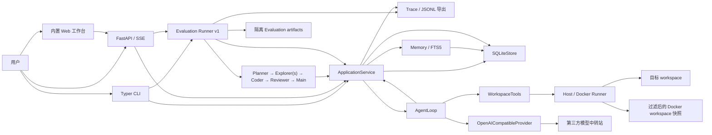
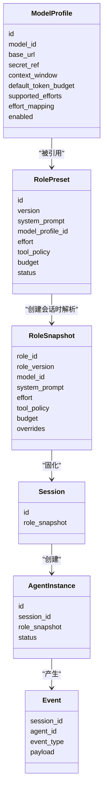
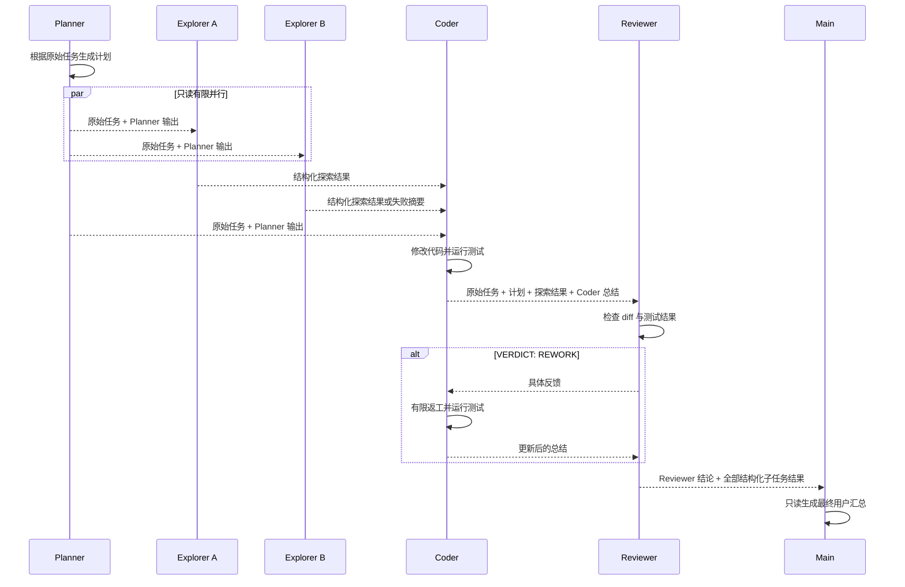

# Operant 项目架构与实现说明

> 文档状态：持续维护
>
> 最后更新：2026-08-31
>
> 对应版本：Operant 2.0 Phase 1C Artifact、Retention 与 CacheObservation

本文档是 Operant 当前架构、模块边界和实现状态的唯一权威说明。README 只保留项目简介和
常用命令，学习资料和个人规划不作为项目实现依据。

`docs/项目架构.md` 描述中长期 Harness Kernel 目标，`docs/UI_UX_DESIGN_SPECIFICATION.md`
描述目标客户端设计。两者都是规划文档，不代表对应能力已经实现；如与本文、源码或测试冲突，
当前实现以本文、源码和测试为准。

## 1. 项目定位

Operant 是一个由角色预设驱动的多模型 Coding Agent Runtime。

用户可以创建 Model Profile 和 Role Preset，再用指定角色创建 Session。Session 创建时会
保存不可变的 `RoleSnapshot`，因此后续修改角色不会改变历史任务的执行配置。

项目当前的核心目标是打通以下流程：

1. 配置多个真实模型；
2. 创建带有提示词、模型、effort、工具权限和预算的角色；
3. 使用角色启动 Agent Tool Calling Loop；
4. 让 Agent 在选定 workspace 中读取、修改代码并运行命令；
5. 保存 Session、Agent、Snapshot 和运行事件；
6. 按 Planner → 只读 Explorer → Coder → Reviewer → Main 汇总运行相互隔离的 Agent。
7. 以 SQLite 任务记录和阶段检查点支持基础恢复，并用 Web 工作台观察完整任务。
8. 用可复现快照、隔离 artifact、外部验证、指标聚合和 Trace 根因分析对 Session/Workflow 做评测。

## 2. 当前完成度

### 已实现

- Pydantic 领域模型；
- Model Profile 创建、查询、更新、停用和健康检查；
- Role Preset 创建、复制、停用和版本记录；
- Main、Planner、Explorer、Coder、Reviewer 默认角色；
- 不可变 Role Snapshot；
- 会话级模型、effort 和 budget 覆盖；
- Session、Agent 和 Event 的 SQLite 持久化；
- 正式 Thread、Turn、Item Canonical History：父子关系、Workspace 绑定、终态/归档、稳定 Cursor 与
  Thread 内 position；Turn/Item 只追加且不可原地改写或删除；
- User Message、Agent Message、Tool Call、Tool Result Ref、Artifact Ref、Approval Link、Steering 和
  System Event 八类类型化 Item；
- 内容寻址 Artifact Store：SHA-256、media type、size、sensitivity、source refs、retention policy ref，
  原子写入、并发去重、读取校验和路径/软链接边界；公开领域对象与 API 不暴露 storage key 或本地路径；
- Artifact 内容通过短时、对象级、操作级 capability 执行完整性校验后的脱敏文本读取、原文下载和
  绑定 Workspace 目录身份的显式导出；HTTP 不签发 capability，物理修改还要求独立 trusted bootstrap；
- 对象级 Artifact Retention Policy、Pin、归档、宽限期、计划删除、可恢复 Trash、恢复和显式物理删除；
  Canonical History、Approval/Audit/Memory、可恢复执行与未知副作用证据作为保守删除阻断项；
- Artifact Store 与 SQLite 引用的零写审计，识别孤儿、缺失、损坏、非安全对象和已删除内容残留；
  修复只接受重新核验后仍成立的精确 finding，并继续使用 M0 Receipt/Action Hash/人工核对边界；
- Provider `CacheObservation` 只追加记录 hit/miss/unknown、显式 Token、请求/前缀 hash 和失效原因，
  不复制 Provider Cache；缺失 usage 保持 unknown，不按 0 处理；
- 每次模型请求前生成不可变 `ContextRevision`，保存实际发送的安全 Message/Tool 快照、版本化
  `PromptLayout`、有序 `PromptBlock`、类型化 Reference Binding、动态 Context Watermark 与来源证据；
- 追加式 Compaction 与可恢复 Tool Result Stub：压缩记录只覆盖同 Agent 已提交的 ContextRevision
  Cursor，或同 Thread 中按真实 `items.sequence` 精确列出的 Canonical Item；不删除或改写 Canonical
  History；大 Tool Result 先进入内容寻址 Artifact，再向模型提供安全 Stub；
- Phase 1B 最小类型化引用：Thread、同 Thread Item、普通 Artifact 和当前 Session/Workspace 可读的
  active Memory；引用在 Provider 调用前完成作用域、敏感级别、完整性与 redaction 校验；
- WorkflowRun、WorkflowRunEvent、任务状态和阶段检查点的 SQLite 持久化；
- v1/v2/v3/v4/v5/v6/v7 单事务 SQLite Migration、逐版本冻结 manifest/checksum、完整 schema integrity 自检、
  真实 Week 1/完整 Week 1—4 数据库识别升级、精确 preview 收编和受限回滚；
- OpenAI-compatible `/v1/models` 查询和 origin 自动补全；
- 流式 `chat/completions` 与 Tool Call 分片拼接；
- Agent Loop 和 Tool Result 回写；
- 测试失败结构化反馈、有限自我修复和重复失败停止；
- workspace 文件工具、命令工具和 Git diff；
- Docker 快照 Runner、CPU/内存/PID 限制、无网络命令执行和进程清理；
- Role Tool Policy 双层校验；
- 持久化 Action Gateway：副作用 Tool Call 的规范化 Action Hash、Receipt、结果重放和未知结果保护；
- 高风险命令的持久化审批请求、单次决定、过期、审计，以及同进程暂停后继续执行；
- Token、精确费用、时间和 Tool Call 硬预算；依赖的 usage 或定价缺失时保持 unknown 并安全停止；
- 总超时和全 Workflow 协作式取消；取消会持久传播到并行 Explorer 和其他活跃 Agent；
- SQLite Session run lease：同一 Session 跨服务进程只允许一个 Agent run，持久 Pending Approval 也会
  阻止重启后误开新 run；租约以 token、generation 和 owner 防止旧执行者 ABA 释放或续期；
- 完整的 Typer CLI；
- Model、Role、Session、审批和 Workflow 的 FastAPI/SSE；REST Command 提供持久化
  `Idempotency-Key` Receipt、Action Hash、结果重放和统一错误信封；
- Planner → 只读 Explorer → Coder → Reviewer 编排，以及由明确 verdict 驱动的有限返工；
- 最多 4 个只读 Explorer 的有限并行、自定义角色替换和并行槽位权限校验；
- 每个子任务的结构化成功/失败结果，以及必需角色失败时的安全停止；
- 可替换的只读 Main Role 最终汇总，并接收全部结构化子任务结果；
- 中断任务的阶段边界恢复；Coder 写结果不明时转为人工核对，拒绝自动重放；
- Session 与 Workflow 级 Trace 摘要、Token/耗时/错误统计和脱敏 JSONL 导出；
- Working、Episodic、Project 三类 Memory、版本/来源/作用域和 SQLite FTS5；
- 任务开始前读取已确认的项目知识，任务结束后生成项目结构/编码约定、验证命令与情节候选知识；
- Memory 候选确认、保守激活和停用；
- 任务、Trace、恢复、取消与 Memory 的 CLI/API；
- 无前端框架、无 CDN 的本地 Web 工作台，支持注册表、选角、SSE、审批和任务回放；
- Provider usage 解析、模型/工具/Agent 耗时和脱敏的 Provider 异常事件；
- EvaluationSuite、EvaluationCase、EvaluationVariant、EvaluationRun、EvaluationResult 及其不可变声明/
  实际快照、验证结果、指标、聚合与失败分类领域模型；
- 顺序执行 Case × Variant × repetition 的 Evaluation Runner v1，支持单 Session/完整 Workflow、
  模型/Prompt/effort/Memory 对照，以及 Exp 19—24 的 Suite 表达；
- 每个 Evaluation Result 的隔离 artifact workspace、变更路径、外部安全验证、Trace 证据和五类根因分析；
- Session、Workflow、Evaluation 事件的 SQLite Cursor、开区间 Query 和已提交 SSE 回放；
- Evaluation Suite/Run/Result/Event 的 SQLite 持久化、CLI 和 FastAPI/SSE；
- `.env` 安全解析，不执行 shell 内容；
- Kimi K2.6、Gemini 3.7 Flash 的六角色真实多模型端到端验收；
- `SECURITY.md` 安全边界；
- 自动化测试、Ruff、mypy 和 GitHub Actions CI。

### 尚未完成

- 模型流中任意字节位置的恢复，以及结果未知 Coder 写操作的无人值守恢复；
- 审批 Future 的跨进程恢复；
- 使用真实 Provider 完成 Exp 19—24、形成统计性实验结论和用户学习验收；
- 自动模型价格发现、显著性分析，以及中断 Evaluation Run 的逐 Result 自动续跑；
- Web 身份认证、设备配对和远程访问控制；
- 通用 Graph Runtime、Definition Compiler、Team/Mailbox 和智能创建；
- 类型化 TypeScript/Python Client SDK、React GUI/PWA、Textual TUI 和 Tauri 桌面壳；
- 复杂 `@` 引用、Provider Cache 的执行/复制，以及面向非可信 HTTP 客户端的 Artifact capability 签发；
- Host Connector、自托管 Relay、Remote Gateway、RemoteDevice/RemoteSession 和受控 Remote Target。

## 3. 总体架构



CLI、API 和 Workflow 只负责输入输出，不复制 Runtime 业务逻辑。它们共同调用
`ApplicationService`，由 Application Service 组织持久化、Agent Loop、Provider 和
workspace 工具。

## 4. 目录结构

```text
operant/
├── src/operant/
│   ├── api.py                    # FastAPI、Session API、SSE
│   ├── cli.py                    # Typer CLI
│   ├── settings.py               # 本地配置入口
│   ├── application/
│   │   ├── defaults.py           # 五个稳定 ID 的默认角色
│   │   ├── evaluation.py         # Evaluation Runner、隔离 artifact、指标与 Trace RCA
│   │   ├── factory.py            # Session / Agent 创建工厂
│   │   ├── service.py            # CLI/API/Workflow 共用的用例层
│   │   ├── trace.py              # Session / Workflow Trace 与脱敏 JSONL
│   │   └── workflow.py           # 编排、持久化检查点、恢复和 Memory 接入
│   ├── domain/
│   │   ├── actions.py            # Tool/REST Receipt、Approval 与审计领域模型
│   │   ├── evaluation.py         # Suite/Case/Variant/Run/Result、快照、指标和失败分类
│   │   ├── memory.py             # 三类 Memory、作用域和激活规则
│   │   ├── models.py             # Model、Role、Snapshot、Session、Agent、Event
│   │   ├── messages.py           # 模型消息、Tool Call、Provider usage/cache facts
│   │   ├── threads.py            # Thread/Item、Artifact、Retention 与 CacheObservation
│   │   └── workflow.py           # WorkflowRun、状态、阶段和任务事件
│   ├── artifacts/
│   │   ├── capability.py         # 短时对象/操作/敏感级别权限票据
│   │   ├── export.py             # Workspace 目录身份绑定的不覆盖显式导出
│   │   └── store.py              # 内容寻址 blob、审计枚举、原子发布/删除与路径边界
│   ├── persistence/
│   │   └── sqlite.py             # Registry、Session、Agent、Event Store
│   ├── providers/
│   │   ├── base.py               # ModelProvider 协议
│   │   └── openai_compatible.py  # OpenAI-compatible 实现
│   ├── runtime/
│   │   ├── feedback.py           # 测试失败反馈与无进展检测
│   │   └── loop.py               # Agent Tool Calling Loop
│   ├── tools/
│   │   ├── execution.py          # Host / Docker 命令 Runner
│   │   └── workspace.py          # workspace 工具与权限检查
│   ├── protocol.py               # Action Hash、公开错误契约和统一脱敏
│   └── web/                      # 无 CDN 的 HTML/CSS/JS 工作台
├── tests/                        # 单元测试与协议测试
├── examples/buggy_calculator/    # 真实模型验收 fixture
├── SECURITY.md                   # 安全边界与威胁模型草案
├── docs/PROJECT_ARCHITECTURE.md  # 本文档
├── pyproject.toml
└── uv.lock
```

## 5. 分层与依赖方向

### Domain

Domain 定义数据和约束，不依赖 FastAPI、Typer、SQLite 或具体模型 SDK。

主要文件：

- `src/operant/domain/models.py`
- `src/operant/domain/messages.py`
- `src/operant/domain/context.py`
- `src/operant/domain/memory.py`
- `src/operant/domain/workflow.py`
- `src/operant/domain/evaluation.py`

### Application

Application Service 负责用例编排：

- Model Profile 和 Role Preset 的注册表用例；
- 默认角色初始化；
- 创建 Session；
- 创建和更新 AgentInstance；
- 构造带 Role Tool Policy 的 WorkspaceTools；
- 启动 AgentLoop；
- 管理总超时、取消信号和待审批 Future；
- 将 RuntimeEvent 写入 SQLite 并回填持久 Cursor；
- 创建、归档和查询 Thread，追加 Turn/Item，并提供 Thread 内稳定分页与只读 SSE 回放；
- 先原子发布 Artifact blob，再事务注册不可变 metadata/source refs；单件查询执行完整 hash/size 校验；
- 在每次 Provider 请求前解析显式引用、构造动态 Watermark、必要时先折叠 Tool Result 再追加
  Compaction，并原子保存与实际 Provider 输入一致的 `ContextRevision`/Prompt 证据；
- 为副作用 Tool Call 注入持久化 Action Gateway，管理 Receipt、精确 Action Hash 与审批记录；
- 根据最终事件更新 Agent 状态；
- 持久化 Workflow 事件、推进任务状态并支持阶段边界恢复；
- 执行 Memory 作用域、FTS 检索、候选确认和版本管理；
- 聚合 Session / Workflow Trace，并导出脱敏 JSONL。
- 持久化 Evaluation Suite/Run/Result，按固定顺序运行隔离对照，核对声明快照与实际快照，执行外部
  验证并聚合指标和根因证据。

`SequentialCodingWorkflow` 是固定、可解释的应用层协调器。它只通过 Application Service
选择 Role Preset、创建隔离 Session 和运行 Agent，不直接访问 SQLite；Reviewer 批准后，可再运行
一个可替换的只读 Main Role 生成最终汇总。动态模型路由和自治委派不属于 v1.0 范围。

### Runtime

Runtime 只依赖抽象的 `ModelProvider`、工具注册表和持久化无关的 `ActionGateway` 协议。它不读取
环境变量，也不直接连接 SQLite；Application Service 注入具体持久化 Gateway。

### Infrastructure

Infrastructure 包含：

- OpenAI-compatible Provider；
- SQLite Store；
- 内容寻址 Artifact Store；
- workspace 文件和命令工具；
- Evaluation artifact 复制、清单哈希和受限外部验证进程。

### Interface

CLI、FastAPI 和内置 Web 工作台是外部入口。Web 只调用 FastAPI；CLI/API 的业务用例调用
Application Service，不自行实现 Agent 循环。FastAPI 的协议中间件会直接使用 SQLiteStore 保存
REST Command Receipt；CLI 是本地进程内入口，不经过该 REST 中间件。

依赖方向保持为：

```text
CLI / API / Workflow
          ↓
Application Service
          ↓
Domain + Runtime 抽象
          ↓
Provider / Tools / SQLite
```

## 6. 核心领域模型



### ModelProfile

Model Profile 保存模型的非敏感配置：

- Provider 类型；
- 精确模型 ID；
- Base URL；
- Secret Reference；
- 上下文窗口和默认 Token 预算元数据；
- 成对配置的每百万输入/输出 Token 价格；
- 支持的 effort 档位；
- effort 到 Provider 参数的映射；
- 启用状态。

`secret_ref` 保存的是环境变量名，例如 `OPERANT_API_KEY`，不是 API Key。Base URL 不允许
包含用户名、密码、query 或 fragment。

### RolePreset

Role Preset 保存可编辑的角色配置：

- 角色名称和 System Prompt；
- 绑定的 Model Profile；
- effort；
- Tool Policy；
- 最大轮次、连续相同测试失败上限、超时、输出 Token、费用和 Tool Call 预算；
- Memory Scope；
- 状态和版本。

Role Preset 是可编辑配置，不是历史执行事实。

### CommandExecutionPolicy

`ToolPolicy` 还携带不可变的 `CommandExecutionPolicy`。它指定 `run_command` 使用 `host` 或
`docker` Runner，以及 Docker 镜像、CPU、内存和 PID 上限。新初始化的默认 Coder 使用 Docker；普通
`ToolPolicy` 的默认值仍为 `host`，因此自定义角色只有在用户明确选择 Docker 时才会启用隔离。

Docker Runner 不会把原 workspace 直接暴露给容器，而是创建排除凭据、Git 元数据、运行态数据、
虚拟环境和缓存的临时快照。测试产生的写入仅落在快照中，源码修改仍必须走 `apply_patch`。

### RoleSnapshot

创建 Session 时，SQLiteStore 会读取当前 Role Preset 和 Model Profile，把最终配置解析为
冻结的 `RoleSnapshot`。

Snapshot 保存：

- 角色 ID 和精确版本；
- 角色名称与 System Prompt；
- Model Profile ID、模型 ID 和 Provider 地址；
- Secret Reference 名称；
- 成对配置的每百万输入/输出 Token 价格；
- effort 及其 Provider 参数映射；
- Tool Policy；
- Budget；
- Memory Scope；
- 会话级覆盖记录。

修改 Role Preset 不会修改已经保存的 Snapshot。进程重启后，旧 Session 仍直接读取原始
Snapshot，而不是重新解析最新角色。

### Session 与 AgentInstance

Session 表示一次具有固定执行配置的会话。AgentInstance 表示该 Session 中的一次实际 Agent
运行。

当前每次调用 `run_session()` 都会创建新的 AgentInstance，并依次进入：

```text
CREATED → RUNNING → COMPLETED / FAILED / CANCELLED / TIMED_OUT
```

同一 Session 同时只允许一个 run。FastAPI 在建立 SSE 响应前先完成 admission；第二个同 Session 请求
直接返回 JSON 409，不会先返回 SSE 头，也不会创建多余 AgentInstance。Application Service 同样执行
该保护，但以结构化 `agent.stream_error` 返回冲突。不同 Session 拥有独立 run slot，可以并发。

single-flight 的权威是 SQLite `session_run_leases`。租约记录 owner、随机 token、单调 generation、
可选 Workflow/Agent 绑定、取消位和到期时间；获取、续期、释放、取消及 Action Gateway 执行栅栏都在
`BEGIN IMMEDIATE` 事务中比较 token + generation + owner，旧 watcher/finally 不能操作后来回收的新租约。
Service 按租约 TTL 的三分之一独立续期，因此即使正在等待长时间 Provider 流也会维持租约；同一 Service
还保留轻量本地 slot，避免旧 coroutine 清理后来 run 的审批 Future。过期租约可被另一进程回收，但若
旧 Agent 留有 `in_progress`/`outcome_unknown` 写 Receipt，会先落成 `outcome_unknown` 并拒绝自动重放，
要求人工核对。绑定 Workflow 的租约在获取事务内再次确认 Workflow 仍为 `running`，关闭取消与创建新
Agent 的竞态。

Workflow 取消在同一个 `BEGIN IMMEDIATE` 事务中把 Run 改为 `cancelled`，并为其全部未释放 child
Session lease 写入 cancel bit；提交后再唤醒本进程取消信号。并行 Explorer 和其他活跃 Agent 会停止，
后续阶段、Agent 和工具副作用不再启动。启动激活与阶段/终态推进都使用 expected-status CAS，迟到事件
不能把 `cancelled` 改回 `running` 或其他终态；重复取消是幂等操作。取消是协作式栅栏：已经交给外部
执行器、无法撤回的写操作仍可能结果未知，必须按 Tool Receipt 的人工核对边界处理，不能宣称可回滚
该外部动作。

### Thread、Turn、Item 与 Artifact

`ConversationThread` 是 Phase 1A 的正式对话身份。它保存稳定 ID、可选父 Thread、不可变 Workspace
绑定、状态、创建/更新时间和归档时间。新 Thread 固定从 `active` 开始；只能推进到 `completed`、
`cancelled` 或 `archived`，已终止 Thread 只能继续归档，不能回到 active。父关系和 Workspace 绑定
创建后不可改写；父 Thread 必须先存在，因此在不可变父关系下不能形成环。

`Turn` 与 `Item` 构成 Canonical History。两者都由 SQLite 分配全表单调 Cursor，并在 Thread 内分配
从 1 开始的无重复 position；并发分配位于同一个 `BEGIN IMMEDIATE` 事务。Turn 和 Item 一经接受便
禁止 UPDATE/DELETE，终态或已归档 Thread 也禁止继续追加。Item 使用带 discriminator 的八类 payload：
User Message、Agent Message、Tool Call、Tool Result Ref、Artifact Ref、Approval Link、Steering 和
System Event。Artifact/Approval 引用在插入事务中核对；接受前公开动态字段经过 bounded redaction，
接受后的安全 payload 才成为不可改写的 Canonical History。Phase 1A 不做 Context Composer、Prompt
Layout 或 Compaction；后续派生摘要不得删除或原地改写这些原始记录。

旧 `Session` 与 `WorkflowRun` 继续保留原表和行为，不会在 Migration 中被猜测性补写为 Thread。
调用方只能在创建新 Thread 时显式声明 `thread_legacy_refs`；Store 会验证目标旧记录存在，并保证每个
旧 source 只映射到一个 Thread。该映射用于兼容查询，不转移或覆盖旧状态机的恢复权威。

`Artifact` 公开对象只保存内容 hash、media type、size、sensitivity、source refs、retention policy ref
和时间；没有本地路径或正文。blob 由独立 Artifact Store 按小写 SHA-256 派生受控相对 key，在同一
文件系统临时文件完整写入并 fsync 后以 create-if-absent hardlink 原子发布；并发相同内容复用同一 blob，
已有目标必须重新核对 hash/size。目录从绝对 root 开始逐组件以 no-follow 语义打开并核对 inode/真实
大小写，拒绝路径穿越、软链接、非普通文件、目录替换和外部路径写入。SQLite 以 content hash 唯一
注册不可变 metadata 与 source refs；同 hash 但 media type、sensitivity、retention 或来源不同会冲突，
不会静默降低敏感级别。单件 GET 重新校验 blob，列表只返回 metadata，Phase 1A 不提供内容下载接口。

Phase 1C 在该存储边界上增加显式内容访问。读取、下载和导出都要求由可信嵌入方签发的短时 HMAC
capability，票据绑定 Artifact、操作、敏感级别，导出还绑定绝对 Workspace root、相对目标和当时的
目录 inode 链；HTTP API 本身不能签发票据。文本读取只返回经过 bounded redaction 的 UTF-8 内容，
原文下载使用固定安全文件名和 `nosniff`，导出只能在已存在的受控 Workspace 子目录以 no-follow、
不覆盖方式原子发布，响应不返回真实路径。Blob 缺失或 hash/size 不符时 fail closed；只有 Retention
状态已明确进入 `deleted` 才返回“内容已删除”，普通缺失仍是需要人工核对的完整性故障。

`RetentionPolicy` 当前只作用于 Artifact，策略不可改写，保存宽限期和是否允许物理删除；每个 Artifact
有独立的 `ArtifactRetentionState`。状态按 active/archived → deletion_scheduled → trashed → deleted
推进，Pin 会阻止进入删除链，计划删除保留明确到期时间，scheduled/trashed 可恢复到 active。状态写入
使用 `updated_at` compare-and-swap，并同步追加审计事件。物理删除默认关闭；启用后仍需独立 trusted
bootstrap 换取最长 300 秒、精确对象/动作的 capability，并要求 trashed、策略允许且没有 Canonical
History、Context/Compaction、Approval/Audit/Memory、可恢复执行或未知副作用证据。unlink 已完成但
SQLite 终态未提交时，Command 保持 `manual_reconcile_required`，只能凭原 Command ID/Action Hash、
Blob 已缺失事实和独立 reconcile capability 显式收口，不自动重放删除。

`GET /v1/artifact-audits` 只读比较 SQLite hash/size/lifecycle 与固定内容树，不创建不存在的 Store
目录，也不写审计表；结果只含 path-free finding。它区分孤儿 Blob、引用缺失、内容损坏、非安全对象和
deleted 状态仍残留 Blob。孤儿修复必须携带精确 content hash + finding hash，在跨进程 mutation lock
内重新审计后才删除；修复本身使用 Receipt，并只追加安全审计事实。所有自动化测试只操作临时 Store，
本阶段没有对真实 `.operant/` 数据执行清理。

### ContextRevision、PromptLayout 与 Compaction

`PersistentContextComposer` 在每次模型请求前运行。它只使用 Session 的不可变 `RoleSnapshot`、当前
Agent 消息、工具 schema、显式类型化引用和已经提交的派生记录；不会自动继承父 Thread 正文，也不会
把旧 Session/Workflow 猜测性补写为 Thread。`RoleSnapshot.context_window` 在 Session 创建时冻结；
legacy Snapshot 缺少该值时保持 unknown，不再读取后来修改的 Model Profile。

每个 `ContextRevision` 由 `agent_id + request_ordinal` 唯一标识，保存实际发送给 Provider 的安全
Message/Tool 快照、`PromptLayout` 版本、有序 `PromptBlock`、Reference Binding、Tool Result Stub、
Watermark、冻结 Workspace、来源 ID/Cursor/version/hash 快照和可选 Compaction ID。Composer 在 Provider 调用和持久化之前对
同一份 payload 做 bounded redaction；工具 schema 也按敏感键和值共同清洗，因此可解释证据与 Provider
输入一致。公开 Query 只返回 hash、计数、来源、Watermark 和布局 metadata；Tool Result Stub 也只返回
Artifact/Tool Call ID、hash、大小和 fetch capability，不返回内部摘要、prompt 正文、工具参数或本地
Artifact 路径。Revision 在 Provider 失败时仍保留，用于说明失败请求；`model.completed` 事件只新增
可选 `context_revision_id`，既有事件顺序不变。

`PromptLayout phase1b.v1` 物理排序为 Role Instructions、Tool Schema、Explicit References、
Compaction、Conversation。SQLite 保存完整布局版本和 block order，持久化前校验实际 Block 顺序与布局
一致，查询/重放不会把自定义布局静默恢复为默认值。每个 Revision 必须包含且只能按布局排列
Role Instructions、Tool Schema 和 Conversation 三个基础 Block，Explicit References 与 Compaction
按需出现；空工具集合仍以 `[]` 的 Tool Schema Block 保存。每个 Block 保存位置、类型、内容 hash、
类型化 source refs、visibility、Token 估算和 cache eligibility；cache eligibility 仍只是解释性事实，
不控制 Provider Cache。Runtime 会把 Provider 明确返回的 cached/read/write Token、请求 ID 和稳定前缀
hash 另存为只追加 `CacheObservation`；显式正数为 hit、显式 0 为 miss，字段缺失为 unknown。该记录
不保存 prompt、response、原始 cache key、凭据或 Provider Cache 正文，也不声称能裁决或复制缓存。

Context Watermark 由冻结的 `context_window`、本轮预留输出 Token、工具 schema 估算和动态安全余量计算，
状态为 Green/Yellow/Red/Emergency/Unknown。阈值是可验证的 Policy 比例，不在 Runtime 中写死固定
60/80 水位。context window 或输出预留未知时，容量和状态保持 unknown，绝不按 0 处理。Yellow 以上
优先把超过动态阈值的 Tool Result 写成普通敏感级别的内容寻址 Artifact，并替换为含 Artifact ID、
Tool Call ID、hash、原始/存储大小、摘要和显式 fetch capability 的 Stub；相同正文可跨 Agent/Session
去重，但已存在的 sensitive/restricted 同 hash Artifact 不会被降级复用。

Red/Emergency 在 Tool Result 折叠后仍超水位时，才追加结构化 `Compaction`。摘要保存目标、约束、
决定、完成/待办/失败、Workspace、Artifact/Memory、Approval、外部副作用、人工核对项和下一步，且
所有动态字段先经过同一 redaction。已有 Agent 对话只允许覆盖同 Session、同 Agent、同 Thread scope
中已经提交的 ContextRevision Cursor；首次携带过大 Thread 引用时可生成 `THREAD_ITEMS` Compaction，
但必须精确记录同 Thread Canonical Item 的 ID、真实 `items.sequence`、canonical body hash、严格递增
顺序、首尾范围和稳定 coverage digest；Compaction ID 由完整不可变证据确定性派生，同证据并发复用
同一记录，不同证据仍冲突。Compaction、Revision、Prompt Block 和 Binding 全部只追加，
SQLite trigger 禁止 UPDATE/DELETE。Compaction 是派生证据，不删除、覆盖或改写 Thread/Turn/Item
Canonical History；没有合法 coverage 时不能伪造 Compaction，安全缩减后仍为 Emergency 则明确失败。

Phase 1B 的显式引用只支持 `thread`、`item`、`artifact`、`memory` 和 `inline`/`metadata` 两种模式。
Thread 必须绑定当前解析后的 Workspace；Item 必须属于所选 Thread；Artifact inline 只允许校验通过的
普通 UTF-8 内容，restricted 拒绝、sensitive 不允许 inline；Memory 必须 active 且通过既有 Session/
Workspace/Role scope 判权。Thread inline 使用累计 UTF-8 字节和 Token 上限的分页式选择，超限时进入
可核验的 `THREAD_ITEMS` Compaction 或明确失败，不会先把整个 Thread 读入内存。引用正文作为不可信
User 数据放入独立 Block，不获得 System 权限。复杂 `@` 解析、跨项目授权策略、客户端 capability
签发和父 Thread 全文继承均不属于本阶段。

Memory provenance 在写入时把当前 active/head、不可变版本、hash 和 Session/Workspace/Role scope
冻结为 source snapshot；Prompt Block、Reference Binding 与 `memory_refs` 必须引用同一规范集合。
Memory 后续增加版本或停用不会破坏旧 Revision 回读，但旧版本不能被用于新的 Revision。Thread 状态
从 active 进入 completed/archived 同样不否定已经冻结的旧证据；新写入仍按当前实体和 scope 校验。

### Action Receipt、Command Receipt 与 Approval

`ToolActionReceipt` 是 Agent 副作用工具的持久化防重记录。当前覆盖 `apply_patch` 与
`run_command`，以 Agent attempt scope、模型 `tool_call_id` 和规范化 `action_hash` 唯一标识一次
动作；数据库不保存原始工具参数。只有 scope、幂等键、Action Hash、Session、Agent 和命令名全部
一致且已有终态时，才会重放已保存的成功或失败结果，不再执行工具；任一绑定不同都会冲突，不能跨
上下文复用结果。新 Receipt 必须以无结果的 `in_progress` 状态创建，并在同一事务内确认 Agent 存在
且属于指定 Session。进程重启时仍为 `in_progress` 的动作会变为 `outcome_unknown`，必须人工核对，
不能盲目重放。

`CommandExecution` 是 REST 修改命令的独立 Receipt。它以规范化路由 scope、query 和 JSON body
计算 Action Hash，并保存 HTTP 状态与安全响应；它不能替代 Tool Action Receipt，两者作用域不同。
进程重启时遗留的 `in_progress` Command 会进入 `manual_reconcile_required`。

`ApprovalRequest` 绑定 Session、Agent、Tool Receipt、Tool Call ID 和精确 Action Hash，只保存不含
参数值的有限摘要；`ApprovalDecision` 保证一个请求只有一个方向的决定，重复提交同一决定幂等，反向
决定冲突。Store 只接受初始 `pending` 的请求，并在同一事务内验证关联 Receipt 存在、仍为
`in_progress`，且 Session、Agent、Tool Call ID 与 Action Hash 全部精确一致。执行前 Gateway 不只检查
Request 的 `approved` 状态，还必须读到同 approval ID 的持久 `ApprovalDecision(approved=true)`，并
再次核对 Receipt 上下文和 Action Hash。请求、决定和过期都写入只追加的 `ApprovalAuditEvent`。请求与决定可以跨进程查询，但让
原 Agent Loop 继续运行的 `asyncio.Future` 仍只存在于原服务进程；重启后的待审批记录会明确返回
`continuation_available=false`。只要该 Session 仍有未过期、未决定的持久 Pending Approval，API 和
Application Service 都拒绝启动新 run；必须先决定该审批或等待其过期，不能用新 Agent 绕过旧审批。

### WorkflowRun 与 WorkflowRunEvent

`WorkflowRun` 是完整编码任务的持久化身份，保存绝对 workspace、任务、各角色 ID、Explorer
并行上限、返工上限、当前阶段、状态、恢复来源和最终 verdict。状态包括 `created`、`running`、
`interrupted`、`manual_reconcile_required`、`completed`、`failed` 和 `cancelled`。

`WorkflowRunEvent` 使用 SQLite 单调递增序号作为 Cursor 保存 Workflow 和角色运行事件。事件在 SSE
发出前先提交 SQLite，Query 和 SSE 回放都使用 `sequence > after_cursor` 的开区间语义。客户端断线后
可以查询已提交阶段和对应 Session；SQLite 是恢复权威，JSONL 只用于脱敏导出，不参与状态判断。

协调器在创建 `WorkflowRun(created)` 后、改为 `running` 前，必须原子取得 SQLite
`workflow_execution_leases` guard。guard 使用 owner、随机 token、单调 generation、TTL 和独立
heartbeat；每个新 child Session 在同一 admission 事务中同时核对 Workflow 状态和当前 guard，旧协调器
失效后不能再创建 Agent。长时间等待 Provider 时 heartbeat 仍独立运行；续期失败会唤醒协调器、取消并
等待全部活跃 child Session 收束，且任何新 Action Gateway 副作用都会被 Session lease fencing 拒绝。
只有 expected token + generation + owner 仍匹配时，旧协调器才能把仍为 `running` 的 run 条件更新为
`interrupted`，不会覆盖用户已经写入的 `cancelled`，也不会用 stale guard 改写其他执行者状态。

同一个 `running` run 不允许回收 guard。进程崩溃后，活跃 guard 或 child Session lease 的 TTL 未到期
时，第二实例 `initialize()` 不会中断该 run；TTL 到期后才转为 `interrupted`，随后显式 resume 创建新的
WorkflowRun ID 并从阶段检查点恢复。没有 v4 guard/child lease 的 legacy 或孤立 `running` row 在
`initialize()` 时立即转为 `interrupted`，不使用会掩盖真实崩溃的时间宽限。

### Memory

`Memory` 分为：

- `working`：只属于一个 Session；
- `episodic`：记录一次任务经历，默认是待确认候选；
- `project`：必须绑定项目作用域，可被后续任务复用。

每条 Memory 保存来源 Session、来源任务、置信度、角色作用域、版本和状态。更新不会覆盖旧版本；
`memory_scope` 在 Service 层真正执行读写判权，而不只是提示词字段。持久知识默认先进入
`candidate`，只有显式确认或满足高置信度、可追踪来源和验证信号的保守规则才进入 `active`。

### Evaluation Suite、Run 与 Result

`EvaluationSuite` 是一次评测的不可变声明，包含 1—100 个 `EvaluationCase`、1—32 个
`EvaluationVariant`、1—20 次 repetition，展开结果最多 1000 条。Case 固定任务、fixture/环境、
验证命令和允许/期望变更路径；Variant 固定 Session 或 Workflow、模型、Prompt hash、Role 版本、
effort、Memory 开关/引用、执行策略与可选价格快照。

`EvaluationRun` 保存 Suite 身份、顺序执行策略、状态和聚合结果。每个 `EvaluationResult` 对应唯一的
Run × Case × Variant × repetition。Runner 在复制 fixture 或创建 Session/Workflow 前先创建带预留
artifact namespace 的 `pending` Result，正常路径只允许用同一 ID 一次性推进到 `passed`、`failed`、
`error`、`skipped` 或 `interrupted`；任何终态都不能再次更新。取消、流关闭或进程重启会把遗留
Pending 原地标记为 Interrupted，保留身份/artifact 引用但不伪造实际快照、指标、验证、变更或 Trace。
聚合显式保存计划总数以及 finished、interrupted、pending、尚未持久化四个互斥分区，成功率只使用
实际观测值。Result 的正常终态保存实际执行快照、artifact 引用、变更路径、验证结果、Trace 指针、
指标和失败分析。声明角色与注册表实际角色不一致时，
运行在模型调用前停止，并将实际快照作为 `orchestration.role_snapshot_drift` 证据保存，不能用声明值
覆盖实际值。

`EvaluationRunEvent` 与 Session `Event`、`WorkflowRunEvent` 一样使用 SQLite 自增 Cursor，并提供
`after_cursor` 开区间查询。Evaluation SSE 只回放已提交的事件，不从内存流位置恢复。

未知 usage、价格或遥测保持 `None`；聚合时只对布尔指标报告已知样本率，费用、Token 和延迟等完整值
只有在所有相关 Result 都有事实时才给出总和/均值，避免把缺失值当成零。

## 7. Role 版本机制

角色使用 `role_heads + role_versions` 实现版本化。

```text
role_heads
└── role_id → current_version

role_versions
├── role_id + version 1
└── role_id + version 2
```

修改和停用角色都会新增版本，不覆盖旧版本。复制角色会创建新的 Role ID，并从版本 1 开始。

创建 Session 时只解析一次当前版本：

```text
RolePreset@1 + ModelProfile
             ↓
       RoleSnapshot@1
             ↓
          Session

之后 RolePreset 更新为 @2，旧 Session 仍保存 RoleSnapshot@1。
```

## 8. Agent Loop

Agent Loop 的消息流程如下：

```mermaid
sequenceDiagram
    participant User as 用户
    participant Loop as AgentLoop
    participant Model as ModelProvider
    participant Gateway as ActionGateway
    participant Tools as WorkspaceTools

    User->>Loop: user message
    Loop->>Model: system + user messages + tool schemas
    Model-->>Loop: streamed text / Tool Call

    alt 没有 Tool Call
        Loop-->>User: agent.completed
    else 有 Tool Call
        Loop->>Gateway: reserve(tool_call_id, action_hash)
        alt 已有相同 Receipt 结果
            Gateway-->>Loop: replay_result
        else 新动作
            Loop->>Tools: execute(name, arguments)
            Tools-->>Loop: Tool Result
            Loop->>Gateway: complete / fail Receipt
        end
        alt 失败的测试命令
            Loop->>Loop: 提取有限的结构化失败反馈
        end
        Loop->>Model: assistant Tool Call + tool message
        Model-->>Loop: 下一轮响应
    end
```

Loop 的关键规则：

1. 收集 System/User/后续 Tool Message 和 Snapshot 允许的工具 schema；
2. 用 Context Composer 解析显式引用、计算动态 Watermark，必要时折叠 Tool Result 或追加 Compaction；
3. 在 Provider 调用前持久化实际安全输入的不可变 ContextRevision；
4. 收集流式文本和 Tool Call；
5. 对 `apply_patch`、`run_command` 先通过 Action Gateway 规范化并预留 Receipt；相同 Tool Call 与
   Action Hash 直接重放已知结果，只执行一次副作用；
6. 新动作才实际执行工具，并在结果返回模型前把成功或失败原子写入 Receipt；
7. 测试命令返回非零退出码时，提取失败摘要和稳定错误签名，写回 Tool Result；
8. 把 Tool Result 追加为 `tool` 消息；
9. 连续达到 `max_consecutive_test_failures` 次相同测试失败时，产生 `agent.no_progress` 并停止；
10. 继续调用模型，并为下一次请求生成新的 ContextRevision；
11. 没有 Tool Call 时结束；
12. 高风险命令先持久化审批请求；批准后再次校验精确 Action Hash，再执行原动作；
13. 在模型返回后的任何 Tool Receipt/审批/执行之前核对累计 Token、精确费用和 Tool Call 预算；
14. 达到 `max_turns` 或任一硬预算时强制停止。

如果 Agent Factory 在 Agent 行创建前失败，Service 会释放 Session lease，并写入不绑定虚假 Agent 的
`session.run_failed` 事件（`agent_id = null`）；后续修复 Factory 后可重新运行同一 Session。Agent 行已
创建后的 Composer/Runtime 初始化失败仍写真实 `agent.failed`，两种失败事实不会混淆。

`ApplicationService` 以 Snapshot 的 `timeout_seconds` 为整次运行设置绝对截止时间，并可通过
取消信号中止正在等待的模型流。`max_output_tokens` 是整个 Agent run 的累计 completion Token 上限，
每一轮传给 Provider 的 `max_completion_tokens` 只取剩余额度；`max_tool_calls` 在准备第 N+1 个调用、
尚未预留 Receipt 或发起审批前停止。费用只使用 Snapshot 中成对冻结的输入/输出单价，并且只有该轮
prompt 与 completion usage 都已知时才累计；不会用 total Token 反推缺失分量，也不会凭模型名猜价格。
若启用了依赖 usage/价格的硬预算而必需数据未知，Loop 会 fail closed，产生可审计
`budget.exhausted`，且该模型响应的工具不会进入 `tool.started` 或副作用链路。没有配置这些硬预算时，
缺失 usage 仍以 `null`/unknown 保存，绝不伪装为 0。

## 9. Runtime 事件

当前可能产生的事件：

| 事件 | 含义 |
|---|---|
| `agent.started` | Agent 开始运行 |
| `model.delta` | 模型流式文本片段 |
| `model.completed` | 一轮模型响应结束 |
| `tool.started` | 开始执行工具 |
| `tool.completed` | 工具执行成功 |
| `tool.failed` | 工具参数或执行失败 |
| `tool.approval_required` | 操作需要人工审批 |
| `tool.approval_decided` | 审批已批准或拒绝 |
| `test.failure_feedback` | 非零测试结果已压缩为下一轮模型可用的摘要 |
| `agent.completed` | Agent 正常完成 |
| `agent.max_turns` | 达到最大轮次 |
| `agent.no_progress` | 重复测试失败触发安全停止 |
| `budget.exhausted` | Token、费用或 Tool Call 预算耗尽，或硬预算所需 usage/定价未知而安全停止 |
| `agent.cancelled` | 用户取消运行 |
| `agent.timed_out` | 达到整次运行总超时 |
| `agent.failed` | Provider 或运行时异常；只保存异常类型，不保存原始错误正文 |

Application Service 会把 RuntimeEvent 转换为持久化 Event，关联 Session 和 AgentInstance。
`agent.started` 的 Event payload 还包含角色版本、模型、Provider 和 effort，使审计可区分每次
模型调用来源。Provider 返回 usage 时，`model.completed` 保存 Token 统计和可选
`context_revision_id`；模型、工具和 Agent
终态事件保存单调时钟耗时。上游不返回 usage 时字段保持未知，不伪装为 0；Trace 对 prompt、completion
和 total 三个计数分别传播 unknown，任何分量未知都不会把对应聚合改写为零或从其他分量反推。

每条持久化 Session Event 的 SQLite `sequence` 同时作为公开 `cursor` 返回；查询使用严格大于
`after_cursor` 的开区间语义。事件 payload、Tool Result、测试反馈、命令输出和 Receipt Result 使用
同一公开脱敏规则，覆盖常见 Key/Token/私钥形态并限制文本和集合大小；真实凭据不能进入持久记录或
模型 Tool Result。

Workflow 还会在 SSE/CLI 流中产生应用层事件，并在对外发送前写入
`workflow_run_events`。角色 RuntimeEvent 同时保留在各自 Session 的 `events` 中：

| 事件 | 含义 |
|---|---|
| `workflow.started` | 固化本次 Main、Planner、Explorer、Coder、Reviewer 角色选择和并行上限 |
| `workflow.subtask_result` | 单个隔离子任务的结构化结果 |
| `workflow.failed` | 必需角色失败，工作流安全停止 |
| `workflow.completed` | Reviewer 明确批准，返回本次所有子任务结果 |
| `workflow.memory_candidate` | 记录任务结束后生成的项目知识或情节候选 ID 与来源 |
| `workflow.review_verdict_missing` | Reviewer 没有明确 verdict，安全终止 |
| `workflow.rework_started` | 开始一次明确、有限的返工 |
| `workflow.rework_limit_reached` | 返工达到上限，停止继续写入 |

结构化子任务结果包含角色槽位、Role ID、Session ID、最终状态、最多 12,000 字符的摘要、已完成
事件类型和失败原因。Explorer 的失败会作为输入交给 Coder/Reviewer；Main 接收全部结果并只做
面向用户的最终汇总。Planner、Coder、Reviewer 或启用的 Main 失败则停止工作流。Workflow 级事件
会在必需角色失败时停止。Workflow 事件与每个子 Session 的 Event 一起组成完整任务 Trace。

## 10. Provider

`ModelProvider` 是 Runtime 依赖的协议。当前实现是 `OpenAICompatibleProvider`。

它负责：

- 通过 `GET /v1/models` 查询中转站提供的精确模型 ID；
- 当 Base URL 只有 origin 时自动补全 `/v1`；
- 从 Secret Reference 指向的环境变量读取 API Key；
- 调用流式 `/chat/completions`；
- 把内部 Message 转为 OpenAI-compatible 消息；
- 发送工具 schema；
- 拼接 SSE 中分段返回的 Tool Call ID、名称和参数；
- 把统一 effort 映射为具体 Provider 参数；
- 返回统一的 ProviderEvent。
- 解析流式响应中的 usage；即使 usage chunk 没有 choices 也不会丢失。

Runtime 不关心当前运行的是 Kimi、GLM 还是 Gemini。只要中转站提供兼容协议，它们就可以
复用同一个 Provider。

除 MockTransport 协议测试外，已使用真实中转站完成 Kimi K2.6 与 Gemini 3.7 Flash 的模型发现、
流式文本、Tool Calling、文件修改和六角色编排联调。一次 Grok Coder 和一次 Grok Planner 调用
遇到上游 `ProviderError`，均被持久化为结构化失败，未被算作验收成功；最终验收使用当前实际
成功响应的 Kimi/Gemini 组合。

## 11. Workspace 工具与权限

当前工具：

| 工具 | 功能 |
|---|---|
| `read_file` | 读取 workspace 内的 UTF-8 文本文件 |
| `search_files` | 在 workspace 内搜索字符串 |
| `apply_patch` | 使用精确旧文本替换修改文件；无变化 Patch 会被拒绝 |
| `run_command` | 不经过 Shell，以参数数组运行命令；由 Role Policy 选择 Host 或 Docker |
| `git_diff` | 只读获取 Git diff |

### 双层 Tool Policy

Tool Policy 在两个位置执行：

1. `definitions()` 只向模型暴露角色允许的工具；
2. `execute()` 再次校验，防止模型伪造隐藏工具调用。

建议默认角色权限：

```text
Planner / Reviewer
    read_file
    search_files
    git_diff

Coder
    read_file
    search_files
    apply_patch
    run_command
    git_diff
```

新初始化的默认 Coder 的命令使用 Docker Runner；没有 Docker 的环境会返回明确工具错误，而不会自动退回
到宿主机。用户自定义的 `ToolPolicy` 默认仍是 Host Runner，必须只用于可信 workspace。

### 路径保护

文件路径解析后必须仍位于用户指定的 workspace 中。敏感文件名与后缀按不区分大小写的规则匹配，
文件工具和 Docker 快照共同拒绝访问/复制：

- `.git`；
- `.operant` 本地权威运行数据；
- `.env` 和 `.env.*`；
- `.npmrc`、`.pypirc`、`.netrc`；
- 常见私钥和证书名/后缀，例如 `id_rsa`、`id_ecdsa`、`*.pem`、`*.key`、`*.p12`、`*.pfx`；
- `secrets.json`、`credentials.json` 等常见凭据文件。

以上文件工具路径保护按名称精确、不区分大小写匹配；`.venv`、`node_modules` 和普通缓存只从
Docker/Evaluation 隔离副本排除，不作为文件工具的通用禁读目录。

### 审批分类

以下命令分类需要审批：

- `git_write`
- `destructive`
- `network`
- `privileged`
- `shell`

高风险操作先预留 Tool Action Receipt，再持久化 Approval Request 和 `approval.requested` 审计事件，
之后产生 `tool.approval_required` 并暂停。CLI 交互确认；API 客户端读取 SSE 中的 `tool_call_id`、
`approval_id`、Action Hash 和过期时间，再向审批决定端点提交批准或拒绝。批准后 Runtime 在执行前
重新计算 Action Hash，并同时核对 Agent、Receipt 和审批状态；拒绝后把明确的拒绝结果作为 Tool Result
写回模型上下文。审批摘要只暴露可执行文件名、参数个数、分类等有限信息，不保存命令参数值。

审批记录与决定可跨进程读取，但正在等待决定的 Future 和原模型流不能跨进程恢复。原服务进程仍在且
对应 Future 可用时，已落库决定会唤醒运行；如果决定恰好发生在请求提交后、Future 创建前，Service 会
在处理已持久化 `tool.approval_required` 时重新读取审批状态，避免丢失决定。进程重启后只能查询或决定
持久请求，`continuation_available=false`，不能声称原 Agent 会继续。

Shell 解释器、删除命令、网络命令、特权命令、Git 写操作和可识别的数据库删除语句都会被分类。
因此 `curl | sh` 一类绕过无 Shell 接口的调用会在 Shell 进程启动前进入人工审批。

### Docker Runner

Docker Runner 会把 workspace 复制为过滤快照，并按不区分大小写的精确名称排除 `.git`、环境文件、
凭据文件、`.operant`、虚拟环境和常见缓存后才挂载到容器。它固定使用：

- `--network none`；
- Role Policy 中的 CPU、内存和 PID 上限；
- `--cap-drop ALL`、`no-new-privileges`、只读容器根和临时 tmpfs；
- 当前宿主 UID/GID；
- 命令超时或取消时的 Docker 客户端进程组终止和容器强制清理。

容器只得到快照，测试写入不会回传宿主 workspace；修改源码仍只能走受 Policy 约束的
`apply_patch`。真实命令需要本机 Docker 和一个预先准备好的项目镜像。

### 输出、超时与 Host Runner 限制

stdout、stderr 与 Git diff 均有上限并暴露截断标记；测试失败反馈进一步收缩到最多 12,000
字符。Host Runner 同样使用新进程组，并在超时或取消时杀死该进程组，但它仍继承本机用户权限，
不应被描述为沙箱。

Docker 也不是完整的安全边界：daemon、镜像和内核仍是信任面。完整威胁模型、部署前提和真实
容器验收条件见仓库根目录的 `SECURITY.md`。

## 12. SQLite 持久化

SQLiteStore 当前创建以下表：

| 表 | 用途 |
|---|---|
| `schema_migrations` | 保存严格连续的版本、名称、校验和和应用时间 |
| `model_profiles` | 保存 Model Profile |
| `role_heads` | 保存角色当前版本号 |
| `role_versions` | 保存所有角色版本 |
| `sessions` | 保存 Session 和 Role Snapshot |
| `agents` | 保存 AgentInstance 和状态 |
| `events` | 按顺序保存运行事件 |
| `workflow_runs` | 保存任务输入、角色选择、当前阶段、状态和恢复来源 |
| `workflow_run_events` | 按 SQLite 序号保存任务级事件和 Session 关联 |
| `evaluation_suites` | 保存不可变 Suite 元数据和 JSON 声明 |
| `evaluation_cases` | 按 Suite 内顺序保存 Case |
| `evaluation_variants` | 按 Suite 内顺序保存 Variant |
| `evaluation_runs` | 保存 Run 状态、顺序执行策略和聚合结果 |
| `evaluation_results` | 保存唯一 Case × Variant × repetition 的 Pending、Interrupted 或已知终态事实 |
| `evaluation_run_events` | 按 SQLite Cursor 保存 Evaluation 事件和可选 Result 关联 |
| `memories` | 保存 Memory ID 与当前版本号 |
| `memory_versions` | 保存所有不可变 Memory 版本、来源、作用域和状态 |
| `memory_fts` | FTS5 全文索引，普通检索只连接当前有效版本 |
| `tool_action_receipts` | 保存副作用 Tool Call 的 scope、幂等键、Action Hash 和安全结果 |
| `command_executions` | 保存 REST Command Receipt、Action Hash、HTTP 结果和核对状态 |
| `approval_requests` | 保存绑定精确 Tool Receipt/Action Hash 的审批请求与过期时间 |
| `approval_decisions` | 保存审批的唯一决定 |
| `approval_audit_events` | 保存请求、决定和过期的只追加审计事件 |
| `session_run_leases` | 保存 Session 跨进程 single-flight、Workflow/Agent 绑定、取消位和执行栅栏 |
| `workflow_execution_leases` | 保存 Workflow 协调器 owner、token、generation、TTL 和释放状态 |
| `threads` | 保存正式 Thread 身份、父关系、Workspace 绑定、状态、时间和全表 Cursor |
| `turns` | 保存 Thread 内稳定 position 的不可变 Turn |
| `items` | 保存八类只追加 Canonical Item、Thread 内 position 和 Cursor |
| `thread_legacy_refs` | 保存显式且唯一的 Session/WorkflowRun → Thread 兼容映射 |
| `artifact_blobs` | 保存内部 content hash、受控 storage key、size；不进入公开领域/API |
| `artifacts` | 保存 content hash 唯一的公开 Artifact metadata |
| `artifact_source_refs` | 保存 Artifact 的有序、不可变来源关联 |
| `retention_policies` | 保存不可变的对象类型、宽限期和物理删除许可 |
| `artifact_retention_states` | 保存 Artifact 的 Pin、归档、计划删除、Trash 和删除投影 |
| `artifact_retention_audit_events` | 保存状态变更、显式修复和人工核对的只追加安全事实 |
| `cache_observations` | 保存 Provider 明确返回的缓存命中、Token、hash 和失效事实 |
| `compactions` | 保存只追加的结构化摘要、覆盖 Cursor 和 Canonical History 外的派生证据 |
| `context_revisions` | 保存每次 Provider 请求的不可变安全输入、Watermark、布局版本与 Compaction 关联 |
| `prompt_blocks` | 保存 ContextRevision 内有序、不可变的 Prompt Block 与来源 hash |
| `reference_bindings` | 保存显式 Thread/Item/Artifact/Memory 引用的解析快照与权限结果 |

当前使用 Python 标准库 `sqlite3`，每个 Store 操作创建独立连接，并启用外键约束。写操作使用
事务；异常时回滚。Migration 使用 `BEGIN IMMEDIATE`，当前版本为：

1. v1：Week 1 Model/Role/Session/Agent/Event 基线；
2. v2：Week 3—4 Workflow、Memory、FTS5 和 Evaluation 表；
3. v3：M0 Tool/REST Receipt、持久 Approval/Audit、Evaluation Event 和 Cursor 索引；
4. v4：Session run lease 与 Workflow coordinator execution lease；
5. v5：Thread/Turn/Item Canonical History、显式 legacy mapping 与内容寻址 Artifact metadata。
6. v6：ContextRevision、PromptBlock、ReferenceBinding 与追加式 Compaction。
7. v7：Artifact Retention Policy/状态/审计与 Provider CacheObservation。

v6 的来源证明以 Store 为正式写入口，并在领域校验、SQLite trigger 和回读三个层次复核。Prompt Block
的 source refs 必须是非空、严格结构的 JSON 数组；Thread、Item、Artifact、Memory、Session、Agent、
Tool Schema 与 Compaction 在写入时核对实体、scope、Cursor/version 和 canonical/stored hash，回读按
冻结 snapshot 复核自身完整性，不因 Thread 状态或 Memory head 后续变化否定旧证据。Memory 的 Block、
Binding、source snapshot 与 `memory_refs_json` 还必须是同一规范集合；foreign、duplicate、missing、
extra 或错序在 Revision INSERT 阶段直接拒绝，不会留下可写不可读的脏记录。`THREAD_ITEMS`
coverage 还核对精确 Item 集合、顺序、范围和 digest。相关 trigger 使用 Store 注册的确定性
`sha256_text` 与 `thread_item_refs_sha256` 函数；未注册这些函数的裸 SQLite 写入会失败关闭，不能绕过
正式 Store 写入边界。

v7 为每个既有 Artifact 建立 active Retention projection；相同 legacy `retention_policy_ref` 只生成一条
默认宽限期 24 小时且禁止物理删除的保守 Policy，不改变 Artifact metadata、Session/Workflow、Receipt、
Approval、Event 或 Canonical History。Policy、Retention Audit 与 CacheObservation 只追加；状态表是
唯一可按 CAS 更新的 projection。v1—v6 升级、重复/并发初始化和 v7 中途失败均在 Migration 单事务中
保留原数据或完整回滚。

每个版本都冻结 schema manifest SHA-256 和由版本、名称、manifest 共同计算的 Migration checksum；
启动时先重算两者，原版本 DDL 或契约发生漂移会要求新增 Migration 版本，不能静默改写历史。自检覆盖
全部受管 table/index/view/trigger/FTS shadow object、规范化 DDL、列名/类型/NOT NULL、主键顺序、
UNIQUE、CHECK、外键声明、普通索引属性与列顺序、FTS5 类型/列/完整性、AUTOINCREMENT 语义和
`PRAGMA foreign_key_check`；任何多余、缺失或漂移都明确失败。

无版本的真实 Week 1 数据库和完整 Week 1—4 数据库可在保留数据的前提下识别并升级；历史识别、
preview 收编、逐步升级、每步 manifest 复验和历史写入全部位于同一个 `BEGIN IMMEDIATE` 事务中，失败
不会留下半套表，并发初始化会串行到同一目标版本。已知的未提交 M0 preview 只能在精确历史名称、
checksum 和 schema 形状全部匹配时收编；v3 会把该 preview 精确升级到 Evaluation Event 完整契约，
随后再升级 v4 execution lease 和 v5 Canonical History/Artifact metadata；未知或漂移的 preview 一律拒绝。

v7/v6/v5/v4/v3 只提供刻意受限的空数据 downgrade：调用方必须显式执行 `rollback(..., isolated=True)`；
回滚 v7 要求全部 Phase 1C 投影、审计和 Observation 表为空，回滚 v6 要求全部 Phase 1B 表为空，
回滚 v5 要求全部 Phase 1A 表为空，回滚 v4 要求两张 execution
lease 表为空，继续回滚 v3 还要求
Tool/Command Receipt、审批/审计和
Evaluation Event 等全部 M0 表为空。v1、v2 不可 downgrade，生产数据迁移不是通用双向回滚机制。

Store 初始化时还会在同一事务内把遗留的 `running` Workflow 和 Evaluation Run
安全标记为 `interrupted`，并把对应 Pending Evaluation Result 原地转为 Interrupted、重算完整 Suite
计划分母；遗留 REST Command 变为 `manual_reconcile_required`，遗留 Tool Action 变为
`outcome_unknown`，待审批记录按时间过期。Session run 和 Workflow coordinator 已使用 SQLite lease
实现同库多服务进程互斥；这不等于分布式 Core 或高可用。REST Command Receipt 仍没有独立 owner/liveness
lease，另一个服务进程执行 `initialize()` 会把全库遗留 `in_progress` Command 保守转为人工核对，因此
当前多进程能力只承诺 Session/Workflow 不重复执行，不承诺多个常驻 Core 进程的无中断 Command 协调。

## 13. CLI

当前命令：

```text
operant init

operant model add
operant model list
operant model show
operant model update
operant model deactivate
operant model discover
operant model health

operant role add
operant role list
operant role show
operant role versions
operant role update
operant role copy
operant role deactivate
operant role seed-defaults

operant session create
operant session show
operant session events
operant session trace [--jsonl]
operant session run

operant workflow run
operant workflow list
operant workflow show
operant workflow events
operant workflow trace [--jsonl]
operant workflow resume [--allow-coder-replay]
operant workflow cancel

operant memory add
operant memory search
operant memory confirm
operant memory deactivate

operant evaluation suite add --file <absolute-suite-json>
operant evaluation suite list
operant evaluation suite show <suite-id>
operant evaluation run <suite-id> [--artifact-root <absolute-path>]
operant evaluation run list
operant evaluation run show <evaluation-run-id>
operant evaluation result list <evaluation-run-id>
```

CLI 统一通过 Application Service 执行完整的 Model/Role 注册表用例。Session 可以从已有
Role 创建，也可以即时创建新 Role，并覆盖模型、effort 和超时。单 Session 与多 Agent Workflow
均可调用真实 Provider；CLI 遇到高风险命令时交互确认。

CLI 是可信本机进程内接口，直接调用 Application Service，不经过 FastAPI 的 REST Command
Idempotency 中间件，因此 CLI 命令不会生成 `command_executions` Receipt，也没有 REST
`Idempotency-Key` 重放语义。Agent 内部的 `apply_patch`/`run_command` 仍经过同一个持久化 Tool Action
Gateway；这两层不能混为一谈。

`operant workflow run` 默认加入 `role_explorer`。`--explorer-role-id` 可重复提供最多 4 个自定义
只读角色，`--max-parallel-explorers` 控制并发数，`--main-role-id` 可替换最终汇总角色。Main、
Planner、Explorer 和 Reviewer 槽位在运行前必须通过只读权限校验；任何带 `apply_patch`、
`run_command`、workspace 写权限或命令执行权限的角色都不能进入这些槽位。

`role add --writable` 和 `session create --new-role-name ... --writable` 默认选择 Docker Runner，
并提供 `--command-runner`、`--docker-image`、`--cpu-limit`、`--memory-limit-mb` 和
`--pids-limit`。只有明确选择 `host` 时才直接继承宿主机权限。

`workflow resume` 只复用已经提交的阶段结果。若中断发生在 Coder 且最后一次写入结果不明，任务
转为 `manual_reconcile_required`；必须先人工检查 workspace，再显式提供
`--allow-coder-replay`。Memory CLI 必须提供 Session ID，并始终用该 Session 的不可变 Snapshot
执行读写判权。

Evaluation CLI 从受信任的本地 JSON 创建 Suite。显式 `--artifact-root` 必须是绝对路径；省略时使用
数据库父目录下的 `evaluations`。Run 以安全 JSON 事件输出进度；Result 查询会移除本地 artifact
workspace 绝对路径。

## 14. FastAPI 与 SSE

当前 API：

| 方法 | 路径 | 功能 |
|---|---|---|
| `GET` | `/healthz` | 健康检查 |
| `GET/POST` | `/v1/models` | 查询或创建 Model Profile |
| `GET/PATCH/DELETE` | `/v1/models/{id}` | 查询、更新或停用 Model Profile |
| `POST` | `/v1/models/discover` | 查询中转站模型 ID |
| `POST` | `/v1/models/{id}/health` | 验证精确模型 ID |
| `GET/POST` | `/v1/roles` | 查询或创建 Role Preset |
| `POST` | `/v1/roles/seed-defaults` | 初始化五个默认角色 |
| `GET/PATCH/DELETE` | `/v1/roles/{id}` | 查询、版本化更新或停用 Role |
| `GET` | `/v1/roles/{id}/versions` | 查询全部历史版本 |
| `POST` | `/v1/roles/{id}/copy` | 复制角色 |
| `POST` | `/v1/sessions` | 创建 Session |
| `GET` | `/v1/sessions/{id}` | 查询 Session 和 Snapshot |
| `GET` | `/v1/sessions/{id}/events` | 查询持久化事件 |
| `GET` | `/v1/sessions/{id}/context-revisions` | 按 Cursor 查询不含 prompt 正文的 ContextRevision 证据 |
| `GET` | `/v1/sessions/{id}/context-revisions/{revision_id}` | 查询单个 metadata-only ContextRevision 证据 |
| `POST` | `/v1/sessions/{id}/runs` | 运行 Agent 并返回 SSE；可选绑定 Thread 和最小类型化引用 |
| `POST` | `/v1/sessions/{id}/cancel` | 取消运行中的 Session |
| `GET` | `/v1/sessions/{id}/approvals` | 查询待审批工具调用 |
| `POST` | `/v1/sessions/{id}/approvals/{tool_call_id}` | 提交审批决定 |
| `GET/POST` | `/v1/threads` | 按 Cursor 查询或显式创建 active Thread |
| `GET` | `/v1/threads/{id}` | 查询 Thread metadata 与显式 legacy refs |
| `POST` | `/v1/threads/{id}/archive` | 幂等归档 Thread |
| `GET/POST` | `/v1/threads/{id}/turns` | 按 Cursor 查询或追加不可变 Turn |
| `GET` | `/v1/threads/{id}/items` | 按 Cursor/Turn 查询 Canonical Item |
| `GET` | `/v1/threads/{id}/items/stream` | 以 SSE 只读回放已提交 Item |
| `POST` | `/v1/threads/{id}/turns/{turn_id}/items` | 追加类型化 Canonical Item |
| `GET/POST` | `/v1/artifacts` | 查询 metadata 或原子写入并注册 Artifact |
| `GET` | `/v1/artifacts/{id}` | 校验 blob 后返回 metadata，不返回正文/路径 |
| `GET` | `/v1/artifacts/{id}/content` | 持 capability 校验并读取脱敏文本，不返回 storage path |
| `GET` | `/v1/artifacts/{id}/download` | 持独立 capability 下载校验后的原始 bytes |
| `POST` | `/v1/artifacts/{id}/export` | 持目标目录身份绑定 capability 显式导出且不覆盖 |
| `GET` | `/v1/artifacts/{id}/retention` | 查询对象级 Retention/Pin/归档/删除投影 |
| `POST` | `/v1/artifacts/{id}/retention/{action}` | Pin、归档、计划删除、Trash、恢复或显式物理删除/核对 |
| `POST` | `/v1/retention-policies` | 创建不可变 Artifact Retention Policy |
| `GET` | `/v1/artifact-audits` | 零写审计 Blob、引用、损坏和非安全对象 |
| `POST` | `/v1/artifact-repairs/orphan-blob` | 重新核验 finding 后显式修复一个孤儿 Blob |
| `GET` | `/v1/cache-observations` | 按 Cursor 查询不含正文/原始 cache key 的 Provider 缓存事实 |
| `POST` | `/v1/workflows/coding/runs` | 运行角色驱动的多 Agent Workflow 并返回 SSE |
| `POST/GET` | `/v1/tasks` | 运行 Workflow，或查询已持久化任务 |
| `GET` | `/v1/tasks/{id}` | 查询任务状态、阶段和角色选择 |
| `GET` | `/v1/tasks/{id}/events` | 回放按序持久化的任务事件 |
| `GET` | `/v1/tasks/{id}/trace` | 查询聚合任务 Trace |
| `GET` | `/v1/tasks/{id}/trace.jsonl` | 下载脱敏 NDJSON Trace |
| `POST` | `/v1/tasks/{id}/resume` | 从阶段检查点恢复任务 |
| `POST` | `/v1/tasks/{id}/cancel` | 取消运行中或可恢复任务 |
| `POST` | `/v1/memories` | 通过 Session Snapshot 创建 Memory |
| `GET` | `/v1/memories/search` | 按作用域检索当前可读 Memory |
| `POST` | `/v1/memories/{id}/confirm` | 确认候选知识 |
| `DELETE` | `/v1/memories/{id}` | 版本化停用知识 |
| `GET/POST` | `/v1/evaluations/suites` | 查询或创建 Evaluation Suite |
| `GET` | `/v1/evaluations/suites/{id}` | 查询完整 Suite |
| `GET/POST` | `/v1/evaluations/runs` | 查询 Run，或顺序运行 Suite 并返回 SSE |
| `GET` | `/v1/evaluations/runs/{id}` | 查询 Run 状态与聚合结果 |
| `GET` | `/v1/evaluations/runs/{id}/events` | 按 Cursor 查询已提交 Evaluation 事件 |
| `GET` | `/v1/evaluations/runs/{id}/events/stream` | 以 SSE 回放已提交 Evaluation 事件 |
| `GET` | `/v1/evaluations/runs/{id}/results` | 查询脱敏后的 Result 列表 |

SSE 的 `event` 字段使用 RuntimeEvent 或 Workflow 事件类型，`data` 是完整事件 JSON。Workflow
事件额外包含角色槽位和 Session ID，使客户端可以区分并行 Explorer，并针对当前角色提交审批。

### REST Command Receipt 与统一错误

除模型发现/健康检查等明确非 Command 的入口外，修改型 `/v1/*` 请求由协议中间件保存
`CommandExecution`。客户端提供的 `Idempotency-Key` 最长 300 字符；缺省时服务器会生成并在响应头
返回一个 key。服务器生成 key 只方便审计当前响应：如果客户端遇到超时或丢失响应，要跨请求去重，
必须保存并复用自己原先发送的同一个 key，不能在重试时省略 header。

同一 Command scope 和 key：

- Action Hash 相同且已有完整成功/失败结果时，返回原 HTTP 状态和 JSON，并带
  `Idempotency-Replayed: true`；
- 正在执行时返回 409，恢复建议为 `retry_same_idempotency_key`；
- key 绑定了不同 Action Hash 时返回 409，要求换新 key；
- 进程重启、Handler 崩溃、响应体不完整或 SSE 在首帧前失败时进入
  `manual_reconcile_required`，后续同 key 返回 409，不再调用 Handler 或猜测副作用结果。

非流式 Command 的首次响应也使用将要持久化的同一份 bounded-redacted payload：JSON 成功与失败、
非 JSON 文本和空 body 都规范化为安全 JSON，保留 HTTP status 与安全 headers；相同 key 的 replay
返回相同语义，不会出现“首次泄密、重放安全”的分裂。当前 `/v1/*` 没有合法的修改型 trailing-slash
路由，因此尾斜杠候选先由 Starlette 返回 307，不预留 Receipt；跳转后的规范 URL 才唯一 reserve、执行
和重放，307 不会吞掉显式 `Idempotency-Key` 或丢失 `Location`。

SSE Command 只有在完整首帧可解析，并且首帧包含可验证的资源 ID 与已提交 SQLite Cursor 时，才把
HTTP Command 记为 accepted；检查范围是完整首帧，硬上限为 256,000 bytes。失败首帧会写入 FAILED；
无效、无法验证、首帧前异常/结束或超限会进入 `manual_reconcile_required`，不能仅因读到任意字节就
假定副作用已接受。

已 accepted 的 SSE Command 不保存或重放完整流，只保存 typed Receipt 摘要。相同 key 的普通重试
固定返回 `202 application/json`、`Idempotency-Replayed: true`、资源类型/ID、`replay_url` 和 Cursor
回放提示；它不是 `200 text/event-stream` 的假 SSE，也不会重新执行或重新接入原生成器。

公开失败统一保留兼容 `detail`，并提供：

```json
{
  "error": {
    "code": "stable_machine_code",
    "message": "safe public message",
    "retryable": false,
    "recovery": "none"
  }
}
```

`recovery` 可表达原 key 重试、新 key 重试、刷新 Cursor 或人工核对。请求校验错误不回显原始 input，
未知异常只返回固定安全消息；首次非流 Command 响应、REST 4xx/5xx、持久 Command Receipt、
Tool Action Receipt、Tool Result 和事件 payload 都使用同一套 bounded redaction，既移除凭据形态，
也限制文本、递归深度、集合项数和最终 JSON 序列化字节数；超限时返回可再次序列化的结构化截断标记，
不会直接截断 JSON 字节。文本规则覆盖任意完整/不完整 PEM `PRIVATE KEY` 块、短 Bearer token、
Basic auth、URL userinfo 和常见 secret key；`secret_ref` 环境变量名保留。

### Cursor 与 SSE 回放边界

Session、Workflow、Evaluation 事件与 Thread Item 都使用实际 SQLite 自增序号作为 Cursor。Query 和回放采用
`cursor > after_cursor` 开区间，因此 SSE `id`、JSON `cursor` 与 SQLite 事实一致。Cursor 只允许在
产生它的同一资源和事件流 scope 内复用；每张事件表的全表 `AUTOINCREMENT` 会因其他 Session/Run 的
写入产生正常 gap，客户端不能拿另一 Session、Workflow Run 或 Evaluation Run 的 Cursor 跳过当前
资源事件；Thread/Artifact 列表同样允许其他资源造成正常 gap。公开 Cursor 只接受 SQLite 有符号整数
范围 `0..2^63-1`。Session run 和
Workflow resume 支持 `Last-Event-ID`；Evaluation 提供独立的事件 Query 与 replay-only SSE。带
`Last-Event-ID` 的现有资源回放只读取已提交事件，会绕过修改 Command Receipt，即使同时传入
`Idempotency-Key` 也不会启动或登记新的执行。新建 Workflow 不能用 `Last-Event-ID`，会在启动前失败。
Thread Item 提供独立 replay-only SSE：`id` 等于 Item Cursor，`data.cursor` 保留同一值；它不会创建
Turn、Item、Agent 或任何副作用。

SSE 只承诺回放已经提交 SQLite 的事件，不承诺从任意模型字节、未提交事件或进程内生成器位置续传。
客户端断开 SSE 也不保证后台任务继续；断开可能取消当前生成器。客户端必须重新查询资源状态与已提交
事件，再按 Workflow 的阶段恢复规则决定是否显式 resume，不能把网络断线等同于后台继续执行。

`/web` 提供本地静态工作台，不依赖 CDN。页面可管理模型和角色、从已有或即时角色创建 Session、
选择 Main/Planner/Explorer/Coder/Reviewer 运行 Workflow、处理审批、观察按角色分栏的 SSE，并查询、
恢复、取消持久化任务和查看任务 Trace。动态内容使用 `textContent` 等安全 DOM API，不执行模型
输出中的 HTML。工作台当前没有身份认证，默认只应绑定受信任的本机地址；不得直接暴露到公网。

## 15. 角色驱动的多 Agent 编排

`SequentialCodingWorkflow` 是应用层的确定性协调器。它使用明确选择的 Role ID 创建独立
Session；CLI/API 默认流程是 Planner → 一个只读 Explorer → Coder → Reviewer → Main 最终汇总。
调用方可以替换任意角色，并提供最多 4 个不同的只读 Explorer；只有 Explorer 槽位允许并行，
Coder 始终独占写阶段。Reviewer 只有在明确给出 `VERDICT: REWORK` 时，才会让 Coder 进入下一轮：



每个角色拥有独立上下文和 Role Snapshot。角色之间只传递有长度上限的结构化结果，不共享完整
模型消息历史。每个结果记录 `role_id` 和 `session_id`，因此自定义角色和实际执行配置可以回溯。
Explorer 超时、取消、达到轮次上限或异常时会产生结构化失败结果，后续角色和 Main 可看到该失败；
必需的 Planner、Coder、Reviewer 或启用的 Main 失败时产生 `workflow.failed` 并停止，不会用空输出继续。

Workflow 通过 CLI 和 API/SSE 暴露，并有确定性 Provider 集成测试。CLI 与 API 默认最多返工
1 轮，可设为 0 到 3；缺少明确 verdict 时发出事件但不自动修改 workspace，以避免含糊审查
结论触发写操作。即使 `max_rework_rounds=0`，缺少 verdict 仍会报告
`workflow.review_verdict_missing`；达到上限仍为 `REWORK` 时，工作流会报告
`workflow.rework_limit_reached`。

协调器在每个 Workflow 事件对外发送前先写入 SQLite，并同步推进 `WorkflowRun` 的阶段和状态。
恢复时沿 `resumed_from_id` 链读取已成功提交的 `workflow.subtask_result` 检查点，跳过已完成角色；
不会尝试从任意模型流字节继续。当上次进程只留下“Coder 已开始”而没有确定结果时，任务转为
`manual_reconcile_required`，默认拒绝自动重放写操作；用户核对 workspace 后必须显式设置
`allow_coder_replay` 才能继续。启动时遗留的 `running` 任务会先标记为 `interrupted`。

任务开始时只向角色注入与绝对 workspace 精确匹配、当前有效且 Snapshot 允许读取的 Project
Memory。任务完成后，把成功 Explorer 的结构化摘要保存为 candidate Project Memory，用于承载项目
结构与编码约定；仅把已验证成功的安全测试命令自动保存为 active Project Memory；Coder 总结先保存
为 candidate Episodic Memory。两类模型摘要均需人工确认后才能激活。这一策略避免跨项目召回和
未经验证的模型结论污染持久知识。

Workflow 还会产生：

| 事件 | 含义 |
|---|---|
| `workflow.review_verdict_missing` | Reviewer 未给出明确 verdict，安全终止且不返工 |
| `workflow.rework_started` | 明确 `REWORK` 后开始指定轮次的 Coder 返工 |
| `workflow.rework_limit_reached` | 最后一轮仍是 `REWORK`，不再自动写入 workspace |
| `workflow.subtask_result` | 返回单角色的结构化完成或失败结果 |
| `workflow.memory_candidate` | 返回任务生成的 Project/Episodic Memory ID、状态和来源 |
| `workflow.failed` | 必需角色失败，停止后续角色 |
| `workflow.completed` | 明确批准后汇总全部子任务结果 |

### Evaluation Runner v1

Runner 按 Case → Variant → repetition 的固定顺序展开，不并发写同一 fixture。每条 Result 都复制
独立 workspace，排除凭据、运行态目录、虚拟环境、依赖/构建缓存和越界软链接；模型只在副本中工作，
源 workspace 不被评测修改。Session Variant 运行一个固定 Role；Workflow Variant 运行固定的
Planner → Explorer(s) → Coder → Reviewer → 可选 Main，并关闭 Memory 候选回写。

模型运行后，Runner 使用无 Shell 参数数组执行 Case 预先声明的 pytest/unittest、Ruff、mypy 或
`git diff --check` 等白名单验证。超时终止进程组，原始输出不进入 Result。成功判定同时要求 Runtime、
外部验证和变更路径契约成立；首次成功、修复/返工轮次、usage/费用/延迟、工具/审批、Patch Accuracy
均从持久事件和外部验证事实计算。

失败分析从 Session/Workflow Trace 和验证事实选择首个转折证据，分类为模型、Prompt/协议、工具/上下文、
环境或编排；无法证明时使用 `unknown`，不会凭错误正文猜测。Evaluation Runner v1 可承载 Exp 19—24，
但本次只完成工程能力与确定性自动化测试，尚未执行真实模型实验，也未产生实验结论。

## 16. 测试与质量检查

当前测试覆盖：

- Role 修改产生新版本；
- 进程重启后旧 Snapshot 不变；
- 不支持的 effort 被拒绝；
- 凭据不能进入 Model Profile URL；
- Role 复制和停用；
- Model Profile 更新、停用和会话级模型覆盖；
- 默认角色幂等初始化；
- Tool Result 写回下一轮模型上下文；
- 失败测试的结构化反馈、最小 Patch 修复和再次验证；
- 连续相同测试失败的 `agent.no_progress` 停止；
- 高风险命令审批、批准后继续执行；
- Shell 解释器审批、命令输出截断和 Host 命令超时；
- 总超时持久化和运行中取消；
- workspace 路径逃逸被拒绝；
- Docker 命令的无网络/资源限制参数和过滤快照；
- Docker 真实集成测试在 Docker 与测试镜像均可用时执行，否则明确跳过；
- 只读角色不能执行写工具；
- Coder 可以修改真实文件；
- OpenAI-compatible 模型发现；
- origin Base URL 自动补全 `/v1`；
- SSE Tool Call 分片拼接；
- `.env` 不执行 shell 且不覆盖进程环境；
- Main/Planner/Explorer/Coder/Reviewer 独立 Session 的确定性工作流；
- `role_main` 接收全部结构化结果并在独立 Session 中生成最终汇总；
- 两个只读 Explorer 的真实异步并发、结构化结果交接和自定义 Role ID；
- Explorer 超时结构化为状态、完成步骤和失败原因，且不会让后续只读结果丢失；
- Main/Planner/Explorer/Reviewer 槽位拒绝可写角色，API 在建立 SSE 前返回配置错误；
- `max_rework_rounds=0` 时仍报告缺失的 Reviewer verdict；
- Workflow 状态、角色选择、阶段和事件写入 SQLite，进程重启时运行中任务转为中断；
- 恢复任务复用已提交的 Planner/Explorer/Coder 检查点，不重复执行已确定的写阶段；
- Coder 结果未知时拒绝默认重放，并进入 `manual_reconcile_required`；
- Working/Episodic/Project Memory 的版本、FTS5 检索、作用域判权、确认和停用；
- 任务只召回精确 workspace 的 active Project Memory，并保守保存验证命令与候选总结；
- 成功 Explorer 的项目结构/编码约定摘要只保存为 candidate Project Memory，不会自动注入后续任务；
- Provider usage 解析、模型/工具耗时、脱敏 Session/Workflow JSONL Trace 和异常清洗；
- Workflow/Memory/Trace 的 CLI 与 API 回归；
- 无 CDN Web 工作台的静态资源、任务查询、恢复、取消和安全 DOM 约束；
- FastAPI 注册表、默认角色、会话覆盖和 Snapshot 回归；
- Evaluation 领域边界、Prompt/Role/Memory/环境/Workflow 快照契约和未知指标传播；
- Suite/Case/Variant/Run/Result SQLite 事务、唯一 Pending→单一终态、取消/流关闭和重启中断；
- artifact 隔离复制、越界软链接排除、外部验证超时/进程组终止和变更路径检查；
- Session/Workflow Variant、Memory 开关与禁用回写、实际角色漂移、指标/费用聚合和五类 Trace RCA；
- Evaluation CLI/API/SSE、错误清洗和本地 artifact 路径脱敏。
- v1/v2/v3/v4 Migration 的旧库保留数据升级、原子失败、并发初始化、校验和/版本损坏拒绝，以及只有
  显式 isolated 且对应租约/M0 表为空时才允许的受限 rollback；逐版本冻结 manifest/checksum、完整受管对象/DDL/列/
  PK/UNIQUE/CHECK/FK/index/trigger/FTS integrity/AUTOINCREMENT/`foreign_key_check` 漂移拒绝，以及
  真实 Week 1/完整 Week 1—4/精确 preview 的兼容升级；
- REST `Idempotency-Key` 自动生成、相同 Action Hash 结果重放、不同 Hash 冲突、Handler/首帧前流失败
  后人工核对、同 key 不重复调用 Handler、首次/replay 同体脱敏，以及 trailing-slash 307 不占 Receipt；
- SSE Command 只在首帧资源与持久 Cursor 可验证时 accepted、完整首帧 256,000 bytes 上限、
  FAILED/manual-reconcile 分流，以及同 key 重试返回 202 JSON typed Receipt 和 `replay_url`；
- Tool Action Hash 的规范化与精确副作用绑定、重复 Tool Call 只执行一次、进程重启未知结果保护；
- Approval 初始 pending、Receipt 上下文/状态精确绑定、持久正向 Decision 执行校验、决定/过期/CAS/
  审计/重启查询，以及决定落库早于 Future 创建的竞态恢复；
- Session single-flight、API 建立 SSE 前 JSON 409、Service 层兜底、Pending Approval 重启阻断，
  跨进程并发 acquire 只有一个胜者、lease 过期回收、stale token/generation/owner fencing、取消后
  Action Gateway 禁止新副作用，以及不同 Session 并发；
- Workflow coordinator guard、活跃 guard/child lease 的多实例初始化保护、guard 过期崩溃恢复、
  长 Provider 等待时 guard 丢失收束、并行 Explorer 全取消、重复取消和取消后不启动 Coder；
- 累计 completion Token、精确定价费用、整次运行时间和 Tool Call 硬预算，usage/定价 unknown 时
  副作用前 fail closed，以及 Provider 剩余额度、Trace/Evaluation unknown 传播；
- Session、Workflow、Evaluation 的真实 SQLite Cursor、开区间 Query、SSE `id` 一致性和
  `Last-Event-ID` 已提交事件回放；
- v1/v2/v3/v4 → v5 升级、重复初始化、逐步空表回滚、失败原子性、历史数据保留和 schema drift；
- 父子 Thread、显式 legacy mapping、并发 Turn/Item position、八类 Item、终态追加栅栏、不可变 trigger、
  Thread/Turn/Item/Artifact Cursor 分页和 Thread Item SSE `Last-Event-ID` 回放；
- Artifact 原子发布、跨实例/并发去重、同 hash metadata 冲突、完整性损坏、大小上限、临时文件清理，
  以及路径穿越、逐组件软链接、大小写别名、非普通文件和 inode 替换拒绝；
- Thread/Artifact 修改 Command 的 M0 Receipt 重放、Action Hash 冲突、UTF-8 字节限额、metadata-only
  响应和本地路径/正文不泄露；
- v1/v2/v3/v4/v5/v6 → v7 保留数据升级、相同 legacy Policy 分组、重复/并发初始化、失败事务完整回滚、
  非空受限 downgrade、冻结 manifest/checksum 与 schema drift 拒绝；
- Artifact capability 的敏感级别、对象/动作/到期/导出目录 inode 绑定，脱敏文本读取、原文下载、
  不覆盖导出和 M0 幂等重放；Retention Pin/归档/宽限期/计划删除/Trash/恢复、CAS 并发冲突、保护引用；
- 物理删除默认关闭、短时 trusted 授权、unlink 后数据库失败进入人工核对、原 Command/Action Hash +
  缺失 Blob 的显式收口，不自动重放未知删除；
- Artifact 审计严格零写、孤儿/缺失/损坏/非安全/删除残留分类、path-free finding、过期 finding 拒绝和
  单对象显式修复；CacheObservation hit/miss/unknown、缺失 usage 保持 null、脱敏、只追加 Cursor 分页；
- v1/v2/v3/v4/v5 → v6 升级、重复/并发初始化、事务失败原子回滚、空表受限 downgrade、append-only
  trigger、完整 PromptLayout/必需 Block 回放、全部类型化来源的实体/scope/version/hash 防伪、Memory
  Block/Binding/snapshot/ref 集合一致性、同 Agent request ordinal 并发幂等和 Cursor namespace；
- 每轮 Provider 输入与持久 ContextRevision 精确一致、Snapshot context window 冻结、unknown 容量/
  输出预留不按 0、父 Thread 不继承正文、Thread/Item/Artifact/Memory 引用判权和敏感数据 redaction；
- 动态 Watermark、首次 Emergency 不伪造 Compaction、追加式摘要不改 Canonical Item、首轮大 Thread
  的精确 `THREAD_ITEMS` coverage/hash/顺序/range/digest 与确定性并发复用、大 Tool Result Artifact Stub 可恢复、跨
  Agent/Session 去重、敏感 hash 降级拒绝和 Artifact 写失败不留部分 Revision；
- Agent 创建前 Factory 失败写 `session.run_failed(agent_id=null)`、释放 lease 且可重新运行；Agent 已
  创建后的 Composer 初始化失败写真实 `agent.failed`；
- 既有 Session run body/SSE 事件顺序兼容，Context Revision Query 只返回 hash/计数/Watermark/来源，
  不返回 prompt、工具参数、Artifact 正文或本地路径；
- 统一错误信封、校验输入与未知异常不泄密，以及首次非流 Command、REST 4xx/5xx、命令输出、
  Receipt、事件、模型 Tool Result 共用 bounded redaction；短 Bearer、任意/不完整 PEM 私钥块和
  大小写敏感文件名回归。

本地验证命令：

```bash
uv run ruff format --check .
uv run ruff check .
uv run mypy src
uv run pytest
git diff --check
```

2026-08-31 的 Phase 1C 后端底座只使用隔离数据库与临时 Artifact Store，覆盖 v1—v6 升级、能力票据、
目录身份替换、Retention CAS/宽限期、物理删除中断、人工核对、孤儿/缺失/损坏/非安全审计、显式修复
和 Cache usage unknown：完整 pytest 为 336 通过、1 个条件性 Docker 测试跳过，并保留 1 个上游
Starlette TestClient 弃用警告；Ruff format/check、mypy、`uv lock --check` 和 `git diff --check` 通过。
未对真实 `.operant/` 执行清理，未设置真实 Provider，也未做高并发吞吐基准；Docker skip 不视为容器验收。

2026-08-30 的 Phase 1B 后端底座使用隔离 v1/v2/v3/v4/v5 数据库、并发请求、伪造关联、敏感内容和
Artifact 故障探针：完整 pytest 为 328 通过、1 个条件性 Docker 测试跳过，并保留 1 个上游 Starlette
TestClient 弃用警告；Ruff format/check、mypy、`uv lock --check` 和 `git diff --check` 通过。未设置
真实 Provider，也未做高并发吞吐基准；Docker skip 不视为容器验收。

2026-08-28 的 Phase 1A 后端底座使用隔离 v1/v2/v3/v4/preview 数据库、并发进程/线程、受控文件系统
竞态和临时 `OPERANT_DB_PATH`：完整 pytest 为 237 通过、1 个条件性 Docker 测试跳过，并保留 1 个
上游 Starlette TestClient 弃用警告；Ruff format/check、mypy、`uv lock --check` 和
`git diff --check` 通过。独立 terra-max Reviewer 复验 chunked body 有界读取、Canonical 引用防伪、
root 替换、preview 原子拒绝、并发 migration/position/blob 去重与旧 API 兼容，最终 P0/P1/P2 均为 0。
未设置真实 Provider，也未做吞吐基准；Docker skip 不视为容器验收。

2026-08-28 的 Phase 0 可靠性收尾使用确定性 Provider、隔离 fixture 和临时 `OPERANT_DB_PATH`：
完整 pytest 为 194 通过、1 个条件性 Docker 测试跳过，并保留 1 个上游 Starlette TestClient 弃用
警告；Ruff format/check、mypy 和 `git diff --check` 通过。未设置真实 Provider，也不把 Docker skip
视为容器验收。2026-08-27 的 M0 后端协议基线最终门禁使用确定性 Provider、隔离 fixture、临时
`OPERANT_DB_PATH` 和 FastAPI TestClient：完整 pytest 为 161 通过、1 个条件性 Docker 测试跳过，
并保留 1 个上游 Starlette TestClient 弃用警告；Ruff
format/check、mypy 和 `git diff --check` 通过。未设置真实 Provider，也不把 Docker skip 视为容器
验收。2026-08-25 的第四周工程收尾门禁为 92 通过、1 跳过。2026-08-22 的门禁曾在
显式设置 `OPERANT_DOCKER_TEST_IMAGE=python:3.13-slim` 后执行
Docker Runner 真实集成路径：pytest 为 57 通过；Ruff format/check、mypy、JavaScript 语法和
`git diff --check` 均通过。仅保留 1 个来自上游 Starlette TestClient 的弃用警告。

开发阶段按需使用 `codebase-memory-mcp` 维护代码知识图谱。当前本机版本为官方
`v0.9.1-rc.1`；Operant full 索引已成功生成 516 个节点和 2597 条边，`search_graph`、
`trace_path` 与 `get_architecture` 均已验证。完整操作说明存放在本机按需加载的
`codebase-memory-mcp` skill 中，不再注入用户级全局 Prompt。

## 17. 真实模型验收场景

仓库中的 `examples/buggy_calculator/` 是可重复验收 fixture。原始版本故意保留两个问题：

- 除法使用整除，丢失小数；
- 除数为零时没有转换为明确的业务错误。

2026-07-30 已完成一次真实验收：

1. 将 fixture 复制到临时 Git workspace；
2. 通过 `/v1/models` 确认 `kimi-k2.6`、`glm-5.2` 和
   `gemini-3.1-pro-preview`；
3. Kimi Planner 读取代码并生成计划；
4. GLM Coder 使用 `apply_patch` 修改真实临时文件，并运行
   `python3 -m unittest -v`；
5. Gemini Reviewer 读取 Git diff 与测试，给出通过结论；
6. 模型外再次运行测试，3 项全部通过，`git diff --check` 通过；
7. SQLite 保存三个独立 Session 的 Snapshot 与事件；
8. 另建 Role 和 Session，再把 Role 从版本 1 修改为版本 2 并切换 Model Profile；
9. 重新读取旧 Session，仍得到版本 1、旧 Prompt 和旧 Model Profile，
   `snapshot_unchanged = true`。

2026-08-22 又完成一次第三周六角色真实验收：

1. 先执行 `operant model discover`，确认本次使用的精确模型 ID 仍由上游提供；
2. 将 calculator fixture 复制到新的绝对临时 workspace，并为六个角色建立独立 Session；
3. Kimi K2.6 Planner 生成计划，Kimi K2.6 与 Gemini 3.7 Flash 两个只读 Explorer 并行检查实现和测试；
4. Gemini 3.7 Flash Coder 在该可信隔离副本中通过 Host Runner 修改 `calculator.py`；
5. Gemini 3.7 Flash Reviewer 给出 `VERDICT: APPROVED`，Kimi K2.6 Main 完成只读汇总；
6. 六个 Session、Workflow 阶段和事件均写入独立 SQLite，Trace 汇总得到 2 个模型、零工具失败和
   `APPROVED` verdict；
7. 工作流生成两条 candidate Project 结构/约定摘要、一条 active Project 验证知识和一条
   candidate Episodic 总结，并分别记录来源 Session 与任务；
8. 模型外独立运行 `python3 -m unittest -v`，3 项全部通过；`git diff --check` 通过，diff 只包含
   预期的除零检查和浮点除法修复；
9. 所有非 Coder 角色的 Snapshot 均再次核对为只读。此次 Host Runner 仅用于可信临时 fixture，
   不能外推为不可信 workspace 的宿主机安全验收。

完成最终代码前的真实验收还暴露并修正了两个问题：一次模型修复留下文件末尾多余空行，被独立
`git diff --check` 正确拒绝；验收脚本的默认数据库曾复用系统临时目录父路径，现已改为每次独立的
artifact 根目录。最终成功运行对应修正后的代码，并在 Coder 收到一次结构化测试失败反馈后完成修复。
更早还有两次独立尝试分别在 Planner 或 Coder 模型调用阶段遇到上游 Provider 瞬时错误；这些失败均
未计入成功证据。失败任务被持久化为失败状态，Provider 原始响应未写入审计事件。

## 18. 已知技术债务

1. SQLite 使用同步 API，运行规模扩大后需要评估异步边界；
2. Workflow 仍是固定状态机和有限次数返工；恢复只发生在已持久化的阶段边界，不支持从任意模型
   流位置继续。Coder 写入结果未知时必须人工核对，不能无人值守恢复；
3. Approval Request、Decision 和 Audit 已持久化，但待审批工具调用的 `Future` 与任意模型流位置仍只
   存在于进程内，不能跨进程恢复；重启后的决定不等于原 Agent 自动继续；
4. Memory 已有版本、来源、作用域、FTS5 和保守激活，但还没有自动冲突合并、质量评测、容量淘汰
   或跨项目知识共享；
5. 已有 v1/v2/v3/v4/v5/v6/v7 原子 Migration、旧库识别升级、Session run lease 和 Workflow execution lease，
   但 downgrade 只用于显式 isolated 且对应审计/租约表全空的数据库；没有通用生产 downgrade，REST
   Command 也没有跨常驻 Core 进程的 owner/liveness lease，不能宣称已有通用多 Writer 或高可用协调；
6. Session/Workflow/Evaluation 已有 Cursor 和已提交事件回放，但不支持任意模型流位置续传；SSE 断线
   不保证后台继续，客户端仍需查询持久状态并按安全恢复规则操作；
7. Web 工作台和 API 没有身份认证、CSRF 防护、设备配对或 Remote Gateway，只能绑定受信任本机地址；
8. Evaluation Runner v1 已有可复现 Suite、隔离 artifact、外部验证、指标和五类 Trace RCA，但模型
   价格仍须由配置/Suite 固定提供，尚无自动价格发现、Evaluation Run 级总预算与调度、统计显著性、
   真实模型 Exp 19—24 结果或逐 Result 断点续跑；中断组合会保留为不可重放的 Interrupted Result，
   当前仍需新建 Run 才能重新执行；
9. Docker Runner 已跑通真实隔离集成用例，第三周六角色 Workflow 也已在可信临时 Host fixture 上
    完成真实模型验收；两者仍是不同证据，尚未完成“真实模型 + Docker Coder”的同一次端到端验收，
    也尚未构建专用 Operant 镜像；
10. 通用 Graph Runtime、Definition/Revision、Team/Mailbox、React GUI/PWA、TUI、Tauri、Remote
    Control、Host Connector、自托管 Relay、Remote Gateway 和 Remote Execution Target 均未实现；
    当前 `/web` 与 `/v1/*` 不能作为这些目标能力的实现证据，也不得直接暴露到公网。
11. Artifact 已有对象级 Retention、Pin、宽限期、Trash、只读审计和显式孤儿修复，但
    Session/Workflow/Evaluation 事件、Thread Canonical History、Tool/Command Receipt、Approval Audit、
    Memory 和 Context/Compaction 仍没有清理执行器，会随运行持续增长；Artifact 也没有后台自动清扫，
    真实物理删除必须另行启用并显式授权，不能把当前能力描述为全局容量治理。
12. Thread/Turn/Item 与 Artifact 已建立持久底座，Context Composer 可显式绑定新 Thread 与最小引用，
    但尚未把既有 Session/Workflow 自动投影为 Canonical History；旧数据仍只支持显式 legacy mapping，
    不能伪称已转换。复杂 `@` 解析、跨项目 sensitivity 授权策略和面向非可信 HTTP 客户端的
    capability 签发仍未实现。当前只记录 Provider CacheObservation，不执行、复制或裁决 Provider Cache。
13. ContextRevision 为了审计和精确解释当前保存 bounded-redacted Provider 输入，Compaction 与 Tool
    Result Artifact 也会持续增长；Artifact 之外还没有对象级 retention 执行，也没有语义摘要质量评测
    或吞吐基准。Composer
    与 SQLite/Artifact Store 使用同步本地 I/O，超大引用和高并发规模需要后续性能评估。

## 19. 文档维护规则

任何改变实际行为的代码更新，都必须同步检查并更新本文档。至少包括：

- 新增、删除或移动模块；
- 修改模块职责或依赖方向；
- 新增或修改领域模型；
- 修改 SQLite 表结构和持久化规则；
- 修改 Agent Loop 的继续、停止、错误或取消条件；
- 修改 Provider 协议、消息格式或 effort 映射；
- 新增、删除或修改工具及权限；
- 修改 CLI、API、SSE 或 Workflow；
- 修改安全边界、审批规则和沙箱行为；
- 完成或新增技术债务；
- 修改测试范围或真实验收流程。

完成代码变更前必须执行：

1. 对照 `git diff` 判断是否影响本文档；
2. 更新对应章节；
3. 更新顶部“最后更新”日期和“对应版本”；
4. 更新“当前完成度”和“已知技术债务”；
5. 检查 Mermaid、目录树、命令和 API 表是否仍与代码一致；
6. 将文档与代码放在同一个 Commit 或 Pull Request 中。

如果一次改动不影响架构或行为，也应在交付说明中明确写出“已检查项目说明文档，无需更新”，
不能静默跳过。

## 20. 变更记录

### 2026-08-31

- 新增短时对象/操作/敏感级别 Artifact capability：完整性校验后的脱敏文本读取、固定安全文件名原文
  下载，以及绑定 Workspace root/父目录 inode 链的不覆盖原子导出；HTTP 不签发 capability，不返回
  storage key、本地路径或未授权正文；
- 新增 Artifact Retention Policy、Pin、归档、宽限期、计划删除、可恢复 Trash/恢复、保护引用扫描和
  CAS 状态推进。物理删除默认关闭并要求独立 trusted bootstrap + 短时 capability；unlink 后状态未知
  进入 M0 人工核对，凭原 Command ID/Action Hash 和 Blob 已缺失事实显式收口，不自动重放；
- 新增严格零写 Artifact 审计与显式孤儿修复，识别 orphan/missing/corrupt/unsafe/purged residue，修复前
  在跨进程 mutation lock 内复核精确 finding；自动化验证只使用临时 Store，没有清理真实 `.operant/`；
- 新增只追加 CacheObservation，记录 Provider 明确返回的 hit/miss/unknown、可选 Token、请求/前缀 hash
  与失效原因；缺失 usage 保持 unknown，不保存 prompt、response、原始 cache key 或 Provider Cache；
- 新增冻结 manifest/checksum 的 SQLite v7、保守 legacy Policy/active projection 回填、只追加审计和
  CacheObservation、受限空数据 rollback，并覆盖 v1—v6 升级、事务失败、并发、权限、完整性、
  幂等、未知删除与恢复边界；未实现 Graph/Team/Remote/Relay/GUI/TUI/Tauri、复杂 `@` 或客户端生成。

### 2026-08-30

- 新增 `ContextRevision`、版本化 `PromptLayout`/有序 `PromptBlock`、动态 Context Watermark、追加式
  `Compaction`、Reference Binding 与 Tool Result Stub；每次 Provider 请求前保存与实际安全输入一致的
  不可变证据，Provider 失败仍可查询，Canonical Thread/Turn/Item 从不被压缩记录删除或改写；
- Composer 按冻结 context window、输出预留、工具 schema 与动态安全余量计算 Green/Yellow/Red/
  Emergency/Unknown；缺失容量或预留保持 unknown。大 Tool Result 优先写入内容寻址 Artifact 并提供
  可恢复 Stub，Red/Emergency 再对已有 Revision 追加结构化摘要，首次请求不伪造 Cursor；
- 新增 Thread/Item/Artifact/Memory 四类最小显式引用与 inline/metadata 模式，执行 Workspace、归属、
  sensitivity、Memory scope/version/hash、Artifact 完整性和 redaction 校验；Memory Block、Binding、
  source snapshot 与 ref 集合保持一致，历史冻结证据不受后续 Thread/Memory 状态变化破坏；不继承父
  Thread 全文，不实现复杂 `@`；
- 新增冻结 manifest/checksum 的 SQLite v6、四张只追加表、FK/UNIQUE/CHECK/index/trigger、并发请求
  幂等、完整 Layout/必需 Block 回放、全部类型化 source ref 的实体/scope/version/hash 防伪、
  `THREAD_ITEMS` 确定性 ID 与精确 coverage
  校验、v1—v5 保留数据升级和空表受限 rollback；Session run 仅新增可选 thread/references，
  `model.completed` 仅新增可选 revision ID，并提供不含 Tool Result 摘要正文的 metadata-only Query；
- Phase 1B 核心、迁移、并发、安全和旧契约回归已加入自动测试；未实现 Graph、Team、Remote/Relay、
  GUI/TUI/Tauri、客户端生成、Provider cache 或任意模型流位置恢复，未修改 `clients/`、`sdk/` 和前端文件。

### 2026-08-28

- 建立正式 Thread/Turn/Item Canonical History：父子关系、不可变 Workspace 绑定、终态/归档、八类
  类型化 Item、Thread 内稳定 position 和 SQLite Cursor；Turn/Item 只追加，终态 Thread 禁止继续写入，
  旧 Session/Workflow 只允许核验后的显式 mapping，不自动伪造历史；
- 新增冻结 manifest/checksum 的 SQLite v5，包含 Thread/Turn/Item、Artifact blob/metadata/source refs 与
  legacy mapping 表、完整 FK/UNIQUE/CHECK/index/trigger、自增 Cursor 和受限空表 rollback；支持
  v1/v2/v3/v4 保留数据升级，并精确验证/原子收编未合并的旧 Phase 1A preview；
- 新增内容寻址 Artifact Store：SHA-256 派生路径、同文件系统临时写入与 hardlink 原子发布、fsync、
  并发去重、完整 hash/size 校验、逐组件 no-follow/真实大小写/inode 检查；root/shard/target 并发替换、
  路径穿越、软链接和非普通文件均安全失败，公开对象/API 不返回正文、storage key 或真实本地路径；
- 新增 Thread/Turn/Item/Artifact Application Service 与 REST/只读 SSE；修改请求继续使用 M0
  Idempotency-Key、Action Hash、Receipt 和统一错误，Query 使用开区间 Cursor，Thread Item SSE 支持
  `Last-Event-ID`。Artifact 上传以纯 ASGI 有界读取拒绝缺失/伪小 Content-Length 的超限 stream；
  Tool Result、Artifact source 和 legacy mapping 在 Store/trigger 双层核对，不能伪造 Canonical 关联；
- 新增 Phase 1A migration、并发顺序、append-only、八类 Item、preview、Receipt/SSE、Artifact 去重/
  损坏/上传限额和路径竞态测试；完整门禁为 237 通过、1 个 Docker 条件 skip、1 个上游 warning，
  Ruff format/check、mypy、`uv lock --check` 和 `git diff --check` 全绿。未实现 Phase 1B Context/
  Compaction、Graph、Remote、Relay、GUI/TUI/Tauri 或客户端生成，未修改 `clients/`、`sdk/` 和前端文档；
- 新增冻结 manifest/checksum 的 SQLite v4：`session_run_leases` 以 owner、token、generation、TTL、
  Agent/Workflow 绑定和 cancel bit 提供跨服务进程 Session single-flight；`workflow_execution_leases`
  为协调器起步、阶段间隙和长 Provider 等待提供独立 guard，旧执行者不能续期、释放或创建新 child；
- Agent Loop 强制累计 completion Token、成对冻结价格计算的精确费用和 Tool Call 预算；整次运行时间
  继续由 Service 绝对 deadline 强制。依赖 usage/价格的硬预算遇到 unknown 时产生
  `budget.exhausted`，并在 `tool.started`、Receipt、审批和副作用之前停止；
- Workflow 取消改为在同一事务内持久化 `cancelled` 并 fence 全部活跃 child lease，再唤醒本进程任务；
  并行 Explorer、其他活跃 Agent 和后续阶段均停止。启动和事件推进使用状态 CAS；guard 丢失会取消
  child、条件写入 `interrupted`，不覆盖用户取消，也不自动重放结果未知的 Coder/Tool 写入；
- Model Profile 增加可选成对输入/输出单价，Budget 增加可选 `max_tool_calls`，Model usage 三个计数可
  分别保持 `null`；Trace 与 Evaluation 不将缺失计数改写为 0。REST/SSE 既有成功响应保持兼容，未知
  写入 lease 回收返回人工核对语义；客户端增量契约记录为待 OpenCode 确认的 COM-20260827-007；
- 新增预算、并发 acquire、租约过期/ABA/fencing、双实例初始化、崩溃恢复、重复取消、并行取消、
  guard 丢失、未知写入和恢复边界测试；最终门禁为 194 通过、1 个 Docker 条件 skip、1 个上游 warning，
  Ruff format/check、mypy 和 `git diff --check` 全绿。未实现 Graph、Remote Control、Relay、GUI、TUI、
  Tauri 或任意模型流位置恢复，未修改 `clients/`、`sdk/` 和前端设计文档。

### 2026-08-27

- 建立 checksummed v1/v2/v3 SQLite Migration：逐版本冻结 manifest/checksum，完整核验受管对象、DDL、
  列/约束/索引/trigger/FTS integrity/AUTOINCREMENT/外键数据，识别并保留升级真实 Week 1 与完整
  Week 1—4 数据库，只精确收编已知 preview；全部步骤单事务完成，并限制 v3 rollback 只能用于显式
  isolated 且 M0 表为空的数据库；
- 新增 REST Command Receipt：修改请求持久化 `Idempotency-Key`、规范化 Action Hash、HTTP 结果和
  恢复状态；支持相同命令结果重放、不同命令冲突、执行中重试提示和未知结果人工核对；
- 新增持久化 Tool Action Gateway：`apply_patch`/`run_command` 在副作用前预留 Receipt，重复
  Tool Call 重放安全结果，进程重启后的不确定动作拒绝自动重放；
- 将审批请求、唯一决定、过期和只追加审计落入 SQLite；创建时强制 pending 并事务核对 Receipt 上下文/
  状态，执行时同时要求持久正向 Decision、精确 Agent/Receipt/Tool Call/Action Hash；修复决定落库早于
  Future 创建时的竞态，但进程内 Future 和模型流仍不支持跨进程恢复；
- Session、Workflow、Evaluation 事件统一使用真实 SQLite Cursor，增加开区间 Query、SSE `id` 和
  `Last-Event-ID` 已提交事件回放；SSE Command 只在 256,000 bytes 内的完整首帧能验证已持久资源与
  Cursor 后 accepted，同 key 重试返回 202 JSON Receipt 与 `replay_url`；明确 SSE 断线不保证后台继续；
- 为修改型 REST Command 增加统一安全错误信封与恢复建议；首次非流响应与 replay 使用同一安全
  payload，JSON/文本/空 body、REST 4xx/5xx、Tool/命令输出、Receipt、事件和模型反馈统一 bounded
  redaction；尾斜杠 307 不预留 Receipt；服务器生成 key 仅界定当前响应，客户端跨请求去重仍必须保存
  并复用原 key；
- 扩展短 Bearer 与任意/不完整 PEM 私钥块脱敏，修复 `.ENV`、`.NPMRC`、`ID_RSA`、
  `CREDENTIALS.JSON` 等大小写变体在 Linux 上绕过文件工具/Docker 快照过滤的问题；
- 增加 Session single-flight：API 在 SSE 头前返回同 Session JSON 409，Service 层同样守卫；重启后的
  Pending Approval 在决定或过期前阻止新 run，不同 Session 仍可并发；
- 新增 M0 persistence/API/protocol 自动化测试；未实现 Graph、Remote Control、Relay、GUI/PWA、TUI、
  Tauri 或 Client SDK，也未把现有本地 Web/API 暴露到公网。

### 2026-08-25

- 完成第四周 Evaluation Runner v1：新增 Suite/Case/Variant/Run/Result、声明/实际快照、验证结果、
  指标聚合与五类 Trace 根因分析领域契约；
- 增加逐 Result 隔离 artifact、凭据/缓存/越界软链接排除、白名单外部验证和进程组超时清理；
- 支持固定单 Session 或完整 Workflow，以及模型、Prompt、effort、Memory 对照和 Exp 19—24 Suite；
- 增加五张 SQLite 表、唯一 Pending→单一终态 Store 契约、Run/Result 原子重启中断、CLI 与
  FastAPI/SSE，并对外移除本地 artifact workspace 路径；
- 修复 reviewer 发现的中断审计空窗：组合执行前即保存 Pending，同一 ID 写终态；取消、流关闭或进程
  重启均收口为不伪造实际事实的 Interrupted，聚合保留完整 Suite 分母；
- Eval Workflow 只读取精确源 workspace 的 active Project Memory，禁用候选回写；角色漂移在模型
  调用前停止并保存实际快照；
- 新增领域、持久化、Runner、Workflow、RCA 和 CLI/API 自动化测试；未运行真实模型 Exp 19—24，
  未修改 Web、GUI、Graph、Remote Control 或其他前端/2.0 后续功能。

### 2026-08-25（目标架构与治理）

- 明确当前实现文档、目标 Harness 架构与目标客户端设计的三层权威关系；
- 记录 React GUI、Textual TUI、Tauri 桌面壳、通用 Graph Runtime 和 Team/Mailbox 尚未实现；
- 将目标 Remote Control 与 Remote Execution Target 分离：前者使用手机/浏览器控制本地 Core，后者
  才在授权远程主机执行；目标支持直连和用户自托管 Relay，但当前均未实现；
- 明确 Operant 2.0 保持单用户、单 Core、本地 SQLite 权威，不把 SaaS、多用户协作或分布式 Core
  写入短期范围；
- 移除已完成且与现行目标文档竞争权威的旧 v1 项目计划、工程计划、学习计划和项目总结；
- 本次只同步设计与治理文档，没有改变当前 Runtime、API、SQLite、Web 工作台或安全行为。

### 2026-08-22

- 完成第三周多 Agent、Memory、恢复、可观测性和基础 Web 工作台工程；
- 将固定流程扩展为 Planner → 一个或多个只读 Explorer → Coder → Reviewer；
- CLI/API 默认在 Reviewer 批准后运行可替换的只读 `role_main` 完成最终汇总；
- 支持最多 4 个不同 Explorer Role，并用信号量限制只读并行；任何可写角色都不能进入并行槽位；
- 增加带 Role ID、Session ID、状态、摘要、完成步骤和失败原因的结构化子任务结果；
- Explorer 失败可以交给后续角色处理，Planner、Coder 或 Reviewer 失败则安全停止；
- 将 Workflow 任务、阶段和有序事件持久化到 SQLite；支持安全检查点恢复、取消和 Coder 未知写结果
  的人工核对状态；
- 实现 Working/Episodic/Project Memory、不可变版本、来源和角色/项目作用域、FTS5 检索、候选确认、
  保守自动激活和停用；
- Provider 与 Runtime 增加 usage、模型/工具耗时和清洗后的失败事件，新增 Session/Workflow Trace
  聚合与脱敏 JSONL 导出；
- CLI/API 增加任务查询、事件、Trace、恢复、取消和 Memory 管理入口；
- 新增不依赖 CDN 的本地 Web 工作台，覆盖模型/角色、Session/Workflow、审批、分栏 SSE、任务回放、
  Trace、恢复和取消，并用真实浏览器完成视觉与交互检查；
- 完成 Kimi K2.6 与 Gemini 3.7 Flash 的六角色真实 Workflow 验收，独立 unittest 和 diff 复核通过；
- 新增并发、恢复、Memory、Trace、Web、CLI/API、usage、失败清洗和权限回归测试；工程完成不代表用户
  已完成第三周学习，学习状态仍由源码核对、练习和复述验收决定。

### 2026-08-19

- 完成第二周 Coding Loop、自我纠错与安全执行工程切片；
- 测试失败会产生有限的结构化反馈，并在连续相同失败时通过 `agent.no_progress` 停止；
- 增加 Host / Docker Command Runner，新初始化的默认 Coder 使用 Docker 过滤快照、无网络、资源限制和
  进程/容器清理路径；
- 扩展 Tool Policy 的 Shell 与数据库删除审批，并让输出截断显式可见；
- 修复所有 `max_rework_rounds` 取值下缺失 Reviewer verdict 的事件一致性；
- 新增 `SECURITY.md`，并增加 Docker 边界、超时、结构化修复与无进展的自动化测试；
- 该工程切片完成时本机尚无 Docker CLI，真实容器集成测试按条件跳过；这是当时的环境状态。
- 随后按官方默认方式安装 Docker Desktop 4.87.0，以 `python:3.13-slim` 跑通真实 Docker Runner
  集成用例；完整测试为 32 通过、1 个上游 Starlette 弃用警告。尚未运行含真实模型的完整 Workflow
  端到端验收。

### 2026-07-30

- 建立第一版项目架构与实现说明；
- 记录当前领域模型、调用链、SQLite、工具权限、CLI/API 和 Workflow；
- 将“每次项目更新必须同步检查本文档”设为项目维护规则；
- 将开发图谱工具升级到官方 `v0.9.1-rc.1` 并重新注册；Operant full 索引及符号、调用链、
  架构查询验证通过，移除对应技术债务；
- 移除安装器注入的用户级全局 AGENTS 块，改用按需加载的 `codebase-memory-mcp` skill；
- 完成 Model/Role CRUD、默认角色、会话覆盖、总超时、取消和可恢复审批；
- CLI/API/Workflow 统一通过 Application Service；
- 完成 21 项自动化测试和真实三模型 calculator 端到端验收；
- 证明角色更新后旧 Session 的 Role Snapshot 保持不变；
- 增加安全 `.env` 加载和 origin Base URL 的 `/v1` 自动补全。
