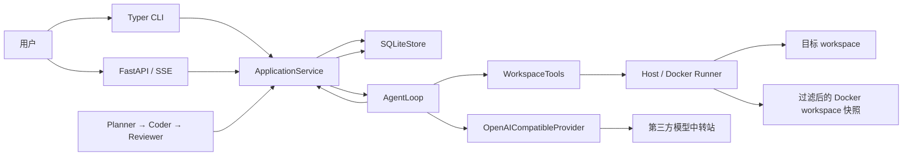
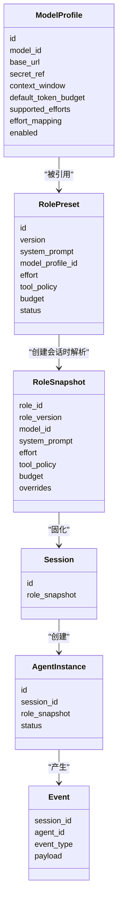
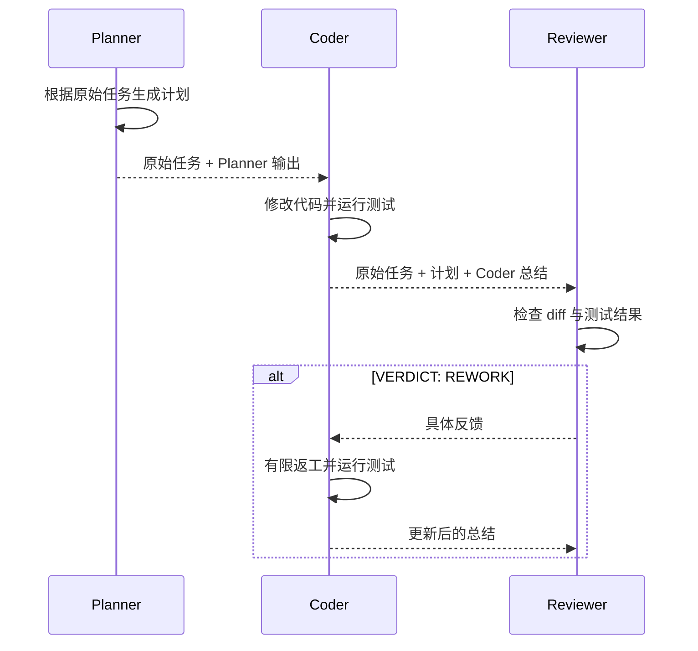

# Operant 项目架构与实现说明

> 文档状态：持续维护
>
> 最后更新：2026-08-19
>
> 对应版本：第二周 Coding Loop、自我纠错与安全执行

本文档是 Operant 当前架构、模块边界和实现状态的唯一权威说明。README 只保留项目简介和
常用命令，学习资料和个人规划不作为项目实现依据。

## 1. 项目定位

Operant 是一个由角色预设驱动的多模型 Coding Agent Runtime。

用户可以创建 Model Profile 和 Role Preset，再用指定角色创建 Session。Session 创建时会
保存不可变的 `RoleSnapshot`，因此后续修改角色不会改变历史任务的执行配置。

项目当前的核心目标是打通以下流程：

1. 配置多个真实模型；
2. 创建带有提示词、模型、effort、工具权限和预算的角色；
3. 使用角色启动 Agent Tool Calling Loop；
4. 让 Agent 在选定 workspace 中读取、修改代码并运行命令；
5. 保存 Session、Agent、Snapshot 和运行事件；
6. 按 Planner → Coder → Reviewer 顺序运行三个独立 Agent。

## 2. 当前完成度

### 已实现

- Pydantic 领域模型；
- Model Profile 创建、查询、更新、停用和健康检查；
- Role Preset 创建、复制、停用和版本记录；
- Main、Planner、Explorer、Coder、Reviewer 默认角色；
- 不可变 Role Snapshot；
- 会话级模型、effort 和 budget 覆盖；
- Session、Agent 和 Event 的 SQLite 持久化；
- OpenAI-compatible `/v1/models` 查询和 origin 自动补全；
- 流式 `chat/completions` 与 Tool Call 分片拼接；
- Agent Loop 和 Tool Result 回写；
- 测试失败结构化反馈、有限自我修复和重复失败停止；
- workspace 文件工具、命令工具和 Git diff；
- Docker 快照 Runner、CPU/内存/PID 限制、无网络命令执行和进程清理；
- Role Tool Policy 双层校验；
- 高风险命令审批后的暂停、决定和继续执行；
- 总超时和运行中取消；
- 完整的 Typer CLI；
- Model、Role、Session、审批和 Workflow 的 FastAPI/SSE；
- Planner → Coder → Reviewer 编排，以及由明确 verdict 驱动的有限返工；
- `.env` 安全解析，不执行 shell 内容；
- Kimi K2.6、GLM 5.2、Gemini 3.1 Pro Preview 真实端到端验收；
- `SECURITY.md` 安全边界草案；
- 自动化测试、Ruff、mypy 和 GitHub Actions CI。

### 尚未完成

- Token 和费用限制；
- Memory 检索与写入；
- 任务恢复和回放；
- Evaluation Runner；
- 可跨进程恢复的 Workflow 返工循环。

## 3. 总体架构



CLI、API 和 Workflow 只负责输入输出，不复制 Runtime 业务逻辑。它们共同调用
`ApplicationService`，由 Application Service 组织持久化、Agent Loop、Provider 和
workspace 工具。

## 4. 目录结构

```text
operant/
├── src/operant/
│   ├── api.py                    # FastAPI、Session API、SSE
│   ├── cli.py                    # Typer CLI
│   ├── settings.py               # 本地配置入口
│   ├── application/
│   │   ├── defaults.py           # 五个稳定 ID 的默认角色
│   │   ├── factory.py            # Session / Agent 创建工厂
│   │   ├── service.py            # CLI/API/Workflow 共用的用例层
│   │   └── workflow.py           # 三角色顺序编排
│   ├── domain/
│   │   ├── models.py             # Model、Role、Snapshot、Session、Agent、Event
│   │   └── messages.py           # 模型消息、Tool Call、Provider Event
│   ├── persistence/
│   │   └── sqlite.py             # Registry、Session、Agent、Event Store
│   ├── providers/
│   │   ├── base.py               # ModelProvider 协议
│   │   └── openai_compatible.py  # OpenAI-compatible 实现
│   ├── runtime/
│   │   ├── feedback.py           # 测试失败反馈与无进展检测
│   │   └── loop.py               # Agent Tool Calling Loop
│   └── tools/
│       ├── execution.py          # Host / Docker 命令 Runner
│       └── workspace.py          # workspace 工具与权限检查
├── tests/                        # 单元测试与协议测试
├── examples/buggy_calculator/    # 真实模型验收 fixture
├── SECURITY.md                   # 安全边界与威胁模型草案
├── docs/PROJECT_ARCHITECTURE.md  # 本文档
├── pyproject.toml
└── uv.lock
```

## 5. 分层与依赖方向

### Domain

Domain 定义数据和约束，不依赖 FastAPI、Typer、SQLite 或具体模型 SDK。

主要文件：

- `src/operant/domain/models.py`
- `src/operant/domain/messages.py`

### Application

Application Service 负责用例编排：

- Model Profile 和 Role Preset 的注册表用例；
- 默认角色初始化；
- 创建 Session；
- 创建和更新 AgentInstance；
- 构造带 Role Tool Policy 的 WorkspaceTools；
- 启动 AgentLoop；
- 管理总超时、取消信号和待审批 Future；
- 将 RuntimeEvent 写入 SQLite；
- 根据最终事件更新 Agent 状态。

### Runtime

Runtime 只依赖抽象的 `ModelProvider` 和工具注册表。它不读取环境变量，也不直接连接
SQLite。

### Infrastructure

Infrastructure 包含：

- OpenAI-compatible Provider；
- SQLite Store；
- workspace 文件和命令工具。

### Interface

CLI 和 FastAPI 是外部入口，只调用 Application Service，不直接操作 SQLite，也不自行实现
Agent 循环。

依赖方向保持为：

```text
CLI / API / Workflow
          ↓
Application Service
          ↓
Domain + Runtime 抽象
          ↓
Provider / Tools / SQLite
```

## 6. 核心领域模型



### ModelProfile

Model Profile 保存模型的非敏感配置：

- Provider 类型；
- 精确模型 ID；
- Base URL；
- Secret Reference；
- 上下文窗口和默认 Token 预算元数据；
- 支持的 effort 档位；
- effort 到 Provider 参数的映射；
- 启用状态。

`secret_ref` 保存的是环境变量名，例如 `OPERANT_API_KEY`，不是 API Key。Base URL 不允许
包含用户名、密码、query 或 fragment。

### RolePreset

Role Preset 保存可编辑的角色配置：

- 角色名称和 System Prompt；
- 绑定的 Model Profile；
- effort；
- Tool Policy；
- 最大轮次、连续相同测试失败上限、超时、输出 Token 和费用预算；
- Memory Scope；
- 状态和版本。

Role Preset 是可编辑配置，不是历史执行事实。

### CommandExecutionPolicy

`ToolPolicy` 还携带不可变的 `CommandExecutionPolicy`。它指定 `run_command` 使用 `host` 或
`docker` Runner，以及 Docker 镜像、CPU、内存和 PID 上限。新初始化的默认 Coder 使用 Docker；普通
`ToolPolicy` 的默认值仍为 `host`，因此自定义角色只有在用户明确选择 Docker 时才会启用隔离。

Docker Runner 不会把原 workspace 直接暴露给容器，而是创建排除凭据、Git 元数据、运行态数据、
虚拟环境和缓存的临时快照。测试产生的写入仅落在快照中，源码修改仍必须走 `apply_patch`。

### RoleSnapshot

创建 Session 时，SQLiteStore 会读取当前 Role Preset 和 Model Profile，把最终配置解析为
冻结的 `RoleSnapshot`。

Snapshot 保存：

- 角色 ID 和精确版本；
- 角色名称与 System Prompt；
- Model Profile ID、模型 ID 和 Provider 地址；
- Secret Reference 名称；
- effort 及其 Provider 参数映射；
- Tool Policy；
- Budget；
- Memory Scope；
- 会话级覆盖记录。

修改 Role Preset 不会修改已经保存的 Snapshot。进程重启后，旧 Session 仍直接读取原始
Snapshot，而不是重新解析最新角色。

### Session 与 AgentInstance

Session 表示一次具有固定执行配置的会话。AgentInstance 表示该 Session 中的一次实际 Agent
运行。

当前每次调用 `run_session()` 都会创建新的 AgentInstance，并依次进入：

```text
CREATED → RUNNING → COMPLETED / FAILED / CANCELLED / TIMED_OUT
```

## 7. Role 版本机制

角色使用 `role_heads + role_versions` 实现版本化。

```text
role_heads
└── role_id → current_version

role_versions
├── role_id + version 1
└── role_id + version 2
```

修改和停用角色都会新增版本，不覆盖旧版本。复制角色会创建新的 Role ID，并从版本 1 开始。

创建 Session 时只解析一次当前版本：

```text
RolePreset@1 + ModelProfile
             ↓
       RoleSnapshot@1
             ↓
          Session

之后 RolePreset 更新为 @2，旧 Session 仍保存 RoleSnapshot@1。
```

## 8. Agent Loop

Agent Loop 的消息流程如下：

```mermaid
sequenceDiagram
    participant User as 用户
    participant Loop as AgentLoop
    participant Model as ModelProvider
    participant Tools as WorkspaceTools

    User->>Loop: user message
    Loop->>Model: system + user messages + tool schemas
    Model-->>Loop: streamed text / Tool Call

    alt 没有 Tool Call
        Loop-->>User: agent.completed
    else 有 Tool Call
        Loop->>Tools: execute(name, arguments)
        Tools-->>Loop: Tool Result
        alt 失败的测试命令
            Loop->>Loop: 提取有限的结构化失败反馈
        end
        Loop->>Model: assistant Tool Call + tool message
        Model-->>Loop: 下一轮响应
    end
```

Loop 的关键规则：

1. 先加入 System Message 和 User Message；
2. 将 Snapshot 允许的工具 schema 发送给模型；
3. 收集流式文本和 Tool Call；
4. 执行工具；
5. 测试命令返回非零退出码时，提取失败摘要和稳定错误签名，写回 Tool Result；
6. 把 Tool Result 追加为 `tool` 消息；
7. 连续达到 `max_consecutive_test_failures` 次相同测试失败时，产生 `agent.no_progress` 并停止；
8. 继续调用模型；
9. 没有 Tool Call 时结束；
10. 高风险命令先产生审批事件，等待批准或拒绝后继续；
11. 达到 `max_turns` 时强制停止。

`ApplicationService` 以 Snapshot 的 `timeout_seconds` 为整次运行设置绝对截止时间，并可通过
取消信号中止正在等待的模型流。`max_output_tokens` 和 `max_cost_usd` 仍只建模，尚未计量。

## 9. Runtime 事件

当前可能产生的事件：

| 事件 | 含义 |
|---|---|
| `agent.started` | Agent 开始运行 |
| `model.delta` | 模型流式文本片段 |
| `model.completed` | 一轮模型响应结束 |
| `tool.started` | 开始执行工具 |
| `tool.completed` | 工具执行成功 |
| `tool.failed` | 工具参数或执行失败 |
| `tool.approval_required` | 操作需要人工审批 |
| `tool.approval_decided` | 审批已批准或拒绝 |
| `test.failure_feedback` | 非零测试结果已压缩为下一轮模型可用的摘要 |
| `agent.completed` | Agent 正常完成 |
| `agent.max_turns` | 达到最大轮次 |
| `agent.no_progress` | 重复测试失败触发安全停止 |
| `agent.cancelled` | 用户取消运行 |
| `agent.timed_out` | 达到整次运行总超时 |

Application Service 会把 RuntimeEvent 转换为持久化 Event，关联 Session 和 AgentInstance。
`agent.started` 的 Event payload 还包含角色版本、模型、Provider 和 effort，使审计可区分每次
模型调用来源。

## 10. Provider

`ModelProvider` 是 Runtime 依赖的协议。当前实现是 `OpenAICompatibleProvider`。

它负责：

- 通过 `GET /v1/models` 查询中转站提供的精确模型 ID；
- 当 Base URL 只有 origin 时自动补全 `/v1`；
- 从 Secret Reference 指向的环境变量读取 API Key；
- 调用流式 `/chat/completions`；
- 把内部 Message 转为 OpenAI-compatible 消息；
- 发送工具 schema；
- 拼接 SSE 中分段返回的 Tool Call ID、名称和参数；
- 把统一 effort 映射为具体 Provider 参数；
- 返回统一的 ProviderEvent。

Runtime 不关心当前运行的是 Kimi、GLM 还是 Gemini。只要中转站提供兼容协议，它们就可以
复用同一个 Provider。

除 MockTransport 协议测试外，已使用真实中转站完成 Kimi K2.6、GLM 5.2 和
Gemini 3.1 Pro Preview 的模型发现、流式文本、Tool Calling、文件修改和三角色编排联调。

## 11. Workspace 工具与权限

当前工具：

| 工具 | 功能 |
|---|---|
| `read_file` | 读取 workspace 内的 UTF-8 文本文件 |
| `search_files` | 在 workspace 内搜索字符串 |
| `apply_patch` | 使用精确旧文本替换修改文件；无变化 Patch 会被拒绝 |
| `run_command` | 不经过 Shell，以参数数组运行命令；由 Role Policy 选择 Host 或 Docker |
| `git_diff` | 只读获取 Git diff |

### 双层 Tool Policy

Tool Policy 在两个位置执行：

1. `definitions()` 只向模型暴露角色允许的工具；
2. `execute()` 再次校验，防止模型伪造隐藏工具调用。

建议默认角色权限：

```text
Planner / Reviewer
    read_file
    search_files
    git_diff

Coder
    read_file
    search_files
    apply_patch
    run_command
    git_diff
```

新初始化的默认 Coder 的命令使用 Docker Runner；没有 Docker 的环境会返回明确工具错误，而不会自动退回
到宿主机。用户自定义的 `ToolPolicy` 默认仍是 Host Runner，必须只用于可信 workspace。

### 路径保护

文件路径解析后必须仍位于用户指定的 workspace 中。文件工具拒绝访问：

- `.git`
- `.env`
- `.env.local`
- `secrets.json`

### 审批分类

以下命令分类需要审批：

- `git_write`
- `destructive`
- `network`
- `privileged`
- `shell`

高风险操作产生 `tool.approval_required` 后暂停。CLI 交互确认；API 客户端读取 SSE 中的
`tool_call_id`，再向审批决定端点提交批准或拒绝。批准后 Runtime 重试原命令，拒绝后把明确的
拒绝结果作为 Tool Result 写回模型上下文。

Shell 解释器、删除命令、网络命令、特权命令、Git 写操作和可识别的数据库删除语句都会被分类。
因此 `curl | sh` 一类绕过无 Shell 接口的调用会在 Shell 进程启动前进入人工审批。

### Docker Runner

Docker Runner 会把 workspace 复制为过滤快照，排除 `.git`、环境文件、凭据文件、`.operant`、
虚拟环境和常见缓存后才挂载到容器。它固定使用：

- `--network none`；
- Role Policy 中的 CPU、内存和 PID 上限；
- `--cap-drop ALL`、`no-new-privileges`、只读容器根和临时 tmpfs；
- 当前宿主 UID/GID；
- 命令超时或取消时的 Docker 客户端进程组终止和容器强制清理。

容器只得到快照，测试写入不会回传宿主 workspace；修改源码仍只能走受 Policy 约束的
`apply_patch`。真实命令需要本机 Docker 和一个预先准备好的项目镜像。

### 输出、超时与 Host Runner 限制

stdout、stderr 与 Git diff 均有上限并暴露截断标记；测试失败反馈进一步收缩到最多 12,000
字符。Host Runner 同样使用新进程组，并在超时或取消时杀死该进程组，但它仍继承本机用户权限，
不应被描述为沙箱。

Docker 也不是完整的安全边界：daemon、镜像和内核仍是信任面。完整威胁模型、部署前提和真实
容器验收条件见仓库根目录的 `SECURITY.md`。

## 12. SQLite 持久化

SQLiteStore 当前创建以下表：

| 表 | 用途 |
|---|---|
| `model_profiles` | 保存 Model Profile |
| `role_heads` | 保存角色当前版本号 |
| `role_versions` | 保存所有角色版本 |
| `sessions` | 保存 Session 和 Role Snapshot |
| `agents` | 保存 AgentInstance 和状态 |
| `events` | 按顺序保存运行事件 |

当前使用 Python 标准库 `sqlite3`，每个 Store 操作创建独立连接，并启用外键约束。写操作使用
事务；异常时回滚。

## 13. CLI

当前命令：

```text
operant init

operant model add
operant model list
operant model show
operant model update
operant model deactivate
operant model discover
operant model health

operant role add
operant role list
operant role show
operant role versions
operant role update
operant role copy
operant role deactivate
operant role seed-defaults

operant session create
operant session show
operant session events
operant session run

operant workflow run
```

CLI 统一通过 Application Service 执行完整的 Model/Role 注册表用例。Session 可以从已有
Role 创建，也可以即时创建新 Role，并覆盖模型、effort 和超时。单 Session 与三角色 Workflow
均可调用真实 Provider；CLI 遇到高风险命令时交互确认。

`role add --writable` 和 `session create --new-role-name ... --writable` 默认选择 Docker Runner，
并提供 `--command-runner`、`--docker-image`、`--cpu-limit`、`--memory-limit-mb` 和
`--pids-limit`。只有明确选择 `host` 时才直接继承宿主机权限。

## 14. FastAPI 与 SSE

当前 API：

| 方法 | 路径 | 功能 |
|---|---|---|
| `GET` | `/healthz` | 健康检查 |
| `GET/POST` | `/v1/models` | 查询或创建 Model Profile |
| `GET/PATCH/DELETE` | `/v1/models/{id}` | 查询、更新或停用 Model Profile |
| `POST` | `/v1/models/discover` | 查询中转站模型 ID |
| `POST` | `/v1/models/{id}/health` | 验证精确模型 ID |
| `GET/POST` | `/v1/roles` | 查询或创建 Role Preset |
| `POST` | `/v1/roles/seed-defaults` | 初始化五个默认角色 |
| `GET/PATCH/DELETE` | `/v1/roles/{id}` | 查询、版本化更新或停用 Role |
| `GET` | `/v1/roles/{id}/versions` | 查询全部历史版本 |
| `POST` | `/v1/roles/{id}/copy` | 复制角色 |
| `POST` | `/v1/sessions` | 创建 Session |
| `GET` | `/v1/sessions/{id}` | 查询 Session 和 Snapshot |
| `GET` | `/v1/sessions/{id}/events` | 查询持久化事件 |
| `POST` | `/v1/sessions/{id}/runs` | 运行 Agent 并返回 SSE |
| `POST` | `/v1/sessions/{id}/cancel` | 取消运行中的 Session |
| `GET` | `/v1/sessions/{id}/approvals` | 查询待审批工具调用 |
| `POST` | `/v1/sessions/{id}/approvals/{tool_call_id}` | 提交审批决定 |
| `POST` | `/v1/workflows/coding/runs` | 运行三角色 Workflow 并返回 SSE |

SSE 的 `event` 字段使用 RuntimeEvent 类型，`data` 是完整事件 JSON。Workflow 事件额外包含
角色名称和 Session ID，使客户端可以针对当前角色提交审批。

## 15. 三角色顺序编排

`SequentialCodingWorkflow` 使用独立 Session；默认由三角色完成首轮，Reviewer 只有在明确
给出 `VERDICT: REWORK` 时，才会让 Coder 进入下一轮：



每个角色拥有独立上下文和 Role Snapshot。角色之间只传递明确的文本产物，不共享完整模型消息
历史。

Workflow 通过 CLI 和 API/SSE 暴露，并有确定性 Provider 集成测试与真实三模型验收。CLI 与
API 默认最多返工 1 轮，可设为 0 到 3；缺少明确 verdict 时发出事件但不自动修改 workspace，
以避免含糊审查结论触发写操作。即使 `max_rework_rounds=0`，缺少 verdict 仍会报告
`workflow.review_verdict_missing`；达到上限仍为 `REWORK` 时，工作流会报告
`workflow.rework_limit_reached`。

Workflow 还会产生：

| 事件 | 含义 |
|---|---|
| `workflow.review_verdict_missing` | Reviewer 未给出明确 verdict，安全终止且不返工 |
| `workflow.rework_started` | 明确 `REWORK` 后开始指定轮次的 Coder 返工 |
| `workflow.rework_limit_reached` | 最后一轮仍是 `REWORK`，不再自动写入 workspace |

## 16. 测试与质量检查

当前测试覆盖：

- Role 修改产生新版本；
- 进程重启后旧 Snapshot 不变；
- 不支持的 effort 被拒绝；
- 凭据不能进入 Model Profile URL；
- Role 复制和停用；
- Model Profile 更新、停用和会话级模型覆盖；
- 默认角色幂等初始化；
- Tool Result 写回下一轮模型上下文；
- 失败测试的结构化反馈、最小 Patch 修复和再次验证；
- 连续相同测试失败的 `agent.no_progress` 停止；
- 高风险命令审批、批准后继续执行；
- Shell 解释器审批、命令输出截断和 Host 命令超时；
- 总超时持久化和运行中取消；
- workspace 路径逃逸被拒绝；
- Docker 命令的无网络/资源限制参数和过滤快照；
- Docker 真实集成测试在 Docker 与测试镜像均可用时执行，否则明确跳过；
- 只读角色不能执行写工具；
- Coder 可以修改真实文件；
- OpenAI-compatible 模型发现；
- origin Base URL 自动补全 `/v1`；
- SSE Tool Call 分片拼接；
- `.env` 不执行 shell 且不覆盖进程环境；
- 三角色独立 Session 的确定性工作流；
- `max_rework_rounds=0` 时仍报告缺失的 Reviewer verdict；
- FastAPI 注册表、默认角色、会话覆盖和 Snapshot 回归。

本地验证命令：

```bash
uv run ruff format --check .
uv run ruff check .
uv run mypy src
uv run pytest
git diff --check
```

开发阶段按需使用 `codebase-memory-mcp` 维护代码知识图谱。当前本机版本为官方
`v0.9.1-rc.1`；Operant full 索引已成功生成 516 个节点和 2597 条边，`search_graph`、
`trace_path` 与 `get_architecture` 均已验证。完整操作说明存放在本机按需加载的
`codebase-memory-mcp` skill 中，不再注入用户级全局 Prompt。

## 17. 真实模型验收场景

仓库中的 `examples/buggy_calculator/` 是可重复验收 fixture。原始版本故意保留两个问题：

- 除法使用整除，丢失小数；
- 除数为零时没有转换为明确的业务错误。

2026-07-30 已完成一次真实验收：

1. 将 fixture 复制到临时 Git workspace；
2. 通过 `/v1/models` 确认 `kimi-k2.6`、`glm-5.2` 和
   `gemini-3.1-pro-preview`；
3. Kimi Planner 读取代码并生成计划；
4. GLM Coder 使用 `apply_patch` 修改真实临时文件，并运行
   `python3 -m unittest -v`；
5. Gemini Reviewer 读取 Git diff 与测试，给出通过结论；
6. 模型外再次运行测试，3 项全部通过，`git diff --check` 通过；
7. SQLite 保存三个独立 Session 的 Snapshot 与事件；
8. 另建 Role 和 Session，再把 Role 从版本 1 修改为版本 2 并切换 Model Profile；
9. 重新读取旧 Session，仍得到版本 1、旧 Prompt 和旧 Model Profile，
   `snapshot_unchanged = true`。

## 18. 已知技术债务

1. `max_output_tokens` 和 `max_cost_usd` 目前只建模，尚未执行计量；
2. SQLite 使用同步 API，运行规模扩大后需要评估异步边界；
3. Workflow 只支持进程内、有限次数的返工；断线后的跨进程恢复仍未实现；
4. Memory Scope 只是字段，Memory 子系统尚未实现；
5. 当前没有数据库迁移框架；
6. SSE 断线后的跨进程任务恢复与回放尚未实现；
7. Docker Runner 已有参数、快照和条件集成测试；本机已安装 Docker Desktop 4.87.0，并使用
   `python:3.13-slim` 跑通真实隔离 Runner 集成用例。尚未构建专用 Operant 镜像或执行含真实模型的
   完整 Workflow 端到端验收，不能把该用例通过表述为完整业务流验收。

## 19. 文档维护规则

任何改变实际行为的代码更新，都必须同步检查并更新本文档。至少包括：

- 新增、删除或移动模块；
- 修改模块职责或依赖方向；
- 新增或修改领域模型；
- 修改 SQLite 表结构和持久化规则；
- 修改 Agent Loop 的继续、停止、错误或取消条件；
- 修改 Provider 协议、消息格式或 effort 映射；
- 新增、删除或修改工具及权限；
- 修改 CLI、API、SSE 或 Workflow；
- 修改安全边界、审批规则和沙箱行为；
- 完成或新增技术债务；
- 修改测试范围或真实验收流程。

完成代码变更前必须执行：

1. 对照 `git diff` 判断是否影响本文档；
2. 更新对应章节；
3. 更新顶部“最后更新”日期和“对应版本”；
4. 更新“当前完成度”和“已知技术债务”；
5. 检查 Mermaid、目录树、命令和 API 表是否仍与代码一致；
6. 将文档与代码放在同一个 Commit 或 Pull Request 中。

如果一次改动不影响架构或行为，也应在交付说明中明确写出“已检查项目说明文档，无需更新”，
不能静默跳过。

## 20. 变更记录

### 2026-08-19

- 完成第二周 Coding Loop、自我纠错与安全执行工程切片；
- 测试失败会产生有限的结构化反馈，并在连续相同失败时通过 `agent.no_progress` 停止；
- 增加 Host / Docker Command Runner，新初始化的默认 Coder 使用 Docker 过滤快照、无网络、资源限制和
  进程/容器清理路径；
- 扩展 Tool Policy 的 Shell 与数据库删除审批，并让输出截断显式可见；
- 修复所有 `max_rework_rounds` 取值下缺失 Reviewer verdict 的事件一致性；
- 新增 `SECURITY.md`，并增加 Docker 边界、超时、结构化修复与无进展的自动化测试；
- 该工程切片完成时本机尚无 Docker CLI，真实容器集成测试按条件跳过；这是当时的环境状态。
- 随后按官方默认方式安装 Docker Desktop 4.87.0，以 `python:3.13-slim` 跑通真实 Docker Runner
  集成用例；完整测试为 32 通过、1 个上游 Starlette 弃用警告。尚未运行含真实模型的完整 Workflow
  端到端验收。

### 2026-07-30

- 建立第一版项目架构与实现说明；
- 记录当前领域模型、调用链、SQLite、工具权限、CLI/API 和 Workflow；
- 将“每次项目更新必须同步检查本文档”设为项目维护规则；
- 将开发图谱工具升级到官方 `v0.9.1-rc.1` 并重新注册；Operant full 索引及符号、调用链、
  架构查询验证通过，移除对应技术债务；
- 移除安装器注入的用户级全局 AGENTS 块，改用按需加载的 `codebase-memory-mcp` skill；
- 完成 Model/Role CRUD、默认角色、会话覆盖、总超时、取消和可恢复审批；
- CLI/API/Workflow 统一通过 Application Service；
- 完成 21 项自动化测试和真实三模型 calculator 端到端验收；
- 证明角色更新后旧 Session 的 Role Snapshot 保持不变；
- 增加安全 `.env` 加载和 origin Base URL 的 `/v1` 自动补全。
