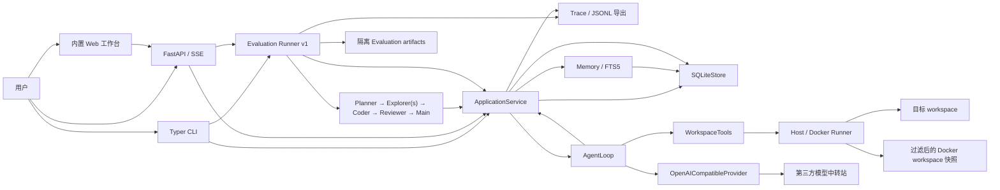
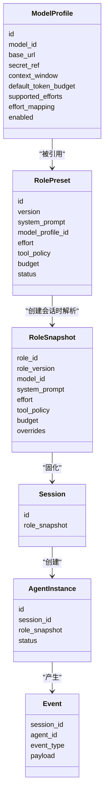
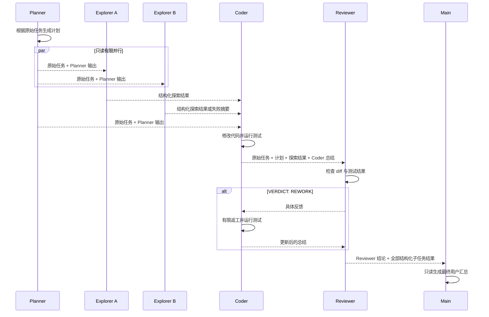

# Operant 项目架构与实现说明

> 文档状态：持续维护
>
> 最后更新：2026-08-25
>
> 对应版本：第四周工程收尾（Evaluation Runner v1）

本文档是 Operant 当前架构、模块边界和实现状态的唯一权威说明。README 只保留项目简介和
常用命令，学习资料和个人规划不作为项目实现依据。

`docs/项目架构.md` 描述中长期 Harness Kernel 目标，`docs/UI_UX_DESIGN_SPECIFICATION.md`
描述目标客户端设计。两者都是规划文档，不代表对应能力已经实现；如与本文、源码或测试冲突，
当前实现以本文、源码和测试为准。

## 1. 项目定位

Operant 是一个由角色预设驱动的多模型 Coding Agent Runtime。

用户可以创建 Model Profile 和 Role Preset，再用指定角色创建 Session。Session 创建时会
保存不可变的 `RoleSnapshot`，因此后续修改角色不会改变历史任务的执行配置。

项目当前的核心目标是打通以下流程：

1. 配置多个真实模型；
2. 创建带有提示词、模型、effort、工具权限和预算的角色；
3. 使用角色启动 Agent Tool Calling Loop；
4. 让 Agent 在选定 workspace 中读取、修改代码并运行命令；
5. 保存 Session、Agent、Snapshot 和运行事件；
6. 按 Planner → 只读 Explorer → Coder → Reviewer → Main 汇总运行相互隔离的 Agent。
7. 以 SQLite 任务记录和阶段检查点支持基础恢复，并用 Web 工作台观察完整任务。
8. 用可复现快照、隔离 artifact、外部验证、指标聚合和 Trace 根因分析对 Session/Workflow 做评测。

## 2. 当前完成度

### 已实现

- Pydantic 领域模型；
- Model Profile 创建、查询、更新、停用和健康检查；
- Role Preset 创建、复制、停用和版本记录；
- Main、Planner、Explorer、Coder、Reviewer 默认角色；
- 不可变 Role Snapshot；
- 会话级模型、effort 和 budget 覆盖；
- Session、Agent 和 Event 的 SQLite 持久化；
- WorkflowRun、WorkflowRunEvent、任务状态和阶段检查点的 SQLite 持久化；
- OpenAI-compatible `/v1/models` 查询和 origin 自动补全；
- 流式 `chat/completions` 与 Tool Call 分片拼接；
- Agent Loop 和 Tool Result 回写；
- 测试失败结构化反馈、有限自我修复和重复失败停止；
- workspace 文件工具、命令工具和 Git diff；
- Docker 快照 Runner、CPU/内存/PID 限制、无网络命令执行和进程清理；
- Role Tool Policy 双层校验；
- 高风险命令审批后的暂停、决定和继续执行；
- 总超时和运行中取消；
- 完整的 Typer CLI；
- Model、Role、Session、审批和 Workflow 的 FastAPI/SSE；
- Planner → 只读 Explorer → Coder → Reviewer 编排，以及由明确 verdict 驱动的有限返工；
- 最多 4 个只读 Explorer 的有限并行、自定义角色替换和并行槽位权限校验；
- 每个子任务的结构化成功/失败结果，以及必需角色失败时的安全停止；
- 可替换的只读 Main Role 最终汇总，并接收全部结构化子任务结果；
- 中断任务的阶段边界恢复；Coder 写结果不明时转为人工核对，拒绝自动重放；
- Session 与 Workflow 级 Trace 摘要、Token/耗时/错误统计和脱敏 JSONL 导出；
- Working、Episodic、Project 三类 Memory、版本/来源/作用域和 SQLite FTS5；
- 任务开始前读取已确认的项目知识，任务结束后生成项目结构/编码约定、验证命令与情节候选知识；
- Memory 候选确认、保守激活和停用；
- 任务、Trace、恢复、取消与 Memory 的 CLI/API；
- 无前端框架、无 CDN 的本地 Web 工作台，支持注册表、选角、SSE、审批和任务回放；
- Provider usage 解析、模型/工具/Agent 耗时和脱敏的 Provider 异常事件；
- EvaluationSuite、EvaluationCase、EvaluationVariant、EvaluationRun、EvaluationResult 及其不可变声明/
  实际快照、验证结果、指标、聚合与失败分类领域模型；
- 顺序执行 Case × Variant × repetition 的 Evaluation Runner v1，支持单 Session/完整 Workflow、
  模型/Prompt/effort/Memory 对照，以及 Exp 19—24 的 Suite 表达；
- 每个 Evaluation Result 的隔离 artifact workspace、变更路径、外部安全验证、Trace 证据和五类根因分析；
- Evaluation Suite/Run/Result 的 SQLite 持久化、CLI 和 FastAPI/SSE；
- `.env` 安全解析，不执行 shell 内容；
- Kimi K2.6、Gemini 3.7 Flash 的六角色真实多模型端到端验收；
- `SECURITY.md` 安全边界；
- 自动化测试、Ruff、mypy 和 GitHub Actions CI。

### 尚未完成

- Token/费用预算的强制执行与真实费用计算；
- 模型流中任意字节位置的恢复，以及结果未知 Coder 写操作的无人值守恢复；
- 审批 Future 的跨进程恢复；
- 使用真实 Provider 完成 Exp 19—24、形成统计性实验结论和用户学习验收；
- 自动模型价格发现、预算强制执行、显著性分析，以及中断 Evaluation Run 的逐 Result 自动续跑；
- 数据库迁移框架、Web 身份认证、设备配对和远程访问控制；
- 通用 Graph Runtime、Definition Compiler、Team/Mailbox 和智能创建；
- 类型化 TypeScript/Python Client SDK、React GUI/PWA、Textual TUI 和 Tauri 桌面壳；
- Host Connector、自托管 Relay、Remote Gateway、RemoteDevice/RemoteSession 和受控 Remote Target。

## 3. 总体架构



CLI、API 和 Workflow 只负责输入输出，不复制 Runtime 业务逻辑。它们共同调用
`ApplicationService`，由 Application Service 组织持久化、Agent Loop、Provider 和
workspace 工具。

## 4. 目录结构

```text
operant/
├── src/operant/
│   ├── api.py                    # FastAPI、Session API、SSE
│   ├── cli.py                    # Typer CLI
│   ├── settings.py               # 本地配置入口
│   ├── application/
│   │   ├── defaults.py           # 五个稳定 ID 的默认角色
│   │   ├── evaluation.py         # Evaluation Runner、隔离 artifact、指标与 Trace RCA
│   │   ├── factory.py            # Session / Agent 创建工厂
│   │   ├── service.py            # CLI/API/Workflow 共用的用例层
│   │   ├── trace.py              # Session / Workflow Trace 与脱敏 JSONL
│   │   └── workflow.py           # 编排、持久化检查点、恢复和 Memory 接入
│   ├── domain/
│   │   ├── evaluation.py         # Suite/Case/Variant/Run/Result、快照、指标和失败分类
│   │   ├── memory.py             # 三类 Memory、作用域和激活规则
│   │   ├── models.py             # Model、Role、Snapshot、Session、Agent、Event
│   │   ├── messages.py           # 模型消息、Tool Call、Provider Event
│   │   └── workflow.py           # WorkflowRun、状态、阶段和任务事件
│   ├── persistence/
│   │   └── sqlite.py             # Registry、Session、Agent、Event Store
│   ├── providers/
│   │   ├── base.py               # ModelProvider 协议
│   │   └── openai_compatible.py  # OpenAI-compatible 实现
│   ├── runtime/
│   │   ├── feedback.py           # 测试失败反馈与无进展检测
│   │   └── loop.py               # Agent Tool Calling Loop
│   ├── tools/
│   │   ├── execution.py          # Host / Docker 命令 Runner
│   │   └── workspace.py          # workspace 工具与权限检查
│   └── web/                      # 无 CDN 的 HTML/CSS/JS 工作台
├── tests/                        # 单元测试与协议测试
├── examples/buggy_calculator/    # 真实模型验收 fixture
├── SECURITY.md                   # 安全边界与威胁模型草案
├── docs/PROJECT_ARCHITECTURE.md  # 本文档
├── pyproject.toml
└── uv.lock
```

## 5. 分层与依赖方向

### Domain

Domain 定义数据和约束，不依赖 FastAPI、Typer、SQLite 或具体模型 SDK。

主要文件：

- `src/operant/domain/models.py`
- `src/operant/domain/messages.py`
- `src/operant/domain/memory.py`
- `src/operant/domain/workflow.py`
- `src/operant/domain/evaluation.py`

### Application

Application Service 负责用例编排：

- Model Profile 和 Role Preset 的注册表用例；
- 默认角色初始化；
- 创建 Session；
- 创建和更新 AgentInstance；
- 构造带 Role Tool Policy 的 WorkspaceTools；
- 启动 AgentLoop；
- 管理总超时、取消信号和待审批 Future；
- 将 RuntimeEvent 写入 SQLite；
- 根据最终事件更新 Agent 状态；
- 持久化 Workflow 事件、推进任务状态并支持阶段边界恢复；
- 执行 Memory 作用域、FTS 检索、候选确认和版本管理；
- 聚合 Session / Workflow Trace，并导出脱敏 JSONL。
- 持久化 Evaluation Suite/Run/Result，按固定顺序运行隔离对照，核对声明快照与实际快照，执行外部
  验证并聚合指标和根因证据。

`SequentialCodingWorkflow` 是固定、可解释的应用层协调器。它只通过 Application Service
选择 Role Preset、创建隔离 Session 和运行 Agent，不直接访问 SQLite；Reviewer 批准后，可再运行
一个可替换的只读 Main Role 生成最终汇总。动态模型路由和自治委派不属于 v1.0 范围。

### Runtime

Runtime 只依赖抽象的 `ModelProvider` 和工具注册表。它不读取环境变量，也不直接连接
SQLite。

### Infrastructure

Infrastructure 包含：

- OpenAI-compatible Provider；
- SQLite Store；
- workspace 文件和命令工具；
- Evaluation artifact 复制、清单哈希和受限外部验证进程。

### Interface

CLI、FastAPI 和内置 Web 工作台是外部入口。Web 只调用 FastAPI；CLI/API 只调用 Application
Service，不直接操作 SQLite，也不自行实现 Agent 循环。

依赖方向保持为：

```text
CLI / API / Workflow
          ↓
Application Service
          ↓
Domain + Runtime 抽象
          ↓
Provider / Tools / SQLite
```

## 6. 核心领域模型



### ModelProfile

Model Profile 保存模型的非敏感配置：

- Provider 类型；
- 精确模型 ID；
- Base URL；
- Secret Reference；
- 上下文窗口和默认 Token 预算元数据；
- 支持的 effort 档位；
- effort 到 Provider 参数的映射；
- 启用状态。

`secret_ref` 保存的是环境变量名，例如 `OPERANT_API_KEY`，不是 API Key。Base URL 不允许
包含用户名、密码、query 或 fragment。

### RolePreset

Role Preset 保存可编辑的角色配置：

- 角色名称和 System Prompt；
- 绑定的 Model Profile；
- effort；
- Tool Policy；
- 最大轮次、连续相同测试失败上限、超时、输出 Token 和费用预算；
- Memory Scope；
- 状态和版本。

Role Preset 是可编辑配置，不是历史执行事实。

### CommandExecutionPolicy

`ToolPolicy` 还携带不可变的 `CommandExecutionPolicy`。它指定 `run_command` 使用 `host` 或
`docker` Runner，以及 Docker 镜像、CPU、内存和 PID 上限。新初始化的默认 Coder 使用 Docker；普通
`ToolPolicy` 的默认值仍为 `host`，因此自定义角色只有在用户明确选择 Docker 时才会启用隔离。

Docker Runner 不会把原 workspace 直接暴露给容器，而是创建排除凭据、Git 元数据、运行态数据、
虚拟环境和缓存的临时快照。测试产生的写入仅落在快照中，源码修改仍必须走 `apply_patch`。

### RoleSnapshot

创建 Session 时，SQLiteStore 会读取当前 Role Preset 和 Model Profile，把最终配置解析为
冻结的 `RoleSnapshot`。

Snapshot 保存：

- 角色 ID 和精确版本；
- 角色名称与 System Prompt；
- Model Profile ID、模型 ID 和 Provider 地址；
- Secret Reference 名称；
- effort 及其 Provider 参数映射；
- Tool Policy；
- Budget；
- Memory Scope；
- 会话级覆盖记录。

修改 Role Preset 不会修改已经保存的 Snapshot。进程重启后，旧 Session 仍直接读取原始
Snapshot，而不是重新解析最新角色。

### Session 与 AgentInstance

Session 表示一次具有固定执行配置的会话。AgentInstance 表示该 Session 中的一次实际 Agent
运行。

当前每次调用 `run_session()` 都会创建新的 AgentInstance，并依次进入：

```text
CREATED → RUNNING → COMPLETED / FAILED / CANCELLED / TIMED_OUT
```

### WorkflowRun 与 WorkflowRunEvent

`WorkflowRun` 是完整编码任务的持久化身份，保存绝对 workspace、任务、各角色 ID、Explorer
并行上限、返工上限、当前阶段、状态、恢复来源和最终 verdict。状态包括 `created`、`running`、
`interrupted`、`manual_reconcile_required`、`completed`、`failed` 和 `cancelled`。

`WorkflowRunEvent` 使用 SQLite 单调递增序号保存 Workflow 和角色运行事件。事件在 SSE 发出前先
提交 SQLite，因此客户端断线后仍能查询已完成阶段和对应 Session。SQLite 是恢复权威；JSONL
只用于脱敏导出，不参与状态判断。

### Memory

`Memory` 分为：

- `working`：只属于一个 Session；
- `episodic`：记录一次任务经历，默认是待确认候选；
- `project`：必须绑定项目作用域，可被后续任务复用。

每条 Memory 保存来源 Session、来源任务、置信度、角色作用域、版本和状态。更新不会覆盖旧版本；
`memory_scope` 在 Service 层真正执行读写判权，而不只是提示词字段。持久知识默认先进入
`candidate`，只有显式确认或满足高置信度、可追踪来源和验证信号的保守规则才进入 `active`。

### Evaluation Suite、Run 与 Result

`EvaluationSuite` 是一次评测的不可变声明，包含 1—100 个 `EvaluationCase`、1—32 个
`EvaluationVariant`、1—20 次 repetition，展开结果最多 1000 条。Case 固定任务、fixture/环境、
验证命令和允许/期望变更路径；Variant 固定 Session 或 Workflow、模型、Prompt hash、Role 版本、
effort、Memory 开关/引用、执行策略与可选价格快照。

`EvaluationRun` 保存 Suite 身份、顺序执行策略、状态和聚合结果。每个 `EvaluationResult` 对应唯一的
Run × Case × Variant × repetition。Runner 在复制 fixture 或创建 Session/Workflow 前先创建带预留
artifact namespace 的 `pending` Result，正常路径只允许用同一 ID 一次性推进到 `passed`、`failed`、
`error`、`skipped` 或 `interrupted`；任何终态都不能再次更新。取消、流关闭或进程重启会把遗留
Pending 原地标记为 Interrupted，保留身份/artifact 引用但不伪造实际快照、指标、验证、变更或 Trace。
聚合显式保存计划总数以及 finished、interrupted、pending、尚未持久化四个互斥分区，成功率只使用
实际观测值。Result 的正常终态保存实际执行快照、artifact 引用、变更路径、验证结果、Trace 指针、
指标和失败分析。声明角色与注册表实际角色不一致时，
运行在模型调用前停止，并将实际快照作为 `orchestration.role_snapshot_drift` 证据保存，不能用声明值
覆盖实际值。

未知 usage、价格或遥测保持 `None`；聚合时只对布尔指标报告已知样本率，费用、Token 和延迟等完整值
只有在所有相关 Result 都有事实时才给出总和/均值，避免把缺失值当成零。

## 7. Role 版本机制

角色使用 `role_heads + role_versions` 实现版本化。

```text
role_heads
└── role_id → current_version

role_versions
├── role_id + version 1
└── role_id + version 2
```

修改和停用角色都会新增版本，不覆盖旧版本。复制角色会创建新的 Role ID，并从版本 1 开始。

创建 Session 时只解析一次当前版本：

```text
RolePreset@1 + ModelProfile
             ↓
       RoleSnapshot@1
             ↓
          Session

之后 RolePreset 更新为 @2，旧 Session 仍保存 RoleSnapshot@1。
```

## 8. Agent Loop

Agent Loop 的消息流程如下：

```mermaid
sequenceDiagram
    participant User as 用户
    participant Loop as AgentLoop
    participant Model as ModelProvider
    participant Tools as WorkspaceTools

    User->>Loop: user message
    Loop->>Model: system + user messages + tool schemas
    Model-->>Loop: streamed text / Tool Call

    alt 没有 Tool Call
        Loop-->>User: agent.completed
    else 有 Tool Call
        Loop->>Tools: execute(name, arguments)
        Tools-->>Loop: Tool Result
        alt 失败的测试命令
            Loop->>Loop: 提取有限的结构化失败反馈
        end
        Loop->>Model: assistant Tool Call + tool message
        Model-->>Loop: 下一轮响应
    end
```

Loop 的关键规则：

1. 先加入 System Message 和 User Message；
2. 将 Snapshot 允许的工具 schema 发送给模型；
3. 收集流式文本和 Tool Call；
4. 执行工具；
5. 测试命令返回非零退出码时，提取失败摘要和稳定错误签名，写回 Tool Result；
6. 把 Tool Result 追加为 `tool` 消息；
7. 连续达到 `max_consecutive_test_failures` 次相同测试失败时，产生 `agent.no_progress` 并停止；
8. 继续调用模型；
9. 没有 Tool Call 时结束；
10. 高风险命令先产生审批事件，等待批准或拒绝后继续；
11. 达到 `max_turns` 时强制停止。

`ApplicationService` 以 Snapshot 的 `timeout_seconds` 为整次运行设置绝对截止时间，并可通过
取消信号中止正在等待的模型流。`max_output_tokens` 和 `max_cost_usd` 仍只建模，尚未计量。

## 9. Runtime 事件

当前可能产生的事件：

| 事件 | 含义 |
|---|---|
| `agent.started` | Agent 开始运行 |
| `model.delta` | 模型流式文本片段 |
| `model.completed` | 一轮模型响应结束 |
| `tool.started` | 开始执行工具 |
| `tool.completed` | 工具执行成功 |
| `tool.failed` | 工具参数或执行失败 |
| `tool.approval_required` | 操作需要人工审批 |
| `tool.approval_decided` | 审批已批准或拒绝 |
| `test.failure_feedback` | 非零测试结果已压缩为下一轮模型可用的摘要 |
| `agent.completed` | Agent 正常完成 |
| `agent.max_turns` | 达到最大轮次 |
| `agent.no_progress` | 重复测试失败触发安全停止 |
| `agent.cancelled` | 用户取消运行 |
| `agent.timed_out` | 达到整次运行总超时 |
| `agent.failed` | Provider 或运行时异常；只保存异常类型，不保存原始错误正文 |

Application Service 会把 RuntimeEvent 转换为持久化 Event，关联 Session 和 AgentInstance。
`agent.started` 的 Event payload 还包含角色版本、模型、Provider 和 effort，使审计可区分每次
模型调用来源。Provider 返回 usage 时，`model.completed` 保存 Token 统计；模型、工具和 Agent
终态事件保存单调时钟耗时。上游不返回 usage 时字段保持未知，不伪装为 0。

Workflow 还会在 SSE/CLI 流中产生应用层事件，并在对外发送前写入
`workflow_run_events`。角色 RuntimeEvent 同时保留在各自 Session 的 `events` 中：

| 事件 | 含义 |
|---|---|
| `workflow.started` | 固化本次 Main、Planner、Explorer、Coder、Reviewer 角色选择和并行上限 |
| `workflow.subtask_result` | 单个隔离子任务的结构化结果 |
| `workflow.failed` | 必需角色失败，工作流安全停止 |
| `workflow.completed` | Reviewer 明确批准，返回本次所有子任务结果 |
| `workflow.memory_candidate` | 记录任务结束后生成的项目知识或情节候选 ID 与来源 |
| `workflow.review_verdict_missing` | Reviewer 没有明确 verdict，安全终止 |
| `workflow.rework_started` | 开始一次明确、有限的返工 |
| `workflow.rework_limit_reached` | 返工达到上限，停止继续写入 |

结构化子任务结果包含角色槽位、Role ID、Session ID、最终状态、最多 12,000 字符的摘要、已完成
事件类型和失败原因。Explorer 的失败会作为输入交给 Coder/Reviewer；Main 接收全部结果并只做
面向用户的最终汇总。Planner、Coder、Reviewer 或启用的 Main 失败则停止工作流。Workflow 级事件
会在必需角色失败时停止。Workflow 事件与每个子 Session 的 Event 一起组成完整任务 Trace。

## 10. Provider

`ModelProvider` 是 Runtime 依赖的协议。当前实现是 `OpenAICompatibleProvider`。

它负责：

- 通过 `GET /v1/models` 查询中转站提供的精确模型 ID；
- 当 Base URL 只有 origin 时自动补全 `/v1`；
- 从 Secret Reference 指向的环境变量读取 API Key；
- 调用流式 `/chat/completions`；
- 把内部 Message 转为 OpenAI-compatible 消息；
- 发送工具 schema；
- 拼接 SSE 中分段返回的 Tool Call ID、名称和参数；
- 把统一 effort 映射为具体 Provider 参数；
- 返回统一的 ProviderEvent。
- 解析流式响应中的 usage；即使 usage chunk 没有 choices 也不会丢失。

Runtime 不关心当前运行的是 Kimi、GLM 还是 Gemini。只要中转站提供兼容协议，它们就可以
复用同一个 Provider。

除 MockTransport 协议测试外，已使用真实中转站完成 Kimi K2.6 与 Gemini 3.7 Flash 的模型发现、
流式文本、Tool Calling、文件修改和六角色编排联调。一次 Grok Coder 和一次 Grok Planner 调用
遇到上游 `ProviderError`，均被持久化为结构化失败，未被算作验收成功；最终验收使用当前实际
成功响应的 Kimi/Gemini 组合。

## 11. Workspace 工具与权限

当前工具：

| 工具 | 功能 |
|---|---|
| `read_file` | 读取 workspace 内的 UTF-8 文本文件 |
| `search_files` | 在 workspace 内搜索字符串 |
| `apply_patch` | 使用精确旧文本替换修改文件；无变化 Patch 会被拒绝 |
| `run_command` | 不经过 Shell，以参数数组运行命令；由 Role Policy 选择 Host 或 Docker |
| `git_diff` | 只读获取 Git diff |

### 双层 Tool Policy

Tool Policy 在两个位置执行：

1. `definitions()` 只向模型暴露角色允许的工具；
2. `execute()` 再次校验，防止模型伪造隐藏工具调用。

建议默认角色权限：

```text
Planner / Reviewer
    read_file
    search_files
    git_diff

Coder
    read_file
    search_files
    apply_patch
    run_command
    git_diff
```

新初始化的默认 Coder 的命令使用 Docker Runner；没有 Docker 的环境会返回明确工具错误，而不会自动退回
到宿主机。用户自定义的 `ToolPolicy` 默认仍是 Host Runner，必须只用于可信 workspace。

### 路径保护

文件路径解析后必须仍位于用户指定的 workspace 中。文件工具拒绝访问：

- `.git`
- `.env`
- `.env.local`
- `secrets.json`

### 审批分类

以下命令分类需要审批：

- `git_write`
- `destructive`
- `network`
- `privileged`
- `shell`

高风险操作产生 `tool.approval_required` 后暂停。CLI 交互确认；API 客户端读取 SSE 中的
`tool_call_id`，再向审批决定端点提交批准或拒绝。批准后 Runtime 重试原命令，拒绝后把明确的
拒绝结果作为 Tool Result 写回模型上下文。

Shell 解释器、删除命令、网络命令、特权命令、Git 写操作和可识别的数据库删除语句都会被分类。
因此 `curl | sh` 一类绕过无 Shell 接口的调用会在 Shell 进程启动前进入人工审批。

### Docker Runner

Docker Runner 会把 workspace 复制为过滤快照，排除 `.git`、环境文件、凭据文件、`.operant`、
虚拟环境和常见缓存后才挂载到容器。它固定使用：

- `--network none`；
- Role Policy 中的 CPU、内存和 PID 上限；
- `--cap-drop ALL`、`no-new-privileges`、只读容器根和临时 tmpfs；
- 当前宿主 UID/GID；
- 命令超时或取消时的 Docker 客户端进程组终止和容器强制清理。

容器只得到快照，测试写入不会回传宿主 workspace；修改源码仍只能走受 Policy 约束的
`apply_patch`。真实命令需要本机 Docker 和一个预先准备好的项目镜像。

### 输出、超时与 Host Runner 限制

stdout、stderr 与 Git diff 均有上限并暴露截断标记；测试失败反馈进一步收缩到最多 12,000
字符。Host Runner 同样使用新进程组，并在超时或取消时杀死该进程组，但它仍继承本机用户权限，
不应被描述为沙箱。

Docker 也不是完整的安全边界：daemon、镜像和内核仍是信任面。完整威胁模型、部署前提和真实
容器验收条件见仓库根目录的 `SECURITY.md`。

## 12. SQLite 持久化

SQLiteStore 当前创建以下表：

| 表 | 用途 |
|---|---|
| `model_profiles` | 保存 Model Profile |
| `role_heads` | 保存角色当前版本号 |
| `role_versions` | 保存所有角色版本 |
| `sessions` | 保存 Session 和 Role Snapshot |
| `agents` | 保存 AgentInstance 和状态 |
| `events` | 按顺序保存运行事件 |
| `workflow_runs` | 保存任务输入、角色选择、当前阶段、状态和恢复来源 |
| `workflow_run_events` | 按 SQLite 序号保存任务级事件和 Session 关联 |
| `evaluation_suites` | 保存不可变 Suite 元数据和 JSON 声明 |
| `evaluation_cases` | 按 Suite 内顺序保存 Case |
| `evaluation_variants` | 按 Suite 内顺序保存 Variant |
| `evaluation_runs` | 保存 Run 状态、顺序执行策略和聚合结果 |
| `evaluation_results` | 保存唯一 Case × Variant × repetition 的 Pending、Interrupted 或已知终态事实 |
| `memories` | 保存 Memory ID 与当前版本号 |
| `memory_versions` | 保存所有不可变 Memory 版本、来源、作用域和状态 |
| `memory_fts` | FTS5 全文索引，普通检索只连接当前有效版本 |

当前使用 Python 标准库 `sqlite3`，每个 Store 操作创建独立连接，并启用外键约束。写操作使用
事务；异常时回滚。Store 初始化时会在同一事务内把遗留的 `running` Workflow 和 Evaluation Run
安全标记为 `interrupted`，并把对应 Pending Evaluation Result 原地转为 Interrupted、重算完整 Suite
计划分母，避免重启后显示虚假运行态或丢失已调度组合。这个实现假设 v1 由单个 Operant 服务进程拥有 SQLite；多进程
租约和数据库迁移仍未实现。

## 13. CLI

当前命令：

```text
operant init

operant model add
operant model list
operant model show
operant model update
operant model deactivate
operant model discover
operant model health

operant role add
operant role list
operant role show
operant role versions
operant role update
operant role copy
operant role deactivate
operant role seed-defaults

operant session create
operant session show
operant session events
operant session trace [--jsonl]
operant session run

operant workflow run
operant workflow list
operant workflow show
operant workflow events
operant workflow trace [--jsonl]
operant workflow resume [--allow-coder-replay]
operant workflow cancel

operant memory add
operant memory search
operant memory confirm
operant memory deactivate

operant evaluation suite add --file <absolute-suite-json>
operant evaluation suite list
operant evaluation suite show <suite-id>
operant evaluation run <suite-id> [--artifact-root <absolute-path>]
operant evaluation run list
operant evaluation run show <evaluation-run-id>
operant evaluation result list <evaluation-run-id>
```

CLI 统一通过 Application Service 执行完整的 Model/Role 注册表用例。Session 可以从已有
Role 创建，也可以即时创建新 Role，并覆盖模型、effort 和超时。单 Session 与多 Agent Workflow
均可调用真实 Provider；CLI 遇到高风险命令时交互确认。

`operant workflow run` 默认加入 `role_explorer`。`--explorer-role-id` 可重复提供最多 4 个自定义
只读角色，`--max-parallel-explorers` 控制并发数，`--main-role-id` 可替换最终汇总角色。Main、
Planner、Explorer 和 Reviewer 槽位在运行前必须通过只读权限校验；任何带 `apply_patch`、
`run_command`、workspace 写权限或命令执行权限的角色都不能进入这些槽位。

`role add --writable` 和 `session create --new-role-name ... --writable` 默认选择 Docker Runner，
并提供 `--command-runner`、`--docker-image`、`--cpu-limit`、`--memory-limit-mb` 和
`--pids-limit`。只有明确选择 `host` 时才直接继承宿主机权限。

`workflow resume` 只复用已经提交的阶段结果。若中断发生在 Coder 且最后一次写入结果不明，任务
转为 `manual_reconcile_required`；必须先人工检查 workspace，再显式提供
`--allow-coder-replay`。Memory CLI 必须提供 Session ID，并始终用该 Session 的不可变 Snapshot
执行读写判权。

Evaluation CLI 从受信任的本地 JSON 创建 Suite。显式 `--artifact-root` 必须是绝对路径；省略时使用
数据库父目录下的 `evaluations`。Run 以安全 JSON 事件输出进度；Result 查询会移除本地 artifact
workspace 绝对路径。

## 14. FastAPI 与 SSE

当前 API：

| 方法 | 路径 | 功能 |
|---|---|---|
| `GET` | `/healthz` | 健康检查 |
| `GET/POST` | `/v1/models` | 查询或创建 Model Profile |
| `GET/PATCH/DELETE` | `/v1/models/{id}` | 查询、更新或停用 Model Profile |
| `POST` | `/v1/models/discover` | 查询中转站模型 ID |
| `POST` | `/v1/models/{id}/health` | 验证精确模型 ID |
| `GET/POST` | `/v1/roles` | 查询或创建 Role Preset |
| `POST` | `/v1/roles/seed-defaults` | 初始化五个默认角色 |
| `GET/PATCH/DELETE` | `/v1/roles/{id}` | 查询、版本化更新或停用 Role |
| `GET` | `/v1/roles/{id}/versions` | 查询全部历史版本 |
| `POST` | `/v1/roles/{id}/copy` | 复制角色 |
| `POST` | `/v1/sessions` | 创建 Session |
| `GET` | `/v1/sessions/{id}` | 查询 Session 和 Snapshot |
| `GET` | `/v1/sessions/{id}/events` | 查询持久化事件 |
| `POST` | `/v1/sessions/{id}/runs` | 运行 Agent 并返回 SSE |
| `POST` | `/v1/sessions/{id}/cancel` | 取消运行中的 Session |
| `GET` | `/v1/sessions/{id}/approvals` | 查询待审批工具调用 |
| `POST` | `/v1/sessions/{id}/approvals/{tool_call_id}` | 提交审批决定 |
| `POST` | `/v1/workflows/coding/runs` | 运行角色驱动的多 Agent Workflow 并返回 SSE |
| `POST/GET` | `/v1/tasks` | 运行 Workflow，或查询已持久化任务 |
| `GET` | `/v1/tasks/{id}` | 查询任务状态、阶段和角色选择 |
| `GET` | `/v1/tasks/{id}/events` | 回放按序持久化的任务事件 |
| `GET` | `/v1/tasks/{id}/trace` | 查询聚合任务 Trace |
| `GET` | `/v1/tasks/{id}/trace.jsonl` | 下载脱敏 NDJSON Trace |
| `POST` | `/v1/tasks/{id}/resume` | 从阶段检查点恢复任务 |
| `POST` | `/v1/tasks/{id}/cancel` | 取消运行中或可恢复任务 |
| `POST` | `/v1/memories` | 通过 Session Snapshot 创建 Memory |
| `GET` | `/v1/memories/search` | 按作用域检索当前可读 Memory |
| `POST` | `/v1/memories/{id}/confirm` | 确认候选知识 |
| `DELETE` | `/v1/memories/{id}` | 版本化停用知识 |
| `GET/POST` | `/v1/evaluations/suites` | 查询或创建 Evaluation Suite |
| `GET` | `/v1/evaluations/suites/{id}` | 查询完整 Suite |
| `GET/POST` | `/v1/evaluations/runs` | 查询 Run，或顺序运行 Suite 并返回 SSE |
| `GET` | `/v1/evaluations/runs/{id}` | 查询 Run 状态与聚合结果 |
| `GET` | `/v1/evaluations/runs/{id}/results` | 查询脱敏后的 Result 列表 |

SSE 的 `event` 字段使用 RuntimeEvent 或 Workflow 事件类型，`data` 是完整事件 JSON。Workflow
事件额外包含角色槽位和 Session ID，使客户端可以区分并行 Explorer，并针对当前角色提交审批。

`/web` 提供本地静态工作台，不依赖 CDN。页面可管理模型和角色、从已有或即时角色创建 Session、
选择 Main/Planner/Explorer/Coder/Reviewer 运行 Workflow、处理审批、观察按角色分栏的 SSE，并查询、
恢复、取消持久化任务和查看任务 Trace。动态内容使用 `textContent` 等安全 DOM API，不执行模型
输出中的 HTML。工作台当前没有身份认证，默认只应绑定受信任的本机地址；不得直接暴露到公网。

## 15. 角色驱动的多 Agent 编排

`SequentialCodingWorkflow` 是应用层的确定性协调器。它使用明确选择的 Role ID 创建独立
Session；CLI/API 默认流程是 Planner → 一个只读 Explorer → Coder → Reviewer → Main 最终汇总。
调用方可以替换任意角色，并提供最多 4 个不同的只读 Explorer；只有 Explorer 槽位允许并行，
Coder 始终独占写阶段。Reviewer 只有在明确给出 `VERDICT: REWORK` 时，才会让 Coder 进入下一轮：



每个角色拥有独立上下文和 Role Snapshot。角色之间只传递有长度上限的结构化结果，不共享完整
模型消息历史。每个结果记录 `role_id` 和 `session_id`，因此自定义角色和实际执行配置可以回溯。
Explorer 超时、取消、达到轮次上限或异常时会产生结构化失败结果，后续角色和 Main 可看到该失败；
必需的 Planner、Coder、Reviewer 或启用的 Main 失败时产生 `workflow.failed` 并停止，不会用空输出继续。

Workflow 通过 CLI 和 API/SSE 暴露，并有确定性 Provider 集成测试。CLI 与 API 默认最多返工
1 轮，可设为 0 到 3；缺少明确 verdict 时发出事件但不自动修改 workspace，以避免含糊审查
结论触发写操作。即使 `max_rework_rounds=0`，缺少 verdict 仍会报告
`workflow.review_verdict_missing`；达到上限仍为 `REWORK` 时，工作流会报告
`workflow.rework_limit_reached`。

协调器在每个 Workflow 事件对外发送前先写入 SQLite，并同步推进 `WorkflowRun` 的阶段和状态。
恢复时沿 `resumed_from_id` 链读取已成功提交的 `workflow.subtask_result` 检查点，跳过已完成角色；
不会尝试从任意模型流字节继续。当上次进程只留下“Coder 已开始”而没有确定结果时，任务转为
`manual_reconcile_required`，默认拒绝自动重放写操作；用户核对 workspace 后必须显式设置
`allow_coder_replay` 才能继续。启动时遗留的 `running` 任务会先标记为 `interrupted`。

任务开始时只向角色注入与绝对 workspace 精确匹配、当前有效且 Snapshot 允许读取的 Project
Memory。任务完成后，把成功 Explorer 的结构化摘要保存为 candidate Project Memory，用于承载项目
结构与编码约定；仅把已验证成功的安全测试命令自动保存为 active Project Memory；Coder 总结先保存
为 candidate Episodic Memory。两类模型摘要均需人工确认后才能激活。这一策略避免跨项目召回和
未经验证的模型结论污染持久知识。

Workflow 还会产生：

| 事件 | 含义 |
|---|---|
| `workflow.review_verdict_missing` | Reviewer 未给出明确 verdict，安全终止且不返工 |
| `workflow.rework_started` | 明确 `REWORK` 后开始指定轮次的 Coder 返工 |
| `workflow.rework_limit_reached` | 最后一轮仍是 `REWORK`，不再自动写入 workspace |
| `workflow.subtask_result` | 返回单角色的结构化完成或失败结果 |
| `workflow.memory_candidate` | 返回任务生成的 Project/Episodic Memory ID、状态和来源 |
| `workflow.failed` | 必需角色失败，停止后续角色 |
| `workflow.completed` | 明确批准后汇总全部子任务结果 |

### Evaluation Runner v1

Runner 按 Case → Variant → repetition 的固定顺序展开，不并发写同一 fixture。每条 Result 都复制
独立 workspace，排除凭据、运行态目录、虚拟环境、依赖/构建缓存和越界软链接；模型只在副本中工作，
源 workspace 不被评测修改。Session Variant 运行一个固定 Role；Workflow Variant 运行固定的
Planner → Explorer(s) → Coder → Reviewer → 可选 Main，并关闭 Memory 候选回写。

模型运行后，Runner 使用无 Shell 参数数组执行 Case 预先声明的 pytest/unittest、Ruff、mypy 或
`git diff --check` 等白名单验证。超时终止进程组，原始输出不进入 Result。成功判定同时要求 Runtime、
外部验证和变更路径契约成立；首次成功、修复/返工轮次、usage/费用/延迟、工具/审批、Patch Accuracy
均从持久事件和外部验证事实计算。

失败分析从 Session/Workflow Trace 和验证事实选择首个转折证据，分类为模型、Prompt/协议、工具/上下文、
环境或编排；无法证明时使用 `unknown`，不会凭错误正文猜测。Evaluation Runner v1 可承载 Exp 19—24，
但本次只完成工程能力与确定性自动化测试，尚未执行真实模型实验，也未产生实验结论。

## 16. 测试与质量检查

当前测试覆盖：

- Role 修改产生新版本；
- 进程重启后旧 Snapshot 不变；
- 不支持的 effort 被拒绝；
- 凭据不能进入 Model Profile URL；
- Role 复制和停用；
- Model Profile 更新、停用和会话级模型覆盖；
- 默认角色幂等初始化；
- Tool Result 写回下一轮模型上下文；
- 失败测试的结构化反馈、最小 Patch 修复和再次验证；
- 连续相同测试失败的 `agent.no_progress` 停止；
- 高风险命令审批、批准后继续执行；
- Shell 解释器审批、命令输出截断和 Host 命令超时；
- 总超时持久化和运行中取消；
- workspace 路径逃逸被拒绝；
- Docker 命令的无网络/资源限制参数和过滤快照；
- Docker 真实集成测试在 Docker 与测试镜像均可用时执行，否则明确跳过；
- 只读角色不能执行写工具；
- Coder 可以修改真实文件；
- OpenAI-compatible 模型发现；
- origin Base URL 自动补全 `/v1`；
- SSE Tool Call 分片拼接；
- `.env` 不执行 shell 且不覆盖进程环境；
- Main/Planner/Explorer/Coder/Reviewer 独立 Session 的确定性工作流；
- `role_main` 接收全部结构化结果并在独立 Session 中生成最终汇总；
- 两个只读 Explorer 的真实异步并发、结构化结果交接和自定义 Role ID；
- Explorer 超时结构化为状态、完成步骤和失败原因，且不会让后续只读结果丢失；
- Main/Planner/Explorer/Reviewer 槽位拒绝可写角色，API 在建立 SSE 前返回配置错误；
- `max_rework_rounds=0` 时仍报告缺失的 Reviewer verdict；
- Workflow 状态、角色选择、阶段和事件写入 SQLite，进程重启时运行中任务转为中断；
- 恢复任务复用已提交的 Planner/Explorer/Coder 检查点，不重复执行已确定的写阶段；
- Coder 结果未知时拒绝默认重放，并进入 `manual_reconcile_required`；
- Working/Episodic/Project Memory 的版本、FTS5 检索、作用域判权、确认和停用；
- 任务只召回精确 workspace 的 active Project Memory，并保守保存验证命令与候选总结；
- 成功 Explorer 的项目结构/编码约定摘要只保存为 candidate Project Memory，不会自动注入后续任务；
- Provider usage 解析、模型/工具耗时、脱敏 Session/Workflow JSONL Trace 和异常清洗；
- Workflow/Memory/Trace 的 CLI 与 API 回归；
- 无 CDN Web 工作台的静态资源、任务查询、恢复、取消和安全 DOM 约束；
- FastAPI 注册表、默认角色、会话覆盖和 Snapshot 回归；
- Evaluation 领域边界、Prompt/Role/Memory/环境/Workflow 快照契约和未知指标传播；
- Suite/Case/Variant/Run/Result SQLite 事务、唯一 Pending→单一终态、取消/流关闭和重启中断；
- artifact 隔离复制、越界软链接排除、外部验证超时/进程组终止和变更路径检查；
- Session/Workflow Variant、Memory 开关与禁用回写、实际角色漂移、指标/费用聚合和五类 Trace RCA；
- Evaluation CLI/API/SSE、错误清洗和本地 artifact 路径脱敏。

本地验证命令：

```bash
uv run ruff format --check .
uv run ruff check .
uv run mypy src
uv run pytest
git diff --check
```

2026-08-25 的第四周工程收尾门禁使用确定性 Provider、隔离 fixture 和 Fake API Runner：pytest 为
92 通过、1 个条件性 Docker 测试跳过，并保留 1 个上游 Starlette TestClient 弃用警告；Ruff
format/check、mypy 和 `git diff --check` 通过。未设置真实 Provider，也不把 Docker skip 视为容器
验收。2026-08-22 的门禁曾在
显式设置 `OPERANT_DOCKER_TEST_IMAGE=python:3.13-slim` 后执行
Docker Runner 真实集成路径：pytest 为 57 通过；Ruff format/check、mypy、JavaScript 语法和
`git diff --check` 均通过。仅保留 1 个来自上游 Starlette TestClient 的弃用警告。

开发阶段按需使用 `codebase-memory-mcp` 维护代码知识图谱。当前本机版本为官方
`v0.9.1-rc.1`；Operant full 索引已成功生成 516 个节点和 2597 条边，`search_graph`、
`trace_path` 与 `get_architecture` 均已验证。完整操作说明存放在本机按需加载的
`codebase-memory-mcp` skill 中，不再注入用户级全局 Prompt。

## 17. 真实模型验收场景

仓库中的 `examples/buggy_calculator/` 是可重复验收 fixture。原始版本故意保留两个问题：

- 除法使用整除，丢失小数；
- 除数为零时没有转换为明确的业务错误。

2026-07-30 已完成一次真实验收：

1. 将 fixture 复制到临时 Git workspace；
2. 通过 `/v1/models` 确认 `kimi-k2.6`、`glm-5.2` 和
   `gemini-3.1-pro-preview`；
3. Kimi Planner 读取代码并生成计划；
4. GLM Coder 使用 `apply_patch` 修改真实临时文件，并运行
   `python3 -m unittest -v`；
5. Gemini Reviewer 读取 Git diff 与测试，给出通过结论；
6. 模型外再次运行测试，3 项全部通过，`git diff --check` 通过；
7. SQLite 保存三个独立 Session 的 Snapshot 与事件；
8. 另建 Role 和 Session，再把 Role 从版本 1 修改为版本 2 并切换 Model Profile；
9. 重新读取旧 Session，仍得到版本 1、旧 Prompt 和旧 Model Profile，
   `snapshot_unchanged = true`。

2026-08-22 又完成一次第三周六角色真实验收：

1. 先执行 `operant model discover`，确认本次使用的精确模型 ID 仍由上游提供；
2. 将 calculator fixture 复制到新的绝对临时 workspace，并为六个角色建立独立 Session；
3. Kimi K2.6 Planner 生成计划，Kimi K2.6 与 Gemini 3.7 Flash 两个只读 Explorer 并行检查实现和测试；
4. Gemini 3.7 Flash Coder 在该可信隔离副本中通过 Host Runner 修改 `calculator.py`；
5. Gemini 3.7 Flash Reviewer 给出 `VERDICT: APPROVED`，Kimi K2.6 Main 完成只读汇总；
6. 六个 Session、Workflow 阶段和事件均写入独立 SQLite，Trace 汇总得到 2 个模型、零工具失败和
   `APPROVED` verdict；
7. 工作流生成两条 candidate Project 结构/约定摘要、一条 active Project 验证知识和一条
   candidate Episodic 总结，并分别记录来源 Session 与任务；
8. 模型外独立运行 `python3 -m unittest -v`，3 项全部通过；`git diff --check` 通过，diff 只包含
   预期的除零检查和浮点除法修复；
9. 所有非 Coder 角色的 Snapshot 均再次核对为只读。此次 Host Runner 仅用于可信临时 fixture，
   不能外推为不可信 workspace 的宿主机安全验收。

完成最终代码前的真实验收还暴露并修正了两个问题：一次模型修复留下文件末尾多余空行，被独立
`git diff --check` 正确拒绝；验收脚本的默认数据库曾复用系统临时目录父路径，现已改为每次独立的
artifact 根目录。最终成功运行对应修正后的代码，并在 Coder 收到一次结构化测试失败反馈后完成修复。
更早还有两次独立尝试分别在 Planner 或 Coder 模型调用阶段遇到上游 Provider 瞬时错误；这些失败均
未计入成功证据。失败任务被持久化为失败状态，Provider 原始响应未写入审计事件。

## 18. 已知技术债务

1. `max_output_tokens` 和 `max_cost_usd` 目前只建模，尚未执行计量；
2. SQLite 使用同步 API，运行规模扩大后需要评估异步边界；
3. Workflow 仍是固定状态机和有限次数返工；恢复只发生在已持久化的阶段边界，不支持从任意模型
   流位置继续。Coder 写入结果未知时必须人工核对，不能无人值守恢复；
4. 待审批工具调用的 `Future` 仍只存在于进程内，尚不能跨进程恢复审批；
5. Memory 已有版本、来源、作用域、FTS5 和保守激活，但还没有自动冲突合并、质量评测、容量淘汰
   或跨项目知识共享；
6. 当前没有数据库迁移框架；现阶段只适合由当前版本初始化或兼容追加表结构；
7. SSE 客户端重连需要通过任务事件查询接口主动回放，尚未实现 `Last-Event-ID` 自动续传；
8. Web 工作台和 API 没有身份认证、CSRF 防护、设备配对或 Remote Gateway，只能绑定受信任本机地址；
9. Evaluation Runner v1 已有可复现 Suite、隔离 artifact、外部验证、指标和五类 Trace RCA，但模型
   价格必须由 Suite 固定提供，尚无自动价格发现、预算强制执行、统计显著性、真实模型 Exp 19—24
   结果或逐 Result 断点续跑；中断组合会保留为不可重放的 Interrupted Result，当前仍需新建 Run 才能
   重新执行；
10. Docker Runner 已跑通真实隔离集成用例，第三周六角色 Workflow 也已在可信临时 Host fixture 上
    完成真实模型验收；两者仍是不同证据，尚未完成“真实模型 + Docker Coder”的同一次端到端验收，
    也尚未构建专用 Operant 镜像。

## 19. 文档维护规则

任何改变实际行为的代码更新，都必须同步检查并更新本文档。至少包括：

- 新增、删除或移动模块；
- 修改模块职责或依赖方向；
- 新增或修改领域模型；
- 修改 SQLite 表结构和持久化规则；
- 修改 Agent Loop 的继续、停止、错误或取消条件；
- 修改 Provider 协议、消息格式或 effort 映射；
- 新增、删除或修改工具及权限；
- 修改 CLI、API、SSE 或 Workflow；
- 修改安全边界、审批规则和沙箱行为；
- 完成或新增技术债务；
- 修改测试范围或真实验收流程。

完成代码变更前必须执行：

1. 对照 `git diff` 判断是否影响本文档；
2. 更新对应章节；
3. 更新顶部“最后更新”日期和“对应版本”；
4. 更新“当前完成度”和“已知技术债务”；
5. 检查 Mermaid、目录树、命令和 API 表是否仍与代码一致；
6. 将文档与代码放在同一个 Commit 或 Pull Request 中。

如果一次改动不影响架构或行为，也应在交付说明中明确写出“已检查项目说明文档，无需更新”，
不能静默跳过。

## 20. 变更记录

### 2026-08-25

- 完成第四周 Evaluation Runner v1：新增 Suite/Case/Variant/Run/Result、声明/实际快照、验证结果、
  指标聚合与五类 Trace 根因分析领域契约；
- 增加逐 Result 隔离 artifact、凭据/缓存/越界软链接排除、白名单外部验证和进程组超时清理；
- 支持固定单 Session 或完整 Workflow，以及模型、Prompt、effort、Memory 对照和 Exp 19—24 Suite；
- 增加五张 SQLite 表、唯一 Pending→单一终态 Store 契约、Run/Result 原子重启中断、CLI 与
  FastAPI/SSE，并对外移除本地 artifact workspace 路径；
- 修复 reviewer 发现的中断审计空窗：组合执行前即保存 Pending，同一 ID 写终态；取消、流关闭或进程
  重启均收口为不伪造实际事实的 Interrupted，聚合保留完整 Suite 分母；
- Eval Workflow 只读取精确源 workspace 的 active Project Memory，禁用候选回写；角色漂移在模型
  调用前停止并保存实际快照；
- 新增领域、持久化、Runner、Workflow、RCA 和 CLI/API 自动化测试；未运行真实模型 Exp 19—24，
  未修改 Web、GUI、Graph、Remote Control 或其他前端/2.0 后续功能。

### 2026-08-25（目标架构与治理）

- 明确当前实现文档、目标 Harness 架构与目标客户端设计的三层权威关系；
- 记录 React GUI、Textual TUI、Tauri 桌面壳、通用 Graph Runtime 和 Team/Mailbox 尚未实现；
- 将目标 Remote Control 与 Remote Execution Target 分离：前者使用手机/浏览器控制本地 Core，后者
  才在授权远程主机执行；目标支持直连和用户自托管 Relay，但当前均未实现；
- 明确 Operant 2.0 保持单用户、单 Core、本地 SQLite 权威，不把 SaaS、多用户协作或分布式 Core
  写入短期范围；
- 移除已完成且与现行目标文档竞争权威的旧 v1 项目计划、工程计划、学习计划和项目总结；
- 本次只同步设计与治理文档，没有改变当前 Runtime、API、SQLite、Web 工作台或安全行为。

### 2026-08-22

- 完成第三周多 Agent、Memory、恢复、可观测性和基础 Web 工作台工程；
- 将固定流程扩展为 Planner → 一个或多个只读 Explorer → Coder → Reviewer；
- CLI/API 默认在 Reviewer 批准后运行可替换的只读 `role_main` 完成最终汇总；
- 支持最多 4 个不同 Explorer Role，并用信号量限制只读并行；任何可写角色都不能进入并行槽位；
- 增加带 Role ID、Session ID、状态、摘要、完成步骤和失败原因的结构化子任务结果；
- Explorer 失败可以交给后续角色处理，Planner、Coder 或 Reviewer 失败则安全停止；
- 将 Workflow 任务、阶段和有序事件持久化到 SQLite；支持安全检查点恢复、取消和 Coder 未知写结果
  的人工核对状态；
- 实现 Working/Episodic/Project Memory、不可变版本、来源和角色/项目作用域、FTS5 检索、候选确认、
  保守自动激活和停用；
- Provider 与 Runtime 增加 usage、模型/工具耗时和清洗后的失败事件，新增 Session/Workflow Trace
  聚合与脱敏 JSONL 导出；
- CLI/API 增加任务查询、事件、Trace、恢复、取消和 Memory 管理入口；
- 新增不依赖 CDN 的本地 Web 工作台，覆盖模型/角色、Session/Workflow、审批、分栏 SSE、任务回放、
  Trace、恢复和取消，并用真实浏览器完成视觉与交互检查；
- 完成 Kimi K2.6 与 Gemini 3.7 Flash 的六角色真实 Workflow 验收，独立 unittest 和 diff 复核通过；
- 新增并发、恢复、Memory、Trace、Web、CLI/API、usage、失败清洗和权限回归测试；工程完成不代表用户
  已完成第三周学习，学习状态仍由源码核对、练习和复述验收决定。

### 2026-08-19

- 完成第二周 Coding Loop、自我纠错与安全执行工程切片；
- 测试失败会产生有限的结构化反馈，并在连续相同失败时通过 `agent.no_progress` 停止；
- 增加 Host / Docker Command Runner，新初始化的默认 Coder 使用 Docker 过滤快照、无网络、资源限制和
  进程/容器清理路径；
- 扩展 Tool Policy 的 Shell 与数据库删除审批，并让输出截断显式可见；
- 修复所有 `max_rework_rounds` 取值下缺失 Reviewer verdict 的事件一致性；
- 新增 `SECURITY.md`，并增加 Docker 边界、超时、结构化修复与无进展的自动化测试；
- 该工程切片完成时本机尚无 Docker CLI，真实容器集成测试按条件跳过；这是当时的环境状态。
- 随后按官方默认方式安装 Docker Desktop 4.87.0，以 `python:3.13-slim` 跑通真实 Docker Runner
  集成用例；完整测试为 32 通过、1 个上游 Starlette 弃用警告。尚未运行含真实模型的完整 Workflow
  端到端验收。

### 2026-07-30

- 建立第一版项目架构与实现说明；
- 记录当前领域模型、调用链、SQLite、工具权限、CLI/API 和 Workflow；
- 将“每次项目更新必须同步检查本文档”设为项目维护规则；
- 将开发图谱工具升级到官方 `v0.9.1-rc.1` 并重新注册；Operant full 索引及符号、调用链、
  架构查询验证通过，移除对应技术债务；
- 移除安装器注入的用户级全局 AGENTS 块，改用按需加载的 `codebase-memory-mcp` skill；
- 完成 Model/Role CRUD、默认角色、会话覆盖、总超时、取消和可恢复审批；
- CLI/API/Workflow 统一通过 Application Service；
- 完成 21 项自动化测试和真实三模型 calculator 端到端验收；
- 证明角色更新后旧 Session 的 Role Snapshot 保持不变；
- 增加安全 `.env` 加载和 origin Base URL 的 `/v1` 自动补全。
