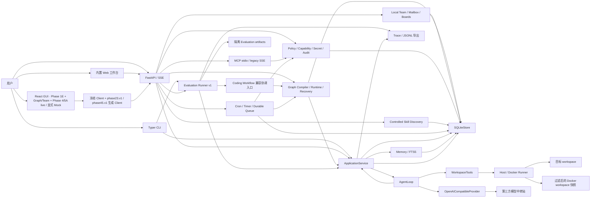
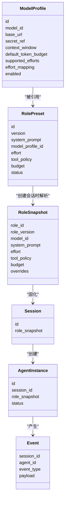
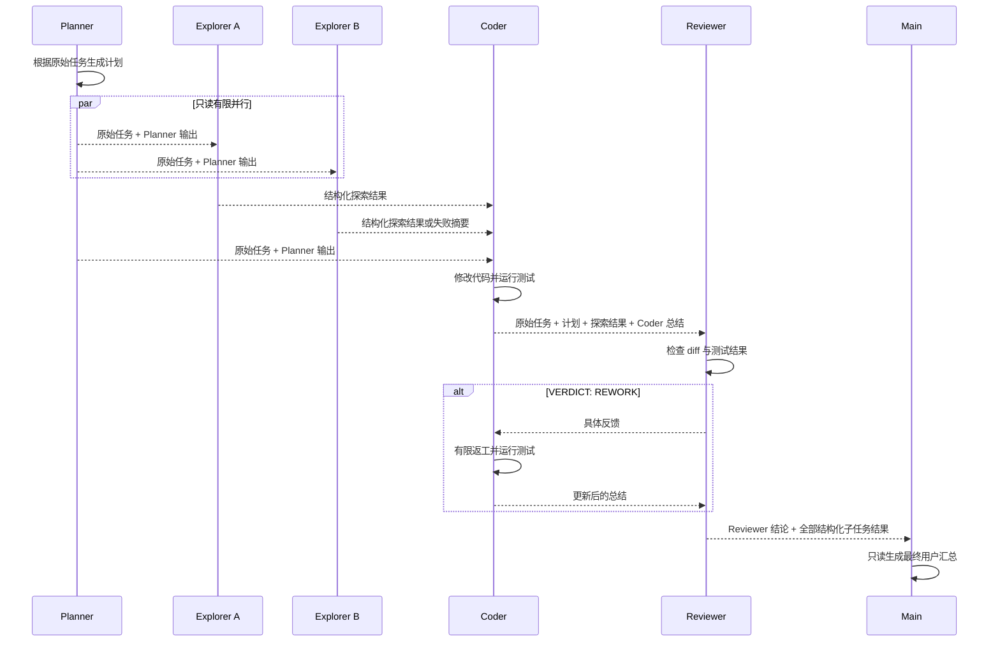

# Operant 项目架构与实现说明

> 文档状态：持续维护
>
> 最后更新：2026-10-05（Beta 任务 5 增量；记录身份：独立验收 Agent，保留原历史署名）
>
> 对应源码：`codex/beta-remote-task5`，基线 `main@85f280063178d6ebf7748d246902b6403cba7f57`；本分支新增任务 5，SQLite 为 v23。本次没有更新已安装 App 或真实用户库。任务 5 的实际双设备结果见独立验收记录，不能凭源码视为已通过。

本文档是 Operant 当前架构、模块边界和实现状态的唯一权威说明。README 只保留项目简介和
常用命令，学习资料和个人规划不作为项目实现依据。

`docs/项目架构.md` 描述中长期 Harness Kernel 目标，`docs/UI_UX_DESIGN_SPECIFICATION.md`
描述目标客户端设计。两者都是规划文档，不代表对应能力已经实现；如与本文、源码或测试冲突，
当前实现以本文、源码和测试为准。

## 当前版本速览

- **当前源码**：会话工作台、编排、配置和任务控制及本机扩展已有各自交付记录。本分支增加 H-17 私有双设备配对、远端 Session 控制和只读/白名单 Target 执行；合并状态和验收以 Git 与[任务 5 验收记录](design/beta-remote/acceptance.md)核对。
- **公开标签**：`v0.1.0-beta.1` 仍是 2026-09-14 的 B2-3 源码快照；本文件当前能力不能倒推为该标签已有能力。
- **会话工作台**：[PR #28](https://github.com/PinelliaChill/Operant/pull/28) 提供会话内子 Agent、定向消息、历史树，以及 GUI/TUI 引用、命令和上下文入口，详见 §2.1。
- **交付边界**：本机候选安装不等于正式签名、公证或自动更新发布；主线合并也不会自动更新已安装 App。历史批次的失败与验收范围仍保留。

| 当前模块 | 主要源码入口 | 职责 |
| --- | --- | --- |
| 会话工作台 | `api_workbench_agents.py`、`api_workbench_context.py` | 子 Agent、定向消息、正式引用与命令 |
| 临时资源治理 | `api_workbench_resources.py`、`application/resource_governance.py` | 按会话盘点、TTL、Pin、保留锁、预览与安全临时快照回收 |
| 协作与实际记忆使用 | `api_b2_4.py`、`memory_plugins/recall.py`、`retrieval.py` | 角色编排、消息与记忆召回，记录实际上下文引用 |
| 整理与治理 | `memory_plugins/governance.py`、`maintenance.py` | 来源、冲突、时效、候选审阅与受控后台整理 |
| 经验与授权 | `memory_plugins/experience_skills.py`、`experience_runtime.py`、`sharing.py` | 经验 Skill、上下文使用、共享、晋级与撤销 |
| 远程记忆边界 | `memory_plugins/remote_memory.py`、`remote_query.py` | 最小传递包与授权投影；不代表生产远程部署已验收 |
| 任务 5 远程闭环 | `remote_control/device_cli.py`、`edge.py`、`session_executor.py`、`session_query.py`，`remote/target_service.py`、`target_cli.py` | 设备配对、受限边缘入口、正式 Session 命令/结果、私有远端 Target 执行；真实双设备状态见验收记录 |

源码入口相对 `src/operant/`。安装与能力概览见 [README](../README.md)，版本变化见 [更新记录](../CHANGELOG.md)。

## 仓库检查与源码发布

日常 CI 对 PR 和 main 提交运行，保留 Python 3.10/3.12，补充 TUI 定向测试，并加入 GUI 测试、类型检查和构建。
按变更范围选择检查，明确的文档改动轻量结束，SDK、工作流、脚本及未知路径保守运行两侧检查；
必需检查名保持稳定，范围判断失败会阻断检查。新 PR 提交取消旧运行，避免重复消耗。
CodeQL 使用默认配置提供扫描结果，不增加额外硬性合并门槛。桌面/分发候选的完整构建保持手动触发；
GitHub Beta 源码预发布固定 Git 标签，不代表签名、公证、自动更新或公网部署验收。

## 1. 项目定位

客户端品牌图标采用白底深绿开口 O；网页/PWA 的 SVG 与桌面 PNG/ICNS 使用相同图形源，
桌面打包显式引用图标文件。资源与更新边界见 [图标说明](design/icon-white/README.md)。

Operant 是一个由角色预设驱动的多模型 Coding Agent Runtime。

用户可以创建 Model Profile 和 Role Preset，再用指定角色创建 Session。Session 创建时会
保存不可变的 `RoleSnapshot`，因此后续修改角色不会改变历史任务的执行配置。

项目当前的核心目标是打通以下流程：

1. 配置多个真实模型；
2. 创建带有提示词、模型、effort、工具权限和预算的角色；
3. 使用角色启动 Agent Tool Calling Loop；
4. 让 Agent 在选定 workspace 中读取、修改代码并运行命令；
5. 保存 Session、Agent、Snapshot 和运行事件；
6. 按 Planner → 只读 Explorer → Coder → Reviewer → Main 汇总运行相互隔离的 Agent。
7. 以 SQLite 任务记录和阶段检查点支持基础恢复，并用 Web 工作台观察完整任务。
8. 用可复现快照、隔离 artifact、外部验证、指标聚合和 Trace 根因分析对 Session/Workflow 做评测。
9. 通过单一 Schema 生成客户端，并让 React GUI 在明确的 live 模式中连接本地 Core；Mock 仅作为
   明确标识的演示模式保留。
10. 把 Workflow Definition、发布 Revision、Graph Run、NodeRun 与 NodeAttempt 分开持久化，以编译期
    校验、运行边界和已提交事实支持 Graph 恢复；现有 Coding Workflow 作为兼容入口投影到同一运行时。
11. 用本地 Team、Roster、定向 Mailbox、Task/Artifact Board 和幂等 Ack 支持单 Core 内协作；消息只做
    投影与上下文输入，不裁决 Graph、Approval 或副作用。
12. 用统一 Policy、Capability Lease、Secret Lease 和只追加 Audit 在副作用前失败关闭，并把
    受控 Skill Discovery 与 MCP 工具调用纳入同一 Action Gateway。
13. 用 Cron/一次性 Timer/本地应用 Hook 生成持久 RunRequest，由单 Scheduler Leader 和单 Runtime Writer
    通过带 fencing 的 Job Lease 幂等地启动已发布 Graph Workflow。
14. 把 Remote Control 与 Remote Execution Target 分成两个领域：前者让已配对设备控制本地 Core，
    后者让本地 Core 把受控 Job 派给授权 Target；二者都不能绕过 Action Gateway。
15. 以短时配对、设备身份、应用层端到端加密、Host Ack 和短 TTL opaque Envelope 提供单 Host
    Remote Control 与自托管 Relay MVP，本地 SQLite 继续是恢复权威。
16. 以独立 Writer Workspace、哈希化 Lease、所有权、Patch/Commit Artifact、冲突与显式 Merge Node
    支持多个 Writer；真实 Git 修改只在管理员映射的隔离 worktree 内验证和合并。
17. 通过受限生产启动器提供 TLS/WSS 直连 Gateway、HTTPS Host/Target Connector，并将连接与
    Container Writer 生命周期事实继续落到本地 SQLite 权威。
18. 让 React PWA、Textual TUI 与 Tauri 薄壳统一消费生成 Client；客户端只保存有限 UI 状态，断线后
    仍以 Query、Cursor 和服务端 Projection 校正。
19. 为私有网络部署提供单用户 OAuth 2.0 Authorization Code + PKCE；Token 只在当前 Core 进程内存中
    保存，重启后必须重新登录。
20. 交付可复现的候选构建、依赖闭包 SBOM、安装 smoke 与发布检查；候选产物未签名时明确标记为
    `unsigned_candidate_not_for_release`，不能冒充正式发布物。

## 2. 当前完成度

本节概览主线 `4dd2ec13` 加本次 Graph 权限修复，不表示本文列出的每项能力均在本次重跑了产品验收。原阶段详情、失败与旧状态
已移至[阶段与验收原记录](history/PROJECT_ARCHITECTURE-history-20260922.md)，按阶段保留新增能力与证据。

| 范围 | 当前已实现 | 仍需区分的边界 |
| --- | --- | --- |
| Core/会话/历史 | Python Runtime、正式模型工具链、Thread/Session、追加事件与历史、取消/审批和状态恢复边界 | 会话子 Agent 与定向消息已接入，权限/预算受继承边界约束；未知写入不自动重放 |
| Context | 版本化Context、引用、预算、水位、自动压缩和手动API，Live记忆检查器 | GUI/TUI 已接入文件/同工作区会话引用及正式命令、压缩/清理；不代表任意资源引用或通用命令注册 |
| Memory/PluginHost | 两个真实引擎、可信/隔离Host、Ledger/Proposal/CAS、来源权限、迁移、开关及keep/delete | 认证进程内是信任边界；插件SDK目前面向记忆，不是通用扩展平台 |
| 召回/治理 | 中文及标识符检索、Memory Pack、预算、刷新/撤销；历史搜索、冲突/时效、维护任务与失败处理 | B2-4 Host性能原指标未达；自动治理不等于模型自证或任意冲突自动合并 |
| 经验与共享 | 经验Skill验证发布/回退、Writer晋级、授权共享/撤销、数据集移交与Remote最小包 | 跨项目共享须显式授权，未合并知识不自动晋级；生产Remote未因此验收 |
| Graph/Team | 正式执行 14 类节点；Live 画布编辑/连线/版本差异/运行投影；Team消息、Mailbox及任务/工件板、隔离Writer | 每个执行图至少含一个 Agent 且锁定匹配 Team；Writer 需受信 Git worktree，未知写入不重放；会话式委派使用独立工作台运行时 |
| 安全/扩展/调度 | Action Gateway、Policy/审批/租约、Skill/MCP管理；全局可选独立审批 ModelProfile；Cron/Timer/应用信号及文件/Git Hook；六类本地隔离扩展、动态 Slash 与客户端安装管理 | 审批模型默认仍为人工模式；硬 DENY 始终优先。Watcher 仅本地显式工作区；扩展代码不进入 Core 进程 |
| 客户端 | React Live GUI 的会话、编排画布、配置继承、审批 Reviewer、Goal/Plan/BTW 与调度管理入口；Tauri壳、TUI运行/审批 | Task 1 已接入文件正文、Diff、本机 PTY、普通 Artifact/会话引用及 TUI 配置、Goal/Plan；隔离 GUI/TUI 正式模型读取和原生 WebView 文件、Diff、历史、审批、终端输入/输出/回收均已验收 |
| Remote/Writer | 单 Host 远控协议、设备 CLI、受限 TLS edge、签名加密 Session 命令/Query、追加 Cursor；远端 Target TLS Worker、实时 Lease/Job 验证与受限文件/命令执行；受限 Container 和 Git 隔离合并 | macOS↔Ubuntu 私有双设备链路以任务 5 验收记录裁决；公网、任意远程桌面/跨平台 App 与分布式 Core 不外推 |
| 本机能力插件 | 随 Core 发布的浏览器/电脑适配器摘要绑定安装、白名单、启停/卸载；Core 管理会话、观察、输入、截图/剪贴板及人工接管；六类隔离扩展可接入正式服务与能力提案 | Beta 任务 4 的真实验收范围以扩展验收记录为准；不从本机回环推定任务 5 跨设备通过 |
| 候选交付 | macOS arm64候选、Core/TUI分发、SBOM/hash及隔离安装验证 | 非正式签名/公证发布，无完整安装向导、DMG或自动更新；本机启动适配另有安装记录 |

可复用的最近证据：B2-7范围与负结果见[任务包](design/b2-7/task-package.md)；
UI关键页面与集中验收见[任务包](design/ui-refine-2-3/task-package.md)。
原 H-03～H-06 交付记录见[可操作编排验收](design/orchestration-system/acceptance.md)；本次补齐范围与证据见[Beta 任务 3 验收](design/beta-orchestration/acceptance.md)。
H-08/H-09/H-12 的实现与验收见[配置、审批与任务控制记录](design/config-approval-task-control/acceptance.md)。
第四部分本机能力插件的范围、真实链路和未完成边界见[扩展能力与运行治理记录](design/extension-runtime-governance/acceptance.md)。四部分合并后的联调与剩余缺口见[前四部分联调验收](design/four-part-integration/acceptance.md)。
本机最新安装状态、授权合并事实与后续目标以治理根进度入口核对，不从旧阶段的“未合并”文字推断。

当前仍缺的用户能力统一由[Harness待实现目标](design/Operant-Harness待实现目标.md)按 H-ID 维护；
它是目标附件，不能代替本版本源码与测试。安全、数据、恢复及未验收限制见第18节。

## 2.1 会话工作台增量（已合并 PR #28）

本节描述已合并的第一部分。范围、真实 GUI/TUI 模型链路与限制见
[独立验收记录](design/session-workbench/acceptance.md)。完整基础测试 1094 项、GUI 131 项、TUI 18 项通过，
Docker 检查有 1 项跳过。上述为原实现批次的验证结果，历史结论不改写；合并源码不代表已安装 App 已更新。

- **会话协作**：`api_workbench_agents.py` 的 `WorkbenchRuntime` 在 ApplicationService 中装配，
  复用正式 Session/AgentLoop、Thread、冻结 RoleSnapshot、Action Gateway 和运行租约。
  子 Agent 仅接收任务包，默认继承模型、权限、预算和绝对工作区，不自动复制父会话正文。
  显式角色只能收窄权限与预算，不能移除审批要求或改变命令执行环境。
  委派工具说明可用的配置 ID，省略覆盖时沿用冻结快照；无效 ID、参数及权限拒绝返回工具错误，
  允许模型修正后继续，不因此终止父任务或扩大权限。
- **持久投影**：v19 记录父子任务与按 Thread 定向的消息。普通 Thread 可在没有活动 Agent 的时候收信，
  因此没有伪造 Graph Team/Agent roster；原 Team Mailbox 保持原契约。消息按发送者幂等键去重，重复提交不再次唤醒，
  只投影到收件人的模型请求，模型响应确认后记录消费位置；本轮后续模型请求保留已收到的消息。
  默认每个父会话最多 4 个子 Agent、深度 2；每个 Thread 自动唤醒最多 4 次（受角色轮数上限约束），
  达到上限后保留消息并显式提示手动继续，计数持久化。完成一轮的子会话仍可接收定向后续消息。
  消息若在最后一次模型请求期间到达，正常完成并释放租约后会检查未消费消息、补充有界唤醒。
  失败、取消和未知结果不因此自动重放；跨进程退出留下的 pending 消息保留，需后续显式继续。
  取消传播后代；未确认的重启任务不自动重放。客户端分别显示投递、消费与唤醒状态。
- **客户端契约**：独立 `workbench.v1`、`/v1/protocol/workbench` 与 digest，
  由 `sdk/protocol/generate_workbench.py` 从同一 Schema 生成 Python/TypeScript Client。
  GUI 与 TUI 共用正式投影；父子折叠、子任务结果、收件人/回复关联与错误状态来自 Core。
  GUI 角色编辑提供本部分必需的只读和协作工具显式选择；新建默认不开启，保留其他 ToolPolicy，
  仅作用于以后创建的 Session，不改变历史冻结快照。
- **引用与命令**：`api_workbench_context.py` 将用户显式选择的工作区文件或同工作区会话公开历史
  保存为有界 Artifact 快照，先发送来源摘要和 hash。`read_context_reference` 仅可读取本轮附加且
  属于当前 Thread 的快照；它要求已有 `read_file` 权限。文件读取拒绝敏感路径、越界和符号链接。
  `/init`、`/review`、`/compact-context`、`/clear-context` 复用正式命令服务和参数校验。
  `/review` 要求严格只读 Reviewer；本部分不新增通用插件命令注册平台。
- **上下文与 TUI**：占用、水位、块来源及引用来自 ContextRevision；手动压缩或清理创建新基线，
  从下轮生效，保留 Canonical History。活动运行或未核对的中断运行不能改基线。
  TUI 默认进入会话 Screen，提供历史、输入、引用、命令、定向消息和上下文入口，Esc 返回原 Graph 监控。
  子任务的 completed 等状态与会话的 active 等生命周期分别展示，已完成任务的会话仍可继续交流。

范围限于[本部分](design/session-workbench/scope.md)。完整图编辑、混合执行/调度、配置继承、
插件驱动、交互终端及发布部署仍属于后续部分；没有迁移真实用户数据库或更新已安装 App。

## 2.2 配置、审批与任务控制增量

- `scope_configs` 在 SQLite v20 中保存 global/project/workspace/role 覆盖及修订号。`ConfigService` 合成有效值和逐字段来源；提示词按层追加，权限与预算在继承层及 Run 覆盖中只能收窄。普通 Live Session 从 Thread 工作区推导已注册 Project，Workflow 建 Session 时传入工作区；Core 将结果、来源、工作区绑定写入不可变 `RoleSnapshot`，旧 Session 不随配置修改。温度仅在 ModelProfile 声明支持时发送给 Provider。Skill 绑定限制该 Session 装载的已安装项目 Skill；MCP 绑定在有 Session ID 的工具调用中校验，普通管理调用继续走独立 Action Gateway。
- 全局 `approval_reviewer` 可在 `off/human/auto` 间切换。auto 要求 Discovery 找到独立 Profile 的精确模型 ID；Phase45 Gateway 和正式 Agent Session 的非 dry-run、非硬 DENY ASK 均可触发模型审核。输入是脱敏、去路径/URL/参数的有限事实；严格度控制可自动处理的风险范围，critical 始终转人工。结果与延期原因留审计；批准后仍需再次计算 Policy 并一次性消费原 Action 的 Approval。
- v20 的 `Goal`、`PlanArtifact` 和 `ExecutionChecklistItem` 使用持久状态与修订号，清单完成要有证据且前置项完成。`/plan <goal_id>` 或 Goal 的生成接口通过零工具、只读 Planner Sidecar 建立可编辑草稿，不直接发布或执行；普通 BTW 在 Live 会话里可只读提问并显式提升结果。默认能力包按可信根发现、校验、安装并按项目启用六个 Skill；`disable-model-invocation` 的 Skill 默认不自动注入。
- Phase3 的配置与任务控制路由使用 `phase3.v1` Schema、digest 与生成的 Python/TypeScript Client；模型、Phase45 与 Workbench 变动从各自单一 Schema 重生成。具体已验收范围见上方记录。

## 2.3 本机能力插件增量

以下原始增量描述保留第四部分交付时的范围；Beta 任务 4 的当前实现见 2.3.1。

`plugins/capability_registry.py` 仅允许显式安装随 Core 发布的 Chrome Browser 与 macOS Computer 适配器，记录版本、源码摘要和目标白名单。默认禁用；启用前和 Worker 每次取任务前重验源码摘要及状态，禁用后不再接收新任务。`plugins/external_tool.py` 为独立的第三方 Tool 包入口：只复制 `manifest.json`/`plugin.py` 到私有目录，绑定摘要、版本和工具命名空间，默认禁用；启用与每次调用前用实际 macOS 沙箱探测文件/网络拒绝，其他平台没有隔离器则拒绝启用。代码不进入 Core 进程；进程不继承 Core 凭据环境，输入/输出、CPU/内存/时长受限，返回内容标为不可信。真实临时包的包外文件、回环网络和环境密钥负例通过；格式与命令见[第三方 Tool 包说明](design/extension-runtime-governance/external-tool-package.md)。`tools/extensions.py` 提供版本化的工具注册边界；Role 工具白名单和 Host 注入必须同时满足才能向 Agent 暴露工具，CLI `role add --extension-tool` / `role update --enable-extension-tool`、`--disable-extension-tool` 提供显式版本化授权。副作用工具仍经 Agent 工具回执、Policy/Approval；内置 Browser/Computer 另经 Core Capability Gateway。Agent 侧审计与 `model.completed` 事件只存扩展参数摘要，活动轮次内才持有执行参数。记忆 PluginHost 仍是独立的记忆 SDK；第三方 Command/Event/Provider/Runtime 与驱动不因 Tool 包交付而被宣称完成。

第三方 Tool 的托管 data/state/logs/tmp 按安装 ID 分区。卸载后旧数据保留供检查；同名插件重装获得新目录和新 Role 授权名，不能继承旧数据或授权。

`remote/local_worker.py` 使用现有 Remote Execution Target 的注册、短期 Lease、fencing、Action Gateway、观察哈希及持久 Job/Receipt；Worker 不读 Core SQLite，也不保存租约 Token。Chrome 驱动使用独立临时 Profile、精确来源白名单（协议/主机/端口）、DNS 地址检查/固定解析、CDP 请求拦截及无直连回退的本机网络代理；代理只转发白名单目标，阻断未授权 HTTP 写请求，并逐次核对 CONNECT 目标。公网域名只能解析到公网地址，本机名只能解析到回环地址；Worker 还排除其 Core 来源及本机 Core 端口，防止误白名单让页面访问控制面。Chrome 子进程不继承 Worker 凭据或代理环境，但保留 macOS 所需的系统 HOME/TMPDIR 路径。仅接受类型化观察、导航、非密码文本输入及点击，不接受调用方传入任意 JavaScript 或 CDP 命令。`fill` 输入由短期 Lease Token 派生密钥，以 AES-GCM 绑定目标、租约、观察哈希、字段和幂等键后封装；本机插件 Target 的 Core 路由在持久 Job 入队前拒绝明文字段及带查询参数的导航 URL，SQLite 仅保存密文，Worker 在执行前解封。已有非本机 Remote Target 仍保留其版本化动作契约。浏览器操作前重读当前页面并核对观察哈希，表单状态变化也会使旧动作失效。点击后短暂等待页面事件处理，再把 DOM 作为动作后回执；独立 DevTools 会话模拟可见窗口接管已验证旧观察被拒绝，但真人接管尚未验收。输入值及页面回显中的同值文本从观察回执中隐去，未知写结果进入人工核对路径，不能盲重试。可选专用可见窗口供用户接管。页面正文限长并脱敏，页面自身请求的 URL 查询只留摘要。正常关闭删除临时 Profile；异常退出后只回收本用户持有、标记有效、进程已退出且超过一小时的 Profile；CLI 可预览大小、状态和保留原因。

新 Profile 在 Chrome 启动前于其目录外写所有权记录，避免 Chrome 启动或退出时重新写目录造成无标记残留。退出时只向仍可确认存活的专用进程组发终止信号，确认整个组消失后才删除 Profile；若父进程已退出但组仍在，则保留目录和归属记录。预览与一小时后回收都检查主 PID 及进程组；启动时没有成功记录 PID 的目录保守保留供人工核对。当前尚有一次旧失败运行留下的无标记 Profile，约 4.4 MB；不按名称猜测归属并自动删除，详情见[验收记录](design/extension-runtime-governance/acceptance.md)。

macOS Computer 适配器只观察前台白名单 App 的窗口/按钮，并以同一窗口和观察哈希执行指定按钮点击；窗口/按钮文本脱敏，原文只在本机短暂复核，变化哈希保证脱敏后仍能识别窗口变化。系统设置、终端、钥匙串和已列入保护集的密码管理器硬拒绝。无辅助功能权限时明确失败。当前没有键盘输入、剪贴板、屏幕截图或通用电脑控制。两种适配器均需先经现有 Target 管理流程注册、授予 Lease，再运行本机 Worker；本部分新增按 Job ID 读取持久结果的 Phase56 Schema/生成客户端，以及浏览器和电脑的正式协议 CLI。Agent 可通过显式 Role 工具白名单和只在进程环境中注入的目标租约使用类型化工具；`gpt-6-luna` 已经正式 Session 完成真实 Chrome 临时网页的观察、导航、非密码输入和点击，三次有副作用动作经测试场景内逐项审批。Live Remote 页面可按 Job ID 读取持久回执并提示人工核对，不发起能力动作。GUI 直接操控、日常电脑 App 的操作范围、第三方 Command/Event/Provider/Runtime 与驱动仍未验收，不能将此增量说成完整 H-15/H-16 或已验收跨设备产品。

### 2.3.1 Beta 任务 4：本机操控与六类扩展

`operant-local-extension.v1` 清单在旧 Tool 包兼容入口上增加 Command、Event、Provider、Runtime、Capability Driver；每类显式授权，安装 ID 绑定授权名、摘要和数据目录。`plugins/local_extensions.py` 统一隔离调用，第三方代码仍仅在受限子进程运行。Command 在会话中生成正式事件和历史项，API 用持久 Command Journal 回读成功结果，未知结果阻止同键重放；GUI/TUI 从服务端读取命令注册版本。Event 只获得脱敏持久事件的有限字段。Provider 仅能选择同来源且经 Discovery 确认的模型，不能改变凭据、安全策略或系统提示。Runtime 只能收窄当前输出预算。Capability Driver 只能提出类型化动作，不能直接获得租约或操控接口；提案与实际动作分别经 Action Gateway，同键审批复用固定提案。

`api_extensions.py` 提供本机安装前检查、摘要绑定安装、分类授权、停用、卸载、命令和驱动发现。GUI 的扩展面板及动态 Slash 使用这些正式接口；客户端安装状态来自 Core，不用本地缓存代替。卸载保留旧安装数据供检查，重新安装不继承旧授权。Linux 尚无已验收的隔离器时拒绝启用。

`api_skill_commands.py` 的 Thread 级 `skill-commands` Query 和 Command 提供 `/skill:<安装 ID>`；GUI/TUI 复用动态命令补全、JSON 参数及反馈。发现和执行重新读取持久项目授权、启用状态、冻结 Role 绑定及包摘要，审批摘要绑定本轮读取的 Skill 上下文。显式调用 `disable-model-invocation` Skill 不改变自动注入规则，也不修改 Role 或扩大工具权限；调用经正式 Session Run、预算与取消链路，事件和 Thread 历史保留安装 ID、摘要和命令来源。持久 Journal 只回放已有结果，未知状态不能自动重放。

`application/local_control.py` 与 `api_local_control.py` 管理 Core 所有的本机会话；内置适配器仍经 Target、短期 Lease/fencing、观察哈希和持久 Job/Receipt 执行。GUI 可选择白名单 App、观察、发送有界动作、读取证据、暂停并接管、重新授权恢复及关闭。恢复必须重新观察；停用会关闭会话。Chrome 增加固定按键和视口 PNG；macOS 增加非密码输入、固定按键、精确窗口 PNG 及有界剪贴板读写。选择的 App 参与目标身份绑定，不能用同键重开到另一目标；系统敏感 App 仍硬拒绝。

安装、启停、卸载和未知结果人工核对使用持久 `command_executions` 收据；审批完成后以同键提交，已成功的同键请求在 Core 重启后也返回原结果。指纹不同的请求拒绝，执行结果不明时不自动重放。会话、租约和证据正文仍是有界临时状态；持久管理收据不把已关闭会话恢复成运行中。

每次本机观测 Job 产生独立观察代次，即使页面或窗口内容不变也生成新证据；旧证据不续期。Worker 另以 Core 从该证据计算的内容摘要核对当前界面，密封输入仍绑定观察代次。内置插件的持久 `generation` 在安装及实际启停时变化；会话、Agent Tool 和独立 Worker 都核对它，跨 CLI/API 快速停用再启用也不能继续使用旧租约。

输入由租约密钥加密封装，SQLite 不保存输入明文。PNG/剪贴板正文只保留在五分钟有效期的有界内存缓存，到期拒绝读取并由后台循环主动清除；读证据前检查 Core 的成功回执、摘要与对应能力审批。非幂等未知动作使会话失败，持久未知列表跨会话、跨 Core 重启阻止开新会话。操作者核对实际效果后，提交结果及说明摘要形成审计；原任务保留 `manual_reconcile_required`，不自动重放。真实验收结果和支持的日常范围见[扩展验收记录](design/extension-runtime-governance/acceptance.md)。

独立 Worker 和 Core 派发每次只领取一个 Job；非幂等结果未知后立即停发该目标，未执行的后续 Job 保持排队。Worker 在发回执前即暂停，即使回执断线也不能继续操作。Core 从持久 Job 检查同目标、同租约的未知状态，重启或记录人工核对不使旧租约恢复；后续工作须重新授权取得新的 fencing。原未知 Job 不自动重放，旧排队 Job 按租约撤销或过期进入终态。

## 2.4 日常工作台补齐：文件、终端与客户端入口

`api_workbench_files.py` 从已注册且可读的工作区提供有界 UTF-8 正文和指定文件的 Git unified diff。
目录逐段以 `openat` 和 `O_NOFOLLOW` 打开；最终文件名从目录句柄精确核对，打开前后比较设备号和 inode，拒绝大小写别名与替换竞态。越界、敏感名、符号链接、非普通文件及二进制均拒绝；
返回的 `content_hash` 只对应预览字节，`hash_scope=preview`，不是完整文件版本。长文本在 UTF-8 字符边界
截断。Diff 禁用外部工具、textconv、fsmonitor 与 pager，限制输出和运行时间。两个接口只接受本机回环
HTTP，不能用路径猜测跨工作区读取权限。

H-10 的 `api_workbench_context.py` 还增加当前 Thread 的 Artifact 选择 Query：只列该 Thread 或绑定
Session 直接来源、`normal`、活动生命周期的文本/JSON/XML 工件，分页返回来源、摘要、大小与完整内容哈希。
内部 `context-reference` 快照不进入选择列表。`kind=artifact` 创建引用时重新校验来源、灵敏度、
生命周期、类型和有界正文，再建立只属于当前 Thread 的快照；模型按需读取仍要求本轮显式附加的
快照 ID。源文件随后变化不改写已附加快照；重新附加才生成新快照，并通过哈希区分版本。知道
Artifact ID 或读取全局元数据列表不构成正文授权。

`api_workbench_terminal.py` 的创建、状态和终止接口同属 `workbench.v1`。创建仅接受本机回环请求、已绑定
工作区的活动普通 Thread，以及冻结 RoleSnapshot 中开启 `run_command`、`command_execution` 且使用 Host
Runner 的角色。Host PTY 拥有本机进程权限，因此创建动作以 `process.exec` 交 Phase45 Action Gateway；
默认 Policy 产生 ASK，经现有审批后用同一幂等键重试，不把 Host shell 伪装成 no-network 容器执行。
工作区目录重新核对设备号和 inode，子进程通过继承的目录 FD 执行 `fchdir` 后再启动 `/bin/sh -i`；交互 Shell 的历史文件指向 `/dev/null`，常见历史路径也禁止预览、Diff 和引用。
启动与 READY 握手在线程中有界等待，以拆分输入回显后的完整随机标记判断 Shell 就绪，不依赖不同 PTY 的换行形式；不阻塞 Core 事件循环。请求取消或 Thread/Session 在等待期取消时，
Core 回收尚未发布令牌的进程并拒绝创建。
创建返回 30 秒的一次性 `stream_token`；WebSocket URL 不含令牌，握手同时提供
`operant.terminal.v1` 和 `operant.token.<stream_token>` 两个子协议，Core 只回选前者，并要求回环连接与
受信本地 Origin。输入、调整大小和输出仅属于已获授权的这一个会话；断线、超时、Thread 完成/取消/归档、
Session 取消、显式 DELETE 与 Core 正常关闭均触发 PTY 回收。Shell 禁用 job control，使后台作业留在
当前 PTY 进程组；Core 还核对精确后代及组成员，沙箱拒绝组信号时只向核对过的后代发信号。
枚举或信号失败标记 `cleanup_unknown` 并持久审计，同 Thread 后续创建被 Core 拒绝，要求人工核对。
活动终端最多 4 个，输出缓冲有界；已结束状态最多保留 256 条或 1 小时。重复创建的同一幂等键在
当前 Core 进程返回同一终端，进程重启后的不明结果要求人工核对，不自动再次启动 Host shell。

OpenAPI 由 `sdk/protocol/generate_workbench.py` 单源生成 `operant-workbench.openapi.json`、digest 和
Python/TypeScript Client；WebSocket 帧及一次性 token 不写入通用 REST Command 回执。本节描述当前源码；定向测试覆盖文件边界、Policy/Role、PTY 交互与取消。隔离 GUI/TUI 的文件、引用选择、PTY 与 TUI 配置/Goal/Plan 已经真实联调，证据见[任务 1 验收记录](design/session-workbench/acceptance.md)。GUI 正式模型已按需读取合成文件和普通 Artifact，并在清理后的新基线上完成第二轮；TUI 正式模型也只读取了显式附加的文件。隔离原生 WebView 已核实文件、Diff、历史、审批及终端输入/输出/回收；安装包及跨设备终端未由该结果证明。

## 2.5 Beta 任务 2：可靠性与临时资源治理

- **取消与恢复**：创建和唤醒子任务前先持久预占 Session 租约。取消意图与完成事件由同一 SQLite 写锁排序：取消先提交则持久 `agent.cancelled`，完成先提交则回读 completed。跨 Core 取消由活动 owner 收尾并释放租约；闭合 Thread 后仍保存取消/失败等终态事件。只按本轮租约绑定的 Agent 事件对账，未知模型、工具或审批执行不自动重放。消息同键重试可在取消后回读原结果；唤醒计数与子任务转换原子提交。
- **长任务压缩**：自动与手动路径保留去重的完整用户原句、目标、约束、决定、未完成项及来源，重复进度保留首末来源。裁剪不拆散工具调用与结果；Canonical History 不删。正式 Provider 引用裁剪与 Token 计数使用同一保守上界；必要事实超过安全摘要预算、旧摘要损坏时显式失败。合成真实长任务和记忆纠正的结果只证明声明的场景，不代表一般化模型质量提升。
- **资源与保留锁**：SQLite v21 保存 Thread 的 TTL、完成确认和未回复时钟。GUI/TUI 使用新增 `workbench.v1` 生成客户端查看逻辑 UTF-8 payload 字节、归属和保留原因，支持分页、normal Artifact Pin、预览和显式清理。默认确认完成后 1 小时、未回复 3 天，可配置为 1 小时至 1 年；新引用快照重置旧完成时钟，且到期时间不早于自身创建时间。
- **安全回收**：只自动回收由正式引用入口创建、采用 `context-reference-temporary` 策略且没有 Pin、引用、活动/可恢复 Run 或未知工具结果锁的快照。最终删除在 SQLite 写锁和受管 blob 锁内重验归属与状态；缺失 blob 或删除结果未知进入人工核对，不盲重试。定时扫描使用独立线程、有界批次和轮转游标，关停等待已开始清理到安全边界。专用临时回收不会打开普通 Artifact 的全局物理删除开关。
- **持续保留**：旧 `context-reference`、普通成果工件、模型输入/压缩、聊天、记忆、审批审计和未知结果证据保留。Browser Profile 只读盘点并沿用既有专用回收，归属不明不参与会话 TTL；PTY、工具快照和运行记录按各自生命周期管理。Provider 内部 Cache 只观测，不作为本地可删除资源。v21 仅允许治理表及新临时快照为空时受限回退，不迁移真实用户库。

详细范围、失败历史、真实模型/客户端证据及日常负载见[任务 2 验收记录](design/beta-reliability/acceptance.md)。本轮在任务 2 停止，后续编排、扩展、远程及安装工作仍按原计划保留。

## 2.6 Beta 任务 5：私有跨设备远程闭环

Remote Control 的设备端由 `remote_control/device_cli.py` 提供：独立身份配对后，设备通过 TLS/WSS 发送签名加密的 Session `create/run/status/cancel` 命令。Core 解密后检查设备 Scope、命令 TTL/签名/幂等、Session 归属和 Action Gateway；`run` 使用已注册 Project 的绝对工作区、冻结 Role/ModelProfile 与正式 Agent Loop。`host_ack` 对应本机持久命令收据，不代表模型已经完成。设备通过独立的签名加密 `session-query` 读取自己创建的 Session 事件和脱敏结果，不能借普通管理 REST 查询其他设备。若 Policy 要求审批，Core 返回 Approval ID；批准后设备只在原 TTL 内重送同一签名帧。SQLite v23 的 `remote_command_events` 为命令状态变化追加 Cursor，断线后可从前一游标继续读取终态；旧的未知副作用不能自动重放。

`operant remote-gateway serve` 是私有部署用的 TLS 受限 edge。它只代理配对、加密结果 Query、WSS Gateway 与 Target 逐次 Lease 验证，限制 Origin、body/frame 大小、精确上游和受信 CA。完整 Core 管理 API 仅留在本机 loopback；远端 SSH 反向隧道接 edge 而非 Core。GUI「设置→远程」与 TUI `Alt+6` 提供 Host/Scope/票据、设备、Session、Gateway/Cursor/Host Ack、撤销及 Target 状态/Lease/Job/结果入口；一次性票据和 Lease Token 只作短时交接，不写持久客户端状态。

Remote Execution Target 的远端进程由 `remote/target_service.py` 和 `operant remote-target serve` 提供，仅监听 loopback 且强制 HTTPS。当前受控动作只有工作区内 `read_text` 和配置中精确 argv 的 `run_allowlisted`；路径保护、输出和运行时间有界。Core 的 `dispatch` 经 HTTPS Connector 校验 Target 签名；Target 每次执行/取消前向 Core 核对当前 Lease、fencing、工作区、完整已领取 Job 与 Manifest，取消还要求 Core 已经持久提出取消。释放或过期 Lease 后不接受新的旧令牌动作；执行中失联、租约失效或结果未知的非幂等 Job 进入人工核对，不自动重复副作用。正式使用范围、运行步骤与真实 macOS↔Ubuntu 结果分别见[使用说明](design/beta-remote/usage.md)和[任务 5 验收记录](design/beta-remote/acceptance.md)；私有双设备链路不意味着公网、任意远程桌面或分布式 Core 已获支持。

## 3. 总体架构


```mermaid
flowchart LR
    User["用户"]
    CLI["Typer CLI"]
    API["FastAPI / SSE"]
    Web["内置 Web 工作台"]
    GUI["React GUI · Phase 1E + Graph/Team + Phase 4/5A live / 显式 Mock"]
    SDK["冻结 Client + phase23.v1 / phase45.v1 生成 Client"]
    Graph["Graph Compiler / Runtime / Recovery"]
    Team["Local Team / Mailbox / Boards"]
    Security["Policy / Capability / Secret / Audit"]
    Skills["Controlled Skill Discovery"]
    MCP["MCP stdio / legacy SSE"]
    Scheduler["Cron / Timer / Durable Queue"]
    Workflow["Coding Workflow 兼容协调入口"]
    Evaluation["Evaluation Runner v1"]
    Service["ApplicationService"]
    Store["SQLiteStore"]
    Trace["Trace / JSONL 导出"]
    Memory["Memory / FTS5"]
    Loop["AgentLoop"]
    Provider["OpenAICompatibleProvider"]
    Tools["WorkspaceTools"]
    Runner["Host / Docker Runner"]
    Snapshot["过滤后的 Docker workspace 快照"]
    Relay["第三方模型中转站"]
    Workspace["目标 workspace"]
    Artifacts["隔离 Evaluation artifacts"]

    User --> CLI
    User --> API
    User --> Web
    User --> GUI
    Web --> API
    GUI --> SDK
    SDK --> API
    API --> Graph
    API --> Team
    API --> Security
    API --> Skills
    API --> MCP
    API --> Scheduler
    CLI --> Service
    API --> Service
    Workflow --> Graph
    Graph --> Service
    Graph --> Store
    Team --> Store
    Security --> Store
    Skills --> Store
    MCP --> Security
    Scheduler --> Security
    Scheduler --> Graph
    Scheduler --> Store
    CLI --> Evaluation
    API --> Evaluation
    Evaluation --> Service
    Evaluation --> Workflow
    Evaluation --> Trace
    Evaluation --> Artifacts
    Service --> Store
    Service --> Trace
    Service --> Memory
    Memory --> Store
    Service --> Loop
    Loop --> Provider
    Provider --> Relay
    Loop --> Tools
    Tools --> Runner
    Runner --> Workspace
    Runner --> Snapshot
    Loop --> Service
    Service --> Store
```

CLI、API 和 Workflow 只负责输入输出，不复制 Runtime 业务逻辑。它们共同调用
`ApplicationService`，由 Application Service 组织持久化、Agent Loop、Provider 和
workspace 工具。

## 4. 目录结构

```text
operant/
├── clients/gui/                  # React GUI；live 消费 Phase 1E、Phase 23 与 Phase 45 Client
├── sdk/
│   ├── protocol/schema/          # phase1e.v1 + additive phase23.v1/phase45.v1 Schema/digest
│   ├── protocol/generate_phase*.py # 三个协议面的离线确定性生成器
│   ├── python_client/            # 生成模型 + Python 传输/SSE Client
│   └── typescript-client/        # 生成模型 + TypeScript 传输/SSE Client
├── src/operant/
│   ├── api.py                    # FastAPI 主入口、Session API、SSE
│   ├── api_phase23.py            # Graph/Team REST、Projection 与 SSE
│   ├── api_phase45.py            # Security/Skill/MCP/Scheduler REST 与后台 Scheduler lifespan
│   ├── cli.py                    # Typer CLI
│   ├── settings.py               # 本地配置入口
│   ├── application/
│   │   ├── client_projection.py # 只读 Project/Thread/Workspace File 投影
│   │   ├── phase45_gateway.py # Phase 5A 经 Phase 4 Policy/Capability 的统一栅栏
│   │   ├── scheduler.py         # Cron/Timer 解析、misfire 与 RunRequest 具象化
│   │   ├── security.py          # Action 规范化、Policy、Reviewer、Capability/Secret
│   │   ├── defaults.py           # 五个稳定 ID 的默认角色
│   │   ├── evaluation.py         # Evaluation Runner、隔离 artifact、指标与 Trace RCA
│   │   ├── factory.py            # Session / Agent 创建工厂
│   │   ├── graph.py              # Graph Compiler、状态机、边界和恢复
│   │   ├── protocol_metadata.py  # phase1e.v1/phase23.v1 版本与 Schema digest
│   │   ├── service.py            # CLI/API/Workflow 共用的用例层
│   │   ├── team.py               # Team 消息、Mailbox、Task/Artifact Board 用例
│   │   ├── trace.py              # Session / Workflow Trace 与脱敏 JSONL
│   │   └── workflow.py           # Coding Workflow Graph bridge、兼容协调与 Memory 接入
│   ├── domain/
│   │   ├── actions.py            # Tool/REST Receipt、Approval 与审计领域模型
│   │   ├── scheduler.py          # Schedule、RunRequest、Authority/Job Lease 与 Attempt
│   │   ├── security.py           # Action/Policy/Capability/Secret/Audit 领域模型
│   │   ├── evaluation.py         # Suite/Case/Variant/Run/Result、快照、指标和失败分类
│   │   ├── graph.py              # Definition/IR、GraphRun、NodeRun/Attempt 与边界
│   │   ├── memory.py             # 旧三类 Memory 兼容模型，新写入走插件 Ledger
│   │   ├── models.py             # Model、Role、Snapshot、Session、Agent、Event
│   │   ├── messages.py           # 模型消息、Tool Call、Provider usage/cache facts
│   │   ├── team.py               # Team/Roster/Mailbox/消息/Task/Artifact Board
│   │   ├── threads.py            # Thread/Item、Artifact、Retention 与 CacheObservation
│   │   └── workflow.py           # WorkflowRun、状态、阶段和任务事件
│   ├── artifacts/
│   │   ├── capability.py         # 短时对象/操作/敏感级别权限票据
│   │   ├── export.py             # Workspace 目录身份绑定的不覆盖显式导出
│   │   └── store.py              # 内容寻址 blob、审计枚举、原子发布/删除与路径边界
│   ├── persistence/
│   │   ├── graph_team.py         # Graph/Team SQLite Repository 与投影
│   │   ├── phase45.py            # Skill/MCP 持久投影与生命周期事实
│   │   ├── scheduler.py          # Schedule/Queue/Lease/Attempt 持久实现
│   │   ├── security.py           # Security Action/Capability/Audit 持久实现
│   │   └── sqlite.py             # Registry、Session、Agent、Migration 与 Event Store
│   ├── memory_plugins/           # Ledger/Manager、召回、治理、经验技能、共享与Remote记忆
│   ├── plugins/                  # 记忆PluginHost、Registry、准入、隔离与资源生命周期
│   ├── mcp/                       # stdio + legacy SSE transport 与 Gateway-fenced adapter
│   ├── providers/
│   │   ├── base.py               # ModelProvider 协议
│   │   └── openai_compatible.py  # OpenAI-compatible 实现
│   ├── runtime/
│   │   ├── feedback.py           # 测试失败反馈与无进展检测
│   │   ├── loop.py               # Agent Tool Calling Loop
│   │   ├── scheduler.py          # 带 Job Lease 的有界 Worker
│   │   └── scheduler_integration.py # Policy 栅栏、Graph 幂等绑定与 Coordinator
│   ├── skills/                    # 受信根下的有界、无软链接候选发现
│   ├── tools/
│   │   ├── execution.py          # Host / Docker 命令 Runner
│   │   └── workspace.py          # workspace 工具与权限检查
│   ├── protocol.py               # Action Hash、公开错误契约和统一脱敏
│   └── web/                      # 无 CDN 的 HTML/CSS/JS 工作台
├── tests/                        # 单元、协议、投影和真实 localhost loopback 测试
├── examples/buggy_calculator/    # 真实模型验收 fixture
├── SECURITY.md                   # 安全边界与威胁模型草案
├── docs/PROJECT_ARCHITECTURE.md  # 本文档
├── pyproject.toml
└── uv.lock
```

## 5. 分层与依赖方向

### Domain

Domain 定义数据和约束，不依赖 FastAPI、Typer、SQLite 或具体模型 SDK。

主要文件：

- `src/operant/domain/models.py`
- `src/operant/domain/messages.py`
- `src/operant/domain/context.py`
- `src/operant/domain/memory.py`
- `src/operant/domain/workflow.py`
- `src/operant/domain/evaluation.py`
- `src/operant/domain/graph.py`
- `src/operant/domain/team.py`

### Application

Application Service 负责用例编排：

- Model Profile 和 Role Preset 的注册表用例；
- 默认角色初始化；
- 创建 Session；
- 可选把新 Session 在同一 SQLite 事务中绑定到一个 active、尚未绑定的 Thread；
- 创建和更新 AgentInstance；
- 构造带 Role Tool Policy 的 WorkspaceTools；
- 启动 AgentLoop；
- 管理总超时、取消信号和待审批 Future；
- 将 RuntimeEvent 写入 SQLite 并回填持久 Cursor；
- 创建、归档和查询 Thread，追加 Turn/Item，并提供 Thread 内稳定分页与只读 SSE 回放；
- 先原子发布 Artifact blob，再事务注册不可变 metadata/source refs；单件查询执行完整 hash/size 校验；
- 在每次 Provider 请求前解析显式引用、构造动态 Watermark、必要时先折叠 Tool Result 再追加
  Compaction，并原子保存与实际 Provider 输入一致的 `ContextRevision`/Prompt 证据；
- 为副作用 Tool Call 注入持久化 Action Gateway，管理 Receipt、精确 Action Hash 与审批记录；
- 根据最终事件更新 Agent 状态；
- 持久化 Workflow 事件、推进任务状态并支持阶段边界恢复；
- 编译、启动和恢复 Graph，推进 NodeRun/Attempt、Condition/Loop/边界状态，并以 revision 防止陈旧写入；
- 维护本地 Team/Roster、定向消息投影、Mailbox/Ack 和带 revision 的 Task/Artifact Board；
- 规范化安全 Action，合成分层 Policy，发放/消费精确 Capability Lease，仅在执行时解析 Secret Ref，
  并对 DENY/审批/Capability/MCP/Scheduler 保存有界审计事实；
- 仅从配置的受信根发现 Skill 候选，管理 MCP Server/工具快照，以及版本化 Schedule、
  持久 RunRequest Queue、DLQ 和显式 replay；
- 在 FastAPI lifespan 内运行单 Leader/单 Writer Scheduler Coordinator，通过 Policy/Capability 栅栏
  和持久幂等绑定启动已发布 Graph Workflow；
- 执行 Memory 作用域、FTS 检索、候选确认和版本管理；
- 聚合 Session / Workflow Trace，并导出脱敏 JSONL。
- 生成只读 Project/Thread/Workspace File 客户端投影；
- 持久化 Evaluation Suite/Run/Result，按固定顺序运行隔离对照，核对声明快照与实际快照，执行外部
  验证并聚合指标和根因证据。

`SequentialCodingWorkflow` 保留为固定、可解释的兼容协调入口，通过 `CodingWorkflowGraphBridge`
把每个 legacy WorkflowRun 和角色阶段映射到 Graph Run/NodeRun/Attempt。Agent 实际执行仍只通过
Application Service 选择 Role Preset、创建隔离 Session 和调用 Agent Loop；Graph 记录编排状态，
不会复制 Action Gateway、Approval 或工具执行。动态模型路由和自治委派不属于当前范围。

### Runtime

Runtime 只依赖抽象的 `ModelProvider`、工具注册表和持久化无关的 `ActionGateway` 协议。它不读取
环境变量，也不直接连接 SQLite；Application Service 注入具体持久化 Gateway。

### Infrastructure

Infrastructure 包含：

- OpenAI-compatible Provider；
- SQLite Store；
- SQLite Security/Phase45/Scheduler Repository；
- MCP stdio 与 legacy SSE transport；
- 受控 Skill 文件系统扫描；
- 内容寻址 Artifact Store；
- workspace 文件和命令工具；
- Evaluation artifact 复制、清单哈希和受限外部验证进程。

### Interface

CLI、FastAPI、内置 Web 工作台和 React GUI 是外部入口。Web 只调用 FastAPI；React GUI 的 live 路径
只调用 Phase 1E、Phase 23 与 Phase 45 单一 Schema 生成的 Client，并以 Core Query/SSE Projection 为权威。CLI/API 的业务
用例调用 Application Service，不自行实现 Agent 循环。FastAPI 的协议中间件会直接使用 SQLiteStore
保存 REST Command Receipt；CLI 是本地进程内入口，不经过该 REST 中间件。

依赖方向保持为：

```text
CLI / API / Workflow
          ↓
Application Service
          ↓
Domain + Runtime 抽象
          ↓
Provider / Tools / SQLite
```

## 6. 核心领域模型


```mermaid
classDiagram
    class ModelProfile {
        id
        model_id
        base_url
        secret_ref
        context_window
        default_token_budget
        supported_efforts
        effort_mapping
        enabled
    }

    class RolePreset {
        id
        version
        system_prompt
        model_profile_id
        effort
        tool_policy
        budget
        status
    }

    class RoleSnapshot {
        role_id
        role_version
        model_id
        system_prompt
        effort
        tool_policy
        budget
        overrides
    }

    class Session {
        id
        role_snapshot
    }

    class AgentInstance {
        id
        session_id
        role_snapshot
        status
    }

    class Event {
        session_id
        agent_id
        event_type
        payload
    }

    ModelProfile --> RolePreset : "被引用"
    RolePreset --> RoleSnapshot : "创建会话时解析"
    RoleSnapshot --> Session : "固化"
    Session --> AgentInstance : "创建"
    AgentInstance --> Event : "产生"
```

### ModelProfile

Model Profile 保存模型的非敏感配置：

- Provider 类型；
- 精确模型 ID；
- Base URL；
- Secret Reference；
- 上下文窗口和默认 Token 预算元数据；
- 成对配置的每百万输入/输出 Token 价格；
- 支持的 effort 档位；
- effort 到 Provider 参数的映射；
- 启用状态。

`secret_ref` 保存的是环境变量名，例如 `OPERANT_API_KEY`，不是 API Key。Base URL 不允许
包含用户名、密码、query 或 fragment。

### RolePreset

Role Preset 保存可编辑的角色配置：

- 角色名称和 System Prompt；
- 绑定的 Model Profile；
- effort；
- Tool Policy；
- 最大轮次、连续相同测试失败上限、超时、输出 Token、费用和 Tool Call 预算；
- Memory Scope；
- 状态和版本。

Role Preset 是可编辑配置，不是历史执行事实。

### CommandExecutionPolicy

`ToolPolicy` 还携带不可变的 `CommandExecutionPolicy`。它指定 `run_command` 使用 `host` 或
`docker` Runner，以及 Docker 镜像、CPU、内存和 PID 上限。新初始化的默认 Coder 使用 Docker；普通
`ToolPolicy` 的默认值仍为 `host`，因此自定义角色只有在用户明确选择 Docker 时才会启用隔离。

Docker Runner 不会把原 workspace 直接暴露给容器，而是创建排除凭据、Git 元数据、运行态数据、
虚拟环境和缓存的临时快照。测试产生的写入仅落在快照中，源码修改仍必须走 `apply_patch`。

### RoleSnapshot

创建 Session 时，SQLiteStore 会读取当前 Role Preset 和 Model Profile，把最终配置解析为
冻结的 `RoleSnapshot`。

Snapshot 保存：

- 角色 ID 和精确版本；
- 角色名称与 System Prompt；
- Model Profile ID、模型 ID 和 Provider 地址；
- Secret Reference 名称；
- 成对配置的每百万输入/输出 Token 价格；
- effort 及其 Provider 参数映射；
- Tool Policy；
- Budget；
- Memory Scope；
- 会话级覆盖记录。

修改 Role Preset 不会修改已经保存的 Snapshot。进程重启后，旧 Session 仍直接读取原始
Snapshot，而不是重新解析最新角色。

### Session 与 AgentInstance

Session 表示一次具有固定执行配置的会话。AgentInstance 表示该 Session 中的一次实际 Agent
运行。

当前每次调用 `run_session()` 都会创建新的 AgentInstance，并依次进入：

```text
CREATED → RUNNING → COMPLETED / FAILED / CANCELLED / TIMED_OUT
```

同一 Session 同时只允许一个 run。FastAPI 在建立 SSE 响应前先完成 admission；第二个同 Session 请求
直接返回 JSON 409，不会先返回 SSE 头，也不会创建多余 AgentInstance。Application Service 同样执行
该保护，但以结构化 `agent.stream_error` 返回冲突。不同 Session 拥有独立 run slot，可以并发。

single-flight 的权威是 SQLite `session_run_leases`。租约记录 owner、随机 token、单调 generation、
可选 Workflow/Agent 绑定、取消位和到期时间；获取、续期、释放、取消及 Action Gateway 执行栅栏都在
`BEGIN IMMEDIATE` 事务中比较 token + generation + owner，旧 watcher/finally 不能操作后来回收的新租约。
Service 按租约 TTL 的三分之一独立续期，因此即使正在等待长时间 Provider 流也会维持租约；同一 Service
还保留轻量本地 slot，避免旧 coroutine 清理后来 run 的审批 Future。过期租约可被另一进程回收，但若
旧 Agent 留有 `in_progress`/`outcome_unknown` 写 Receipt，会先落成 `outcome_unknown` 并拒绝自动重放，
要求人工核对。绑定 Workflow 的租约在获取事务内再次确认 Workflow 仍为 `running`，关闭取消与创建新
Agent 的竞态。

Workflow 取消在同一个 `BEGIN IMMEDIATE` 事务中把 Run 改为 `cancelled`，并为其全部未释放 child
Session lease 写入 cancel bit；提交后再唤醒本进程取消信号。并行 Explorer 和其他活跃 Agent 会停止，
后续阶段、Agent 和工具副作用不再启动。启动激活与阶段/终态推进都使用 expected-status CAS，迟到事件
不能把 `cancelled` 改回 `running` 或其他终态；重复取消是幂等操作。取消是协作式栅栏：已经交给外部
执行器、无法撤回的写操作仍可能结果未知，必须按 Tool Receipt 的人工核对边界处理，不能宣称可回滚
该外部动作。

### Thread、Turn、Item 与 Artifact

`ConversationThread` 是 Phase 1A 的正式对话身份。它保存稳定 ID、可选父 Thread、不可变 Workspace
绑定、状态、创建/更新时间和归档时间。新 Thread 固定从 `active` 开始；只能推进到 `completed`、
`cancelled` 或 `archived`，已终止 Thread 只能继续归档，不能回到 active。父关系和 Workspace 绑定
创建后不可改写；父 Thread 必须先存在，因此在不可变父关系下不能形成环。

`Turn` 与 `Item` 构成 Canonical History。两者都由 SQLite 分配全表单调 Cursor，并在 Thread 内分配
从 1 开始的无重复 position；并发分配位于同一个 `BEGIN IMMEDIATE` 事务。Turn 和 Item 一经接受便
禁止 UPDATE/DELETE，终态或已归档 Thread 也禁止继续追加。Item 使用带 discriminator 的八类 payload：
User Message、Agent Message、Tool Call、Tool Result Ref、Artifact Ref、Approval Link、Steering 和
System Event。Artifact/Approval 引用在插入事务中核对；接受前公开动态字段经过 bounded redaction，
接受后的安全 payload 才成为不可改写的 Canonical History。Phase 1A 不做 Context Composer、Prompt
Layout 或 Compaction；后续派生摘要不得删除或原地改写这些原始记录。

旧 `Session` 与 `WorkflowRun` 继续保留原表和行为，不会在 Migration 中被猜测性补写为 Thread。
调用方可以在创建新 Thread 时显式声明 `thread_legacy_refs`；Phase 1E 还允许创建 Session 时提供一个
已存在、active 且尚未绑定 Session 的 `thread_id`。后一条路径会在同一个 `BEGIN IMMEDIATE` 事务中
写 Session 与 `thread_legacy_refs(session)`，因此失败不会留下孤儿 Session，并发竞争也只有一个成功。
Store 始终验证目标旧记录存在，并保证每个旧 source 只映射到一个 Thread。该映射用于兼容查询，不
转移或覆盖旧状态机的恢复权威，也不猜测历史 Session 的 Thread 归属。

`Artifact` 公开对象只保存内容 hash、media type、size、sensitivity、source refs、retention policy ref
和时间；没有本地路径或正文。blob 由独立 Artifact Store 按小写 SHA-256 派生受控相对 key，在同一
文件系统临时文件完整写入并 fsync 后以 create-if-absent hardlink 原子发布；并发相同内容复用同一 blob，
已有目标必须重新核对 hash/size。目录从绝对 root 开始逐组件以 no-follow 语义打开并核对 inode/真实
大小写，拒绝路径穿越、软链接、非普通文件、目录替换和外部路径写入。SQLite 以 content hash 唯一
注册不可变 metadata 与 source refs；同 hash 但 media type、sensitivity、retention 或来源不同会冲突，
不会静默降低敏感级别。单件 GET 重新校验 blob，列表只返回 metadata，Phase 1A 不提供内容下载接口。

Phase 1C 在该存储边界上增加显式内容访问。读取、下载和导出都要求由可信嵌入方签发的短时 HMAC
capability，票据绑定 Artifact、操作、敏感级别，导出还绑定绝对 Workspace root、相对目标和当时的
目录 inode 链；HTTP API 本身不能签发票据。文本读取只返回经过 bounded redaction 的 UTF-8 内容，
原文下载使用固定安全文件名和 `nosniff`，导出只能在已存在的受控 Workspace 子目录以 no-follow、
不覆盖方式原子发布，响应不返回真实路径。Blob 缺失或 hash/size 不符时 fail closed；只有 Retention
状态已明确进入 `deleted` 才返回“内容已删除”，普通缺失仍是需要人工核对的完整性故障。

`RetentionPolicy` 当前只作用于 Artifact，策略不可改写，保存宽限期和是否允许物理删除；每个 Artifact
有独立的 `ArtifactRetentionState`。状态按 active/archived → deletion_scheduled → trashed → deleted
推进，Pin 会阻止进入删除链，计划删除保留明确到期时间，scheduled/trashed 可恢复到 active。状态写入
使用 `updated_at` compare-and-swap，并同步追加审计事件。物理删除默认关闭；启用后仍需独立 trusted
bootstrap 换取最长 300 秒、精确对象/动作的 capability，并要求 trashed、策略允许且没有 Canonical
History、Context/Compaction、Approval/Audit/Memory、可恢复执行或未知副作用证据。unlink 已完成但
SQLite 终态未提交时，Command 保持 `manual_reconcile_required`，只能凭原 Command ID/Action Hash、
Blob 已缺失事实和独立 reconcile capability 显式收口，不自动重放删除。

`GET /v1/artifact-audits` 只读比较 SQLite hash/size/lifecycle 与固定内容树，不创建不存在的 Store
目录，也不写审计表；结果只含 path-free finding。它区分孤儿 Blob、引用缺失、内容损坏、非安全对象和
deleted 状态仍残留 Blob。孤儿修复必须携带精确 content hash + finding hash，在跨进程 mutation lock
内重新审计后才删除；修复本身使用 Receipt，并只追加安全审计事实。所有自动化测试只操作临时 Store，
本阶段没有对真实 `.operant/` 数据执行清理。

### ContextRevision、PromptLayout 与 Compaction

`PersistentContextComposer` 在每次模型请求前运行。它只使用 Session 的不可变 `RoleSnapshot`、当前
Agent 消息、工具 schema、显式类型化引用和已经提交的派生记录；不会自动继承父 Thread 正文，也不会
把旧 Session/Workflow 猜测性补写为 Thread。`RoleSnapshot.context_window` 在 Session 创建时冻结；
legacy Snapshot 缺少该值时保持 unknown，不再读取后来修改的 Model Profile。

每个 `ContextRevision` 由 `agent_id + request_ordinal` 唯一标识，保存实际发送给 Provider 的安全
Message/Tool 快照、`PromptLayout` 版本、有序 `PromptBlock`、Reference Binding、Tool Result Stub、
Watermark、冻结 Workspace、来源 ID/Cursor/version/hash 快照和可选 Compaction ID。Composer 在 Provider 调用和持久化之前对
同一份 payload 做 bounded redaction；工具 schema 也按敏感键和值共同清洗，因此可解释证据与 Provider
输入一致。公开 Query 只返回 hash、计数、来源、Watermark 和布局 metadata；Tool Result Stub 也只返回
Artifact/Tool Call ID、hash、大小和 fetch capability，不返回内部摘要、prompt 正文、工具参数或本地
Artifact 路径。Revision 在 Provider 失败时仍保留，用于说明失败请求；`model.completed` 事件只新增
可选 `context_revision_id`，既有事件顺序不变。

`PromptLayout phase1b.v1` 物理排序为 Role Instructions、Tool Schema、Explicit References、
Compaction、Conversation。SQLite 保存完整布局版本和 block order，持久化前校验实际 Block 顺序与布局
一致，查询/重放不会把自定义布局静默恢复为默认值。每个 Revision 必须包含且只能按布局排列
Role Instructions、Tool Schema 和 Conversation 三个基础 Block，Explicit References 与 Compaction
按需出现；空工具集合仍以 `[]` 的 Tool Schema Block 保存。每个 Block 保存位置、类型、内容 hash、
类型化 source refs、visibility、Token 估算和 cache eligibility；cache eligibility 仍只是解释性事实，
不控制 Provider Cache。Runtime 会把 Provider 明确返回的 cached/read/write Token、请求 ID 和稳定前缀
hash 另存为只追加 `CacheObservation`；显式正数为 hit、显式 0 为 miss，字段缺失为 unknown。该记录
不保存 prompt、response、原始 cache key、凭据或 Provider Cache 正文，也不声称能裁决或复制缓存。

Context Watermark 由冻结的 `context_window`、本轮预留输出 Token、工具 schema 估算和动态安全余量计算，
状态为 Green/Yellow/Red/Emergency/Unknown。阈值是可验证的 Policy 比例，不在 Runtime 中写死固定
60/80 水位。context window 或输出预留未知时，容量和状态保持 unknown，绝不按 0 处理。Yellow 以上
优先把超过动态阈值的 Tool Result 写成普通敏感级别的内容寻址 Artifact，并替换为含 Artifact ID、
Tool Call ID、hash、原始/存储大小、摘要和显式 fetch capability 的 Stub；相同正文可跨 Agent/Session
去重，但已存在的 sensitive/restricted 同 hash Artifact 不会被降级复用。

Red/Emergency 在 Tool Result 折叠后仍超水位时，才追加结构化 `Compaction`。摘要保存目标、约束、
决定、完成/待办/失败、Workspace、Artifact/Memory、Approval、外部副作用、人工核对项和下一步，且
所有动态字段先经过同一 redaction。已有 Agent 对话只允许覆盖同 Session、同 Agent、同 Thread scope
中已经提交的 ContextRevision Cursor；首次携带过大 Thread 引用时可生成 `THREAD_ITEMS` Compaction，
但必须精确记录同 Thread Canonical Item 的 ID、真实 `items.sequence`、canonical body hash、严格递增
顺序、首尾范围和稳定 coverage digest；Compaction ID 由完整不可变证据确定性派生，同证据并发复用
同一记录，不同证据仍冲突。Compaction、Revision、Prompt Block 和 Binding 全部只追加，
SQLite trigger 禁止 UPDATE/DELETE。Compaction 是派生证据，不删除、覆盖或改写 Thread/Turn/Item
Canonical History；没有合法 coverage 时不能伪造 Compaction，安全缩减后仍为 Emergency 则明确失败。

Phase 1B 的显式引用只支持 `thread`、`item`、`artifact`、`memory` 和 `inline`/`metadata` 两种模式。
Thread 必须绑定当前解析后的 Workspace；Item 必须属于所选 Thread；Artifact inline 只允许校验通过的
普通 UTF-8 内容，restricted 拒绝、sensitive 不允许 inline；Memory 必须 active 且通过既有 Session/
Workspace/Role scope 判权。Thread inline 使用累计 UTF-8 字节和 Token 上限的分页式选择，超限时进入
可核验的 `THREAD_ITEMS` Compaction 或明确失败，不会先把整个 Thread 读入内存。引用正文作为不可信
User 数据放入独立 Block，不获得 System 权限。复杂 `@` 解析、跨项目授权策略、客户端 capability
签发和父 Thread 全文继承均不属于本阶段。

Memory provenance 在写入时把当前 active/head、不可变版本、hash 和 Session/Workspace/Role scope
冻结为 source snapshot；Prompt Block、Reference Binding 与 `memory_refs` 必须引用同一规范集合。
Memory 后续增加版本或停用不会破坏旧 Revision 回读，但旧版本不能被用于新的 Revision。Thread 状态
从 active 进入 completed/archived 同样不否定已经冻结的旧证据；新写入仍按当前实体和 scope 校验。

### Action Receipt、Command Receipt 与 Approval

`ToolActionReceipt` 是 Agent 副作用工具的持久化防重记录。当前覆盖 `apply_patch` 与
`run_command`，以 Agent attempt scope、模型 `tool_call_id` 和规范化 `action_hash` 唯一标识一次
动作；数据库不保存原始工具参数。只有 scope、幂等键、Action Hash、Session、Agent 和命令名全部
一致且已有终态时，才会重放已保存的成功或失败结果，不再执行工具；任一绑定不同都会冲突，不能跨
上下文复用结果。新 Receipt 必须以无结果的 `in_progress` 状态创建，并在同一事务内确认 Agent 存在
且属于指定 Session。进程重启时仍为 `in_progress` 的动作会变为 `outcome_unknown`，必须人工核对，
不能盲目重放。

`CommandExecution` 是 REST 修改命令的独立 Receipt。它以规范化路由 scope、query 和 JSON body
计算 Action Hash，并保存 HTTP 状态与安全响应；它不能替代 Tool Action Receipt，两者作用域不同。
进程重启时遗留的 `in_progress` Command 会进入 `manual_reconcile_required`。

`ApprovalRequest` 绑定 Session、Agent、Tool Receipt、Tool Call ID 和精确 Action Hash，只保存不含
参数值的有限摘要；`ApprovalDecision` 保证一个请求只有一个方向的决定，重复提交同一决定幂等，反向
决定冲突。Store 只接受初始 `pending` 的请求，并在同一事务内验证关联 Receipt 存在、仍为
`in_progress`，且 Session、Agent、Tool Call ID 与 Action Hash 全部精确一致。执行前 Gateway 不只检查
Request 的 `approved` 状态，还必须读到同 approval ID 的持久 `ApprovalDecision(approved=true)`，并
再次核对 Receipt 上下文和 Action Hash。请求、决定和过期都写入只追加的 `ApprovalAuditEvent`。请求与决定可以跨进程查询，但让
原 Agent Loop 继续运行的 `asyncio.Future` 仍只存在于原服务进程；重启后的待审批记录会明确返回
`continuation_available=false`。只要该 Session 仍有未过期、未决定的持久 Pending Approval，API 和
Application Service 都拒绝启动新 run；必须先决定该审批或等待其过期，不能用新 Agent 绕过旧审批。

### WorkflowRun 与 WorkflowRunEvent

`WorkflowRun` 是完整编码任务的持久化身份，保存绝对 workspace、任务、各角色 ID、Explorer
并行上限、返工上限、当前阶段、状态、恢复来源和最终 verdict。状态包括 `created`、`running`、
`interrupted`、`manual_reconcile_required`、`completed`、`failed` 和 `cancelled`。

`WorkflowRunEvent` 使用 SQLite 单调递增序号作为 Cursor 保存 Workflow 和角色运行事件。事件在 SSE
发出前先提交 SQLite，Query 和 SSE 回放都使用 `sequence > after_cursor` 的开区间语义。客户端断线后
可以查询已提交阶段和对应 Session；SQLite 是恢复权威，JSONL 只用于脱敏导出，不参与状态判断。

协调器在创建 `WorkflowRun(created)` 后、改为 `running` 前，必须原子取得 SQLite
`workflow_execution_leases` guard。guard 使用 owner、随机 token、单调 generation、TTL 和独立
heartbeat；每个新 child Session 在同一 admission 事务中同时核对 Workflow 状态和当前 guard，旧协调器
失效后不能再创建 Agent。长时间等待 Provider 时 heartbeat 仍独立运行；续期失败会唤醒协调器、取消并
等待全部活跃 child Session 收束，且任何新 Action Gateway 副作用都会被 Session lease fencing 拒绝。
只有 expected token + generation + owner 仍匹配时，旧协调器才能把仍为 `running` 的 run 条件更新为
`interrupted`，不会覆盖用户已经写入的 `cancelled`，也不会用 stale guard 改写其他执行者状态。

同一个 `running` run 不允许回收 guard。进程崩溃后，活跃 guard 或 child Session lease 的 TTL 未到期
时，第二实例 `initialize()` 不会中断该 run；TTL 到期后才转为 `interrupted`，随后显式 resume 创建新的
WorkflowRun ID 并从阶段检查点恢复。没有 v4 guard/child lease 的 legacy 或孤立 `running` row 在
`initialize()` 时立即转为 `interrupted`，不使用会掩盖真实崩溃的时间宽限。

### Graph Definition、Run、NodeRun 与 Attempt

`WorkflowDefinition` 保存不可变版本、输入/输出 Schema、NodeSpec、EdgeSpec、GraphLimits、预算、Policy
和锁定的 Role/Provider 版本。Draft 可以先编译；publish 会生成新的 Published Revision，不原地改写
Draft。Compiler 拒绝重复或缺失节点/端口、类型不匹配、非法条件、无边界 Loop、未声明写入语义和
未满足的插件依赖，并固定所有 Subworkflow 版本。Timer Node 已可编译并由正式执行器执行有界等待。

`GraphWorkflowRun` 固定 Definition Revision、输入、workspace/target、Team 关联、预算与 Policy Snapshot；
`NodeRun` 保存节点状态、输入/输出引用、retry/iteration、wait token、活动 Attempt 和 revision；
`NodeAttempt` 保存执行序号、Agent/Action Receipt 关联、结果、错误与副作用状态。副作用状态从
`not_started` 到 `started`/`committed`，无法证明结果时只允许 `unknown` 并把节点和 Run 转为人工核对。

Condition 只开放不使用 Python `eval` 的受限表达式。Runtime 从已提交输出做 fixed-point 依赖推进：
未选分支会沿依赖链变为 SKIPPED，ANY 在任一有效输入后就绪，ALL 等待所有输入完成，Join 会聚合实际
运行的分支；全部分支未运行时，要求输入的 Join 跳过，无输入的控制 Join 仍可运行。Loop 同时受迭代、时间、Token、费用、子 Agent、递归和无进展签名
限制；时间和费用必须是有限非负数，Token、子 Agent 与递归深度必须是非负整数，成功终止 Loop 前还要
满足 required output。时间、Token、费用和子 Agent 数是调用方提供的累计遥测，不冒充自动计量。
所有入口、实际下游输入和成功输出都在 Attempt/状态写入前按 port required/type 与可持久化 JSON 校验；
可选源端口缺失会禁用边。Human Input 用精确 wait token 提交输入；Approval Node 的请求、Action Hash、
有效期与决定持久化在 `graph_node_approvals`。流程决定仅准许下游继续，不授予工具权限；真实动作仍
必须单独经过 Session 或 Phase45 Gateway。Human Input/Approval 的超时通过显式分支处理，Wait/Timer
使用持久时钟等待，重启后不会重新计时。

启动 Core 时，Repository 会找出可恢复的 Graph Run，并从 Attempt/Node 已提交事实重算派生路由；
即使进程在成功 Attempt 与下游推进之间崩溃，也不会重放成功动作。STARTED/UNKNOWN 的幂等 Attempt
沿用首次 key 重试；未知非幂等写进入 `manual_reconcile_required`。`BoundedGraphExecutor` 现接入 Agent、
Tool/Script、Condition、Fan-out/Join、Loop、Timer、Human Input、Approval、Wait、Subworkflow、Artifact 和
Merge，至少需要一个 Team Agent 节点。Tool/Script 锁定
RolePreset 版本，执行前创建正式 Session，并以该 Session 的有效 `RoleSnapshot.tool_policy` 构造工具和扩展；
配置层收窄的权限因此同样作用于 Graph 动作。动作仍经过 Action Gateway、审批和 Graph Attempt 边界；成功的 Agent Loop 下一轮
使用新 Agent/Thread 身份。Core 关停先持久 interrupt，明确用户取消才持久 cancel；未知写结果不自动重放。
Graph 的 Tool/Script 在副作用开始前同时核对 Policy ASK 与 Role ToolPolicy 的命令分类审批；即使
Policy ALLOW，命中 Role 的 `shell` 等审批类别仍须绑定当前 Action Receipt 的用户决定。

Live 画布从 Core 读取不可变 Definition，编辑已支持节点的常用参数、端口和连线，其余字段随 Definition 保留；保存产生新草稿
版本，校验与发布回读 Core，运行图只显示 Core 的 NodeRun 状态。模型建议使用正式 ModelProfile 与 Team
成员生成候选，先通过同一 Definition/Compiler，展示差异、写入权限与预算；用户应用到画布后仍需
分别确认保存、发布和运行。成功建议以脱敏对话轮次持久化，继续请求包含最近轮次及最新完整候选；
失败建议不追加历史，单对话最多 40 轮，超出明确拒绝。历史与建议候选不会自行保存、发布或运行 Definition。

Subworkflow 只能执行已发布的固定版本。入场先编译整个子图树，拒绝直接或间接递归、超出根图深度/子
Agent 上限、扩大 Role/Capability/Plugin 授权及无法支撑的预算。父子 Run、节点与 iteration 持久关联；
模型请求、重试和循环次数预留互不重叠的预算份额，子图还受其 Definition/节点上限与父图剩余时间约束。
未用份额不动态借给其他节点。总时限到期统一捕获异步超时并持久化失败状态，兼容 Python 3.10 与后续版本。累计 Token/费用/工具调用从持久子 Run 派生，不另写一份账本；取消、
中断和失败向子图传播，父运行在返回前等待已取消的子任务完成关停；恢复沿用原 child Run 与等待令牌。Run 首次准备固定有效配置和 ModelProfile
指纹，之后配置变化明确失败，要求创建新 Run。Writer 使用原图工作区的配置收窄权限。

Artifact 节点以有界文本/JSON 或当前 Team/Session 已绑定工件发布到 Artifact Board，核验正文完整性与
敏感级别。同一正文可复用内容寻址 Blob，节点提交和 Board 归属分别保留。Agent/Tool/Script Writer
仅接受管理员配置的独立 Git worktree；Gateway 授权后取得 typed workspace/lease。执行必须实际产生
干净 Git commit，再发布可验证 CommitArtifact；执行证据不冒充已通过测试。Merge 只接受至少两个
唯一、可达的 typed writer 来源，用户通过既有 MergeRun 接口审查、finalize；节点观察正式终态。
未知写入或合并结果进入人工核对，不自动重放；容器 writer 尚未接入此 Graph 执行器。

### Team、Roster、Mailbox 与 Board

`TeamDefinition` 固定成员槽位、版本和 `max_active_agents`；`TeamRun` 绑定精确 Graph Run。公开流程先
创建 Graph，再由 Team 创建命令在一个 SQLite `BEGIN IMMEDIATE` 事务内写入 Team、非空 Roster、Team
初始 Event，以 CAS 回填 Graph 的 `team_run_id`/revision，并追加 Graph Event；并发第二个 Team 或任一
后续失败都会整体回滚。`StartGraphRunRequest` 不接受无法预知的反向 Team ID。`RosterEntry` 把成员槽位
绑定到隔离 AgentInstance 和 Thread。单 Core、单 SQLite 是唯一权威，不存在第二 Writer 或远程 Team。

每次发送只创建一条不可变 `MessageEnvelope`，并在同一事务写入每个接收人的 `MailboxDelivery` 与
outbox 事实。普通消息时间线必须给出 Roster viewer，SQLite 在 LIMIT 前按可见性过滤；定向消息只对
发送者和明确接收者可见，`hidden`/`owner_audit` 不进入普通 UI。模型只看到指定给自己的 bounded、
不可信消息投影；大正文必须先保存为 Artifact 并发送引用。Team 消息、`ApprovalRequested` 或 Ack
都不能改写 Graph 状态、替代持久 Approval、调用工具或绕过 Action Gateway。

`MessageAck` 精确绑定 Delivery、Message、Team、Recipient、Cursor 和幂等键。首次 Ack 完整持久化，
同 key 重试返回首个 Ack；key 或 scope 冲突明确失败。Task Board 和 Artifact Board 使用
`expected_revision` 与幂等键做单调更新，Artifact Board 只发布已有 Artifact metadata，并按 viewer
过滤接收范围，不复制 Artifact 正文。

### Phase 4 Security Control Plane

`ActionRequest` 是新安全栅栏的最小权威输入：它把 principal、Session/Workflow/Node/Agent scope、
tool/operation、规范化 target/arguments、workspace、数据分类、所需 `Capability`、sandbox/network
profile、Secret Ref、dry-run、幂等等级、Policy Version 和幂等键绑定到 SHA-256 Action Hash。
路径必须留在明确 workspace 内，URL 会去除 userinfo/fragment 并规范化 host/port，Secret 只能用环境
变量名形式的 reference 出现。

`PolicyEngine` 对 System、Workspace、Role、Workflow、Session、Approval 与 Default 层的匹配规则做可解释合成。
同一 Action 内任一 capability 命中 DENY 即整体 DENY，否则 ASK 优先于 ALLOW；无匹配默认 DENY。
System hard DENY 只能由 System DENY 规则定义，审批或 LLM Reviewer 不能覆盖。
`ApprovalReviewerAdapter` 仅接收经脱敏的最小 ASK 事实，并且只允许输出 ALLOW/DENY；超时、异常或非法输出固定
fail-closed 为 DENY。Phase 4 公开 API 除 normalize/check/explain/test 和 Capability 发放/消费外，还为
Phase 45 系统动作保存绑定 Action Hash、Target、Policy Version 与过期时间的独立 Approval。只有 User 或
Core 配置的 Reviewer Adapter 可决定，客户端不能提交 `decided_by`；批准后仍重算 Policy，匹配的 ASK
只消费一次，DENY、过期、已消费或 hard DENY 均不能继续。它与 Session Tool Approval 是两个不同作用域。

`CapabilityLease` 只能从已 ALLOW 且绑定精确 Action/Policy 的评估发放，保存 capability、target、
workspace、约束、TTL、次数和撤销状态；SQLite 消费在同一 CAS 中重新核对 action/principal/
capability/target/过期/撤销/用量。`SecretBroker` 只在已 ALLOW 的精确 `secret.use` Action 上按需解析
`secret_ref`，真实值只进入目标进程环境并用短 TTL Lease 约束，不写入 SQLite、API 或审计正文。
`SecurityAuditEvent` 只追加保存决策、规则 ID 和有界事实；重复 DENY 以不含参数值的 signature 计数，
达阈值后报告 no-progress，不通过放宽 Policy 自愈。

### Skill Discovery 与 MCP

`SkillDiscovery` 的输入不是任意用户路径，而是 Core 启动时注入的有界、绝对、真实目录 allowlist。
默认 `uvicorn operant.api:app` 可从 `OPERANT_SKILL_ROOTS_JSON` 读取 root-ref 到绝对路径的 JSON 映射；
MCP stdio 对应使用 `OPERANT_MCP_WORKSPACE_ROOTS_JSON`。API 与 GUI 只看引用名，不返回映射后的宿主路径。
扫描只检查根本身和一层子目录的 `SKILL.md`，逐组件拒绝软链接/越界/非普通文件，读前后核对
device/inode/size/mtime，对候选数、manifest/body/frontmatter、资源数量/层级/大小和 JSON 列表均有上限。
root entry 与每个候选跨 `scripts`/`references`/嵌套目录的 resource entry 还使用独立全局预算，扫描到
上限后一项即在缓存、排序和逐项 stat 前停止，避免大量非候选或目录项绕过工作量边界。
发现结果只是带 manifest/resource hash 的 `untrusted_candidate`，持久候选不等于信任、安装或执行。

MCP Adapter 支持两种 transport：默认选择的 stdio 用显式 argv 在 digest-pinned Docker 镜像中启动，
不经 Shell、不继承 Core 环境、不允许环境 Secret，也不直接挂载宿主 workspace；它只读取受控 root 的
过滤快照；复制过程用目录 FD 锚定、no-follow 打开和前后身份/版本核对拒绝软链接、非普通文件与替换
竞态，再使用只读 mount、无网络、cap-drop、no-new-privileges、CPU/内存/PID 与快照大小/项数上限。
镜像不存在或 Docker 不可用时明确失败，不拉取、不回退 Host。`legacy_sse` 是兼容性 transport，使用长连 SSE
接收和消息 POST，不是新的推荐 MCP 安全边界；默认拒绝 redirect、userinfo/query/fragment、不安全
HTTP 和非明确允许的 loopback HTTP。两种 transport 都校验有界 JSON-RPC frame、request ID、Schema
大小/深度/数量、超时、工具数量和结果脱敏。MCP Server 是不可信外部进程/端点，不是安全边界。

`initialize` + `tools/list` 得到的工具 Schema 先经过有界白名单子集验证，再作为版本快照持久；当前支持
type/enum/const、递归 object/array、长度/数量/数值约束和 allOf/anyOf/oneOf/not，任何未知断言关键字
会拒绝整个快照，不会静默忽略。每次 `tools/call` 必须仍命中快照、递归通过该本地 Schema、重算 Action
Hash，再由 `Phase45ActionGateway` 评估精确 transport capability、
发放并一次消费 Lease 才发送到 Server。Action Hash 还绑定 Server 的 transport、引用、argv、cwd、
workspace root 与镜像摘要；发送前持久 receipt 并原子标为 `sent`，完成结果脱敏后才标为 `completed`。
重复 completed 调用只回放持久结果；`sent`/`outcome_unknown` 必须人工核对，不允许第二次外部调用。
默认 balanced Policy 允许隔离 stdio 的 `process.exec.no_network` + `workspace.read`，legacy SSE 的
`network.egress` + `secret.use` 为 ASK。它的 endpoint/bearer 仅在审批消费后按 SecretBroker 解析并保留到
最短 60 秒 Lease，到期关闭 transport、清空值并更新生命周期。

### Phase 5A Scheduler

`ScheduleDefinition` 是不可改写的版本事实，`ScheduleHead` 保存当前版本、enabled/paused/cancelled 与
物化 cursor。Cron 使用五段受限表达式和 IANA 时区，通过 UTC 遍历映射本地时间，因此 DST gap 不会
伪造不存在的触发，fold 中两个真实 UTC occurrence 可区分。Timer Schedule 是单次绝对 UTC 触发，
与 Graph Timer 节点的运行中延迟是两个机制。Hook Definition 独立绑定 `application.signal`；本地调用者
提交稳定事件 ID 后形成持久 RunRequest，同一 Schedule 版本与事件 ID 去重。停机窗口按 `skip`、`fire_once` 或有界 `catch_up`
具象化；同一 Schedule Version + occurrence 产生稳定幂等键，重复 tick 只返回已有 `RunRequest`。

`RunRequest` 和 `JobAttempt` 持久保存 queued/leased/retry_wait/succeeded/cancelled/dead_letter/
`manual_reconcile_required` 状态、可用时间、重试次数、最后安全错误码和唯一 Workflow Run 绑定。
Scheduler Leader 持有者才能生成 due RunRequest，Runtime Writer 持有者才能 claim/dispatch；这两个全局租约
和每个 Job Lease 都绑定 owner、随机 token、单调 fencing 和 TTL。续租最长不超过 Runtime Writer
到期时间；旧 token/fence 不能续租、取消或提交。Claim 还会原子核对每个 Schedule 的
`concurrency_limit` 和当前 enabled 状态，暂停后未领取的请求等待恢复，不会因多个 due 请求绕过并发上限。
内部记忆维护使用 enabled 的 `application.signal` Hook，由维护命令显式入队；没有时钟 occurrence，
不会为保留手工队列而绕过暂停规则。

Worker 在调用 Gateway 前持久 `side_effect_started`，再用原 RunRequest 幂等键经 Policy/Capability/Audit 创建
并启动精确 Published Graph Revision。`scheduler_graph_dispatches` 先保留幂等绑定：已 completed 的键重放
返回同一 Graph Run；pending 绑定通过稳定 Graph Run ID 查找已提交 Run，找到则恢复并完成绑定，找不到
则证明 create 事务未提交，可用原幂等绑定安全创建。只有发现绑定与既有 Run 冲突，或 create/start/完成
绑定返回无法确定的异常，才进入人工核对。可确定失败使用有界指数退避，达
`max_attempts` 后进 DLQ；仅显式 replay 用新请求绑定旧 DLQ 事实。非幂等作业在副作用开始后
lease 过期或结果未知时直接 `manual_reconcile_required`，不自动 retry/replay。已绑定 Graph Run 的过期租约
使用同一个 Graph Run 接管，不因 `max_attempts=1` 重建运行；Graph Attempt 决定未知副作用边界。
Worker 绑定后调度正式 Graph executor，等待终态再结清 RunRequest；取消请求会传播到 Graph，Core 正常
关停则 interrupt 并允许安全恢复。Schedule 的 `workflow_input.workspace_or_target` 可绑定绝对工作区；
创建/更新时只校验绝对路径语法，调度执行先通过 Policy/Capability，再解析和检查工作区是否存在，
避免未经授权的请求探测主机路径；无效工作区以可确定的派发失败处理。
未绑定工作区且 Definition 也未固定唯一工作区的 Agent Graph 无法执行。FastAPI lifespan
运行有界 Coordinator，停机时只释放它持有的精确租约；多 Core 可候选接管，但同时只允许一个
Leader 和一个 Writer，不是通用多 Writer 或高可用集群。

文件 watcher 仅检查 stat 指纹，不读取正文；Git watcher 仅探测 HEAD commit，未提交修改不会触发。
watch_path 必须处于显式绝对工作区内，拒绝软链接及根目录。基线、generation 与去重请求在同一
有 fencing 的事务里保存，暂停/取消期间不派发；重新启用沿用同版本基线，期间有变化可产生一次新事件。探测在线程中有界轮询，慢 Git
不会阻塞 HTTP，探测后按实际时间重验租约与停机栅栏。它不是递归文件树或跨设备 watcher。

### Memory

当前主链由 `plugins` 与 `memory_plugins` 共同实现，数据属于插件dataset；由Core托管的表不改变数据所有权。

- `plugins/registry.py`、`host.py`、`protocol.py` 管安装、认证/准入、可信进程内或实际隔离执行、RPC预算、
  生命周期与资源登记。正式SDK仍是记忆操作契约，不承诺任意类型模块都可热替换。
- `memory_plugins/ledger.py` 维护版本、来源、候选/发布状态、唯一发布head和Proposal/CAS；模型提取只是提议，
  不自证为可信知识。迁移保留来源不足记录的 `legacy_unverified`，不会因旧active状态自动发布。
- `manager.py`、`retrieval.py`、`recall.py` 统一插件召回、中文/标识符候选、权限和条件过滤、Memory Pack与预算。
  Session与正式Graph Agent共用该链；Run截止点、显式刷新、当前权限/撤销在发送前复核，不修改已发送历史。
- `governance.py`、`maintenance.py` 提供历史搜索、冲突/时效、精确批量处理及有限后台维护；水位与Proposal幂等，
  整理仍走正式治理，不覆盖原任务结果、不抢占前台预算，关闭后的迟到提交须被拒绝。
- `experience_skills.py`、`experience_runtime.py` 支持经验生成Skill、验证发布/回退及调用前来源检查；
  `worktree_knowledge.py`、`sharing.py` 与 `remote_memory.py` 分别处理Writer晋级、授权共享/撤销、数据集移交及最小Remote包。
  未合并知识不能直接晋级，远程上传进入本地候选审阅，不由Target自报发布成功。
- 关闭停止记忆侧注入、工具、索引及后台路径；keep/delete分别处理保留和专属资源清理，
  不自动删除普通聊天、审计、活动恢复锁或独立导出。来源删除与外部副本例外必须可解释。

运行时以 `memory_plugins` 中的 dataset Ledger、Manager 和正式插件召回链为准。下列 `Memory` 仅是仍保留的旧版本兼容模型及历史数据结构；B2-7 已移除应用层旧写入与自动晋升路径。

旧 `Memory` 分为：

- `working`：只属于一个 Session；
- `episodic`：记录一次任务经历，默认是待确认候选；
- `project`：必须绑定项目作用域，可被后续任务复用。

历史 Memory 保存来源 Session、来源任务、置信度、角色作用域、版本和状态，保留旧版本用于解释与
显式迁移。新写入必须经过 dataset Proposal/CAS；旧数据导入维持 `legacy_unverified`，不因旧 `active`
状态自动获得新可信发布资格。作用域、来源撤销和权限在当前治理入口重新核验。

### Evaluation Suite、Run 与 Result

`EvaluationSuite` 是一次评测的不可变声明，包含 1—100 个 `EvaluationCase`、1—32 个
`EvaluationVariant`、1—20 次 repetition，展开结果最多 1000 条。Case 固定任务、fixture/环境、
验证命令和允许/期望变更路径；Variant 固定 Session 或 Workflow、模型、Prompt hash、Role 版本、
effort、Memory 开关/引用、执行策略与可选价格快照。

`EvaluationRun` 保存 Suite 身份、顺序执行策略、状态和聚合结果。每个 `EvaluationResult` 对应唯一的
Run × Case × Variant × repetition。Runner 在复制 fixture 或创建 Session/Workflow 前先创建带预留
artifact namespace 的 `pending` Result，正常路径只允许用同一 ID 一次性推进到 `passed`、`failed`、
`error`、`skipped` 或 `interrupted`；任何终态都不能再次更新。取消、流关闭或进程重启会把遗留
Pending 原地标记为 Interrupted，保留身份/artifact 引用但不伪造实际快照、指标、验证、变更或 Trace。
聚合显式保存计划总数以及 finished、interrupted、pending、尚未持久化四个互斥分区，成功率只使用
实际观测值。Result 的正常终态保存实际执行快照、artifact 引用、变更路径、验证结果、Trace 指针、
指标和失败分析。声明角色与注册表实际角色不一致时，
运行在模型调用前停止，并将实际快照作为 `orchestration.role_snapshot_drift` 证据保存，不能用声明值
覆盖实际值。

`EvaluationRunEvent` 与 Session `Event`、`WorkflowRunEvent` 一样使用 SQLite 自增 Cursor，并提供
`after_cursor` 开区间查询。Evaluation SSE 只回放已提交的事件，不从内存流位置恢复。

未知 usage、价格或遥测保持 `None`；聚合时只对布尔指标报告已知样本率，费用、Token 和延迟等完整值
只有在所有相关 Result 都有事实时才给出总和/均值，避免把缺失值当成零。

## 7. Role 版本机制

角色使用 `role_heads + role_versions` 实现版本化。

```text
role_heads
└── role_id → current_version

role_versions
├── role_id + version 1
└── role_id + version 2
```

修改和停用角色都会新增版本，不覆盖旧版本。复制角色会创建新的 Role ID，并从版本 1 开始。

创建 Session 时只解析一次当前版本：

```text
RolePreset@1 + ModelProfile
             ↓
       RoleSnapshot@1
             ↓
          Session

之后 RolePreset 更新为 @2，旧 Session 仍保存 RoleSnapshot@1。
```

## 8. Agent Loop

Agent Loop 的消息流程如下：

```mermaid
sequenceDiagram
    participant User as 用户
    participant Loop as AgentLoop
    participant Model as ModelProvider
    participant Gateway as ActionGateway
    participant Tools as WorkspaceTools

    User->>Loop: user message
    Loop->>Model: system + user messages + tool schemas
    Model-->>Loop: streamed text / Tool Call

    alt 没有 Tool Call
        Loop-->>User: agent.completed
    else 有 Tool Call
        Loop->>Gateway: reserve(tool_call_id, action_hash)
        alt 已有相同 Receipt 结果
            Gateway-->>Loop: replay_result
        else 新动作
            Loop->>Tools: execute(name, arguments)
            Tools-->>Loop: Tool Result
            Loop->>Gateway: complete / fail Receipt
        end
        alt 失败的测试命令
            Loop->>Loop: 提取有限的结构化失败反馈
        end
        Loop->>Model: assistant Tool Call + tool message
        Model-->>Loop: 下一轮响应
    end
```

Loop 的关键规则：

1. 收集 System/User/后续 Tool Message 和 Snapshot 允许的工具 schema；
2. 用 Context Composer 解析显式引用、计算动态 Watermark，必要时折叠 Tool Result 或追加 Compaction；
3. 在 Provider 调用前持久化实际安全输入的不可变 ContextRevision；
4. 收集流式文本和 Tool Call；
5. 对 `apply_patch`、`run_command` 先通过 Action Gateway 规范化并预留 Receipt；相同 Tool Call 与
   Action Hash 直接重放已知结果，只执行一次副作用；
6. 新动作才实际执行工具，并在结果返回模型前把成功或失败原子写入 Receipt；
7. 测试命令返回非零退出码时，提取失败摘要和稳定错误签名，写回 Tool Result；
8. 把 Tool Result 追加为 `tool` 消息；
9. 连续达到 `max_consecutive_test_failures` 次相同测试失败时，产生 `agent.no_progress` 并停止；
10. 继续调用模型，并为下一次请求生成新的 ContextRevision；
11. 没有 Tool Call 时结束；
12. 高风险命令先持久化审批请求；批准后再次校验精确 Action Hash，再执行原动作；
13. 在模型返回后的任何 Tool Receipt/审批/执行之前核对累计 Token、精确费用和 Tool Call 预算；
14. 达到 `max_turns` 或任一硬预算时强制停止。

如果 Agent Factory 在 Agent 行创建前失败，Service 会释放 Session lease，并写入不绑定虚假 Agent 的
`session.run_failed` 事件（`agent_id = null`）；后续修复 Factory 后可重新运行同一 Session。Agent 行已
创建后的 Composer/Runtime 初始化失败仍写真实 `agent.failed`，两种失败事实不会混淆。

`ApplicationService` 以 Snapshot 的 `timeout_seconds` 为整次运行设置绝对截止时间，并可通过
取消信号中止正在等待的模型流。`max_output_tokens` 是整个 Agent run 的累计 completion Token 上限，
每一轮传给 Provider 的 `max_completion_tokens` 只取剩余额度；`max_tool_calls` 在准备第 N+1 个调用、
尚未预留 Receipt 或发起审批前停止。费用只使用 Snapshot 中成对冻结的输入/输出单价，并且只有该轮
prompt 与 completion usage 都已知时才累计；不会用 total Token 反推缺失分量，也不会凭模型名猜价格。
若启用了依赖 usage/价格的硬预算而必需数据未知，Loop 会 fail closed，产生可审计
`budget.exhausted`，且该模型响应的工具不会进入 `tool.started` 或副作用链路。没有配置这些硬预算时，
缺失 usage 仍以 `null`/unknown 保存，绝不伪装为 0。

## 9. Runtime 事件

当前可能产生的事件：

| 事件 | 含义 |
|---|---|
| `agent.started` | Agent 开始运行 |
| `model.delta` | 模型流式文本片段 |
| `model.completed` | 一轮模型响应结束 |
| `tool.started` | 开始执行工具 |
| `tool.completed` | 工具执行成功 |
| `tool.failed` | 工具参数或执行失败 |
| `tool.approval_required` | 操作需要人工审批 |
| `tool.approval_decided` | 审批已批准或拒绝 |
| `test.failure_feedback` | 非零测试结果已压缩为下一轮模型可用的摘要 |
| `agent.completed` | Agent 正常完成 |
| `agent.max_turns` | 达到最大轮次 |
| `agent.no_progress` | 重复测试失败触发安全停止 |
| `budget.exhausted` | Token、费用或 Tool Call 预算耗尽，或硬预算所需 usage/定价未知而安全停止 |
| `agent.cancelled` | 用户取消运行 |
| `agent.timed_out` | 达到整次运行总超时 |
| `agent.failed` | Provider 或运行时异常；只保存异常类型，不保存原始错误正文 |

Application Service 会把 RuntimeEvent 转换为持久化 Event，关联 Session 和 AgentInstance。
`agent.started` 的 Event payload 还包含角色版本、模型、Provider 和 effort，使审计可区分每次
模型调用来源。Provider 返回 usage 时，`model.completed` 保存 Token 统计和可选
`context_revision_id`；模型、工具和 Agent
终态事件保存单调时钟耗时。上游不返回 usage 时字段保持未知，不伪装为 0；Trace 对 prompt、completion
和 total 三个计数分别传播 unknown，任何分量未知都不会把对应聚合改写为零或从其他分量反推。

每条持久化 Session Event 的 SQLite `sequence` 同时作为公开 `cursor` 返回；查询使用严格大于
`after_cursor` 的开区间语义。事件 payload、Tool Result、测试反馈、命令输出和 Receipt Result 使用
同一公开脱敏规则，覆盖常见 Key/Token/私钥形态并限制文本和集合大小；真实凭据不能进入持久记录或
模型 Tool Result。

Workflow 还会在 SSE/CLI 流中产生应用层事件，并在对外发送前写入
`workflow_run_events`。角色 RuntimeEvent 同时保留在各自 Session 的 `events` 中：

| 事件 | 含义 |
|---|---|
| `workflow.started` | 固化本次 Main、Planner、Explorer、Coder、Reviewer 角色选择和并行上限 |
| `workflow.subtask_result` | 单个隔离子任务的结构化结果 |
| `workflow.failed` | 必需角色失败，工作流安全停止 |
| `workflow.completed` | Reviewer 明确批准，返回本次所有子任务结果 |
| `workflow.memory_candidate` | 记录任务结束后生成的项目知识或情节候选 ID 与来源 |
| `workflow.review_verdict_missing` | Reviewer 没有明确 verdict，安全终止 |
| `workflow.rework_started` | 开始一次明确、有限的返工 |
| `workflow.rework_limit_reached` | 返工达到上限，停止继续写入 |

结构化子任务结果包含角色槽位、Role ID、Session ID、最终状态、最多 12,000 字符的摘要、已完成
事件类型和失败原因。Explorer 的失败会作为输入交给 Coder/Reviewer；Main 接收全部结果并只做
面向用户的最终汇总。Planner、Coder、Reviewer 或启用的 Main 失败则停止工作流。Workflow 级事件
会在必需角色失败时停止。Workflow 事件与每个子 Session 的 Event 一起组成完整任务 Trace。

## 10. Provider

`ModelProvider` 是 Runtime 依赖的协议。当前实现是 `OpenAICompatibleProvider`。

它负责：

- 通过 `GET /v1/models` 查询中转站提供的精确模型 ID；
- 当 Base URL 只有 origin 时自动补全 `/v1`；
- 从 Secret Reference 指向的环境变量读取 API Key；
- 调用流式 `/chat/completions`；
- 把内部 Message 转为 OpenAI-compatible 消息；
- 发送工具 schema；
- 拼接 SSE 中分段返回的 Tool Call ID、名称和参数；
- 把统一 effort 映射为具体 Provider 参数；
- 返回统一的 ProviderEvent。
- 解析流式响应中的 usage；即使 usage chunk 没有 choices 也不会丢失。

Runtime 不关心当前运行的是 Kimi、GLM 还是 Gemini。只要中转站提供兼容协议，它们就可以
复用同一个 Provider。

除 MockTransport 协议测试外，已使用真实中转站完成 Kimi K2.6 与 Gemini 3.7 Flash 的模型发现、
流式文本、Tool Calling、文件修改和六角色编排联调。一次 Grok Coder 和一次 Grok Planner 调用
遇到上游 `ProviderError`，均被持久化为结构化失败，未被算作验收成功；最终验收使用当前实际
成功响应的 Kimi/Gemini 组合。

## 11. Workspace 工具与权限

当前工具：

| 工具 | 功能 |
|---|---|
| `read_file` | 读取 workspace 内的 UTF-8 文本文件 |
| `search_files` | 在 workspace 内搜索字符串 |
| `apply_patch` | 使用精确旧文本替换修改文件；无变化 Patch 会被拒绝 |
| `run_command` | 不经过 Shell，以参数数组运行命令；由 Role Policy 选择 Host 或 Docker |
| `git_diff` | 只读获取 Git diff |

### 双层 Tool Policy

Tool Policy 在两个位置执行：

1. `definitions()` 只向模型暴露角色允许的工具；
2. `execute()` 再次校验，防止模型伪造隐藏工具调用。

建议默认角色权限：

```text
Planner / Reviewer
    read_file
    search_files
    git_diff

Coder
    read_file
    search_files
    apply_patch
    run_command
    git_diff
```

新初始化的默认 Coder 的命令使用 Docker Runner；没有 Docker 的环境会返回明确工具错误，而不会自动退回
到宿主机。用户自定义的 `ToolPolicy` 默认仍是 Host Runner，必须只用于可信 workspace。

### 路径保护

文件路径解析后必须仍位于用户指定的 workspace 中。敏感文件名与后缀按不区分大小写的规则匹配，
文件工具和 Docker 快照共同拒绝访问/复制：

- `.git`；
- `.operant` 本地权威运行数据；
- `.env` 和 `.env.*`；
- `.npmrc`、`.pypirc`、`.netrc`；
- 常见私钥和证书名/后缀，例如 `id_rsa`、`id_ecdsa`、`*.pem`、`*.key`、`*.p12`、`*.pfx`；
- `secrets.json`、`credentials.json` 等常见凭据文件。

以上文件工具路径保护按名称精确、不区分大小写匹配；`.venv`、`node_modules` 和普通缓存只从
Docker/Evaluation 隔离副本排除，不作为文件工具的通用禁读目录。

### 审批分类

以下命令分类需要审批：

- `git_write`
- `destructive`
- `network`
- `privileged`
- `shell`

高风险操作先预留 Tool Action Receipt，再持久化 Approval Request 和 `approval.requested` 审计事件，
之后产生 `tool.approval_required` 并暂停。CLI 交互确认；API 客户端读取 SSE 中的 `tool_call_id`、
`approval_id`、Action Hash 和过期时间，再向审批决定端点提交批准或拒绝。批准后 Runtime 在执行前
重新计算 Action Hash，并同时核对 Agent、Receipt 和审批状态；拒绝后把明确的拒绝结果作为 Tool Result
写回模型上下文。审批摘要只暴露可执行文件名、参数个数、分类等有限信息，不保存命令参数值。

审批记录与决定可跨进程读取，但正在等待决定的 Future 和原模型流不能跨进程恢复。原服务进程仍在且
对应 Future 可用时，已落库决定会唤醒运行；如果决定恰好发生在请求提交后、Future 创建前，Service 会
在处理已持久化 `tool.approval_required` 时重新读取审批状态，避免丢失决定。进程重启后只能查询或决定
持久请求，`continuation_available=false`，不能声称原 Agent 会继续。

Shell 解释器、删除命令、网络命令、特权命令、Git 写操作和可识别的数据库删除语句都会被分类。
因此 `curl | sh` 一类绕过无 Shell 接口的调用会在 Shell 进程启动前进入人工审批。

### Docker Runner

Docker Runner 会把 workspace 复制为过滤快照，并按不区分大小写的精确名称排除 `.git`、环境文件、
凭据文件、`.operant`、虚拟环境和常见缓存后才挂载到容器。它固定使用：

- `--network none`；
- Role Policy 中的 CPU、内存和 PID 上限；
- `--cap-drop ALL`、`no-new-privileges`、只读容器根和临时 tmpfs；
- 当前宿主 UID/GID；
- 命令超时或取消时的 Docker 客户端进程组终止和容器强制清理。

容器只得到快照，测试写入不会回传宿主 workspace；修改源码仍只能走受 Policy 约束的
`apply_patch`。真实命令需要本机 Docker 和一个预先准备好的项目镜像。

### 输出、超时与 Host Runner 限制

stdout、stderr 与 Git diff 均有上限并暴露截断标记；测试失败反馈进一步收缩到最多 12,000
字符。Host Runner 同样使用新进程组，并在超时或取消时杀死该进程组，但它仍继承本机用户权限，
不应被描述为沙箱。

Docker 也不是完整的安全边界：daemon、镜像和内核仍是信任面。完整威胁模型、部署前提和真实
容器验收条件见仓库根目录的 `SECURITY.md`。

## 12. SQLite 持久化

SQLiteStore 当前创建以下表：

| 表 | 用途 |
|---|---|
| `schema_migrations` | 保存严格连续的版本、名称、校验和和应用时间 |
| `model_profiles` | 保存 Model Profile |
| `role_heads` | 保存角色当前版本号 |
| `role_versions` | 保存所有角色版本 |
| `sessions` | 保存 Session 和 Role Snapshot |
| `agents` | 保存 AgentInstance 和状态 |
| `events` | 按顺序保存运行事件 |
| `workflow_runs` | 保存任务输入、角色选择、当前阶段、状态和恢复来源 |
| `workflow_run_events` | 按 SQLite 序号保存任务级事件和 Session 关联 |
| `evaluation_suites` | 保存不可变 Suite 元数据和 JSON 声明 |
| `evaluation_cases` | 按 Suite 内顺序保存 Case |
| `evaluation_variants` | 按 Suite 内顺序保存 Variant |
| `evaluation_runs` | 保存 Run 状态、顺序执行策略和聚合结果 |
| `evaluation_results` | 保存唯一 Case × Variant × repetition 的 Pending、Interrupted 或已知终态事实 |
| `evaluation_run_events` | 按 SQLite Cursor 保存 Evaluation 事件和可选 Result 关联 |
| `memory_ledger_*` | dataset 所有权、不可变版本、Proposal/CAS head、幂等与 tombstone |
| `b23_management` / `b23_commands` / `b23_sources` | 管理状态、命令结果与来源副本 |
| `memories` | 保留旧 Memory ID 与当前版本号，生产新写入已拒绝 |
| `memory_versions` | 保存所有不可变 Memory 版本、来源、作用域和状态 |
| `memory_fts` | FTS5 全文索引，普通检索只连接当前有效版本 |
| `tool_action_receipts` | 保存副作用 Tool Call 的 scope、幂等键、Action Hash 和安全结果 |
| `command_executions` | 保存 REST Command Receipt、Action Hash、HTTP 结果和核对状态 |
| `approval_requests` | 保存绑定精确 Tool Receipt/Action Hash 的审批请求与过期时间 |
| `approval_decisions` | 保存审批的唯一决定 |
| `approval_audit_events` | 保存请求、决定和过期的只追加审计事件 |
| `session_run_leases` | 保存 Session 跨进程 single-flight、Workflow/Agent 绑定、取消位和执行栅栏 |
| `workflow_execution_leases` | 保存 Workflow 协调器 owner、token、generation、TTL 和释放状态 |
| `threads` | 保存正式 Thread 身份、父关系、Workspace 绑定、状态、时间和全表 Cursor |
| `turns` | 保存 Thread 内稳定 position 的不可变 Turn |
| `items` | 保存八类只追加 Canonical Item、Thread 内 position 和 Cursor |
| `thread_legacy_refs` | 保存显式且唯一的 Session/WorkflowRun → Thread 兼容映射 |
| `artifact_blobs` | 保存内部 content hash、受控 storage key、size；不进入公开领域/API |
| `artifacts` | 保存 content hash 唯一的公开 Artifact metadata |
| `artifact_source_refs` | 保存 Artifact 的有序、不可变来源关联 |
| `retention_policies` | 保存不可变的对象类型、宽限期和物理删除许可 |
| `artifact_retention_states` | 保存 Artifact 的 Pin、归档、计划删除、Trash 和删除投影 |
| `artifact_retention_audit_events` | 保存状态变更、显式修复和人工核对的只追加安全事实 |
| `cache_observations` | 保存 Provider 明确返回的缓存命中、Token、hash 和失效事实 |
| `compactions` | 保存只追加的结构化摘要、覆盖 Cursor 和 Canonical History 外的派生证据 |
| `context_revisions` | 保存每次 Provider 请求的不可变安全输入、Watermark、布局版本与 Compaction 关联 |
| `prompt_blocks` | 保存 ContextRevision 内有序、不可变的 Prompt Block 与来源 hash |
| `reference_bindings` | 保存显式 Thread/Item/Artifact/Memory 引用的解析快照与权限结果 |
| `workspace_initializations` | 保存 Core 内部 Workspace 注册路径、公开 hash 和注册时可读写事实 |
| `context_baselines` | 保存 Session+Thread 的追加式 clear/compact Context 起点和前驱链 |
| `review_runs` | 保存只读 Review Session、状态和不可变 Review Artifact 关联 |
| `btw_sidecar_runs` | 保存 Sidecar 冻结 Item Cursor、独立 Agent/Revision、状态与显式提升关联 |
| `btw_sidecar_events` | 按资源 Cursor 保存 Sidecar started/model_completed/failed/promoted 事实 |
| `phase1d_command_audit_events` | 保存 `/init`、Review 和 Context Command 的只追加 Receipt 关联审计 |
| `workflow_definitions` | 保存 Draft/Published Graph Definition Revision 与规范 hash |
| `graph_workflow_runs` | 保存 Graph Run、Definition Snapshot 关联、预算、状态和 legacy Workflow 映射 |
| `graph_run_leases` | 预留 Graph 单协调者租约、token、generation 与 TTL；Phase 6 Writer 使用独立 Workspace Lease，不把它扩成多协调者 |
| `node_runs` | 保存每个节点的状态、输入/输出引用、等待 token、iteration 和 revision |
| `node_attempts` | 保存节点每次执行、Receipt/Agent 关联、结果和副作用状态 |
| `graph_run_events` | 按 Graph Run Cursor 保存带 event_id/schema_version/run_sequence 的只追加运行事件 |
| `team_definitions` | 保存版本化本地 Team Definition |
| `team_runs` | 保存绑定 Graph Run 的本地 Team 实例 |
| `team_roster` | 保存成员槽位到 AgentInstance/Thread 的运行期绑定 |
| `team_messages` | 保存单条 canonical Team Message 和消息 Cursor |
| `mailbox_deliveries` | 保存逐接收人投影、Delivery Cursor 与首次 Ack 事实 |
| `team_tasks` | 保存带 revision 的 Task Board 投影 |
| `artifact_board_items` | 保存已有 Artifact 的接收范围和 revision 投影 |
| `team_run_events` | 按 Team Run Cursor 保存带 event_id/schema_version/run_sequence 的消息、Ack 与 Board 事件 |
| `security_action_requests` | 保存不可变 Security Action、Action Hash、Policy Version 和幂等键 |
| `capability_leases` | 保存 Action/Principal/Capability/Target 绑定、TTL、用量和撤销状态 |
| `security_audit_events` | 按 Cursor 保存只追加 Policy/Capability/MCP/Scheduler 安全事实 |
| `policy_denial_observations` | 保存不含参数值的 DENY signature 计数和 no-progress 输入 |
| `skill_candidates` | 保存受信根下的未信任 Skill 候选快照和 manifest/resource hash |
| `mcp_servers` | 保存 stdio/legacy SSE 引用型配置和生命周期投影 |
| `mcp_tool_snapshots` | 保存 Server 每次发现的工具 Schema 版本快照 |
| `mcp_lifecycle_events` | 保存只追加 MCP 配置/启停/失败/删除事实 |
| `mcp_action_receipts` | 保存精确配置/Schema/参数绑定与 reserved/sent/completed/outcome_unknown 结果事实 |
| `mcp_server_start_leases` | 保存 MCP start 的 owner/token/fencing/TTL，避免并发双启动 |
| `mcp_stdio_sandboxes` | 保存 stdio workspace root ref 与 digest-pinned Docker image，不保存主机路径 |
| `phase45_approval_requests` | 保存系统动作 ASK 的一次性 User/Reviewer 决定、过期与消费事实 |
| `schedule_definitions` | 保存不可改写的 Cron/Timer Schedule Revision |
| `schedule_heads` | 保存 Schedule 当前版本、状态和物化 Cursor |
| `run_requests` | 保存幂等持久 Queue、retry/DLQ/manual-reconcile 与 Workflow Run 绑定 |
| `scheduler_authority_leases` | 保存唯一 Scheduler Leader/Runtime Writer 的 owner/token/fencing/TTL |
| `job_leases` | 保存每个 claimed RunRequest 的带 fencing 执行租约 |
| `job_attempts` | 保存每次调度尝试、副作用开始标志、结果和安全错误码 |
| `scheduler_graph_dispatches` | 保存 RunRequest/Idempotency/Action Hash 到唯一 Graph Run 的持久绑定 |
| `scheduler_watch_baselines` | 保存文件/Git探测指纹、generation、时钟和错误码 |
| `workflow_suggestion_conversations` / `workflow_suggestion_turns` | 保存脱敏建议对话、固定Team/起点和成功候选轮次 |
| `graph_node_approvals` | 保存图流程请求、等待令牌、动作Hash、有效期和决定 |
| `remote_control_hosts` | 保存本地 Remote Host 公钥、能力、开关与在线投影，不保存私钥 |
| `remote_pairing_challenges` | 保存一次性配对码 hash、本机预授 Scope、TTL 与消费事实，不保存配对码明文 |
| `remote_devices` / `remote_sessions` | 保存设备公钥/Scope/撤销与会话 Cursor/key ref；会话密钥在独立 0600 key store |
| `remote_command_receipts` | 保存签名 Command 的 action/payload hash、状态、Host Ack 与安全结果引用 |
| `relay_envelopes` | 保存短 TTL opaque ciphertext、nonce 和 delivery/ack 投影，不保存业务明文 |
| `remote_execution_targets` | 保存 Target Identity、Secret Ref、Capability Manifest、状态与 fencing |
| `remote_target_leases` | 保存 Target Workspace Lease 的 token hash、fencing、TTL 与释放事实 |
| `remote_execution_jobs` / `remote_execution_results` | 保存受控 Job、幂等、unknown/cancel 状态、结果 checksum 和后置证据 |
| `capability_observations` / `capability_action_receipts` | 保存 Browser/Computer observe-before-act 绑定和结果状态 |
| `writer_workspaces` | 保存 Graph/Node 对应的隔离类型/ref、冻结 base 与路径所有权 |
| `writer_leases` | 保存每个 Writer 的 token hash、单调 fencing、TTL 与释放事实 |
| `writer_artifacts` / `writer_conflicts` | 保存 Patch/Commit hash、changed paths、测试证据与确定性冲突 |
| `merge_runs` | 保存 Merge Node、策略、独立 target ref、revision、结果或失败/回滚状态；partial unique 约束阻止同一 target 同时 RUNNING |

当前使用 Python 标准库 `sqlite3`，每个 Store 操作创建独立连接，并启用外键约束。写操作使用
事务；异常时回滚。Migration 使用 `BEGIN IMMEDIATE`，当前版本为：

1. v1：Week 1 Model/Role/Session/Agent/Event 基线；
2. v2：Week 3—4 Workflow、Memory、FTS5 和 Evaluation 表；
3. v3：M0 Tool/REST Receipt、持久 Approval/Audit、Evaluation Event 和 Cursor 索引；
4. v4：Session run lease 与 Workflow coordinator execution lease；
5. v5：Thread/Turn/Item Canonical History、显式 legacy mapping 与内容寻址 Artifact metadata。
6. v6：ContextRevision、PromptBlock、ReferenceBinding 与追加式 Compaction。
7. v7：Artifact Retention Policy/状态/审计与 Provider CacheObservation。
8. v8：Slash/Context Command、Workspace 注册、Review、BTW Sidecar 与 Command Audit；同时只为
   `THREAD_ITEMS` Compaction 放宽同 Session/Thread 的跨 Agent 后续引用，普通 ContextRevision
   Compaction 仍强制同 Agent。
9. v9：Graph Definition/Run/Lease、NodeRun/Attempt/Event 与本地 Team/Run/Roster/Message/Mailbox/
   Task/Artifact Board/Event；冻结 manifest/checksum，并保持 v1—v8 DDL、名称和 checksum 不变。
10. v10：Security Action Request、Capability Lease、只追加 Security Audit 和 DENY Observation；
    保持 v1—v9 manifest/checksum 不变。
11. v11：Skill Candidate、MCP Server/Tool Snapshot/Lifecycle Event、Schedule Revision/Head、
    RunRequest Queue、Scheduler Authority/Job Lease/Attempt 与 Scheduler→Graph 幂等绑定；保持
    v1—v10 manifest/checksum 不变。
12. v12：MCP Action Receipt、Server Start Fence、stdio Sandbox 绑定与 Phase 45 持久 Approval；保持
    v1—v11 manifest/checksum 不变。
13. v13：Remote Control/Relay、Remote Execution Target/Browser/Computer evidence 与 Multi-Writer/
    Merge 表；Command/Merge 执行 owner 与租约支持跨进程保守恢复，一次性 Pairing/Lease Secret 不进入
    Command Receipt，Lease 只保存 hash，并保持 v1—v12 manifest/checksum 不变。
14. v14：Remote Gateway connection/event 与 Container Writer lifecycle/event；活动连接与容器操作都
    绑定 owner、lease、revision 和失败事实，事件只追加；空数据时才允许隔离 downgrade，并保持
    v1—v13 manifest/checksum 不变。

15. v15：B2-3 dataset Ledger、管理状态、来源与命令 journal；旧迁移原样保留。只有全部新增业务表为空的显式隔离测试库才允许 downgrade。
16. v16～v18：B2-4 召回、B2-5 治理及 B2-6 经验共享；各版冻结 manifest/checksum。
17. v19：会话子 Agent、定向消息及唤醒计数，继续使用冻结角色快照。
18. v20：配置层、Goal、Plan 与执行清单。覆盖更新和任务状态使用 revision CAS；已有 v1～v19 manifest/checksum 不变。回退仅在新增表为空的隔离库允许。
19. v21：任务 2 的会话临时资源治理与保留锁。
20. v22：任务 3 的图审批、智能建议对话和本地触发器基线；任务 4 沿用此版本。
21. v23：任务 5 的 `remote_command_events` 追加式命令状态游标；升级时为已有命令收据回填当前状态，后续状态转移追加新事件。保留 v1～v22 的迁移和校验契约。

v6 的来源证明以 Store 为正式写入口，并在领域校验、SQLite trigger 和回读三个层次复核。Prompt Block
的 source refs 必须是非空、严格结构的 JSON 数组；Thread、Item、Artifact、Memory、Session、Agent、
Tool Schema 与 Compaction 在写入时核对实体、scope、Cursor/version 和 canonical/stored hash，回读按
冻结 snapshot 复核自身完整性，不因 Thread 状态或 Memory head 后续变化否定旧证据。Memory 的 Block、
Binding、source snapshot 与 `memory_refs_json` 还必须是同一规范集合；foreign、duplicate、missing、
extra 或错序在 Revision INSERT 阶段直接拒绝，不会留下可写不可读的脏记录。`THREAD_ITEMS`
coverage 还核对精确 Item 集合、顺序、范围和 digest。相关 trigger 使用 Store 注册的确定性
`sha256_text` 与 `thread_item_refs_sha256` 函数；未注册这些函数的裸 SQLite 写入会失败关闭，不能绕过
正式 Store 写入边界。

v7 为每个既有 Artifact 建立 active Retention projection；相同 legacy `retention_policy_ref` 只生成一条
默认宽限期 24 小时且禁止物理删除的保守 Policy，不改变 Artifact metadata、Session/Workflow、Receipt、
Approval、Event 或 Canonical History。Policy、Retention Audit 与 CacheObservation 只追加；状态表是
唯一可按 CAS 更新的 projection。v1—v6 升级、重复/并发初始化和 v7 中途失败均在 Migration 单事务中
保留原数据或完整回滚。

v8 不自动创建或改写 Thread 历史。Context Baseline 与 Sidecar/Command Audit 只追加；Review/Sidecar
运行态只允许 `running` 到一个已知终态。重启时遗留 running Review/Sidecar 安全转为
`process_interrupted`，不会猜测 Provider 结果或自动重放。v8 对 ContextRevision 和 PromptBlock 两层
Compaction provenance 使用相同规则：确定性的 `THREAD_ITEMS` 摘要可被同 Session/Thread 的后续 Agent
引用，基于旧 ContextRevision 的摘要仍必须属于当前 Agent。三个已知未合并 v8 preview 只有在历史、
checksum 和对应 trigger 的精确形状匹配时才收编；未知漂移继续拒绝。

v10 把规范化 Security Action 和 Audit 设为不可变/只追加事实，Capability Lease 仅允许带精确
action/principal/capability/target 的并发 CAS 消费。Policy Bundle 本身是当前 Core 组合时配置，不在
v10 表中伪装成动态管理面；Secret Lease 也是运行时短时对象，SQLite 只保存 Secret Ref 与有界审计，
不保存真实 Secret 值。

v11 把 Skill 候选、MCP 生命周期/工具快照和 Scheduler 全部收入同一 SQLite 权威。Core 重启时
会将没有存活进程的 MCP starting/ready/running 投影保守收口；Schedule 更新追加 Revision，Queue 用稳定
幂等键去重。权威租约与 Job Lease 按 token/fencing/expiry 核对；回收过期 Job 时，未开始或已知幂等的
调用可进 retry/DLQ，已开始的非幂等调用只进 `manual_reconcile_required`。

v12 在任何 MCP 工具副作用前持久 receipt，并把调用从 `reserved` 原子推进到 `sent`；只有脱敏结果
成功持久化后才进入 `completed`，因此 Core 重启后可重放已知结果而不会再次调用 Server，未知结果则
保持人工核对。MCP start fence 和生命周期 CAS 阻止并发双启动；stdio 的受控 root/image 绑定与 Phase 45
Approval 都只保存引用、摘要和决定事实，不保存宿主路径或 Secret 真值。

v13 继续以本地 SQLite 为 Remote 与 Multi-Writer 状态权威。Remote Command 与 Merge Run 的运行态
使用 owner/expiry lease 和 CAS；活跃 owner 会续租，只有过期 owner 才进入保守恢复，旧进程晚到结果
不能覆盖人工核对。Remote Control 私钥和会话密钥只放在
独立 `0600` 原子 key store，并用文件锁串行多进程写；Pairing code、Remote Target/Writer Lease token
只在首次 `Cache-Control: no-store` 响应返回，Command Receipt 对该响应标为需要人工核对而不保存响应
正文。Target 与 Writer 表只保存 token SHA-256，fencing/expiry 在 `BEGIN IMMEDIATE` 事务中核对。

v14 为每个 RemoteSession 最多保留一个活动 WSS connection，连接建立时再次核对 Host/Device/Session
绑定并登记 owner/lease；关闭、过期和失败都留下只追加事件。Container Writer 在 Docker 调用前先持久
进入过渡态并绑定 Writer Lease fencing 与 Action Hash；调用后无法确定结果时进入 `outcome_unknown`，
只能经本机鉴权、Action Gateway 和实际 Docker inspect 人工核对，不能自动重放。

v23 为 Remote Command 的每次收据状态变化生成独立递增事件，WSS `cursor_sync` 和本机事件查询使用同一持久 Cursor。旧版按收据行号读取会漏掉断线期间对同一行的终态更新；本版在迁移后可从已见 `accepted` 游标继续读到后续 `completed`。该迁移不把历史命令重新执行，也不改变 Host Ack 与模型运行终态的含义。

每个版本都冻结 schema manifest SHA-256 和由版本、名称、manifest 共同计算的 Migration checksum；
启动时先重算两者，原版本 DDL 或契约发生漂移会要求新增 Migration 版本，不能静默改写历史。自检覆盖
全部受管 table/index/view/trigger/FTS shadow object、规范化 DDL、列名/类型/NOT NULL、主键顺序、
UNIQUE、CHECK、外键声明、普通索引属性与列顺序、FTS5 类型/列/完整性、AUTOINCREMENT 语义和
`PRAGMA foreign_key_check`；任何多余、缺失或漂移都明确失败。

无版本的真实 Week 1 数据库和完整 Week 1—4 数据库可在保留数据的前提下识别并升级；历史识别、
preview 收编、逐步升级、每步 manifest 复验和历史写入全部位于同一个 `BEGIN IMMEDIATE` 事务中，失败
不会留下半套表，并发初始化会串行到同一目标版本。已知的未提交 M0 preview 只能在精确历史名称、
checksum 和 schema 形状全部匹配时收编；v3 会把该 preview 精确升级到 Evaluation Event 完整契约，
随后再升级 v4 execution lease 和 v5 Canonical History/Artifact metadata；未知或漂移的 preview 一律拒绝。

v15/v14/v12/v11/v10/v9/v8/v7/v6/v5/v4/v3 只提供刻意受限的空数据 downgrade：调用方必须显式执行 `rollback(..., isolated=True)`；
回滚 v12 要求 MCP receipt/start/sandbox 与 Phase 45 Approval 表全空；
回滚 v11 要求 Skill/MCP/Scheduler/Queue/Lease/Attempt/Graph Dispatch 表全空，回滚 v10 要求
Security Action/Capability/Audit/Denial 表全空；
回滚 v9 要求全部 Graph/Team 定义、运行、事件、消息、Ack 与 Board 表为空；回滚 v8 要求全部 Phase 1D
注册、基线、Run、Event 与 Audit 表为空，并精确恢复 v7 的两条严格
Compaction owner trigger；回滚 v7 要求全部 Phase 1C 投影、审计和 Observation 表为空，回滚 v6 要求全部 Phase 1B 表为空，
回滚 v5 要求全部 Phase 1A 表为空，回滚 v4 要求两张 execution
lease 表为空，继续回滚 v3 还要求
Tool/Command Receipt、审批/审计和
Evaluation Event 等全部 M0 表为空。v1、v2 不可 downgrade，生产数据迁移不是通用双向回滚机制。

Store 初始化时还会在同一事务内把遗留的 `running` Workflow 和 Evaluation Run
安全标记为 `interrupted`，并把对应 Pending Evaluation Result 原地转为 Interrupted、重算完整 Suite
计划分母；遗留 REST Command 变为 `manual_reconcile_required`，遗留 Tool Action 变为
`outcome_unknown`，待审批记录按时间过期。Session run 和 Workflow coordinator 已使用 SQLite lease
实现同库多服务进程互斥；这不等于分布式 Core 或高可用。REST Command Receipt 仍没有独立 owner/liveness
lease，另一个服务进程执行 `initialize()` 会把全库遗留 `in_progress` Command 保守转为人工核对，因此
当前多进程能力只承诺 Session/Workflow 不重复执行，不承诺多个常驻 Core 进程的无中断 Command 协调。

## 13. CLI

当前命令：

```text
operant init
operant capability-plugin install|enable|disable|list|uninstall
operant capability-worker
operant capability-browser observe|navigate|fill|click|status
operant capability-computer observe|click-button|status

operant model add
operant model list
operant model show
operant model update
operant model deactivate
operant model discover
operant model health

operant role add
operant role list
operant role show
operant role versions
operant role update
operant role copy
operant role deactivate
operant role seed-defaults

operant session create
operant session show
operant session events
operant session trace [--jsonl]
operant session run

operant workflow run
operant workflow list
operant workflow show
operant workflow events
operant workflow trace [--jsonl]
operant workflow resume [--allow-coder-replay]
operant workflow cancel

operant memory manage --help
# 旧 memory add/search/confirm/deactivate 仅作为兼容入口保留；新写入要求使用 B2-3。

operant evaluation suite add --file <absolute-suite-json>
operant evaluation suite list
operant evaluation suite show <suite-id>
operant evaluation run <suite-id> [--artifact-root <absolute-path>]
operant evaluation run list
operant evaluation run show <evaluation-run-id>
operant evaluation result list <evaluation-run-id>
```

CLI 统一通过 Application Service 执行完整的 Model/Role 注册表用例。Session 可以从已有
Role 创建，也可以即时创建新 Role，并覆盖模型、effort 和超时。单 Session 与多 Agent Workflow
均可调用真实 Provider；CLI 遇到高风险命令时交互确认。

CLI 是可信本机进程内接口，直接调用 Application Service，不经过 FastAPI 的 REST Command
Idempotency 中间件，因此 CLI 命令不会生成 `command_executions` Receipt，也没有 REST
`Idempotency-Key` 重放语义。Agent 内部的 `apply_patch`/`run_command` 仍经过同一个持久化 Tool Action
Gateway；这两层不能混为一谈。

`operant workflow run` 默认加入 `role_explorer`。`--explorer-role-id` 可重复提供最多 4 个自定义
只读角色，`--max-parallel-explorers` 控制并发数，`--main-role-id` 可替换最终汇总角色。Main、
Planner、Explorer 和 Reviewer 槽位在运行前必须通过只读权限校验；任何带 `apply_patch`、
`run_command`、workspace 写权限或命令执行权限的角色都不能进入这些槽位。

`role add --writable` 和 `session create --new-role-name ... --writable` 默认选择 Docker Runner，
并提供 `--command-runner`、`--docker-image`、`--cpu-limit`、`--memory-limit-mb` 和
`--pids-limit`。只有明确选择 `host` 时才直接继承宿主机权限。

`workflow resume` 只复用已经提交的阶段结果。若中断发生在 Coder 且最后一次写入结果不明，任务
转为 `manual_reconcile_required`；必须先人工检查 workspace，再显式提供
`--allow-coder-replay`。Memory CLI 必须提供 Session ID，并始终用该 Session 的不可变 Snapshot
执行读写判权。

Evaluation CLI 从受信任的本地 JSON 创建 Suite。显式 `--artifact-root` 必须是绝对路径；省略时使用
数据库父目录下的 `evaluations`。Run 以安全 JSON 事件输出进度；Result 查询会移除本地 artifact
workspace 绝对路径。

## 14. FastAPI 与 SSE

当前 API：

| 方法 | 路径 | 功能 |
|---|---|---|
| `GET` | `/healthz` | 健康检查 |
| `GET` | `/v1/protocol` | 协商冻结 `phase1e.v1`、Schema digest、最小 Client 与 capability |
| `GET` | `/v1/protocol/phase23` | 独立协商 additive `phase23.v1`、digest 与 Graph/Team capability |
| `GET` | `/v1/protocol/phase45` | 独立协商 additive `phase45.v1`、digest 与 Security/Skill/MCP/Scheduler capability |
| `GET` | `/v1/protocol/phase56` | 独立协商 additive `phase56.v1`、digest 与 Remote/Multi-Writer capability |
| `GET` | `/v1/protocol/beta` | 独立协商 additive `operant-beta.v1`、digest 与 Gateway/Container capability |
| `GET` | `/v1/projects` | 查询已登记 Workspace 的只读 Project/Thread/Workflow 聚合投影 |
| `GET` | `/v1/workspaces/{workspace_id}/files` | 安全列出 Workspace 相对目录的有界 metadata |
| `GET` | `/v1/slash-commands` | 查询冻结版本的 Slash Command Registry |
| `GET` | `/v1/slash-commands/resolve` | 把界面别名解析为类型化 Command，不执行命令 |
| `POST` | `/v1/commands/workspace/init` | 校验并登记 Workspace；公开响应不含本地路径 |
| `POST` | `/v1/commands/context/clear` | 追加 clear Context Baseline，不改 Canonical History |
| `POST` | `/v1/commands/context/compact` | 原子追加 THREAD_ITEMS Compaction 与 compact Baseline |
| `GET` | `/v1/context-baselines` | 按 Session+Thread 和 Cursor 查询 Context Baseline |
| `POST` | `/v1/commands/review` | 用严格只读 Reviewer 运行 Review，并返回审计 SSE |
| `GET` | `/v1/reviews/{id}` | 查询 metadata-only Review 状态和 Artifact ID |
| `GET` | `/v1/command-executions/{id}/events[/stream]` | 查询或 SSE 回放 Phase 1D Command Audit |
| `POST` | `/v1/sidecars/btw` | 启动无工具、主 Thread 隔离的 Sidecar，并返回 SSE |
| `GET` | `/v1/sidecars/btw/{id}` | 查询脱敏 Sidecar 结果和提升状态，不返回 prompt/路径 |
| `GET` | `/v1/sidecars/btw/{id}/events[/stream]` | 查询或 SSE 回放已提交 Sidecar Event |
| `POST` | `/v1/sidecars/btw/{id}/cancel` | 协作式取消本进程运行中的 Sidecar；重复取消安全返回 |
| `POST` | `/v1/sidecars/btw/{id}/promote` | 显式且幂等地把已完成结果追加为一个 Steering Item |
| `GET/POST` | `/v1/models` | 查询或创建 Model Profile |
| `GET/PATCH/DELETE` | `/v1/models/{id}` | 查询、更新或停用 Model Profile |
| `POST` | `/v1/models/discover` | 查询中转站模型 ID |
| `POST` | `/v1/models/{id}/health` | 验证精确模型 ID |
| `GET/POST` | `/v1/roles` | 查询或创建 Role Preset |
| `POST` | `/v1/roles/seed-defaults` | 初始化五个默认角色 |
| `GET/PATCH/DELETE` | `/v1/roles/{id}` | 查询、版本化更新或停用 Role |
| `GET` | `/v1/roles/{id}/versions` | 查询全部历史版本 |
| `POST` | `/v1/roles/{id}/copy` | 复制角色 |
| `POST` | `/v1/sessions` | 创建 Session；可选在同一事务绑定 active、未绑定的 Thread |
| `GET` | `/v1/sessions/{id}` | 查询 Session 和 Snapshot |
| `GET` | `/v1/sessions/{id}/events` | 查询持久化事件 |
| `GET` | `/v1/sessions/{id}/context-revisions` | 按 Cursor 查询不含 prompt 正文的 ContextRevision 证据 |
| `GET` | `/v1/sessions/{id}/context-revisions/{revision_id}` | 查询单个 metadata-only ContextRevision 证据 |
| `POST` | `/v1/sessions/{id}/runs` | 运行 Agent 并返回 SSE；可选绑定 Thread 和最小类型化引用 |
| `POST` | `/v1/sessions/{id}/cancel` | 取消运行中的 Session |
| `GET` | `/v1/sessions/{id}/approvals` | 查询待审批工具调用 |
| `POST` | `/v1/sessions/{id}/approvals/{tool_call_id}` | 提交审批决定 |
| `GET/POST` | `/v1/threads` | 按 Cursor 查询或显式创建 active Thread |
| `GET` | `/v1/threads/{id}` | 查询 Thread metadata 与显式 legacy refs |
| `POST` | `/v1/threads/{id}/archive` | 幂等归档 Thread |
| `GET/POST` | `/v1/threads/{id}/turns` | 按 Cursor 查询或追加不可变 Turn |
| `GET` | `/v1/threads/{id}/items` | 按 Cursor/Turn 查询 Canonical Item |
| `GET` | `/v1/threads/{id}/items/stream` | 以 SSE 只读回放已提交 Item |
| `POST` | `/v1/threads/{id}/turns/{turn_id}/items` | 追加类型化 Canonical Item |
| `GET/POST` | `/v1/artifacts` | 查询 metadata 或原子写入并注册 Artifact |
| `GET` | `/v1/artifacts/{id}` | 校验 blob 后返回 metadata，不返回正文/路径 |
| `GET` | `/v1/artifacts/{id}/content` | 持 capability 校验并读取脱敏文本，不返回 storage path |
| `GET` | `/v1/artifacts/{id}/download` | 持独立 capability 下载校验后的原始 bytes |
| `POST` | `/v1/artifacts/{id}/export` | 持目标目录身份绑定 capability 显式导出且不覆盖 |
| `GET` | `/v1/artifacts/{id}/retention` | 查询对象级 Retention/Pin/归档/删除投影 |
| `POST` | `/v1/artifacts/{id}/retention/{action}` | Pin、归档、计划删除、Trash、恢复或显式物理删除/核对 |
| `POST` | `/v1/retention-policies` | 创建不可变 Artifact Retention Policy |
| `GET` | `/v1/artifact-audits` | 零写审计 Blob、引用、损坏和非安全对象 |
| `POST` | `/v1/artifact-repairs/orphan-blob` | 重新核验 finding 后显式修复一个孤儿 Blob |
| `GET` | `/v1/cache-observations` | 按 Cursor 查询不含正文/原始 cache key 的 Provider 缓存事实 |
| `POST` | `/v1/graph/workflows/drafts` | 保存 Draft Definition，不视为已发布或已执行 |
| `POST` | `/v1/graph/workflows/suggest` | 使用选定 Team 的正式 ModelProfile 生成未持久化、经编译校验的候选草稿；用户另行保存/发布 |
| `POST` | `/v1/graph/workflows/{id}/compile` | 编译指定 Draft Revision 并返回诊断与 definition hash |
| `POST` | `/v1/graph/workflows/{id}/publish` | 编译通过后创建新的不可变 Published Revision |
| `GET` | `/v1/graph/workflows/{id}/definitions/{version}` | 查询精确 Definition Revision |
| `POST` | `/v1/graph/runs` | 固定 Published Revision 并创建/启动未绑定 Team 的 Graph Run |
| `GET` | `/v1/graph/runs/by-legacy/{workflow_run_id}` | 查询既有 Coding Workflow 绑定的 Graph Run |
| `GET` | `/v1/graph/runs/{id}` | 查询 Graph Run 与当前节点投影 |
| `GET` | `/v1/graph/runs/{id}/nodes` | 查询 NodeRun 与全部 Attempt |
| `GET` | `/v1/graph/runs/{id}/events/stream` | 按 Graph Run Cursor 回放已提交事件 |
| `POST` | `/v1/graph/runs/{id}/resume` | 从安全持久边界恢复；拒绝强制重放未知副作用 |
| `POST` | `/v1/graph/runs/{id}/cancel` | 取消 Graph Run 并持久传播节点终态 |
| `POST` | `/v1/graph/runs/{id}/nodes/{node_id}/input` | 用必需的精确 wait token 提交 Human Input |
| `GET/POST` | `/v1/graph/runs/{id}/nodes/{node_id}/approval[/decision]` | 读取持久流程审批或提交绑定 ID/token 的决定，决定返回 CommandReceipt |
| `GET` | `/v1/graph/workflows/suggestion-conversations[/{id}]` | 读取脱敏建议对话与候选，重启后继续 |
| `POST` | `/v1/teams/definitions` | 保存版本化本地 Team Definition |
| `POST` | `/v1/teams/runs` | 原子绑定 Graph Run 并创建 Team Run/Roster/初始事件；同一 Graph 仅一个 Team |
| `GET` | `/v1/teams/runs/{id}` | 查询 Team Run 与 Roster Projection |
| `POST/GET` | `/v1/teams/runs/{id}/messages` | 发送 canonical Message；GET 必须带 Roster viewer 并按 Cursor 查询可见消息 |
| `GET` | `/v1/teams/runs/{id}/mailbox/{agent_id}` | 查询指定接收人的 Mailbox Projection |
| `POST` | `/v1/teams/runs/{id}/mailbox/{agent_id}/{delivery_id}/ack` | 幂等确认精确 Delivery/Cursor |
| `GET/POST` | `/v1/teams/runs/{id}/tasks[/{task_id}]` | 查询或以 expected revision 更新 Task Board |
| `GET/POST` | `/v1/teams/runs/{id}/artifacts` | 按 viewer 查询或发布已有 Artifact Projection |
| `GET` | `/v1/teams/runs/{id}/events/stream` | 按 Team Run Cursor 回放已提交事件 |
| `POST` | `/v1/security/actions/normalize` | 规范化并持久一个完整绑定的 Security Action |
| `POST` | `/v1/security/policy/{check,explain,test}` | 执行 Policy dry-run/解释/批量测试，不修改 Policy |
| `GET/POST` | `/v1/security/approvals/{id}` | 查询或由 User 决定绑定精确 Action 的 Phase 45 ASK |
| `POST` | `/v1/security/approvals/{id}/review` | 仅由 Core 配置的 Reviewer Adapter 评审 eligible ASK，失败关闭 |
| `POST` | `/v1/security/capability-leases[/{id}/consume]` | 仅为已 ALLOW Action 发放并以 CAS 消费短时 Lease |
| `GET` | `/v1/security/actions/{action_hash}/audit` | 按 Cursor 查询有界安全审计事实 |
| `POST/GET` | `/v1/skills/discover`, `/v1/skills` | 扫描已配置受信根并查询未信任候选快照 |
| `POST/GET/PUT/DELETE` | `/v1/mcp/servers[/{id}]` | 配置、查询或删除 stdio/legacy SSE Server |
| `GET` | `/v1/mcp/workspace-roots` | 只列 Core 配置的 root ref，不返回宿主路径 |
| `POST` | `/v1/mcp/servers/{id}/{start,stop}` | 经 Policy/Capability 栅栏启停 Server 并持久生命周期 |
| `GET` | `/v1/mcp/servers/{id}/tools` | 查询已发现的最新工具 Schema 快照 |
| `GET` | `/v1/mcp/action-receipts/{action_hash}` | 查询 result_available/status 等安全回执事实，不返回结果正文 |
| `POST` | `/v1/mcp/servers/{id}/tools/{name}/call` | 重验 Schema/Action/Policy/Lease；completed 回放，unknown 禁止重放 |
| `POST/GET/PUT` | `/v1/schedules[/{id}]` | 创建、查询或追加版本化 Cron/单次 Timer/application.signal、file.changed、git.head.changed Hook Schedule |
| `GET` | `/v1/schedules/{id}/watch-status` | 读取 watcher 初始化、generation、探测时钟与安全错误码 |
| `POST` | `/v1/schedules/{id}/status` | 切换 enabled/paused/cancelled 投影 |
| `POST` | `/v1/schedules/{id}/trigger` | 用调用方幂等键创建手工 RunRequest |
| `POST` | `/v1/schedules/{id}/hook` | 本地调用方以稳定事件 ID 发送 application.signal 并复用持久 RunRequest |
| `GET` | `/v1/scheduler/{queue,dead-letter}` | 查询持久 Queue 或 DLQ 投影 |
| `POST` | `/v1/scheduler/queue/{id}/cancel` | 停止待处理或执行中的 RunRequest，并将取消传播到绑定 Graph |
| `POST` | `/v1/scheduler/dead-letter/{id}/replay` | 显式、幂等地创建绑定原 DLQ 事实的新请求 |
| `GET/POST` | `/v1/remote-control/hosts[/enable]` | 本机鉴权下查询或显式启用/禁用 Remote Host |
| `POST` | `/v1/remote-control/pairing-challenges` | 创建不落 Command Receipt 的一次性短时配对票据 |
| `POST/GET` | `/v1/remote-control/{devices,sessions}` 及其 `/pair`、`/{id}/{revoke,close}` 子路由 | 配对/撤销设备、创建/关闭会话并查询安全投影 |
| `POST/GET` | `/v1/remote-control/commands[/{id}]` | 提交签名加密 Command，或按 ID 查询 Host Ack/终态；`/{id}/reconcile` 仅供本机人工核对 unknown |
| `GET` | `/v1/remote-control/events` | 按 Host 与可选 Session 绑定 Cursor 查询已提交事件 |
| `WSS` | `/v1/remote-control/gateway` | 精确 Origin/Bearer/子协议与 Host/Device/Session 绑定的有界直连 Gateway |
| `GET` | `/v1/remote-control/gateway/connections` | 仅本机查询活动/已关闭 Gateway connection 投影 |
| `POST/GET` | `/v1/relay/envelopes` | Relay 鉴权后发布/拉取有界 opaque Envelope |
| `POST` | `/v1/relay/envelopes/{id}/acknowledge` | 只确认 Relay 投递；不表示 Core 已接受动作 |
| `POST/GET` | `/v1/remote-targets` | 经 Action Gateway 注册 Target 或查询安全投影 |
| `POST` | `/v1/remote-targets/{id}/heartbeat`、`/{id}/leases[/renew|/release]` | 身份心跳与一次性 Target Lease；renew/release 继续 fencing |
| `POST/GET` | `/v1/remote-targets/{id}/jobs` 及 jobs 子路由 | 创建、poll、complete、cancel 受控远程 Job 与结果 |
| `POST` | `/v1/{browser,computer}/{target_id}/observe`、`/v1/{browser,computer}/act` | Browser/Computer observe-before-act Capability |
| `POST/GET` | `/v1/graph/runs/{id}/writer-workspaces` | 建立/查询冻结策略对应的独立 Writer Workspace |
| `POST` | `/v1/writer-workspaces/{id}/lease[/renew,/release]` | 获取、续期或释放 token-hash + fencing Writer Lease |
| `GET/POST` | `/v1/writer-workspaces/{id}/container` | 仅本机查询或创建受 Action Gateway/Writer Lease 约束的 Container Writer |
| `POST` | `/v1/writer-workspaces/{id}/container/{start,stop,remove,reconcile}` | 仅本机推进或人工核对 Container Writer 生命周期 |
| `POST/GET` | `/v1/writer-workspaces/{id}/artifacts`, `/v1/graph/runs/{id}/writer-artifacts` | 发布或查询已验证 Patch/Commit Artifact |
| `POST/GET` | `/v1/graph/runs/{id}/writer-conflicts[/detect]` | 确定性检测或查询多 Writer 冲突 |
| `POST/GET` | `/v1/merge-runs[/{id}]` 及 `/{id}/{finalize,reconcile}` | 创建/查询显式 Merge Node Run；finalize 经 Git commit 审批，unknown 只允许本机 Gateway 人工核对 |
| `POST` | `/v1/workflows/coding/runs` | 运行角色驱动的多 Agent Workflow 并返回 SSE |
| `POST/GET` | `/v1/tasks` | 运行 Workflow，或查询已持久化任务 |
| `GET` | `/v1/tasks/{id}` | 查询任务状态、阶段和角色选择 |
| `GET` | `/v1/tasks/{id}/events` | 回放按序持久化的任务事件 |
| `GET` | `/v1/tasks/{id}/trace` | 查询聚合任务 Trace |
| `GET` | `/v1/tasks/{id}/trace.jsonl` | 下载脱敏 NDJSON Trace |
| `POST` | `/v1/tasks/{id}/resume` | 从阶段检查点恢复任务 |
| `POST` | `/v1/tasks/{id}/cancel` | 取消运行中或可恢复任务 |
| `POST` | `/v1/memories` | 通过 Session Snapshot 创建 Memory |
| `GET` | `/v1/memories/search` | 按作用域检索当前可读 Memory |
| `POST` | `/v1/memories/{id}/confirm` | 确认候选知识 |
| `DELETE` | `/v1/memories/{id}` | 版本化停用知识 |
| `GET/POST` | `/v1/evaluations/suites` | 查询或创建 Evaluation Suite |
| `GET` | `/v1/evaluations/suites/{id}` | 查询完整 Suite |
| `GET/POST` | `/v1/evaluations/runs` | 查询 Run，或顺序运行 Suite 并返回 SSE |
| `GET` | `/v1/evaluations/runs/{id}` | 查询 Run 状态与聚合结果 |
| `GET` | `/v1/evaluations/runs/{id}/events` | 按 Cursor 查询已提交 Evaluation 事件 |
| `GET` | `/v1/evaluations/runs/{id}/events/stream` | 以 SSE 回放已提交 Evaluation 事件 |
| `GET` | `/v1/evaluations/runs/{id}/results` | 查询脱敏后的 Result 列表 |

SSE 的 `event` 字段使用 RuntimeEvent 或 Workflow 事件类型，`data` 是完整事件 JSON。Workflow
事件额外包含角色槽位和 Session ID，使客户端可以区分并行 Explorer，并针对当前角色提交审批。

### Phase 1E / Phase 23 / Phase 45 / Phase 56 生成 Client 边界

`sdk/protocol/schema/operant-phase1e.openapi.json` 是 Phase 1E 正式 Client 面的唯一协议源。固定生成器
离线产生 TypeScript/Python 公共模型与调用方法，生成文件不得手工修改；旧 GUI demo 的手写类型只服务
明确的 Mock 表面，不属于 live 协议，也不继续作为正式契约扩展。冻结的 8 个 operation 是：协议协商、
Project 查询、Workspace 文件查询、Thread 查询、Session 创建、Session run SSE、Session 待审批查询和
审批决定。

Client 首次 live 连接必须核对 `protocol_version` 与生成物内嵌的 Schema digest；不匹配即明确失败，
不能降级到 Mock。修改方法由 Client 生成并保存幂等键，同一逻辑动作重试复用原 key；Python 默认
传输使用标准库，TypeScript 浏览器传输使用同源 `/v1`。SSE parser 处理分块 UTF-8、CRLF、重复字段、
有界 frame 和 JSON 错误，Cursor 在 JavaScript 中保持无损 `bigint`，Reducer 以资源 scope、stream kind
和 Cursor 去重。网络断开后，GUI 先回放同 scope 已提交 Cursor，再查询 Project/Thread/Approval 投影
校正；本地 Store 只保存选择、UI 布局、有限事件窗口和未提交输入，不裁决运行或恢复终态。

`sdk/protocol/schema/operant-phase23.openapi.json` 是 Phase 2/3 的 additive Graph/Team 协议源，由独立
固定生成器产生 25 个 TypeScript/Python operation。它复用 Phase 1E 的错误、Receipt、Cursor、SSE 与
幂等语义，但不修改 `phase1e.v1` 的 Schema、digest 或生成文件。Graph/Team Client 修改方法要求调用方
稳定复用幂等键；SSE Cursor 仍按资源 scope 去重，不能跨 Graph Run、Team Run 或 legacy Workflow
互换。Graph/Team Event 都公开稳定 `event_id`、`phase23.v1` schema version 与资源内 run sequence。
Graph 创建请求不接受 Team ID；Team 创建请求才是 Graph↔Team 的唯一原子绑定入口。未知副作用只返回
人工核对恢复建议，Client 或 GUI 不能将其改写为可安全重放。

`sdk/protocol/schema/operant-phase45.openapi.json` 是 additive `phase45.v1` 协议源，固定生成 32 个
TypeScript/Python operation，覆盖 Security、Skill、MCP 和 Scheduler。它不修改 Phase 1E/23 的 Schema、
digest 或专属生成文件；三个生成器共同维护兼容 Python 包入口。Phase 45 修改操作要求
稳定幂等键；GUI 只显示服务端投影，不在本地伪造 Policy ALLOW、Skill 信任、MCP 工具结果、
Schedule 终态或 DLQ replay 成功。

`sdk/protocol/schema/operant-phase56.openapi.json` 是 additive `phase56.v1` 协议源，覆盖 Remote
Control/Relay、Remote Execution Target/Browser/Computer 与 Multi-Writer/Merge。生成器只从公共
FastAPI Schema 产生 TypeScript/Python Client 和 SHA-256；Phase 45 生成器显式冻结旧 Capability 枚举，
因此新增 Phase 56 capability 不会反向改写 Phase 45 产物。一次性 Pairing/Lease 响应不进入 durable
Command body；丢失时只能重新建立新的逻辑动作，不允许从 Receipt 回放 Secret。

`sdk/protocol/schema/operant-beta.openapi.json` 是 additive `operant-beta.v1` 协议源，覆盖直连 Gateway
connection 投影和 Container Writer 生命周期，当前 digest 为
`1565354a3ce029073212292fd38dcfcc6beced58ff87360d967ff50087c79b91`。生成器保持 Phase
1E/23/45/56 产物逐字冻结；PWA、TUI、Tauri 不得手写另一套这些 operation 或本地状态机。

### REST Command Receipt 与统一错误

除模型发现/健康检查等明确非 Command 的入口外，修改型 `/v1/*` 请求由协议中间件保存
`CommandExecution`。客户端提供的 `Idempotency-Key` 最长 300 字符；缺省时服务器会生成并在响应头
返回一个 key。服务器生成 key 只方便审计当前响应：如果客户端遇到超时或丢失响应，要跨请求去重，
必须保存并复用自己原先发送的同一个 key，不能在重试时省略 header。

同一 Command scope 和 key：

- Action Hash 相同且已有完整成功/失败结果时，返回原 HTTP 状态和 JSON，并带
  `Idempotency-Replayed: true`；
- 正在执行时返回 409，恢复建议为 `retry_same_idempotency_key`；
- key 绑定了不同 Action Hash 时返回 409，要求换新 key；
- 进程重启、Handler 崩溃、响应体不完整或 SSE 在首帧前失败时进入
  `manual_reconcile_required`，后续同 key 返回 409，不再调用 Handler 或猜测副作用结果。

非流式 Command 的首次响应也使用将要持久化的同一份 bounded-redacted payload：JSON 成功与失败、
非 JSON 文本和空 body 都规范化为安全 JSON，保留 HTTP status 与安全 headers；相同 key 的 replay
返回相同语义，不会出现“首次泄密、重放安全”的分裂。当前 `/v1/*` 没有合法的修改型 trailing-slash
路由，因此尾斜杠候选先由 Starlette 返回 307，不预留 Receipt；跳转后的规范 URL 才唯一 reserve、执行
和重放，307 不会吞掉显式 `Idempotency-Key` 或丢失 `Location`。

SSE Command 只有在完整首帧可解析，并且首帧包含可验证的资源 ID 与已提交 SQLite Cursor 时，才把
HTTP Command 记为 accepted；检查范围是完整首帧，硬上限为 256,000 bytes。失败首帧会写入 FAILED；
无效、无法验证、首帧前异常/结束或超限会进入 `manual_reconcile_required`，不能仅因读到任意字节就
假定副作用已接受。

Review/BTW 在创建 Run、Event 或 Agent 前由 NotFound、输入校验或 Policy 明确拒绝时，会返回固定安全的
`review.stream_error`/`btw.stream_error` 首帧，并把 Command Receipt 记为 FAILED 404/400/403、
`recovery=none`；相同 key 只重放已持久失败，不再次进入应用服务。这类启动前拒绝没有未知副作用，
不得误标为 `manual_reconcile_required`。

已 accepted 的 SSE Command 不保存或重放完整流，只保存 typed Receipt 摘要。相同 key 的普通重试
固定返回 `202 application/json`、`Idempotency-Replayed: true`、资源类型/ID、`replay_url` 和 Cursor
回放提示；它不是 `200 text/event-stream` 的假 SSE，也不会重新执行或重新接入原生成器。

公开失败统一保留兼容 `detail`，并提供：

```json
{
  "error": {
    "code": "stable_machine_code",
    "message": "safe public message",
    "retryable": false,
    "recovery": "none"
  }
}
```

`recovery` 可表达原 key 重试、新 key 重试、刷新 Cursor 或人工核对。请求校验错误不回显原始 input，
未知异常只返回固定安全消息；首次非流 Command 响应、REST 4xx/5xx、持久 Command Receipt、
Tool Action Receipt、Tool Result 和事件 payload 都使用同一套 bounded redaction，既移除凭据形态，
也限制文本、递归深度、集合项数和最终 JSON 序列化字节数；超限时返回可再次序列化的结构化截断标记，
不会直接截断 JSON 字节。文本规则覆盖任意完整/不完整 PEM `PRIVATE KEY` 块、短 Bearer token、
Basic auth、URL userinfo 和常见 secret key；`secret_ref` 环境变量名保留。

### Cursor 与 SSE 回放边界

Session、Workflow、Evaluation、Phase 1D Command Audit、BTW Sidecar Event 与 Thread Item 都使用实际 SQLite 自增序号作为 Cursor。Query 和回放采用
`cursor > after_cursor` 开区间，因此 SSE `id`、JSON `cursor` 与 SQLite 事实一致。Cursor 只允许在
产生它的同一资源和事件流 scope 内复用；每张事件表的全表 `AUTOINCREMENT` 会因其他 Session/Run 的
写入产生正常 gap，客户端不能拿另一 Session、Workflow Run 或 Evaluation Run 的 Cursor 跳过当前
资源事件；Thread/Artifact 列表同样允许其他资源造成正常 gap。公开 Cursor 只接受 SQLite 有符号整数
范围 `0..2^63-1`。Session run 和
Workflow resume 支持 `Last-Event-ID`；Evaluation 提供独立的事件 Query 与 replay-only SSE。带
`Last-Event-ID` 的现有资源回放只读取已提交事件，会绕过修改 Command Receipt，即使同时传入
`Idempotency-Key` 也不会启动或登记新的执行。新建 Workflow 不能用 `Last-Event-ID`，会在启动前失败。
Thread Item 提供独立 replay-only SSE：`id` 等于 Item Cursor，`data.cursor` 保留同一值；它不会创建
Turn、Item、Agent 或任何副作用。

SSE 只承诺回放已经提交 SQLite 的事件，不承诺从任意模型字节、未提交事件或进程内生成器位置续传。
客户端断开 SSE 也不保证后台任务继续；断开可能取消当前生成器。客户端必须重新查询资源状态与已提交
事件，再按 Workflow 的阶段恢复规则决定是否显式 resume，不能把网络断线等同于后台继续执行。

`/web` 提供本地静态工作台，不依赖 CDN。页面可管理模型和角色、从已有或即时角色创建 Session、
选择 Main/Planner/Explorer/Coder/Reviewer 运行 Workflow、处理审批、观察按角色分栏的 SSE，并查询、
恢复、取消持久化任务和查看任务 Trace。动态内容使用 `textContent` 等安全 DOM API，不执行模型
输出中的 HTML。loopback 默认可无 OAuth 运行；私网部署必须通过 `operant serve` 同时启用 TLS 与
OAuth。两种模式都不得直接暴露到公网。

## 15. 角色驱动的多 Agent 编排

`SequentialCodingWorkflow` 是应用层的确定性兼容协调器。它使用明确选择的 Role ID 创建独立
Session，并通过 `CodingWorkflowGraphBridge` 把每次 legacy WorkflowRun 映射到固定 Definition Revision
和 Graph Run；CLI/API 默认流程是 Planner → 一个只读 Explorer → Coder → Reviewer → Main 最终汇总。
调用方可以替换任意角色，并提供最多 4 个不同的只读 Explorer；只有 Explorer 槽位允许并行，
Coder 始终独占写阶段。Reviewer 只有在明确给出 `VERDICT: REWORK` 时，才会让 Coder 进入下一轮：


```mermaid
sequenceDiagram
    participant P as Planner
    participant E1 as Explorer A
    participant E2 as Explorer B
    participant C as Coder
    participant R as Reviewer
    participant M as Main

    P->>P: 根据原始任务生成计划
    par 只读有限并行
        P-->>E1: 原始任务 + Planner 输出
        P-->>E2: 原始任务 + Planner 输出
    end
    E1-->>C: 结构化探索结果
    E2-->>C: 结构化探索结果或失败摘要
    P-->>C: 原始任务 + Planner 输出
    C->>C: 修改代码并运行测试
    C-->>R: 原始任务 + 计划 + 探索结果 + Coder 总结
    R->>R: 检查 diff 与测试结果
    alt VERDICT: REWORK
        R-->>C: 具体反馈
        C->>C: 有限返工并运行测试
        C-->>R: 更新后的总结
    end
    R-->>M: Reviewer 结论 + 全部结构化子任务结果
    M->>M: 只读生成最终用户汇总
```

每个角色拥有独立上下文和 Role Snapshot。角色之间只传递有长度上限的结构化结果，不共享完整
模型消息历史。每个结果记录 `role_id` 和 `session_id`，因此自定义角色和实际执行配置可以回溯。
Explorer 超时、取消、达到轮次上限或异常时会产生结构化失败结果，后续角色和 Main 可看到该失败；
必需的 Planner、Coder、Reviewer 或启用的 Main 失败时产生 `workflow.failed` 并停止，不会用空输出继续。

每个角色阶段同时产生 NodeRun/NodeAttempt；Explorer 失败遵循 `skip`，不会阻止 Join，但失败摘要仍
进入后续结构化输入。Coder 是 `non_idempotent`、`manual_reconcile` 节点：调用 Agent Session 前先把
Attempt 记为 `started`，只有既有 Workflow 阶段提交成功后才记为 `committed`。Reviewer 的条件结果和
Loop 节点控制有限返工；每轮返工产生新的 Coder/Reviewer Attempt，而不是覆盖历史。停止、取消、流
关闭或恢复会同时推进 legacy 与 Graph 投影，二者仍以同一 SQLite 已提交事实为准。

Workflow 通过 CLI 和 API/SSE 暴露，并有确定性 Provider 集成测试。CLI 与 API 默认最多返工
1 轮，可设为 0 到 3；缺少明确 verdict 时发出事件但不自动修改 workspace，以避免含糊审查
结论触发写操作。即使 `max_rework_rounds=0`，缺少 verdict 仍会报告
`workflow.review_verdict_missing`；达到上限仍为 `REWORK` 时，工作流会报告
`workflow.rework_limit_reached`。

协调器在每个 Workflow 事件对外发送前先写入 SQLite，并同步推进 `WorkflowRun` 的阶段和状态。
恢复时沿 `resumed_from_id` 链读取已成功提交的 `workflow.subtask_result` 检查点，跳过已完成角色；
不会尝试从任意模型流字节继续。当上次进程只留下“Coder 已开始”而没有确定结果时，任务转为
`manual_reconcile_required`，默认拒绝自动重放写操作；用户核对 workspace 后必须显式设置
`allow_coder_replay` 才能继续。启动时遗留的 `running` 任务会先标记为 `interrupted`。

任务的各角色通过正式 Session 召回与绝对 workspace 匹配、当前权限允许的插件知识。Workflow
本身不再拼接最近条目，也不在完成时自动保存摘要或按验证命令关键词发布知识。跨任务形成知识使用
已发布的有限维护流程或显式提议，来源与 Proposal/CAS 同事务保存，并由审阅决定发布。

Workflow 还会产生：

| 事件 | 含义 |
|---|---|
| `workflow.review_verdict_missing` | Reviewer 未给出明确 verdict，安全终止且不返工 |
| `workflow.rework_started` | 明确 `REWORK` 后开始指定轮次的 Coder 返工 |
| `workflow.rework_limit_reached` | 最后一轮仍是 `REWORK`，不再自动写入 workspace |
| `workflow.subtask_result` | 返回单角色的结构化完成或失败结果 |
| `workflow.memory_candidate` | 历史事件仍可回放；B2-7 的协调器不再产生此旧自动写入事件 |
| `workflow.failed` | 必需角色失败，停止后续角色 |
| `workflow.completed` | 明确批准后汇总全部子任务结果 |

### Evaluation Runner v1

Runner 按 Case → Variant → repetition 的固定顺序展开，不并发写同一 fixture。每条 Result 都复制
独立 workspace，排除凭据、运行态目录、虚拟环境、依赖/构建缓存和越界软链接；模型只在副本中工作，
源 workspace 不被评测修改。Session Variant 运行一个固定 Role；Workflow Variant 运行固定的
Planner → Explorer(s) → Coder → Reviewer → 可选 Main，并关闭 Memory 候选回写。

模型运行后，Runner 使用无 Shell 参数数组执行 Case 预先声明的 pytest/unittest、Ruff、mypy 或
`git diff --check` 等白名单验证。超时终止进程组，原始输出不进入 Result。成功判定同时要求 Runtime、
外部验证和变更路径契约成立；首次成功、修复/返工轮次、usage/费用/延迟、工具/审批、Patch Accuracy
均从持久事件和外部验证事实计算。

失败分析从 Session/Workflow Trace 和验证事实选择首个转折证据，分类为模型、Prompt/协议、工具/上下文、
环境或编排；无法证明时使用 `unknown`，不会凭错误正文猜测。Evaluation Runner v1 可承载 Exp 19—24，
但本次只完成工程能力与确定性自动化测试，尚未执行真实模型实验，也未产生实验结论。

## 16. 测试与质量检查

按适用 AGENTS 与改动影响执行门禁；Core/协议/迁移/运行时或跨边界改动需要完整基础门禁，
客户端按当前脚本检查，未变化证据经版本/输入核对后复用。Docker条件skip不算容器验收。

历史各轮测试清单、次数、失败与修复保留在[原验收记录](history/PROJECT_ARCHITECTURE-history-20260922.md#16-测试与质量检查)。
最近Core/候选验收见[B2-7任务包](design/b2-7/task-package.md)，最近UI证据见
[UI验收记录](design/ui-refine-2-3/acceptance.md)。测试通过只证明声明的输入、版本与场景。

## 17. 真实模型验收场景

真实验证使用 Provider Discovery 的精确模型 ID、正式 ModelProfile 与入口、绝对隔离 workspace，
报告结果和限制；普通单测、Mock或仅成功预检不能代替受影响的实际业务链。

- B2-7：真实三组对照、形成后冻结与带条件复用，见[评测说明](design/b2-7/evaluation.md)；固定问题失败保留，不能把补充问题成功回填成原问题成功。
- 原生新库/升级库、单/多Agent、TUI与打包边界见[B2-7任务包](design/b2-7/task-package.md)。
- UI优化：真实原生聊天、历史、技能启停和重连见[验收记录](design/ui-refine-2-3/acceptance.md)；未变化场景按原证据复用，不宣称全部重演。
- 早期三角色、六角色、其他模型与Provider失败见[原场景记录](history/PROJECT_ARCHITECTURE-history-20260922.md#17-真实模型验收场景)，模型名称和服务结果只代表当时。

## 18. 已知技术债务

以下按当前实现重新归纳；原有16项及其当时措辞完整保留在[历史技术债快照](history/PROJECT_ARCHITECTURE-history-20260922.md#18-已知技术债务)。
已交付的记忆治理/共享、规范历史与Skill安装不再被笼统列为未实现。

1. **规模与I/O**：SQLite、Context与Artifact主要是同步本地I/O；任务 2 已建立 12 会话 / 2400 Item / 20 引用快照的日常基准；大Graph/Team、高并发、超大引用及长期容量仍未作容量承诺。B2-4 Host原性能门未达，不把诊断原型或小样本检索收益当产品性能优化。
2. **恢复边界**：恢复发生在持久化边界，不支持任意模型流位置续跑；工具待审批Future与BTW取消信号仍有进程内部分。重启后的审批决定不等于原执行自动继续，SSE重连也不能单独证明后台运行仍存活。
3. **未知副作用**：Coder/Writer/外部动作结果未知须人工核对。Git已提交而SQLite回执未落盘的窗口可能进入outcome_unknown；既有租约、锁与工作树证据保留，不猜测或自动重放。
4. **Graph与协作**：正式执行器和 Live 画布支持 14 类节点，执行图仍需至少一个 Agent 与匹配的 Team。Subworkflow 使用固定版本和保守预算预留；Graph writer 仅支持管理员配置的 Git worktree。工作流建议对话持久化但不自行发布；文件/Git watcher 在本地工作区运行。会话委派/消息与 Graph Team 是不同运行时，不能混作一个状态权威。
5. **记忆效果与清理**：召回、治理、共享和小样本质量评测已实现，但不证明普遍收益。原固定复用问题失败与补充条件化成功分开；尚无一般化自动冲突合并或完整容量淘汰。插件专属数据delete与全局历史/缓存治理不同。
6. **数据与迁移**：本任务分支 SQLite v23，在 v22 基础上增加 Remote Command 追加状态游标；已有分版本原子迁移及隔离演练，只有显式允许且新增表为空的受限回退，没有通用生产 downgrade。旧记录显式映射/迁移，legacy_unverified 不自动升级为可信。各类 Lease 不代表分布式 Core/高可用，普通 REST Command 没有通用跨常驻进程 owner/liveness 恢复机制。
7. **客户端入口**：Live GUI 已有配置来源、审批 Reviewer、Goal/Plan/BTW，以及会话父子树、规范历史与编排画布。Task 1 的文件正文、Diff、PTY、显式引用和 TUI 配置/Goal/Plan 已完成隔离入口联调；GUI 正式模型的文件/普通 Artifact 按需读取及有历史清理后的新轮、TUI 显式文件读取已验收。隔离原生 WebView 文件、Diff、历史、审批与终端交互均已核实；任意对象`@`和动态`/`注册仍有缺口。Phase1E冻结协议本身的查询缺口需与后续入口区分。
8. **权限与公网**：OAuth面向单用户私网，不是多租户或通用公网CSRF方案；loopback仍可无OAuth。Remote配对/E2E不替代所有API鉴权，Gateway/Relay不属于已审计公网托管产品。面向非可信HTTP客户端的Artifact capability签发仍未完成；跨项目操作必须走已实现的显式共享授权，不能由路径推定权限。
9. **外部能力与隔离**：本机 Chrome 已有真实隔离 Profile 与 Core Job 链路，Agent 工具入口已完成真实模型在临时网页上的观察、导航、非密码输入和点击；macOS Computer 适配器已通过真实回环 HTTP Core/Worker/生成客户端点击独立临时 App；日常 App 操作范围仍需验收。隔离第三方 Tool 已以临时包验证包外文件、网络和环境密钥拒绝，但不代表其他插件类别已有沙箱。GUI 仅有持久 Job 读回和人工核对提示，直接操控和生产 Remote 尚未验收。MCP Streamable HTTP、真实第三方 Server 长时验证、多 Host 发现/通知与移动推送仍有缺口。历史 Docker 隔离测试与真实 Host 模型任务是不同证据；候选中的 Docker skip 及生产 HTTPS Target 限制继续保留。
10. **扩展与审批**：新增受信 Tool 扩展边界、隔离第三方 Tool 包和两种随 Core 发布的能力适配器，仍缺通用 Command/Event/Provider/Runtime 扩展和第三方能力驱动契约。六项默认 Skill 能从配置的可信根安装，但运行依赖相应 Skill 包与工具环境，不能把安装读回当成文档/幻灯片/PDF 内容质量验收。审批模型默认不开启，启用后失联或重启中的审核保持人工待审；模型不能修改 Policy。
11. **保留策略与缓存**：Artifact 可 Pin/归档/计划删除/Trash/Restore/显式孤儿修复，物理删除另行启用；新增浏览器临时 Profile 正常关闭即清理、崩溃后一小时回收，任务 2 新增会话资源盘点与临时引用快照 TTL 执行器，其他权威记录保留，不按临时 TTL 物理删除。Provider 缓存目前只做观测，不复制或裁决 Provider 内部缓存；不得按临时 TTL 删除长期知识/审计/恢复证据。
12. **评测与发布**：价格/首次模型等待等部分遥测未知；缺自动价格发现、一般化统计显著性、Evaluation Run逐Result续跑等，历史Exp19—24学习验收未完成。候选已测本机macOS arm64，不代表Windows/Linux/浏览器矩阵或正式签名WebView。仓库仍缺完整安装向导、Developer ID/公证、DMG和自动更新；本机launcher适配不等于跨设备安装产品。历史安全扫描事项未全部清零。

## 19. 文档维护规则

任何改变实际行为的代码更新，都必须同步检查并更新本文档。至少包括：

- 新增、删除或移动模块；
- 修改模块职责或依赖方向；
- 新增或修改领域模型；
- 修改 SQLite 表结构和持久化规则；
- 修改 Agent Loop 的继续、停止、错误或取消条件；
- 修改 Provider 协议、消息格式或 effort 映射；
- 新增、删除或修改工具及权限；
- 修改 CLI、API、SSE 或 Workflow；
- 修改安全边界、审批规则和沙箱行为；
- 完成或新增技术债务；
- 修改测试范围或真实验收流程。

完成代码变更前必须执行：

1. 对照 `git diff` 判断是否影响本文档；
2. 更新对应章节；
3. 更新顶部“最后更新”日期和“对应版本”；
4. 更新“当前完成度”和“已知技术债务”；
5. 检查 Mermaid、目录树、命令和 API 表是否仍与代码一致；
6. 将文档与代码放在同一个 Commit 或 Pull Request 中。

如果一次改动不影响架构或行为，也应在交付说明中明确写出“已检查项目说明文档，无需更新”，
不能静默跳过。

## 20. 变更记录

原阶段新增能力、验证结果与失败原文已移至[历史记录](history/PROJECT_ARCHITECTURE-history-20260922.md)。
以下为旧章节链接保留追溯入口，不再重复维护阶段流水。

<a id="ui-全局视觉基础ui-refine-20260920-第一阶段"></a> [历史：UI 全局视觉基础（UI-REFINE-20260920 第一阶段）](history/PROJECT_ARCHITECTURE-history-20260922.md#ui-全局视觉基础ui-refine-20260920-第一阶段)

<a id="ui-关键页面与集中验收ui-refine-20260920-第二三阶段"></a> [历史：UI 关键页面与集中验收（UI-REFINE-20260920 第二、三阶段）](history/PROJECT_ARCHITECTURE-history-20260922.md#ui-关键页面与集中验收ui-refine-20260920-第二三阶段)

<a id="b2-7--mp-6-综合验收与候选交付候选范围验收完成"></a> [历史：B2-7 / MP-6 综合验收与候选交付（候选范围验收完成）](history/PROJECT_ARCHITECTURE-history-20260922.md#b2-7--mp-6-综合验收与候选交付候选范围验收完成)

<a id="b2-6--mp-5-经验共享与远程边界已完成本批验收"></a> [历史：B2-6 / MP-5 经验、共享与远程边界（已完成本批验收）](history/PROJECT_ARCHITECTURE-history-20260922.md#b2-6--mp-5-经验共享与远程边界已完成本批验收)

<a id="b2-5--mp-4-整理与治理已合并验收"></a> [历史：B2-5 / MP-4 整理与治理（已合并验收）](history/PROJECT_ARCHITECTURE-history-20260922.md#b2-5--mp-4-整理与治理已合并验收)

<a id="b2-4--mp-3-本地交付含明确性能限制"></a> [历史：B2-4 / MP-3 本地交付（含明确性能限制）](history/PROJECT_ARCHITECTURE-history-20260922.md#b2-4--mp-3-本地交付含明确性能限制)

<a id="b2-3--mp-2-记忆与管理集成2026-09-13已完成本批验收"></a> [历史：B2-3 / MP-2 记忆与管理集成（2026-09-13，已完成本批验收）](history/PROJECT_ARCHITECTURE-history-20260922.md#b2-3--mp-2-记忆与管理集成2026-09-13已完成本批验收)

<a id="b2-2--mp-1-与基础任务接入2026-09-12已完成本批验收"></a> [历史：B2-2 / MP-1 与基础任务接入（2026-09-12，已完成本批验收）](history/PROJECT_ARCHITECTURE-history-20260922.md#b2-2--mp-1-与基础任务接入2026-09-12已完成本批验收)

<a id="b2-1--mp-0-增量2026-09-09"></a> [历史：B2-1 / MP-0 增量（2026-09-09）](history/PROJECT_ARCHITECTURE-history-20260922.md#b2-1--mp-0-增量2026-09-09)

<a id="已实现"></a> [历史：已实现](history/PROJECT_ARCHITECTURE-history-20260922.md#已实现)

<a id="尚未完成"></a> [历史：尚未完成](history/PROJECT_ARCHITECTURE-history-20260922.md#尚未完成)

<a id="2026-09-05operant-20-betarc-产品化收口"></a> [历史：2026-09-05（Operant 2.0 Beta/RC 产品化收口）](history/PROJECT_ARCHITECTURE-history-20260922.md#2026-09-05operant-20-betarc-产品化收口)

<a id="2026-09-04phase-5b-remote--phase-6-multi-writer"></a> [历史：2026-09-04（Phase 5B Remote + Phase 6 Multi-Writer）](history/PROJECT_ARCHITECTURE-history-20260922.md#2026-09-04phase-5b-remote--phase-6-multi-writer)

<a id="2026-09-04phase-45a-独立安全审查收口"></a> [历史：2026-09-04（Phase 4/5A 独立安全审查收口）](history/PROJECT_ARCHITECTURE-history-20260922.md#2026-09-04phase-45a-独立安全审查收口)

<a id="2026-09-03phase-4-security--phase-5a-skillmcpscheduler"></a> [历史：2026-09-03（Phase 4 Security + Phase 5A Skill/MCP/Scheduler）](history/PROJECT_ARCHITECTURE-history-20260922.md#2026-09-03phase-4-security--phase-5a-skillmcpscheduler)

<a id="2026-09-03phase-45a-gui-安全skill-与-mcp-live-接入"></a> [历史：2026-09-03（Phase 4/5A GUI 安全、Skill 与 MCP live 接入）](history/PROJECT_ARCHITECTURE-history-20260922.md#2026-09-03phase-45a-gui-安全skill-与-mcp-live-接入)

<a id="2026-09-03phase-2-graph-runtime--phase-3-本地-team-runtime"></a> [历史：2026-09-03（Phase 2 Graph Runtime + Phase 3 本地 Team Runtime）](history/PROJECT_ARCHITECTURE-history-20260922.md#2026-09-03phase-2-graph-runtime--phase-3-本地-team-runtime)

<a id="2026-09-02"></a> [历史：2026-09-02](history/PROJECT_ARCHITECTURE-history-20260922.md#2026-09-02)

<a id="2026-09-01"></a> [历史：2026-09-01](history/PROJECT_ARCHITECTURE-history-20260922.md#2026-09-01)

<a id="2026-08-31"></a> [历史：2026-08-31](history/PROJECT_ARCHITECTURE-history-20260922.md#2026-08-31)

<a id="2026-08-30"></a> [历史：2026-08-30](history/PROJECT_ARCHITECTURE-history-20260922.md#2026-08-30)

<a id="2026-08-28"></a> [历史：2026-08-28](history/PROJECT_ARCHITECTURE-history-20260922.md#2026-08-28)

<a id="2026-08-27"></a> [历史：2026-08-27](history/PROJECT_ARCHITECTURE-history-20260922.md#2026-08-27)

<a id="2026-08-25"></a> [历史：2026-08-25](history/PROJECT_ARCHITECTURE-history-20260922.md#2026-08-25)

<a id="2026-08-25目标架构与治理"></a> [历史：2026-08-25（目标架构与治理）](history/PROJECT_ARCHITECTURE-history-20260922.md#2026-08-25目标架构与治理)

<a id="2026-08-22"></a> [历史：2026-08-22](history/PROJECT_ARCHITECTURE-history-20260922.md#2026-08-22)

<a id="2026-08-19"></a> [历史：2026-08-19](history/PROJECT_ARCHITECTURE-history-20260922.md#2026-08-19)

<a id="2026-07-30"></a> [历史：2026-07-30](history/PROJECT_ARCHITECTURE-history-20260922.md#2026-07-30)
