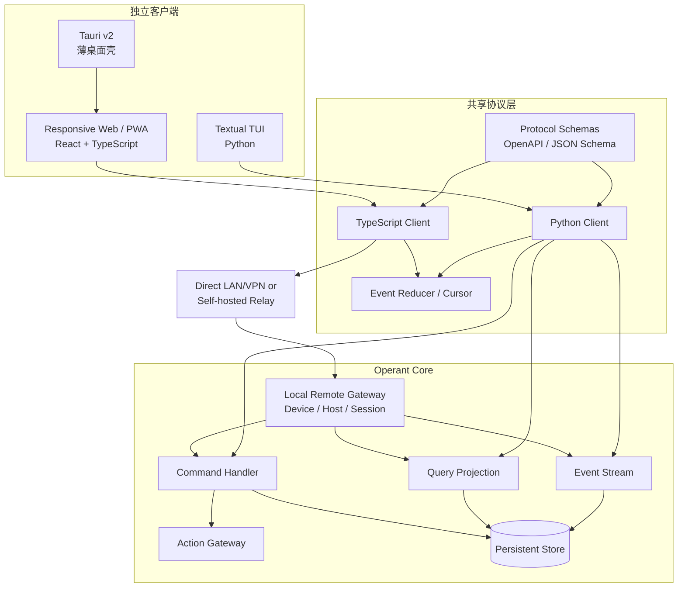
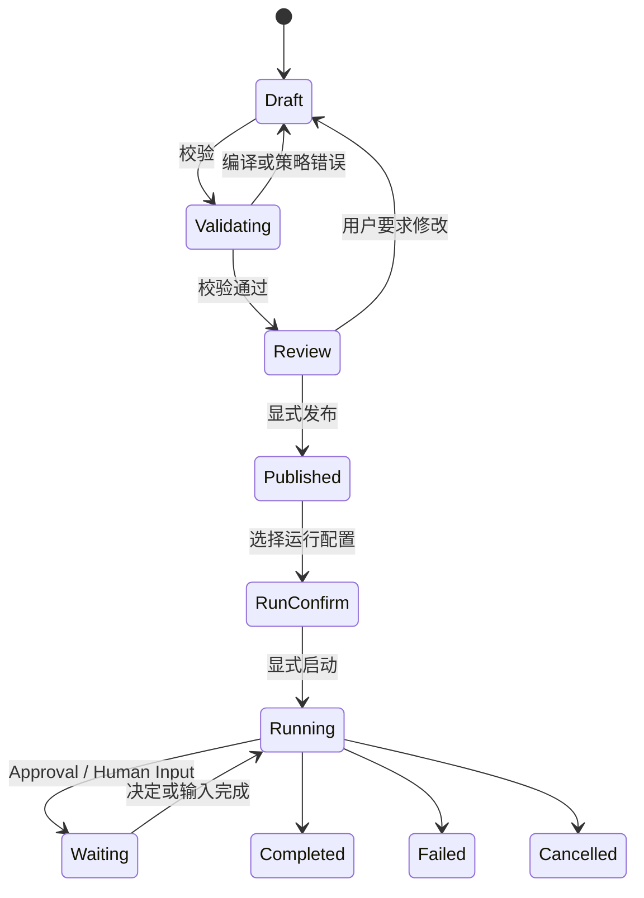
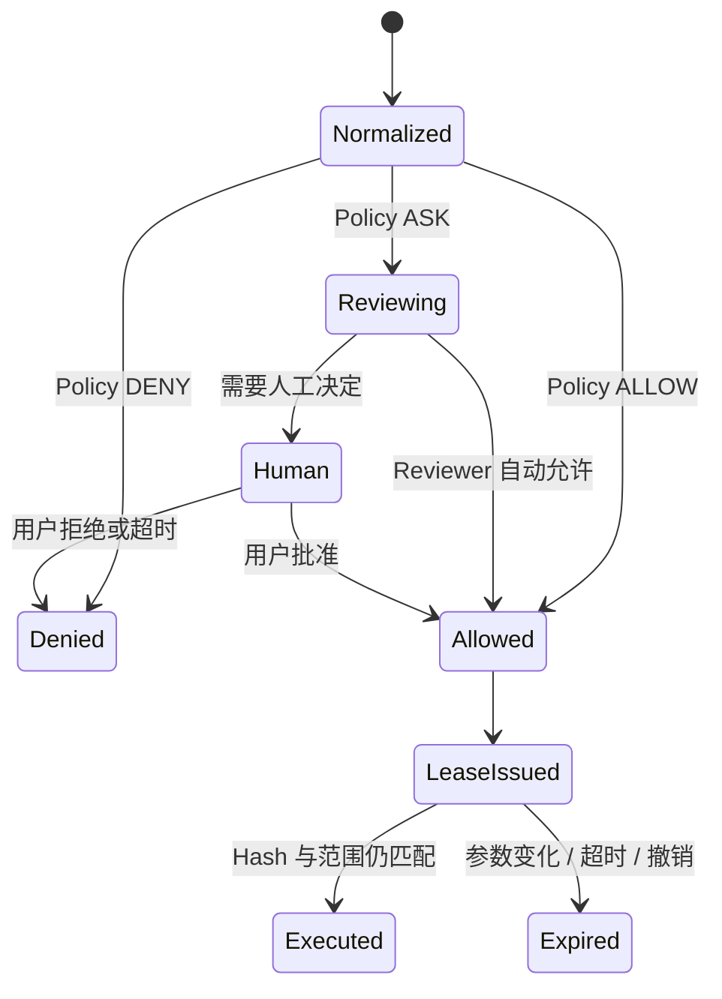
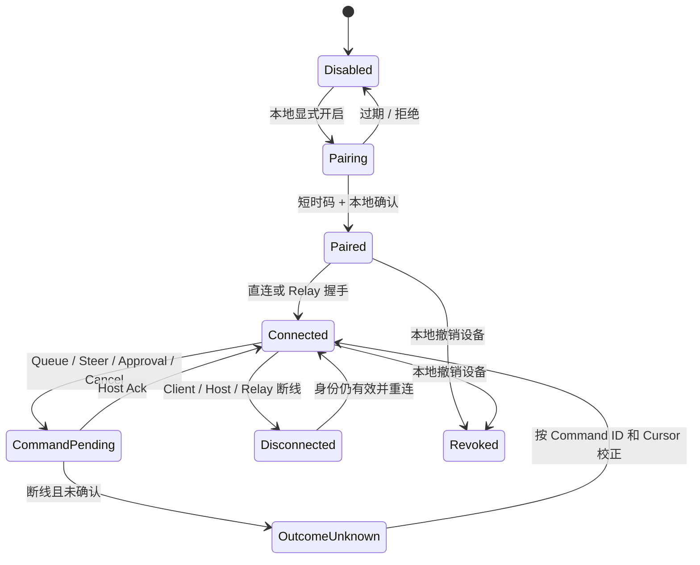

# Operant 多 Agent Harness 客户端设计与实现规范

> 文档状态：目标客户端设计 v0.3；Beta/RC 实现状态以当前架构文档为准
>
> 最后更新：2026-09-04
>
> 仓库内权威路径：`docs/UI_UX_DESIGN_SPECIFICATION.md`
>
> 当前实现权威：`docs/PROJECT_ARCHITECTURE.md`、源码与测试
>
> 目标内核契约：`docs/项目架构.md`

## 1. 文档定位

本文定义 Operant 下一阶段 GUI、桌面壳和 TUI 的产品结构、技术边界、状态来源、交互规则、
安全要求与实施顺序。它用于指导 Antigravity、OpenCode 和后续实现 Agent 设计客户端，但不改变当前代码状态。

Beta/RC 已交付 React PWA、Textual TUI、Tauri 薄壳、WSS/Host Connector 和生成 Client 接入；其精确
能力、限制与验收只以源码、测试和 `docs/PROJECT_ARCHITECTURE.md` 为准。本文仍描述目标交互，不把
未完成的智能创建、多 Host 运维、移动推送、签名/公证或公网部署套件宣称为已实现。

本设计遵循以下原则：

1. GUI 和 TUI 是两个独立客户端，但共用同一套类型化协议与状态语义。
2. Operant Core 是运行、权限、恢复和审计的唯一权威；客户端只是命令入口和状态投影。
3. REST 加 SSE 是默认通信方式；只有 PTY 输入、运行中 steering 等真实双向场景使用 WebSocket。
4. Tauri 是薄桌面壳，不执行 Agent 动作，不裁决权限，也不绕过 Action Gateway。
5. 工作流“定义编辑”和“运行监控”是两个界面、两套状态，不把画布草稿当成执行状态。
6. 不展示或承诺暴露模型隐藏思维链。界面只展示结构化摘要、动作、证据、决策、工件和状态。
7. 智能创建只生成 Draft 或 Patch Proposal；发布定义和启动运行必须经过校验与显式确认。
8. 视觉原型只证明方向，不证明响应式、键盘、无障碍、安全、真实协议或运行恢复已经可用。
9. Remote PWA 是同一用户操控本地 Core 的客户端；自托管 Relay 只路由加密 Envelope，不是云端 Agent、
   多用户平台或恢复权威。

## 2. 文档与状态权威关系

| 内容 | 权威来源 | 客户端可否覆盖 |
|---|---|---|
| 当前已实现能力 | `docs/PROJECT_ARCHITECTURE.md`、源码、测试 | 不可 |
| 目标内核、领域对象和安全边界 | `docs/项目架构.md` | 不可 |
| 目标客户端结构与交互 | 本文 | 可通过评审后的新版本更新 |
| Workflow Definition | 服务端持久化版本 | 客户端只能提交 Draft/Patch |
| Workflow Run、Node Run、Attempt | 服务端 Graph Runtime | 不可 |
| Thread、Message、Artifact、Approval | 服务端查询投影 | 不可 |
| Host、RemoteDevice、RemoteSession、Command Receipt | 本地 Core 查询投影 | 不可 |
| 画布选中项、面板开关、未提交表单 | 客户端本地状态 | 可以 |
| 视觉原型中的示例数字和状态 | 模拟数据 | 不可作为事实 |

客户端不得根据本地缓存自行判断动作已经执行、审批已经生效、节点已经成功或 Run 可以恢复。
断线重连后必须从服务端 Cursor 回放事件，再用 Query Projection 校正本地视图。

## 3. 客户端总体架构



### 3.1 传输选择

| 场景 | 默认传输 | 原因 |
|---|---|---|
| 创建、修改、审批、取消、发布 | REST Command | 便于幂等、审计和错误表达 |
| 列表、详情、历史、投影查询 | REST Query | 状态来源明确，可缓存与重取 |
| Run、Agent、审批和 Artifact 增量事件 | SSE | 单向流简单，支持 Cursor 回放 |
| PTY 输入/输出、运行中 steering | WebSocket | 需要真实双向低延迟通信 |
| 手机 PWA/远程浏览器与 Host Connector | 直连 HTTPS/WSS 或自托管 Relay WSS | 双方主动出站，统一转发加密 Envelope |
| TUI 与同进程 Core | 可选 in-process adapter | 仅替换传输，不改变 SDK 接口和语义 |

TUI 不得直接读取 Core 内部 Event Bus 或持有 Runtime 内部对象。可选的 in-process adapter 必须实现
与 Python Client 相同的 Command、Query、Event 和错误契约，确保本地 TUI 与远程 TUI 行为一致。

Remote Control 不建立第二套页面 API。局域网或用户 VPN 可直连 Local Remote Gateway；跨网络时，
Remote Client 与 Host Connector 分别连接用户自托管 Relay。Relay 只路由端到端加密 Envelope，远程
Command 继续遵守请求 ID、幂等键、Device/Host Identity、过期、签名、Host Ack、Cursor 和错误语义。

### 3.2 客户端状态分层

GUI 使用三类状态，不能全部塞进一个全局 Store：

- **远程查询状态**：使用 TanStack Query 管理列表、详情、缓存、重取和失效；
- **事件流状态**：使用带 Schema Version、Cursor 和去重逻辑的 Event Reducer；
- **本地界面状态**：使用 Zustand 保存选中项、抽屉、布局、过滤条件和未提交草稿。

以下数据不得只存在 Zustand：Thread 历史、Graph Definition 发布版本、Workflow Run 状态、
Approval 决定、Capability Lease、Artifact 元数据、Context Revision 和审计事件。
Paired RemoteDevice、Host 在线状态、RemoteSession、Command Receipt 和设备撤销状态同样以 Core
Projection 为准，不能根据 Relay 在线图标或客户端缓存自行推断。

### 3.3 Tauri 薄壳边界

Tauri v2 只负责：

- 窗口生命周期、系统托盘与原生通知；
- 文件/目录选择器；
- 应用更新；
- 本地 Operant Core 发现、启动状态提示和安全连接；
- Remote Control 的本地开启、配对入口和连接状态提示；
- 操作系统允许范围内的窗口级快捷键。

Tauri 不负责：

- 直接执行命令、脚本、PTY 或 Agent Tool；
- 独立实现 Policy Engine、Approval 或 Capability 校验；
- 保存第二份 Workflow 恢复状态；
- 直接访问 SQLite；
- 绕过 Operant Action Gateway 操作文件、浏览器、电脑或远程主机。
- 在 Rust 壳内保存另一份 RemoteDevice、Approval 或 Command Receipt 权威状态。

xterm.js 只是终端视图。PTY Session 的创建、输入、调整尺寸、终止、超时、权限与审计都由 Operant
Capability 和 Action Gateway 控制。

## 4. 技术选型

### 4.1 GUI 与桌面端

| 层 | 选型 | 约束 |
|---|---|---|
| Web UI | React 19.x + TypeScript | 使用实施时受支持的稳定小版本 |
| 移动远程端 | 同一 React 应用的响应式 PWA | 不为 2.0 复制一套 iOS/Android 业务客户端 |
| 构建 | Vite 当前受支持稳定版 | 不把旧主版本写死为长期要求 |
| 路由 | React Router | 页面 URL 可恢复、可深链 |
| 远程状态 | TanStack Query | 不复制服务端权威状态 |
| 本地状态 | Zustand | 只保存本地 UI/草稿状态 |
| Graph | `@xyflow/react` | 只负责编辑和投影，不负责执行 |
| 代码/Diff | Monaco，按需懒加载 | 普通页面不预加载重资源 |
| 终端 | xterm.js，按需懒加载 | 只连接受控 PTY Capability |
| 基础组件 | Radix Primitives 或同级无障碍组件 | 保留语义、焦点和键盘支持 |
| 桌面壳 | Tauri v2 | 最后接入，保持薄壳 |

不把“安装包固定小于 15 MB”“闲置内存固定为某个数字”“Web 与桌面 100% 零差异”写成承诺。
这些值受 WebView、平台、资源、字体和打包策略影响，必须以实施后的多平台基准为准。

### 4.2 TUI

TUI 使用 Python 3.10+ 与 Textual，作为可选安装组件发布，例如 `operant[tui]` 或独立
`operant-tui` 包。Textual 和 Rich 都是可选的第三方依赖，安装与打包说明必须明确列出。

TUI 通过生成的 Python Client 使用同一协议。它可以与 Core 同进程运行，但不得形成另一套模型、
审批、恢复或事件逻辑。

### 4.3 建议目录

```text
clients/
├── gui/                         # React Web 客户端
│   ├── src/app/                 # Router、Provider、全局错误边界
│   ├── src/features/session/    # 会话与子 Agent
│   ├── src/features/workflow/   # Definition 编辑与 Run 监控
│   ├── src/features/team/       # Team、Mailbox、群聊投影
│   ├── src/features/settings/   # 配置、策略和生命周期
│   ├── src/features/approval/   # Approval 与证据视图
│   ├── src/features/remote/     # Host、设备配对、Relay 与 Remote Control
│   ├── src/components/          # 通用可访问组件
│   └── src/styles/              # Tokens、主题与响应式规则
├── desktop/                     # Tauri v2 薄壳
│   └── src-tauri/
└── tui/                         # Textual 客户端
    ├── operant_tui/app.py
    ├── operant_tui/screens/
    └── operant_tui/widgets/

sdk/
├── protocol/                    # OpenAPI、JSON Schema、事件版本
├── typescript-client/           # GUI 使用
└── python-client/               # TUI 和 Python 集成使用
```

如果第一阶段不希望立即调整单仓目录，可先保留现有 Python 包，只要求边界和生成物最终能迁移到上面
的结构。目录不是安全边界，协议和状态权威才是。

## 5. 信息架构

GUI 的一级入口建议为：

1. **会话**：Thread、父子 Agent、上下文、Artifact 和即时任务；
2. **协作**：正在运行的 Agent/Team/Workflow、历史记录和创建入口；
3. **工作流**：Definition 编辑、校验、版本、发布和 Run 监控；
4. **群聊**：Team Message 的可见性投影、事件时间线和任务板；
5. **自动化**：Trigger、Schedule、Hook、Loop、历史运行和 Dead Letter；
6. **远程**：Host、配对设备、Relay、连接状态、撤销和远程安全审计；
7. **设置**：模型、角色、权限、插件、Skill、工作区、缓存与保留策略。

“协作面板”负责概览和跳转，“工作流编辑器”负责 Definition，“Run 详情”负责运行状态。三个页面
不能合并为一张同时可编辑又可执行的无限画布。

## 6. GUI 全局布局与响应式

### 6.1 宽屏布局

```text
┌──────────────────────────────────────────────────────────────────────┐
│ 顶部：工作区 / 模式 / 全局状态 / 命令面板                           │
├──────────────┬───────────────────────────────────┬───────────────────┤
│ 左侧导航     │ 中央主视图                        │ 右侧检查器        │
│ 240—260 px   │ 最小 520 px                       │ 340—380 px        │
│ 会话/对象树  │ 会话、画布、群聊、设置            │ Diff/终端/证据    │
├──────────────┴───────────────────────────────────┴───────────────────┤
│ 底部：连接、运行、预算、隔离与审批状态                              │
└──────────────────────────────────────────────────────────────────────┘
```

### 6.2 断点规则

- `>= 1280px`：三栏布局，左右栏可调宽、可折叠；
- `960—1279px`：中央主视图固定保留，左右栏变成互斥抽屉；
- `< 960px`：单主视图，导航、检查器、终端和详情都使用全高抽屉或独立路由；
- `< 600px`：优先保留任务状态、Queue/Steer、Approval、Diff 摘要和关键决策；复杂 Graph 编辑与
  长代码审查转为只读概览、分步详情或提示切换大屏；
- 不允许简单等比压缩三栏，导致代码、审批和按钮不可读；
- 每个可调面板都要提供键盘操作和“恢复默认布局”。

## 7. GUI 核心页面

### 7.1 会话模式

会话页以 `Thread` 为核心，而不是以一次模型请求为核心：

- 左侧显示历史 Thread、父子关系、状态、工作区和归档；
- 子 Agent Thread 默认折叠在父 Thread 下，可在侧栏独立打开；
- 中央流展示用户消息、Agent 摘要、Tool/Action、Artifact、Approval、错误和完成状态；
- 右侧检查器展示文件、Diff、终端、Artifact、Trace 和子 Agent 详情；
- `@文件`、`@会话`、`@Artifact` 先插入引用摘要与权限信息，详细内容按需读取；
- `/` 命令显示来源、权限、输入 Schema 和是否产生副作用。

禁止把“内部思考”“完整推理过程”作为可展开内容。子 Agent 卡片可展示：

- 任务目标；
- 当前阶段；
- 结构化行动摘要；
- 使用的文件、工具和证据引用；
- 输出 Artifact；
- 决策结论与不确定项；
- Token、耗时和预算，但只显示 Provider 实际返回或可验证的值。

### 7.2 上下文窗口

上下文圆环是入口，不只是装饰。点击后显示当前 `ContextRevision` 的可解释分解：

- System/Policy；
- Role Snapshot；
- 用户与 Agent 消息；
- 文件片段；
- Memory；
- Artifact 摘要；
- Tool Result；
- 压缩摘要；
- 预留输出预算。

每项显示来源、估算 Token、是否固定、是否可移除、是否已压缩和最后更新时间。缓存命中率只有在
Provider 返回可信 usage 字段时才显示；不能用估算值伪装成真实命中率。

手动压缩应创建新的 `ContextRevision`，并允许查看摘要、被替换片段的引用和压缩原因；Canonical
History 不因压缩而删除。

### 7.3 协作面板

协作首页显示：

- 当前运行的 Agent、Team 和 Workflow Run；
- 等待审批、等待输入、失败、人工核对和预算告警；
- 历史 Team/Run；
- 新建 Agent、Team、Workflow 和智能创建入口；
- 每个对象的工作区、模型快照、权限摘要和最近事件。

Agent 群组可使用紧凑关系图展示成员与通信边，但概览图不是 Workflow Definition 编辑器。

### 7.4 Workflow Definition 编辑器

编辑器只编辑 Draft Definition：

- 节点与边均有稳定 ID；
- 节点有类型化输入/输出端口和连接 Handle；
- 边可表达数据依赖、控制依赖、条件、错误分支和回环；
- 节点类型至少包括 Agent、Tool、Script、Condition、Join、Approval、Human Input、Subworkflow；
- Loop 必须配置最大次数、时间、预算、无进展签名和退出条件；
- 支持 Draft 保存、Compiler 校验、Definition Diff、版本发布和回滚；
- Compiler Error 精确定位到节点、端口、边或策略字段；
- 未发布 Draft 不能被定时任务或 Hook 直接运行。

节点配置采用作用域继承：全局 → 工作区 → Team/Workflow → Run。未修改字段显示继承值和来源，
修改后显示 Override。模型必须来自 Provider Discovery 与 ModelProfile，不能在界面中硬编码不存在的
模型 ID。

### 7.5 Workflow Run 监控

Run 页面使用发布时固定的 Definition Revision，只读展示：

- Workflow Run、Node Run 和 Node Attempt；
- Ready、Running、Waiting、Succeeded、Failed、Cancelled、Manual Reconcile 等状态；
- 每个 Attempt 的输入引用、输出 Artifact、模型快照、工具、审批和错误；
- Retry/Rework 关系；
- 事件时间线、预算、关键路径和并发占用；
- 运行所用 Definition 与当前最新 Definition 的 Diff。

如果允许运行中 steering，必须生成显式 Command 和审计事件；不能在画布上拖动节点后悄悄改变
正在运行的图。

### 7.6 智能创建

智能创建是一个受控 Meta-Agent：

1. 收集目标、工作区、模型、预算、权限、插件、Skill、Loop 和完成条件；
2. 生成 `WorkflowDraft` 或 `WorkflowPatchProposal`；
3. 运行 Compiler、Policy 和静态风险检查；
4. 展示新增、修改、删除的 Definition Diff；
5. 用户确认后发布；
6. 发布后仍需单独确认是否立即运行或创建 Trigger。

Meta-Agent 不得直接发布、启动、创建定时任务、扩大权限或写入 Secret。

### 7.7 Team 群聊与 Agent 通信

Agent 通信采用“单条权威消息 + 收件箱投影”，不是为每个接收者复制一份无关联提示词：

1. Runtime 保存一条带 `sender`、`recipients`、`visibility`、`artifact_refs` 和 `message_id` 的
   Canonical `AgentMessage`；
2. Mailbox 为每个接收者保存可投递引用；
3. Context Composer 只把有权接收的消息注入对应 Agent 上下文；
4. 非接收者不消耗该消息 Token；
5. UI 群聊只是按当前查看权限生成的 Projection，不是上下文广播总线。

可见性至少分开表达：

- **投递对象**：哪些 Agent 会收到内容；
- **界面可见对象**：哪些用户/角色可在 UI 查看正文；
- **审计可见性**：无正文时是否可看到“发生过一次定向通信”；
- **上下文注入策略**：立即注入、按需检索或只传 Artifact 引用。

群聊页面建议提供三种模式：

- 消息模式：按对话查看定向消息与广播；
- 时间线模式：按运行事件查看 Agent、Tool、Approval 和 Artifact；
- 安全模式：只看权限请求、决定、Lease 和副作用证据。

左侧可放成员过滤与任务板，右侧使用统一检查器显示消息详情、Artifact、Node Run 和 Trace。

### 7.8 设置与治理

设置页按作用域组织：全局 → 工作区 → Team/Workflow → Run。每个字段必须显示：

- 当前有效值；
- 值来自哪个作用域；
- 是否被下级覆盖；
- 修改何时生效：立即、下个 Agent、下个 Run 或重新启动；
- 对历史 Snapshot 是否无影响。

至少包括 ModelProfile、Role、默认 Prompt、预算、reasoning effort、权限、审批策略、Workspace、
Plugin、Skill、缓存和保留策略。温度、max token、reasoning effort 等字段要根据 Provider Capability
动态显示，不能假设所有模型都支持同样参数。

### 7.9 Remote Control

Remote Control 是会话、Workflow 和 Team 页面在远程设备上的控制面，不是远程桌面镜像，也不是第二套
云端 Agent。主要界面包括：

- Host 选择器：昵称、在线状态、Core/Protocol 版本、Workspace 和 Capability；
- 设备配对：本地显式开启、二维码/短时码、本地确认、Scope 选择和完成状态；
- 设备管理：最后活动、权限、撤销、全部断开和远程安全审计；
- Relay 状态：直连/Relay 路径、连接质量、最后可信 Cursor、重连和故障说明；
- 移动控制面：任务状态、Queue/Steer、Approval、Human Input、取消、Artifact、Diff 和测试摘要；
- 多 Agent 控制：Team、子 Agent、定向消息、任务板、预算和等待原因；
- Workflow 控制：Graph 只读概览、当前节点、Pause/Resume/Cancel、Approval 和安全重试。

手机端默认使用 `Queue`，只有用户明确选择 `Steer` 时才向运行中任务发引导 Command。两者在收到
Host Ack 前显示“发送中/未确认”，不能用 Relay 已接收代替 Core 已接受。Host 离线时不允许创建会在
未来自动执行的副作用 Command；可以保存本地草稿，但重新上线后必须由用户再次确认发送。

Remote PWA 与桌面 Web 使用同一组件和 SDK，但移动端不是三栏页面缩小版。它优先帮助用户完成会阻塞
Agent 的决策：查看进度、发出精确指令、审批、审查 Diff、提供输入和取消。复杂 Graph 编辑、长代码
比较、插件安装和高风险全局 Policy 修改应提示切换大屏，除非移动交互已单独通过验收。

Relay 只显示连接和路由元数据，页面不能从 Relay 缓存推断 Run、Approval 或动作结果。远程客户端不
展示 Secret；敏感路径、命令和 Action 参数按 Device Scope 使用脱敏摘要或受控引用。

## 8. Approval 与安全交互

### 8.1 决策层级

```text
Action Normalizer
  → 确定性 Policy Engine
      → DENY：不可覆盖
      → ALLOW：发放受限 Capability Lease
      → ASK：可进入 LLM Reviewer 或人工审批
```

审批模型只是 ASK 的辅助 Reviewer。默认模型来自用户已配置且通过能力/成本筛选的 ModelProfile；
如果没有合适模型，界面提示用户选择低成本、低延迟、结构化输出可靠的模型，而不是写死某个未经
发现的名称。

### 8.2 Approval 卡片

每张卡片至少显示：

- 发起 Agent、Thread、Run、Node 与 Role Snapshot；
- 发起审批的 Host、RemoteDevice、连接路径和 Device Scope；
- 规范化 Action 名称和参数摘要；
- 精确 Target 与 Workspace 边界；
- Action Hash；
- 风险类型和风险等级；
- 文件写入、网络、Secret、宿主机、容器和远程影响；
- 命中的 Policy Rule 与来源作用域；
- LLM Reviewer 的结构化建议与证据，但不伪装成最终安全事实；
- 批准一次、批准本次 Run、拒绝和要求修改；
- Capability Lease 的范围、有效期和撤销状态。

参数、Target、Policy Version 或 Action Hash 变化后，旧批准自动失效。DENY 不显示“仍然批准”按钮。
用户关闭人工审批时，未通过的高风险动作应失败关闭并要求 Agent 寻找合规替代方案。

## 9. 缓存、历史与保留策略

设置页必须把以下对象分开：

| 对象 | 作用 | 默认处理方向 |
|---|---|---|
| Provider Prompt Cache | 降低重复 Prompt 成本 | 由 Provider 能力与 TTL 决定 |
| 本地临时执行缓存 | 加速索引、预览、下载和构建 | 可按 TTL/容量清理 |
| Canonical History | Thread 与运行事实 | 归档，不因缓存清理删除 |
| Artifact | 计划、Diff、报告、截图等产物 | 独立保留策略与敏感级别 |
| Audit | 权限、审批与副作用证据 | 安全保留策略，禁止静默删除 |
| Memory | 可复用知识 | candidate/active/retired 生命周期 |
| Trace | 诊断投影 | 脱敏导出与独立 TTL |

任务完成不能通过解析用户自然语言中的“可以”“完成”等词自动触发删除。正确流程是：

1. Run 进入 `completed`；
2. 用户显式执行“确认完成并归档”，或自动化规则满足确定条件；
3. 创建归档/回收任务；
4. 经过可配置宽限期后，只清理允许删除的临时缓存；
5. Canonical History、Artifact、Audit、Memory 和 Trace 按各自策略处理；
6. 批量清理前显示预计释放空间、对象数量、影响范围和恢复窗口。

## 10. 视觉系统

保留初版的淡青、薄荷青翠与深青蓝灰方向，但修正文字、焦点和状态色对比度。以下 Token 是起始值，
最终必须通过自动对比度检查与真实页面验证。

```css
:root {
  --bg-app: #f6faf9;
  --bg-surface: #eef6f5;
  --bg-card: #ffffff;
  --bg-subtle: #e3f1ef;

  --border-subtle: #c8dfdb;
  --border-strong: #5e9f97;

  --text-primary: #0f172a;
  --text-secondary: #334155;
  --text-muted: #475569;

  --accent-action: #0f766e;
  --accent-action-hover: #115e59;
  --accent-subtle: #dff5f1;
  --focus-ring: #0f766e;

  --status-safe-bg: #ecfdf5;
  --status-safe-text: #047857;
  --status-warn-bg: #fffbeb;
  --status-warn-text: #92400e;
  --status-error-bg: #fef2f2;
  --status-error-text: #b91c1c;
  --status-info-bg: #f0f9ff;
  --status-info-text: #0369a1;
}
```

要求：

- 正常正文和小号状态文字至少满足 WCAG AA 4.5:1；
- 大号文字、图标和焦点边界至少满足 3:1；
- 颜色不能成为状态的唯一表达，同时使用文字、图标或形状；
- 所有交互组件有 hover、focus-visible、active、disabled、loading 和 error 状态；
- 支持浅色、深色和高对比度主题；
- 遵守 `prefers-reduced-motion`，关键状态不能只依赖动画；
- 字体采用系统字体优先，代码字体可配置，不因网络字体失败破坏布局。

## 11. 无障碍与键盘

GUI 必须具备：

- 真实语义按钮、表单、列表、树、标签页和对话框；
- 清晰且可见的 `focus-visible`；
- 跳过导航、焦点陷阱、对话框关闭与焦点恢复；
- 键盘可操作的面板调宽、Graph 节点选择/连接和命令面板；
- 图标按钮有可读名称；
- 动态事件使用节制的 live region，避免每个 Token 都打断屏幕阅读器；
- 虚拟列表保留正确的选中、位置和可访问名称。

快捷键不能拦截浏览器、操作系统或输入法常用组合。所有快捷键可查询、可修改，并有菜单入口作为
等价操作。

## 12. TUI 设计

### 12.1 自适应布局

- `>= 140` 列：会话树 + 主内容 + 检查器三窗格；
- `100—139` 列：主内容 + 一个可切换侧栏；
- `< 100` 列：单窗格，以 Screen/Tab 在会话、Graph/Run、群聊、审批和检查器之间切换。

TUI 启动时检测终端宽高、颜色能力和鼠标支持。任何重要操作都有纯键盘路径；颜色不是唯一状态信号。

### 12.2 焦点与交互

- `Tab`/`Shift+Tab` 按真实可聚焦控件顺序移动；
- `Alt+1/2/3` 只在对应窗格存在时直达；
- 当前焦点由真实 Widget Focus 决定，不使用只变边框的假焦点；
- `?` 打开上下文快捷键帮助；
- `/` 打开命令面板；
- `Esc` 逐层关闭菜单、弹窗和抽屉；
- 危险操作需要清楚显示目标与风险，不能只依赖单键确认。

Textual TUI 使用 Python Client 订阅同一 Cursor Event Stream。断线、重连、过期 Cursor、Schema 不兼容
和服务端重启都要有可恢复提示。

TUI 可以选择本地 Core、直连 Host 或自托管 Relay 中的 HostInstance，但 RemoteDevice 配对、Scope、
Command Ack、Approval 与 Cursor 语义必须和 PWA 一致。远程 TUI 不能通过 SSH 直接读取 Core SQLite、
内部 Event Bus 或宿主日志来绕开统一协议。

## 13. 核心协议对象

客户端 SDK 至少需要以下稳定对象：

- `Thread`、`ThreadItem`、`ParentChildLink`；
- `ContextRevision`、`ContextComponent`、`ContextReference`；
- `AgentDefinition`、`AgentSnapshot`、`AgentInstance`；
- `TeamDefinition`、`TeamRun`、`AgentMessage`、`MailboxDelivery`；
- `WorkflowDraft`、`WorkflowDefinition`、`WorkflowRevision`；
- `WorkflowRun`、`NodeRun`、`NodeAttempt`；
- `Artifact`、`ArtifactReference`；
- `ApprovalRequest`、`ApprovalDecision`、`CapabilityLease`；
- `EffectiveSettings`、`SettingSource`；
- `HostInstance`、`RemoteDevice`、`RemoteSession`、`RemoteCommandReceipt`；
- `RelayEnvelopeMetadata`、`TransportMode`、`DeviceScope`；
- `RunEvent`、`EventCursor`、`ProtocolError`。

Command 必须有 `request_id` 和 `idempotency_key`；Event 必须有 `event_id`、`sequence`、
`schema_version`、`occurred_at` 和作用域标识。客户端生成类型，不手写两套不一致的接口模型。

## 14. 关键交互状态机

### 14.1 Workflow 创建与运行



### 14.2 Approval



### 14.3 Remote Control 配对与 Command



Relay Ack 只代表中转收到加密 Envelope；只有 Host Ack 才代表 Core 接受 Command。设备撤销后，已有
RemoteSession、待使用凭据和未消费 Capability Lease 必须失效。

## 15. 错误、空状态和恢复

每个核心页面都要设计以下状态：

- 首次使用，没有 ModelProfile/Role/Workspace；
- 正在加载和增量流式更新；
- 局部失败而其他面板仍可用；
- Core 未启动或连接丢失；
- Host 离线、Relay 不可达、RemoteDevice 被撤销或配对码过期；
- Remote Command 只到达 Relay、等待 Host Ack 或结果未知；
- 直连失败后回退 Relay，或 Relay 失败但本地任务仍继续；
- Cursor 过期，需要全量重取；
- Protocol Schema 不兼容；
- 权限不足、Policy DENY、Approval 超时；
- Run 中断、人工核对和未知副作用；
- Artifact 不可用、已归档或需要更高权限；
- Provider 未返回 usage，因而无法显示真实 Token/缓存指标。

错误文案要回答：发生了什么、哪些状态仍可信、是否产生副作用、用户能做什么、重试是否安全。

## 16. 实施顺序

### UI-0：规范与协议基线

- 固化本文、目标架构和当前实现文档的权威关系；
- 定义 Thread、Cursor、ContextRevision、Artifact、Approval、EffectiveSettings、HostInstance、
  RemoteDevice、RemoteSession 和 RemoteCommandReceipt Schema；
- 建立 TypeScript/Python SDK 生成与契约测试；
- 为现有 API/SSE 补齐 Cursor、错误和 Projection 约束；
- 固化直连/Relay 的加密 Envelope、Device Scope、幂等、过期、签名、Host Ack 与撤销语义。

### UI-1：Web GUI 会话模式

- 在现有 REST/SSE 上实现会话、任务、事件、审批和右侧检查器；
- 将同一 React 应用做成响应式 PWA；Host Connector/Relay MVP 可用后，交付单 Host 的远程查看、
  Queue/Steer、审批、Diff、Artifact、取消与重连；
- 旧的原生 Web 工作台保留到功能对等和迁移验收完成；
- Monaco、xterm.js 懒加载；
- 完成宽屏、平板宽度、窄屏和键盘验收。

### UI-2：统一协议与投影

- 父子 Thread、ContextRevision、Artifact、有效设置来源；
- Event Reducer、Cursor 回放、断线恢复与 Schema Version；
- 设备配对、Host/Relay 连接、Remote Command Receipt 与本地 Projection 校正；
- 让 GUI 不再依赖临时页面模型。

### UI-3：Graph Runtime 后再做 Graph 编辑器

- 先实现服务端 Draft、Compiler、Definition Revision、Run/Node/Attempt；
- 再实现 Definition 编辑、Diff、发布和 Run 监控；
- 移动 PWA 提供 Graph 只读概览、当前节点、Human Input、Approval、Pause/Resume/Cancel；
- 不先做一个只能拖拽、不能恢复和校验的画布。

### UI-4：Team、Mailbox 与群聊

- 实现 Canonical AgentMessage、收件箱投影、任务板和可见性；
- 再实现消息、时间线和安全三种群聊视图；
- 在 RemoteDevice Scope 内提供 Team、子 Agent、定向消息和任务板远程控制。

### UI-5：Textual TUI

- 复用 Python Client、Command、Query、Event Reducer；
- 实现三档自适应布局和真实键盘焦点；
- 通过远程连接与可选 in-process adapter 做一致性测试；
- 不允许远程 TUI 直读 SQLite、日志或内部 Event Bus。

### UI-6：Tauri 桌面壳

- Web GUI 稳定后接入 Tauri；
- 只实现桌面集成能力；
- 不把执行、PTY、权限或恢复逻辑迁入 Rust 壳；
- 提供本地 Remote Control 开关、设备配对、连接状态、撤销和紧急断开入口。

## 17. 验收标准

### 17.1 协议与状态

- Web 与 TUI 对同一 fixture 得到相同 Thread、Run、Approval 和 Artifact 投影；
- SSE 断线后可按 Cursor 去重回放；
- 过期 Cursor 会明确要求重取，不产生重复 Command；
- 客户端刷新、关闭或崩溃不改变服务端 Run；
- Draft、Published Definition 和 Run Snapshot 不混淆；
- PWA、TUI 和桌面 Web 对同一 Remote Fixture 得到相同 Host、Device、Command Receipt 和 Cursor 结果；
- Relay 断线不改变本地 Run，Queue/Steer/Approval 在 Host Ack 前不显示为已生效。

### 17.2 安全

- 所有副作用从 UI 到执行都经过 Action Gateway；
- Tauri、xterm.js、Graph 节点和 Plugin UI 不能绕过 Policy；
- DENY 不可在客户端改成 ALLOW；
- Approval 绑定 Action Hash，参数变化后失效；
- Secret 和隐藏思维链不出现在 DOM、日志、Event、Trace 或导出中；
- Relay 无法读取端到端加密业务 Payload，RemoteDevice Scope 不能覆盖 Policy `DENY`；
- 撤销设备后，其 RemoteSession 和未使用远程凭据失效。

### 17.3 可用性与无障碍

- 至少验证 1440、1024、800 宽度和对应高宽变化；
- Remote PWA 额外验证 390、430 和 768 宽度的任务控制、审批、Diff 摘要与断线恢复；
- 核心路径可只用键盘完成；
- 自动化对比度和无障碍扫描通过，关键页面再做人工核对；
- 焦点、弹窗、抽屉、Graph、虚拟列表和 live region 行为正确；
- 减少动画、深色和高对比度模式可用。

### 17.4 性能与可靠性

- 先记录真实基线，再设置启动、交互、长列表、Graph 和内存预算；
- 大型 Monaco、xterm.js、Graph 代码按路由拆分；
- 长事件流和群聊使用虚拟化，但不能丢失可访问性；
- 10,000 条事件回放、长时间 SSE、重连和多 Run 切换有专项测试；
- 验证直连/Relay 切换、Host/Client/Relay 分别断线、重复 Command、Ack 丢失和过期 Envelope；
- 不用未经测试的固定包体、内存或缓存命中率作为宣传结论。

## 18. 原型定位与已知限制

Antigravity 目录中的：

- `operant_ui_demo.html`；
- `operant_tui_demo.html`。

继续保留为视觉概念原型，用于讨论色调、信息密度、布局方向和页面关系。它们当前不作为以下验收：

- 真实 React/Tauri/Textual 技术栈；
- 真实 API、SSE、WebSocket 或 Cursor；
- Graph Definition 编译和 Run 恢复；
- 真实键盘焦点与屏幕阅读器；
- 窄屏响应式；
- Action Gateway、Approval 与 Capability 安全链；
- 多平台包体和性能。

后续原型修改必须先从本文选择一个明确验收目标，不能把所有页面同时做成无法验证的“大而全”演示。

## 19. v0.2 相对初版的关键修订

1. GUI/TUI 改为“物理解耦、协议统一”，删除 TUI 直读内部 Event Bus 的设计。
2. REST/SSE 成为默认协议，WebSocket 只用于真实双向场景。
3. Tauri 降为薄壳，PTY、命令、权限和安全裁决回到 Operant Core。
4. 远程状态、事件流状态和本地 UI 状态分层，不再全部交给 Zustand。
5. Graph 明确区分 Draft Definition、Published Revision 和 Workflow Run。
6. 智能创建只生成可审查的 Draft/Patch Proposal。
7. Agent 通信采用 Canonical Message + Mailbox Projection，避免其他 Agent 上下文污染。
8. 删除“展示内部思考”，改为可审计的结构化摘要和证据。
9. 审批模型改为动态 ModelProfile，不硬编码示例模型；LLM 不能覆盖 Policy DENY。
10. 缓存清理改为显式生命周期，不再解析用户自然语言自动删除。
11. 补充响应式、无障碍、对比度、真实焦点、深色与减少动画要求。
12. 调整实施顺序：协议与现有会话 GUI 优先，Graph Runtime 先于画布，Tauri 最后。

## 20. v0.3 Remote Control 修订

1. 将响应式 Web GUI 同时定义为可安装 PWA，不为 2.0 复制 iOS/Android 业务客户端。
2. 将 Remote Control 与 Remote Execution Target 分离，Remote PWA 只控制同一用户的本地 Core。
3. 增加 HostInstance、RemoteDevice、RemoteSession、RemoteCommandReceipt、Device Scope 与撤销状态。
4. 采用局域网/VPN 直连优先、用户自托管 Relay 回退；Relay 只路由端到端加密 Envelope。
5. 明确 Relay Ack 与 Host Ack 不同，Queue、Steer、Approval、Cancel 在 Core 确认前保持未确认。
6. Remote Control MVP 提前到 UI-0/UI-1，随后随 Graph、Team、TUI 和 Tauri 增量扩展。
7. 增加手机宽度、Host/Client/Relay 分别断线、重复 Command、Ack 丢失、设备撤销和传输切换验收。
8. 明确 Operant 2.0 保持单用户、单 Core、本地 SQLite 权威，不建设 SaaS、多用户或分布式控制面。
