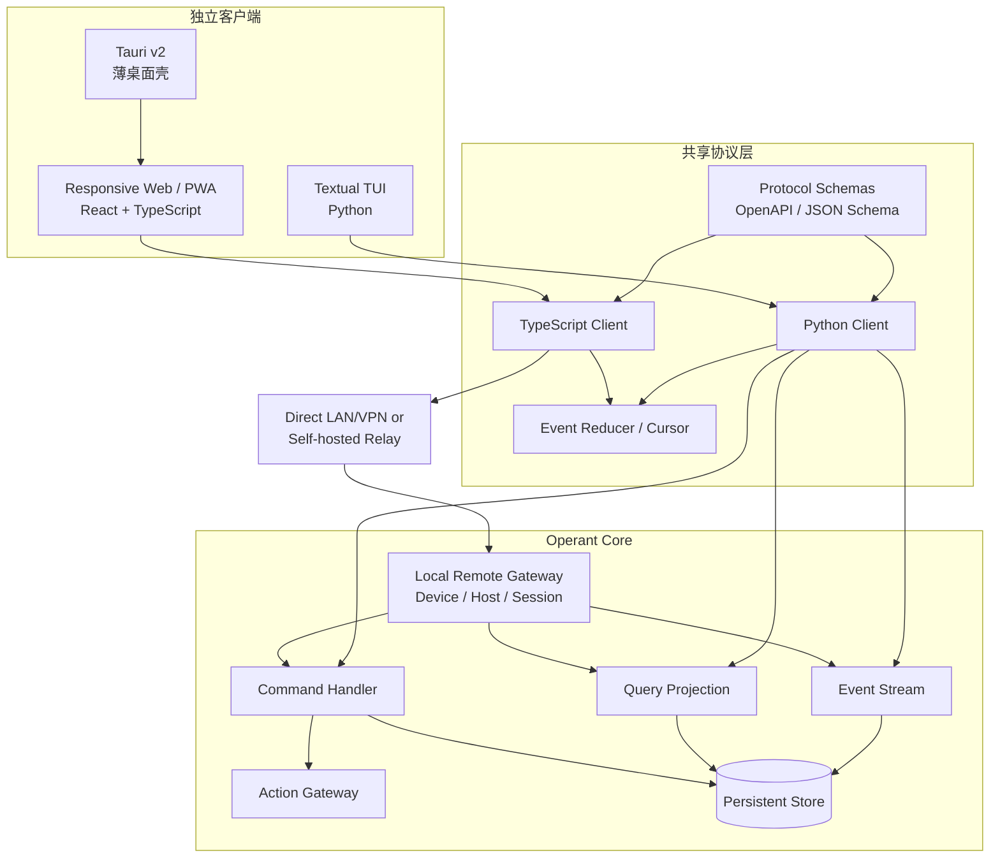
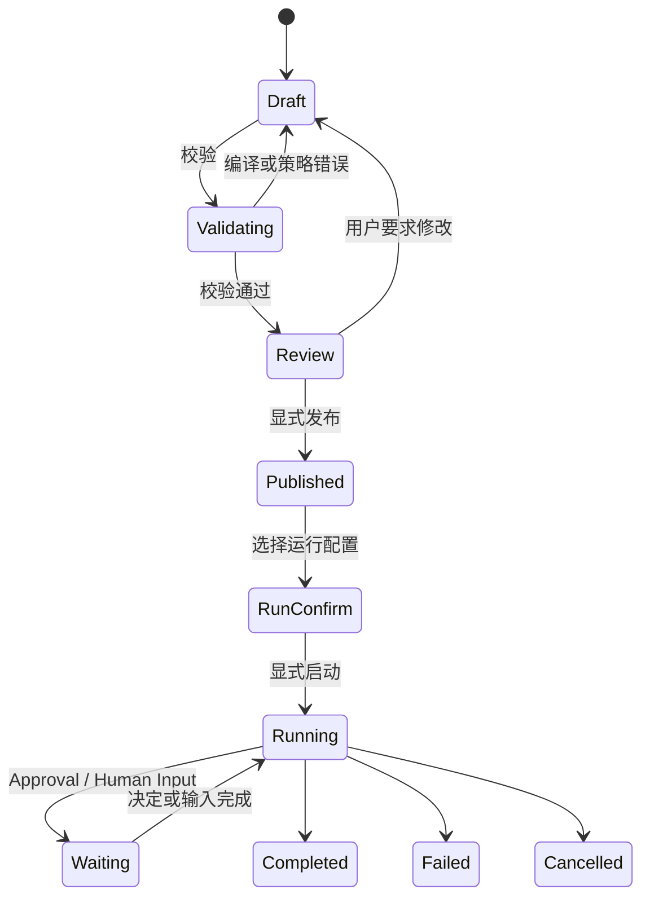
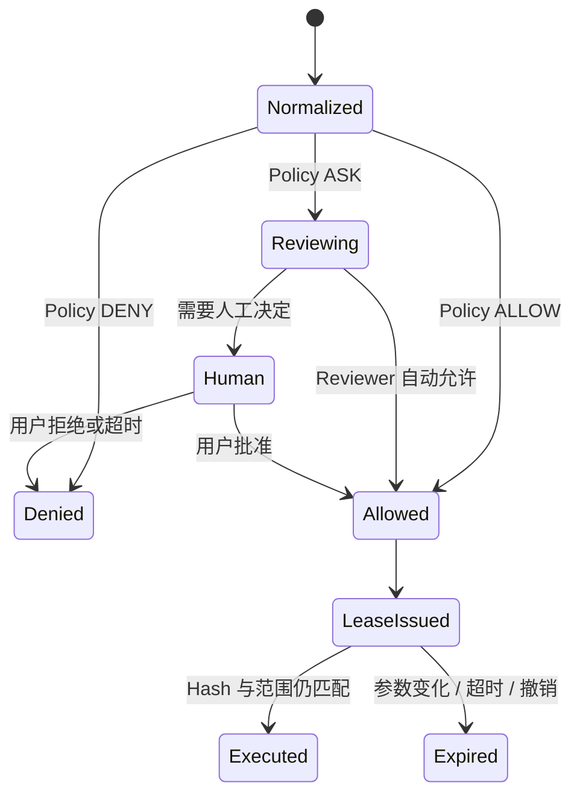
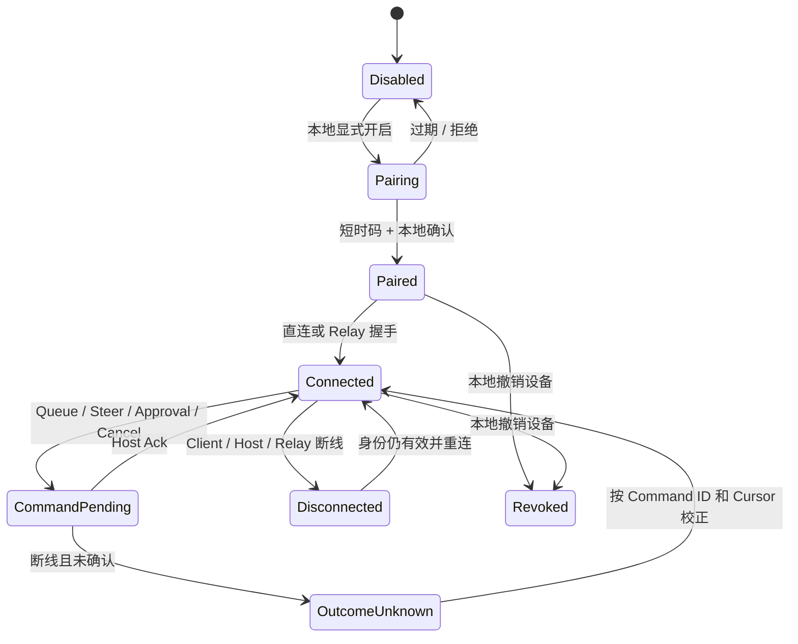

# Operant 多 Agent Harness 客户端设计与实现规范

> 文档状态：目标客户端设计；GUI 真实接入范围与验收约束见第 16.1 节
> 旧版本修订、GUI demo v6–v10 与旧客户端对接需求已移入[历史归档](history/UI_UX_DESIGN-history-20260922.md)；历史内容不作当前实现依据
>
> 原版本记录：2026-09-09；记录身份：Codex；适用对象：所有 Agent
>
> 本次整理：2026-09-22；记录身份：Agent4；仅做历史归档、措辞收敛和链接保全，不改产品实现
>
> 仓库内权威路径：`docs/UI_UX_DESIGN_SPECIFICATION.md`
>
> 当前实现核对：本轮基于 Beta 3 `939e3cc` 的 `codex/onboarding-ux`；实际代码和验证结果见 [PROJECT_ARCHITECTURE.md](PROJECT_ARCHITECTURE.md)与[本轮验收](design/onboarding-ux/acceptance.md)。早期 UI 实施树只保留历史证据
>
> 目标内核契约：`docs/项目架构.md`
>
> 当前协作与文件归属以本地 AGENTS.md为准；后续目标补充：2026-09-21；记录身份：Agent1。会话/子Agent、Live画布、引用/命令、配置及TUI等尚缺入口统一见[Harness 待实现目标](design/Operant-Harness待实现目标.md)。
>
> 本轮状态：方案已批准，代码与原生验收正在完成；本机安装、发行与用户库沿用原有边界。历史三阶段 UI 结果仍保留，不代替本轮验收。

## 1. 文档定位

2026-10-07 User 已批准的 [开箱即用与界面整理方案](design/onboarding-ux/plan.md) 更新本轮目标：默认通用助手，ChatGPT/Gemini OAuth，一级导航为对话、项目、协作、任务，模型、角色、技能与扩展各有唯一设置页。第 5 节据此替换；已实现状态以当前实现说明和 [逐项验收](design/onboarding-ux/acceptance.md)为准。

本文定义 Operant 下一阶段 GUI、桌面壳和 TUI 的产品结构、技术边界、状态来源、交互规则、
安全要求与实施顺序。它用于指导本批承担客户端职责的 Agent 设计客户端，但不改变当前代码状态。

当前实现必须按具体 branch/HEAD 与实际运行工件核对，不能用旧工作区或 Demo 代替后续版本的事实。
本轮参考基线为 Beta 3 `939e3cc`，实施分支为 `codex/onboarding-ux`；早期 UI 树 `74a0251` 和
2026-09-08 Beta/RC `708b341` 都是历史基线，不能混为本轮实现或完整桌面验收。
任何目标能力完成后，必须以源码、测试和对应版本 `docs/PROJECT_ARCHITECTURE.md` 的更新为准，
不能仅凭本设计文档宣称已经实现。

本设计遵循以下原则：

1. 最终保留 React + Tauri 桌面 GUI 与 TUI，共用同一套类型化协议与状态语义；React 只维护一套
   图形界面，浏览器用于开发调试，真实 Tauri WebView 随阶段验收。
2. Operant Core 是运行、权限、恢复和审计的唯一权威；客户端只是命令入口和状态投影。
3. REST 加 SSE 是默认通信方式；只有 PTY 输入、运行中 steering 等真实双向场景使用 WebSocket。
4. Tauri 是薄桌面壳，不执行 Agent 动作，不裁决权限，也不绕过 Action Gateway。
5. 工作流“定义编辑”和“运行进度”是两个界面、两套状态，不把画布草稿当成执行状态。
6. 不展示或承诺暴露模型隐藏思维链。界面只展示结构化摘要、动作、证据、决策、工件和状态。
7. 智能创建只生成 Draft 或 Patch Proposal；发布定义和启动运行必须经过校验与显式确认。
8. 视觉原型只证明方向，不证明响应式、键盘、无障碍、安全、真实协议或运行恢复已经可用。
9. Remote PWA 是同一用户操控本地 Core 的客户端；自托管 Relay 只路由加密 Envelope，不是云端 Agent、
   多用户平台或恢复权威。

## 2. 文档与状态权威关系

| 内容 | 权威来源 | 客户端可否覆盖 |
|---|---|---|
| 当前已实现能力 | `docs/PROJECT_ARCHITECTURE.md`、源码、测试 | 不可 |
| 目标内核、领域对象和安全边界 | `docs/项目架构.md` | 不可 |
| 目标客户端结构与交互 | 本文 | 可通过评审后的新版本更新 |
| Workflow Definition | 服务端持久化版本 | 客户端只能提交 Draft/Patch |
| Workflow Run、Node Run、Attempt | 服务端 Graph Runtime | 不可 |
| Thread、Message、Artifact、Approval | 服务端查询投影 | 不可 |
| Host、RemoteDevice、RemoteSession、Command Receipt | 本地 Core 查询投影 | 不可 |
| 画布选中项、面板开关、未提交表单 | 客户端本地状态 | 可以 |
| 视觉原型中的示例数字和状态 | 模拟数据 | 不可作为事实 |

客户端不得根据本地缓存自行判断动作已经执行、审批已经生效、节点已经成功或 Run 可以恢复。
断线重连后必须从服务端 Cursor 回放事件，再用 Query Projection 校正本地视图。

## 3. 客户端总体架构


```mermaid
flowchart TB
    subgraph Clients[独立客户端]
        Web[Responsive Web / PWA\nReact + TypeScript]
        Desktop[Tauri v2\n薄桌面壳]
        TUI[Textual TUI\nPython]
    end

    subgraph SDK[共享协议层]
        Schema[Protocol Schemas\nOpenAPI / JSON Schema]
        TS[TypeScript Client]
        PY[Python Client]
        Reducer[Event Reducer / Cursor]
    end

    subgraph Core[Operant Core]
        Remote[Local Remote Gateway\nDevice / Host / Session]
        Command[Command Handler]
        Query[Query Projection]
        Stream[Event Stream]
        Action[Action Gateway]
        Store[(Persistent Store)]
    end

    Relay[Direct LAN/VPN or\nSelf-hosted Relay] --> Remote
    Desktop --> Web
    Web --> TS
    TUI --> PY
    Schema --> TS
    Schema --> PY
    TS --> Reducer
    PY --> Reducer
    TS --> Relay
    Remote --> Command
    Remote --> Query
    Remote --> Stream
    PY --> Command
    PY --> Query
    PY --> Stream
    Command --> Action
    Command --> Store
    Query --> Store
    Stream --> Store
```

### 3.1 传输选择

| 场景 | 默认传输 | 原因 |
|---|---|---|
| 创建、修改、审批、取消、发布 | REST Command | 便于幂等、审计和错误表达 |
| 列表、详情、历史、投影查询 | REST Query | 状态来源明确，可缓存与重取 |
| Run、Agent、审批和 Artifact 增量事件 | SSE | 单向流简单，支持 Cursor 回放 |
| PTY 输入/输出、运行中 steering | WebSocket | 需要真实双向低延迟通信 |
| 手机 PWA/远程浏览器与 Host Connector | 直连 HTTPS/WSS 或自托管 Relay WSS | 双方主动出站，统一转发加密 Envelope |
| TUI 与同进程 Core | 可选 in-process adapter | 仅替换传输，不改变 SDK 接口和语义 |

TUI 不得直接读取 Core 内部 Event Bus 或持有 Runtime 内部对象。可选的 in-process adapter 必须实现
与 Python Client 相同的 Command、Query、Event 和错误契约，确保本地 TUI 与远程 TUI 行为一致。

Remote Control 不建立第二套页面 API。局域网或用户 VPN 可直连 Local Remote Gateway；跨网络时，
Remote Client 与 Host Connector 分别连接用户自托管 Relay。Relay 只路由端到端加密 Envelope，远程
Command 继续遵守请求 ID、幂等键、Device/Host Identity、过期、签名、Host Ack、Cursor 和错误语义。

### 3.2 客户端状态分层

GUI 使用三类状态，不能全部塞进一个全局 Store：

- **远程查询状态**：使用 TanStack Query 管理列表、详情、缓存、重取和失效；
- **事件流状态**：使用带 Schema Version、Cursor 和去重逻辑的 Event Reducer；
- **本地界面状态**：使用 Zustand 保存选中项、抽屉、布局、过滤条件和未提交草稿。

以下数据不得只存在 Zustand：Thread 历史、Graph Definition 发布版本、Workflow Run 状态、
Approval 决定、Capability Lease、Artifact 元数据、Context Revision 和审计事件。
Paired RemoteDevice、Host 在线状态、RemoteSession、Command Receipt 和设备撤销状态同样以 Core
Projection 为准，不能根据 Relay 在线图标或客户端缓存自行推断。

### 3.3 Tauri 薄壳边界

Tauri v2 只负责：

- 窗口生命周期、系统托盘与原生通知；
- 文件/目录选择器；
- 应用更新；
- 本地 Operant Core 发现、启动状态提示和安全连接；
- Remote Control 的本地开启、配对入口和连接状态提示；
- 操作系统允许范围内的窗口级快捷键。

Tauri 不负责：

- 直接执行命令、脚本、PTY 或 Agent Tool；
- 独立实现 Policy Engine、Approval 或 Capability 校验；
- 保存第二份 Workflow 恢复状态；
- 直接访问 SQLite；
- 绕过 Operant Action Gateway 操作文件、浏览器、电脑或远程主机。
- 在 Rust 壳内保存另一份 RemoteDevice、Approval 或 Command Receipt 权威状态。

xterm.js 只是终端视图。PTY Session 的创建、输入、调整尺寸、终止、超时、权限与审计都由 Operant
Capability 和 Action Gateway 控制。

## 4. 技术选型

### 4.1 GUI 与桌面端

| 层 | 选型 | 约束 |
|---|---|---|
| 共享 GUI | React 19.x + TypeScript | 使用实施时受支持的稳定小版本，桌面产品与浏览器调试共用 |
| 移动远程端 | 既有响应式 PWA | 暂停新增投入，不复制移动业务客户端 |
| 构建 | Vite 当前受支持稳定版 | 不把旧主版本写死为长期要求 |
| 路由 | React Router | 页面 URL 可恢复、可深链 |
| 远程状态 | TanStack Query | 不复制服务端权威状态 |
| 本地状态 | Zustand | 只保存本地 UI/草稿状态 |
| Graph | `@xyflow/react` | 只负责编辑和投影，不负责执行 |
| 代码/Diff | Monaco，按需懒加载 | 普通页面不预加载重资源 |
| 终端 | xterm.js，按需懒加载 | 只连接受控 PTY Capability |
| 基础组件 | Radix Primitives 或同级无障碍组件 | 保留语义、焦点和键盘支持 |
| 桌面壳 | Tauri v2 | 随 GUI 阶段持续验收，保持薄壳 |

不把“安装包固定小于 15 MB”“闲置内存固定为某个数字”“Web 与桌面 100% 零差异”写成承诺。
这些值受 WebView、平台、资源、字体和打包策略影响，必须以实施后的多平台基准为准。

### 4.2 TUI

TUI 使用 Python 3.10+ 与 Textual，作为可选安装组件发布，例如 `operant[tui]` 或独立
`operant-tui` 包。Textual 和 Rich 都是可选的第三方依赖，安装与打包说明必须明确列出。

TUI 通过生成的 Python Client 使用同一协议。它可以与 Core 同进程运行，但不得形成另一套模型、
审批、恢复或事件逻辑。

### 4.3 建议目录

```text
clients/
├── gui/                         # React Web 客户端
│   ├── src/app/                 # Router、Provider、全局错误边界
│   ├── src/features/session/    # 会话与子 Agent
│   ├── src/features/workflow/   # Definition 编辑与 Run 监控
│   ├── src/features/team/       # Team、Mailbox、群聊投影
│   ├── src/features/settings/   # 配置、策略和生命周期
│   ├── src/features/approval/   # Approval 与证据视图
│   ├── src/features/remote/     # Host、设备配对、Relay 与 Remote Control
│   ├── src/components/          # 通用可访问组件
│   └── src/styles/              # Tokens、主题与响应式规则
├── desktop/                     # Tauri v2 薄壳
│   └── src-tauri/
└── tui/                         # Textual 客户端
    ├── operant_tui/app.py
    ├── operant_tui/screens/
    └── operant_tui/widgets/

sdk/
├── protocol/                    # OpenAPI、JSON Schema、事件版本
├── typescript-client/           # GUI 使用
└── python-client/               # TUI 和 Python 集成使用
```

如果第一阶段不希望立即调整单仓目录，可先保留现有 Python 包，只要求边界和生成物最终能迁移到上面
的结构。目录不是安全边界，协议和状态权威才是。

## 5. 信息架构

一级导航保留四项，宽屏侧栏和窄屏入口保持相同顺序：

| 入口 | 路径 | 内容 |
| --- | --- | --- |
| 对话 | `/chat` | 对话历史、任务输入、助手回复、文件与子成员 |
| 项目 | `/projects` | 项目文件与知识内容 |
| 协作 | `/collab` | 团队模板、协作任务、计划与运行进度 |
| 任务 | `/tasks` | 任务、待审批和定时任务 |

设置固定在导航底部，分为常规、模型连接、助手与角色、工具与扩展、记忆、权限与高级。每项配置
只有一个管理页；内容页可链接到设置，不复制管理表单。知识内容归项目，记忆配置归设置。

旧链接继续可用并重定向到对应页面：`/agents` → 助手与角色，`/extensions`、`/skills` → 工具与扩展，
`/approvals`、`/schedules` → 任务的对应标签，`/remote` → 权限与高级，`/workflow` → 协作。
对话、运行、群聊和成员详情深链继续指向其具体对象。URL 保存页面与当前设置分类，返回键恢复原位置。

“协作总览”负责模板与实例管理，“编排画布”负责 Definition，“运行进度”负责运行状态。三个视图
不能合并为一张同时可编辑又可执行的无限画布。

## 6. GUI 全局布局与响应式

### 6.1 宽屏布局

```text
┌──────────────────────────────────────────────────────────────────────┐
│ 顶部：工作区 / 模式 / 全局状态 / 命令面板                           │
├─────┬──────────┬───────────────────────────────────┬───────────────────┤
│Rail │ 情境侧栏 │ 中央主视图                        │ 右侧检查器        │
│64 px│ 280 px   │ 最小 520 px                       │ 340—380 px        │
│ 图标│ 会话/对象│ 会话、画布、群聊、设置            │ Diff/终端/证据    │
├─────┴──────────┴───────────────────────────────────┴───────────────────┤
│ 底部：连接、运行进度、预算、隔离与审批状态                              │
└──────────────────────────────────────────────────────────────────────┘
```

64px 图标 rail 固定不折叠，设置位于底部，演示切换仅在开发设置中；280px 情境侧栏随当前页面显示
会话或协作对象树，可在所有 ≥960px 桌面宽度收起（见 6.2）。

桌面图标导航不常驻显示文字标签，名称通过悬停和读屏提供。页面优先使用用户可理解的任务、流程、团队、成员等用词；仅在操作前提、风险、授权、错误或恢复需要时显示说明，内部实现信息放入详情。

本机文件或文件夹字段在桌面端提供系统浏览按钮，同时保留手动输入；取消选择保留原值并恢复焦点。网页或远端路径不能冒用本机文件的完整路径，按实际能力提供输入或已有授权目录选择。

### 6.2 断点规则

- `>= 960px`：三栏布局；会话/协作情境侧栏在所有桌面宽度内联且可折叠——收起时完全隐藏，左缘
  只留细竖把手，把手带「展开侧栏」`aria-label`，点击或 Enter 展开；
- `>= 1280px`：左右栏可调宽；
- `< 960px`：单主视图，导航、检查器、终端和详情都使用全高抽屉或独立路由；会话/协作侧栏维持
  覆盖抽屉（遮罩、Esc 与焦点管理），底部 tab 保留会话入口；
- 协作编排画布的节点面板与节点配置面板各自独立可折叠，收起后画布对应侧缘留细把手，画布表面
  宽度自适应；
- 情境侧栏与画布面板的折叠状态按 `localStorage`（`operant.panel.*`）持久化，默认展开，缺失或
  非法值按展开处理；
- `< 600px`：优先保留任务状态、Queue/Steer、Approval、Diff 摘要和关键决策；复杂 Graph 编辑与
  长代码审查转为只读概览、分步详情或提示切换大屏；
- 不允许简单等比压缩三栏，导致代码、审批和按钮不可读；
- 每个可调面板都要提供键盘操作和“恢复默认布局”。

## 7. GUI 核心页面

### 7.1 会话模式

对话页使用持久 `Thread` 身份。首次进入提供可跳过的“连接模型”引导，连接成功后恢复输入草稿；
通用助手和个人工作区由系统准备。用户点击“新建对话”即可输入任务，初始化命令在后端补齐
Thread、Session 和运行快照；重复请求复用结果。创建过程中禁止重复提交；切换页面后旧结果不得
跳转或发送到新页面。未知创建结果保留原请求标识，只读核对后再提供进入已有对话的入口。

对话标题默认取第一条消息的简短内容，支持改名并持久保存。手动名称优先；侧栏、标题栏和选择器
统一显示名称，编号只放详情。当前对话标题独立查询，不能因列表分页而丢失手动名称。模型、角色和
运行参数可定制，常规对话不要求先填写系统提示词或绑定运行。

- 左侧显示历史 Thread、父子关系、状态、工作区和归档；
- 子 Agent Thread 默认折叠在父 Thread 下，可在侧栏独立打开；
- 中央流展示用户消息、Agent 摘要、Tool/Action、Artifact、Approval、错误和完成状态；
- 右侧检查器展示文件、Diff、终端、Artifact、Trace 和子 Agent 详情；
- `@文件`、`@会话`、`@Artifact` 先插入引用摘要与权限信息，详细内容按需读取；
- `/` 命令显示来源、权限、输入 Schema 和是否产生副作用。

禁止把“内部思考”“完整推理过程”作为可展开内容。子 Agent 卡片可展示：

- 任务目标；
- 当前阶段；
- 结构化行动摘要；
- 使用的文件、工具和证据引用；
- 输出 Artifact；
- 决策结论与不确定项；
- Token、耗时和预算，但只显示 Provider 实际返回或可验证的值。

### 7.2 上下文窗口

上下文圆环是入口，不只是装饰。点击后显示当前 `ContextRevision` 的可解释分解：

- System/Policy；
- Role Snapshot；
- 用户与 Agent 消息；
- 文件片段；
- Memory；
- Artifact 摘要；
- Tool Result；
- 压缩摘要；
- 预留输出预算。

每项显示来源、估算 Token、是否固定、是否可移除、是否已压缩和最后更新时间。缓存命中率只有在
Provider 返回可信 usage 字段时才显示；不能用估算值伪装成真实命中率。

手动压缩应创建新的 `ContextRevision`，并允许查看摘要、被替换片段的引用和压缩原因；Canonical
History 不因压缩而删除。

### 7.3 协作模式：工作流模板与实例

协作模块采用“模板 → 实例”模型：工作流模板（Published Revision）可创建
多个实例；实例是一对一的群聊会话，创建时自动命名为「{模板名} · 实例 N」，会话重命名即实例重命名。

- 协作总览为模板为主的双栏视图：左栏是模板列表（名称、版本徽章、活跃实例数）；右栏是选中模板
  详情——节点/连线数、活跃实例数、活跃实例列表、默认收起的「已归档实例」折叠区（只读行：
  恢复/删除），以及「打开画布」（只读）与「+ 新建实例」入口；
- 协作情境侧栏分三组：草稿、实例、运行进度；实例组跨模板平铺活跃实例（按更新时间倒序），
  组底部提供默认收起的「已归档 (N)」可折叠子组；
- 实例行 hover 显示「···」菜单：活跃实例可重命名、归档、删除，已归档实例可恢复、删除。
  归档是只读保留且可恢复；删除连同实例会话的消息、过程日志、文件、任务与知识条目彻底移除；
- 运行中的实例禁止归档、删除与重命名，提示先到运行进度取消运行；
- 模板封锁：模板存在活跃实例时禁止发布新版本；草稿编辑不受限，发布被拦截并提示当前活跃实例数，
  从未发布过的新草稿不受封锁；
- 「运行」概念统一命名为「运行进度」，用于侧栏分组、总览 chips（总览/编排画布/运行进度）、
  监控面板、状态栏与页面标题。

Team/Run 的等待审批、预算告警、历史归档与智能创建入口等协作概览能力仍是目标扩展，具体实现状态
必须以当前架构文档、正式协议、源码和测试为准。

Beta 2.0 对接以正式 Core 契约为准：上述交互要求不能直接当作已实现的数据契约。实例、Run、Thread、
Task 和插件数据集保留各自身份，归档/删除与发布守卫须由正式契约冻结；历史与数据删除须列明范围和保留例外。

### 7.4 Workflow Definition 编辑器

编辑器只编辑 Draft Definition：

- 节点与边均有稳定 ID；
- 节点有类型化输入/输出端口和连接 Handle；
- 边可表达数据依赖、控制依赖、条件、错误分支和回环；
- 节点类型至少包括 Agent、Tool、Script、Condition、Join、Approval、Human Input、Subworkflow；
- Loop 必须配置最大次数、时间、预算、无进展签名和退出条件；
- 支持 Draft 保存、Compiler 校验、Definition Diff、版本发布和回滚；
- Compiler Error 精确定位到节点、端口、边或策略字段；
- 未发布 Draft 不能被定时任务或 Hook 直接运行。

节点配置采用作用域继承：全局 → 工作区 → Team/Workflow → Run。未修改字段显示继承值和来源，
修改后显示 Override。模型必须来自 Provider Discovery 与 ModelProfile，不能在界面中硬编码不存在的
模型 ID。

### 7.5 运行进度（Workflow Run 监控）

Run 页面使用发布时固定的 Definition Revision，只读展示：

- Workflow Run、Node Run 和 Node Attempt；
- Ready、Running、Waiting、Succeeded、Failed、Cancelled、Manual Reconcile 等状态；
- 每个 Attempt 的输入引用、输出 Artifact、模型快照、工具、审批和错误；
- Retry/Rework 关系；
- 事件时间线、预算、关键路径和并发占用；
- 运行所用 Definition 与当前最新 Definition 的 Diff。

如果允许运行中 steering，必须生成显式 Command 和审计事件；不能在画布上拖动节点后悄悄改变
正在运行的图。

### 7.6 智能创建

智能创建是一个受控 Meta-Agent：

1. 收集目标、工作区、模型、预算、权限、插件、Skill、Loop 和完成条件；
2. 生成 `WorkflowDraft` 或 `WorkflowPatchProposal`；
3. 运行 Compiler、Policy 和静态风险检查；
4. 展示新增、修改、删除的 Definition Diff；
5. 用户确认后发布；
6. 发布后仍需单独确认是否立即运行或创建 Trigger。

Meta-Agent 不得直接发布、启动、创建定时任务、扩大权限或写入 Secret。

### 7.7 Team 群聊与 Agent 通信

Agent 通信采用“单条权威消息 + 收件箱投影”，不是为每个接收者复制一份无关联提示词：

1. Runtime 保存一条带 `sender`、`recipients`、`visibility`、`artifact_refs` 和 `message_id` 的
   Canonical `AgentMessage`；
2. Mailbox 为每个接收者保存可投递引用；
3. Context Composer 只把有权接收的消息注入对应 Agent 上下文；
4. 非接收者不消耗该消息 Token；
5. UI 群聊只是按当前查看权限生成的 Projection，不是上下文广播总线。

可见性至少分开表达：

- **投递对象**：哪些 Agent 会收到内容；
- **界面可见对象**：哪些用户/角色可在 UI 查看正文；
- **审计可见性**：无正文时是否可看到“发生过一次定向通信”；
- **上下文注入策略**：立即注入、按需检索或只传 Artifact 引用。

群聊页面建议提供三种模式：

- 消息模式：按对话查看定向消息与广播；
- 时间线模式：按运行事件查看 Agent、Tool、Approval 和 Artifact；
- 安全模式：只看权限请求、决定、Lease 和副作用证据。

左侧可放成员过滤与任务板，右侧使用统一检查器显示消息详情、Artifact、Node Run 和 Trace。

### 7.8 设置与治理

设置按第 5 节的六类组织。模型连接常用表单只展示服务商、密钥和模型；ChatGPT、Gemini 提供
独立的模型账号连接。上下文窗口、温度、预算及其他可选参数默认收起。未知上下文窗口保持未指定，
温度默认不发送；参数显示和可用范围来自 Provider Discovery、ModelProfile 与 Capability。

高级配置支持全局 → 工作区 → Team/Workflow → Run 的作用域。在详情中显示：

- 当前有效值；
- 值来自哪个作用域；
- 是否被下级覆盖；
- 修改何时生效：立即、下个 Agent、下个 Run 或重新启动；
- 对历史 Snapshot 是否无影响。

权限与高级包含操作权限、作用域配置、保留审计和远程设备的必要入口。审批与权限配置应支持
`ask` / `workspace-write` / `full-open` / `auto-approve`
等策略模式、文件写入/命令执行/网络访问规则，以及完整的 radio 语义和键盘焦点行为；策略持久化与
裁决仍由 Core 负责，演示分组不代表正式设置契约已接入。

工具与扩展按“启用 → 选择目标 → 在对话中使用”组织。能力卡片显示用途、状态和启用按钮；
应用从列表选择，网站按目标授权。手动操控台、包摘要、原始参数和调试信息放入高级区域。
启用后提供“在新对话中使用”，先展示所选应用或完整网站授权范围，再建立对话专用的控制会话。
已有手动操控会话不静默转移；未知开启或创建结果按原请求只读核对，保留草稿并阻止重试。
明确批准后，“继续原请求”完成创建并进入对话；只读核对不能自动创建。实际工具请求的审批
显示在对话或任务审批入口，不要求用户理解内层 Gateway；批准仅对应已展示的目标和操作。
模型或工具失败时直接说明原因和下一步，普通页面不常驻协议、编号或服务端实现说明。

### 7.9 Remote Control

Remote Control 是会话、Workflow 和 Team 页面在远程设备上的控制面，不是远程桌面镜像，也不是第二套
云端 Agent。主要界面包括：

- Host 选择器：昵称、在线状态、Core/Protocol 版本、Workspace 和 Capability；
- 设备配对：本地显式开启、二维码/短时码、本地确认、Scope 选择和完成状态；
- 设备管理：最后活动、权限、撤销、全部断开和远程安全审计；
- Relay 状态：直连/Relay 路径、连接质量、最后可信 Cursor、重连和故障说明；
- 移动控制面：任务状态、Queue/Steer、Approval、Human Input、取消、Artifact、Diff 和测试摘要；
- 多 Agent 控制：Team、子 Agent、定向消息、任务板、预算和等待原因；
- Workflow 控制：Graph 只读概览、当前节点、Pause/Resume/Cancel、Approval 和安全重试。

手机端默认使用 `Queue`，只有用户明确选择 `Steer` 时才向运行中任务发引导 Command。两者在收到
Host Ack 前显示“发送中/未确认”，不能用 Relay 已接收代替 Core 已接受。Host 离线时不允许创建会在
未来自动执行的副作用 Command；可以保存本地草稿，但重新上线后必须由用户再次确认发送。

Remote PWA 与桌面 Web 使用同一组件和 SDK，但移动端不是三栏页面缩小版。它优先帮助用户完成会阻塞
Agent 的决策：查看进度、发出精确指令、审批、审查 Diff、提供输入和取消。复杂 Graph 编辑、长代码
比较、插件安装和高风险全局 Policy 修改应提示切换大屏，除非移动交互已单独通过验收。

Relay 只显示连接和路由元数据，页面不能从 Relay 缓存推断 Run、Approval 或动作结果。远程客户端不
展示 Secret；敏感路径、命令和 Action 参数按 Device Scope 使用脱敏摘要或受控引用。

### 7.10 Agent 管理

Agent 管理应采用单一 Agent 体系，并清楚区分可编辑的 RolePreset 与运行时 AgentInstance：

- 设置中的“助手与角色”为唯一预设管理页；默认准备通用、规划、探索、编程、审查助手，已有用户配置保持原值；
- 运行成员在对话与协作页面显示状态，预设卡片显示名称、模型、职责简述与能力；
- 点击卡片打开详情抽屉：只读展示完整描述、能力清单、模型与状态，底部「编辑」切入编辑态表单，
  可修改名称、模型、职责简述、系统提示词与最大轮次；工具权限包含文件写入、命令执行开关、
  可用工具清单与需审批动作类别；
- 页头“新建助手”复用编辑表单；保存统一走同一 upsert 入口，高级字段默认收起。

## 8. Approval 与安全交互

### 8.1 决策层级

```text
Action Normalizer
  → 确定性 Policy Engine
      → DENY：不可覆盖
      → ALLOW：发放受限 Capability Lease
      → ASK：可进入 LLM Reviewer 或人工审批
```

审批模型只是 ASK 的辅助 Reviewer。默认模型来自用户已配置且通过能力/成本筛选的 ModelProfile；
如果没有合适模型，界面提示用户选择低成本、低延迟、结构化输出可靠的模型，而不是写死某个未经
发现的名称。

### 8.2 Approval 卡片

每张卡片至少显示：

- 发起 Agent、Thread、Run、Node 与 Role Snapshot；
- 发起审批的 Host、RemoteDevice、连接路径和 Device Scope；
- 规范化 Action 名称和参数摘要；
- 精确 Target 与 Workspace 边界；
- Action Hash；
- 风险类型和风险等级；
- 文件写入、网络、Secret、宿主机、容器和远程影响；
- 命中的 Policy Rule 与来源作用域；
- LLM Reviewer 的结构化建议与证据，但不伪装成最终安全事实；
- 批准一次、批准本次 Run、拒绝和要求修改；
- Capability Lease 的范围、有效期和撤销状态。

参数、Target、Policy Version 或 Action Hash 变化后，旧批准自动失效。DENY 不显示“仍然批准”按钮。
用户关闭人工审批时，未通过的高风险动作应失败关闭并要求 Agent 寻找合规替代方案。

### 8.3 审批收件箱

审批收件箱应与策略配置分开：rail「审批」页（`/approvals`）承载待处理审批与决定历史，策略配置
放在设置治理入口。正式路由和字段仍以 Core Projection 与 Command 契约为准。

- 待处理审批使用富卡片：标题、详情、动作分类徽章、批准/拒绝，卡片带可点击的来源会话深链——
  工作流实例跳 `/workflow/{workflowId}/s/{conversationId}`，普通会话跳 `/chat/{conversationId}`；
- 「近期决定」历史区展示已批准/已拒绝、决定时间、来源会话与备注；批准或拒绝后即时从待处理
  移入历史。

8.2 列出的完整卡片字段（Run、Node、Action Hash、Policy Rule、Lease 等）仍是目标形态；任何演示卡片
只覆盖其中子集时，都不能视为正式字段已接入。

## 9. 缓存、历史与保留策略

设置页必须把以下对象分开：

| 对象 | 作用 | 默认处理方向 |
|---|---|---|
| Provider Prompt Cache | 降低重复 Prompt 成本 | 由 Provider 能力与 TTL 决定 |
| 本地临时执行缓存 | 加速索引、预览、下载和构建 | 可按 TTL/容量清理 |
| Canonical History | Thread 与运行事实 | 归档，不因缓存清理删除 |
| Artifact | 计划、Diff、报告、截图等产物 | 独立保留策略与敏感级别 |
| Audit | 权限、审批与副作用证据 | 安全保留策略，禁止静默删除 |
| Memory | 可复用知识 | candidate/active/retired 生命周期 |
| Trace | 诊断投影 | 脱敏导出与独立 TTL |

任务完成不能通过解析用户自然语言中的“可以”“完成”等词自动触发删除。正确流程是：

1. Run 进入 `completed`；
2. 用户显式执行“确认完成并归档”，或自动化规则满足确定条件；
3. 创建归档/回收任务；
4. 经过可配置宽限期后，只清理允许删除的临时缓存；
5. Canonical History、Artifact、Audit、Memory 和 Trace 按各自策略处理；
6. 批量清理前显示预计释放空间、对象数量、影响范围和恢复窗口。

## 10. 视觉系统

保留初版的淡青、薄荷青翠与深青蓝灰方向，但修正文字、焦点和状态色对比度。以下 Token 是起始值，
最终必须通过自动对比度检查与真实页面验证。

```css
:root {
  --bg-app: #f6faf9;
  --bg-surface: #eef6f5;
  --bg-card: #ffffff;
  --bg-subtle: #e3f1ef;

  --border-subtle: #c8dfdb;
  --border-strong: #5e9f97;

  --text-primary: #0f172a;
  --text-secondary: #334155;
  --text-muted: #475569;

  --accent-action: #0f766e;
  --accent-action-hover: #115e59;
  --accent-subtle: #dff5f1;
  --focus-ring: #0f766e;

  --status-safe-bg: #ecfdf5;
  --status-safe-text: #047857;
  --status-warn-bg: #fffbeb;
  --status-warn-text: #92400e;
  --status-error-bg: #fef2f2;
  --status-error-text: #b91c1c;
  --status-info-bg: #f0f9ff;
  --status-info-text: #0369a1;
}
```

要求：

- 正常正文和小号状态文字至少满足 WCAG AA 4.5:1；
- 大号文字、图标和焦点边界至少满足 3:1；
- 颜色不能成为状态的唯一表达，同时使用文字、图标或形状；
- 所有交互组件有 hover、focus-visible、active、disabled、loading 和 error 状态；
- 支持浅色、深色和高对比度主题；
- 遵守 `prefers-reduced-motion`，关键状态不能只依赖动画；
- 字体采用系统字体优先，代码字体可配置，不因网络字体失败破坏布局。

## 11. 无障碍与键盘

GUI 必须具备：

- 真实语义按钮、表单、列表、树、标签页和对话框；
- 清晰且可见的 `focus-visible`；
- 跳过导航、焦点陷阱、对话框关闭与焦点恢复；
- 键盘可操作的面板调宽、Graph 节点选择/连接和命令面板；
- 图标按钮有可读名称；
- 动态事件使用节制的 live region，避免每个 Token 都打断屏幕阅读器；
- 虚拟列表保留正确的选中、位置和可访问名称。

快捷键不能拦截浏览器、操作系统或输入法常用组合。所有快捷键可查询、可修改，并有菜单入口作为
等价操作。

## 12. TUI 设计

### 12.1 自适应布局

- `>= 140` 列：会话树 + 主内容 + 检查器三窗格；
- `100—139` 列：主内容 + 一个可切换侧栏；
- `< 100` 列：单窗格，以 Screen/Tab 在会话、Graph/Run、群聊、审批和检查器之间切换。

TUI 启动时检测终端宽高、颜色能力和鼠标支持。任何重要操作都有纯键盘路径；颜色不是唯一状态信号。

### 12.2 焦点与交互

- `Tab`/`Shift+Tab` 按真实可聚焦控件顺序移动；
- `Alt+1/2/3` 只在对应窗格存在时直达；
- 当前焦点由真实 Widget Focus 决定，不使用只变边框的假焦点；
- `?` 打开上下文快捷键帮助；
- `/` 打开命令面板；
- `Esc` 逐层关闭菜单、弹窗和抽屉；
- 危险操作需要清楚显示目标与风险，不能只依赖单键确认。

Textual TUI 使用 Python Client 订阅同一 Cursor Event Stream。断线、重连、过期 Cursor、Schema 不兼容
和服务端重启都要有可恢复提示。

TUI 可以选择本地 Core、直连 Host 或自托管 Relay 中的 HostInstance，但 RemoteDevice 配对、Scope、
Command Ack、Approval 与 Cursor 语义必须和 PWA 一致。远程 TUI 不能通过 SSH 直接读取 Core SQLite、
内部 Event Bus 或宿主日志来绕开统一协议。

## 13. 核心协议对象

客户端 SDK 至少需要以下稳定对象：

- `Thread`、`ThreadItem`、`ParentChildLink`；
- `ContextRevision`、`ContextComponent`、`ContextReference`；
- `AgentDefinition`、`AgentSnapshot`、`AgentInstance`；
- `TeamDefinition`、`TeamRun`、`AgentMessage`、`MailboxDelivery`；
- `WorkflowDraft`、`WorkflowDefinition`、`WorkflowRevision`；
- `WorkflowRun`、`NodeRun`、`NodeAttempt`；
- `Artifact`、`ArtifactReference`；
- `ApprovalRequest`、`ApprovalDecision`、`CapabilityLease`；
- `EffectiveSettings`、`SettingSource`；
- `HostInstance`、`RemoteDevice`、`RemoteSession`、`RemoteCommandReceipt`；
- `RelayEnvelopeMetadata`、`TransportMode`、`DeviceScope`；
- `RunEvent`、`EventCursor`、`ProtocolError`。

Command 必须有 `request_id` 和 `idempotency_key`；Event 必须有 `event_id`、`sequence`、
`schema_version`、`occurred_at` 和作用域标识。客户端生成类型，不手写两套不一致的接口模型。

## 14. 关键交互状态机

### 14.1 Workflow 创建与运行


```mermaid
stateDiagram-v2
    [*] --> Draft
    Draft --> Validating: 校验
    Validating --> Draft: 编译或策略错误
    Validating --> Review: 校验通过
    Review --> Draft: 用户要求修改
    Review --> Published: 显式发布
    Published --> RunConfirm: 选择运行配置
    RunConfirm --> Running: 显式启动
    Running --> Waiting: Approval / Human Input
    Waiting --> Running: 决定或输入完成
    Running --> Completed
    Running --> Failed
    Running --> Cancelled
```

### 14.2 Approval


```mermaid
stateDiagram-v2
    [*] --> Normalized
    Normalized --> Denied: Policy DENY
    Normalized --> Allowed: Policy ALLOW
    Normalized --> Reviewing: Policy ASK
    Reviewing --> Allowed: Reviewer 自动允许
    Reviewing --> Human: 需要人工决定
    Human --> Allowed: 用户批准
    Human --> Denied: 用户拒绝或超时
    Allowed --> LeaseIssued
    LeaseIssued --> Executed: Hash 与范围仍匹配
    LeaseIssued --> Expired: 参数变化 / 超时 / 撤销
```

### 14.3 Remote Control 配对与 Command


```mermaid
stateDiagram-v2
    [*] --> Disabled
    Disabled --> Pairing: 本地显式开启
    Pairing --> Paired: 短时码 + 本地确认
    Pairing --> Disabled: 过期 / 拒绝
    Paired --> Connected: 直连或 Relay 握手
    Connected --> CommandPending: Queue / Steer / Approval / Cancel
    CommandPending --> Connected: Host Ack
    CommandPending --> OutcomeUnknown: 断线且未确认
    OutcomeUnknown --> Connected: 按 Command ID 和 Cursor 校正
    Connected --> Disconnected: Client / Host / Relay 断线
    Disconnected --> Connected: 身份仍有效并重连
    Paired --> Revoked: 本地撤销设备
    Connected --> Revoked: 本地撤销设备
```

Relay Ack 只代表中转收到加密 Envelope；只有 Host Ack 才代表 Core 接受 Command。设备撤销后，已有
RemoteSession、待使用凭据和未消费 Capability Lease 必须失效。

## 15. 错误、空状态和恢复

每个核心页面都要设计以下状态：

- 首次使用，没有 ModelProfile/Role/Workspace；
- 正在加载和增量流式更新；
- 局部失败而其他面板仍可用；
- Core 未启动或连接丢失；
- Host 离线、Relay 不可达、RemoteDevice 被撤销或配对码过期；
- Remote Command 只到达 Relay、等待 Host Ack 或结果未知；
- 直连失败后回退 Relay，或 Relay 失败但本地任务仍继续；
- Cursor 过期，需要全量重取；
- Protocol Schema 不兼容；
- 权限不足、Policy DENY、Approval 超时；
- Run 中断、人工核对和未知副作用；
- Artifact 不可用、已归档或需要更高权限；
- Provider 未返回 usage，因而无法显示真实 Token/缓存指标。

错误文案要回答：发生了什么、哪些状态仍可信、是否产生副作用、用户能做什么、重试是否安全。

## 16. 实施顺序

<a id="gui-live-integration-plan"></a>

### 16.1 Beta 2.0 GUI 接入范围（GUI-LIVE-20260909）

记录身份：Codex。适用对象：所有 Agent。GUI-L0 已随 B2-1 交付，后续实际状态见 memory/current.md。
User 要求接入现有模块，并与新记忆系统协同形成 Beta 2.0 更新。本节保留唯一 GUI 模块范围与验收表；
原批次与依赖属于已结束的 Beta 2.0 计划，当前交付按
[实现说明](PROJECT_ARCHITECTURE.md)与对应验收文件核对，不恢复旧计划作为并列入口。
GUI-L 编号和下文 UI 编号保留，不重新编号已交付的后端阶段。

**版本与范围**：本次整理参考主线 `74a0251` 对应的实施树 `.worktrees/ui-install-main`；原 2026-09-08
Beta/RC `708b341` 源码检查只保留为历史基线。文档编辑目录仍在旧 Phase 1B `2b54b07`，不能将两份
checkout 混为当前实现。
开始工程前必须重新核对实施主线、GUI 构建与 Core 版本，保留当前未提交设计和客户端改动。
下表“基线缺口”保留当时检查依据；B2-1 后的完成状态以对应实施树和 memory/current.md 为准，不要求重做已交付项。

**客户端范围**：只优化一套面向桌面的 React GUI，并持续在 Tauri 内验收；浏览器保留开发入口。
暂停独立 Web/PWA 发布、手机交互和新增移动端矩阵投入，保留已有能力与协议；本次不删除客户端。
TUI 保持现有兼容性，公共协议变更同步生成 Python Client；必要记忆/插件操作在契约稳定后按统一计划补齐。
签名、公证、自动更新仍属发布工作，不作为日常功能接入的前置阻塞。

| 模块 / 编号 | 基线缺口 | 交付范围与完成条件 |
| --- | --- | --- |
| 0 / GUI-L0 Live 隔离 | 一级路由白名单拦截任务、Agent、运行详情、工作流深链；旧 `/collab/:wfId/canvas` 却仍读取 Mock | 按实际路由和能力验证所有入口；Live 无法读取 DemoContext/MockClient。覆盖直接深链、刷新、Mock→Live 切换与残留缓存；未实现操作显式标注，不能仅删除拦截器冒充接入 |
| 1 / GUI-L1 日常任务闭环 | 任务/Agent 页面未接入；聊天缺历史 Query，Session 取消固定禁用 | 联动接入 ModelProfile、RolePreset 配置与运行 Agent 状态；任务列表/详情、创建与启动、Thread 消息分页/回读、运行详情、取消、审批和恢复入口。使用选择器与明确名称完成操作；真实模型任务可在 GUI 从创建走到结果，刷新后仍能回读 |
| 2 / GUI-L2 项目与设置 | 项目只有只读投影；Live 设置仅 Policy 检查/审计及 Remote，缺模型、记忆和保留治理 | 补项目注册/编辑/归档与解除关联、模型配置与发现、有效设置及来源；按 MP 新契约实现 Memory 搜索、来源/版本、候选确认、修改提议与停用，旧数据由 Core 兼容迁移；接入已有 Artifact 保留/审计能力。缺失的 Query/Command 由 Core 补齐，权限与数据范围由服务端裁决 |
| 3 / GUI-L3 协作使用闭环 | Graph/Team 只有部分接口界面，需手填 ID；群聊和 Agent 个人页被禁用 | 用模板/Team/Run/成员选择器完成定义读取、受支持节点的编辑校验与发布、启动和监控；接入定向消息、Mailbox、任务/工件板和 Agent 个人页。任务板操作由 Core 持久化，消息不冒充执行状态；单次真实协作任务能从分派走到结果汇总 |
| 4 / GUI-L4 技能与插件 | Skill 仅发现候选；MCP 已接入，通用插件生命周期未完成 | 保留 MCP 配置/启停/工具调用；补 Skill 信任、安装、项目启停/装载和卸载，补插件安装/配置/启停/卸载界面及 Host 实现。插件 keep/delete 与认证/隔离复用 MP-0 至 MP-2；安装和授权有独立记录，不以发现成功代替 |
| 随各阶段 / GUI-LR 既有能力回归 | 审批、调度、Remote 有真实调用路径，未证明全部 GUI 流程已验收 | 保留并验证实际受支持的审批决定、调度操作、MCP 生命周期与 Remote 控制；按共享契约的实际影响做回归，不重做已交付 Runtime，也不静默删去已有入口 |

GUI-L0 与 MP-0 同批推进；GUI-L1 对应 B2-2，L2 的基础管理和 L4 的通用生命周期对应 B2-3，
L3 与 MP-3 对应 B2-4，治理和经验技能随 MP-4/5 对应 B2-5/6，最终回归为 B2-7。
L3 依赖任务/Agent/项目身份，L4 的 Host 来自 [MP 专项](项目架构.md#memory-plugin-plan)，不重复建设。
MP-3～MP-6 不等待整个 GUI 专项完成；未完成 L4 生命周期与经验发布时不能整体宣称“所有模块已接入”。

**实现前需冻结的语义与依赖**：

- Task 不直接等同于 Session、WorkflowRun 或 TeamTask；先定义任务页的统一投影及来源类型、
  稳定 ID 和可用动作，避免另建客户端任务状态机。Agent 页区分可编辑 RolePreset 与运行时 AgentInstance。
- 后端已有能力优先补正式协议和 GUI；协议缺失先补单一 Schema，再生成 TypeScript/Python Client，
  不把旧 Demo SDK 当成正式 Client，不硬编码 Provider 模型或内部 ID。
- 项目解除关联不删除工作区源码；默认行为与影响范围由 Core 明确。文件正文、写入和导出只在
  有正式授权契约时开放，不能用“浏览目录”充当完整文件管理。
- Memory 基础管理直接消费新契约，兼容既有来源、版本和 Scope；不先写旧 CRUD 页面或另建永久内置引擎。
  插件方向、关闭停止活动、卸载 keep/delete 均按既有 MP 计划保留。当前没有全局保留清理执行器，
  不把可编辑设置、Artifact 清理或本地开关描述为全局自动治理。
- Graph Pause、智能创建、任意第三方节点及其他未支持动作分别列为后续能力，界面说明限制；
  GUI-L3 完成的是明确支持的编排与协作流程，不是全部目标 Runtime 扩展。
- Skill 信任安装不能只建立软链接；[历史归档第 28 节](history/UI_UX_DESIGN-history-20260922.md#history-v10-client-backend)的历史路径方案须经 Host 的来源、权限、目录与资源
  所有权校验后形成正式契约。通用 Plugin 与 MCP Server 是不同对象，不共用含糊的“已安装”状态。
  GUI-L4 只前置用户显式安装和管理已有 Skill 包的基础生命周期；经验记忆自动生成 procedure/Skill、
  验证发布与来源撤销传播仍按 MP-5 执行，复用前置契约，不重复建设或提前标记 MP-5 完成。

**逐模块验收与交付记录**：

1. 分别记录“Core 已有/待补、正式协议已覆盖/待补、GUI 已接入/部分/未接入、真实验收通过/未验收”，
   绑定实际 HEAD、入口和证据。上表在没有新增实现证据前保持待实现，不沿用历史 Beta 门禁充当通过。
2. 在真实 Tauri + Core 中完成操作、持久化、刷新和安全重启后的回读；允许后端按既有边界返回
   interrupted/manual_reconcile_required，不要求自动续传任意模型流。包含空状态、错误、审批、取消、
   断线重连、重复提交和权限拒绝；只读页面按其实际操作范围验证。
3. Live 路由与旧深链接不得读取或回退演示数据；消息历史、任务和运行结果来自权威 Query/Event。
   审批决定或请求 Ack 不能直接显示为执行成功，未知写入不得自动重放。
4. 修改正式模型链路时先 discover，使用精确模型 ID、正式 ModelProfile 与明确绝对 workspace，
   经真实 GUI 完成范围受控的单 Agent/多 Agent 流程，记录结果、预算、外部副作用与限制。
   静态检查、Mock、普通单测和浏览器截图不能替代该项。
5. 按 AGENTS.md 执行与代码改动相符的完整基础门禁、Client 确定生成及现有 GUI 测试/类型检查/构建；
   检查桌面宽窄窗口、键盘焦点和对比度。保留已有性能预算，仅对实际改动或未解决风险增加测试。
6. 当前职责、编号身份、文件归属和交接规则以 本地 AGENTS.md 与本批任务包为准；通常由
   Agent1 负责 Core、公共契约、真实接入、业务交互、客户端测试和集成交付，Agent2 负责分配的 UI
   呈现与视觉优化，其他编号按任务包承担明确范围。实际验收由负责人完成后同步对应实现文档。

基线证据入口（均须在主线 `74a0251` 或实际实施版本中定位，不以旧 checkout 同名文件代替）：
`clients/gui/src/app/RailLayout.tsx`、`context/ClientContext.tsx`、`live/LiveContext.tsx`、
`features/chat/LiveChatView.tsx`、`features/settings/SettingsView.tsx`、`features/projects/LiveProjectsView.tsx`、
`features/collab/LiveGraphTeamView.tsx`、`features/collab/CollabWorkflowCanvas.tsx` 与 `features/skills/SkillsView.tsx`；
除首项外路径均相对 `clients/gui/src/`。Mock 深链问题为源码确认，尚未桌面复现。

以下 UI-0 至 UI-6 保留能力划分；当前执行次序以 Beta 2.0 统一计划为准，新增 PWA 扩展不阻塞本专项。

### UI-0：规范与协议基线

- 固化本文、目标架构和当前实现文档的权威关系；
- 定义 Thread、Cursor、ContextRevision、Artifact、Approval、EffectiveSettings、HostInstance、
  RemoteDevice、RemoteSession 和 RemoteCommandReceipt Schema；
- 建立 TypeScript/Python SDK 生成与契约测试；
- 为现有 API/SSE 补齐 Cursor、错误和 Projection 约束；
- 固化直连/Relay 的加密 Envelope、Device Scope、幂等、过期、签名、Host Ack 与撤销语义。

### UI-1：共享 React GUI 会话模式

- 在现有 REST/SSE 上实现会话、任务、事件、审批和右侧检查器；
- 同一 React 界面在浏览器开发、Tauri 验收；独立 PWA/手机扩展暂停新增投入，已有远程接口保留；
- 旧的原生 Web 工作台保留到功能对等和迁移验收完成；
- Monaco、xterm.js 懒加载；
- 完成宽屏、平板宽度、窄屏和键盘验收。

### UI-2：统一协议与投影

- 父子 Thread、ContextRevision、Artifact、有效设置来源；
- Event Reducer、Cursor 回放、断线恢复与 Schema Version；
- 设备配对、Host/Relay 连接、Remote Command Receipt 与本地 Projection 校正；
- 让 GUI 不再依赖临时页面模型。

### UI-3：Graph Runtime 后再做 Graph 编辑器

- 先实现服务端 Draft、Compiler、Definition Revision、Run/Node/Attempt；
- 再实现 Definition 编辑、Diff、发布和 Run 监控；
- 移动 PWA 提供 Graph 只读概览、当前节点、Human Input、Approval、Pause/Resume/Cancel；
- 不先做一个只能拖拽、不能恢复和校验的画布。

### UI-4：Team、Mailbox 与群聊

- 实现 Canonical AgentMessage、收件箱投影、任务板和可见性；
- 再实现消息、时间线和安全三种群聊视图；
- 在 RemoteDevice Scope 内提供 Team、子 Agent、定向消息和任务板远程控制。

### UI-5：Textual TUI

- 复用 Python Client、Command、Query、Event Reducer；
- 实现三档自适应布局和真实键盘焦点；
- 通过远程连接与可选 in-process adapter 做一致性测试；
- 不允许远程 TUI 直读 SQLite、日志或内部 Event Bus。

### UI-6：Tauri 桌面壳

- Tauri 随 GUI 接入阶段持续验收，复用同一 React 构建，不再等 Web GUI 全部稳定后才验证桌面；
- 只实现桌面集成能力；
- 不把执行、PTY、权限或恢复逻辑迁入 Rust 壳；
- 提供本地 Remote Control 开关、设备配对、连接状态、撤销和紧急断开入口。

## 17. 验收标准

本节保留整体目标。当前 GUI-LIVE 专项以第 16.1 节的桌面范围和逐模块门禁为准；PWA/手机及
新增跨平台矩阵暂不作为本专项前置条件，已有能力仍按实际改动影响做回归。

### 17.1 协议与状态

- Web 与 TUI 对同一 fixture 得到相同 Thread、Run、Approval 和 Artifact 投影；
- SSE 断线后可按 Cursor 去重回放；
- 过期 Cursor 会明确要求重取，不产生重复 Command；
- 客户端刷新、关闭或崩溃不改变服务端 Run；
- Draft、Published Definition 和 Run Snapshot 不混淆；
- PWA、TUI 和桌面 Web 对同一 Remote Fixture 得到相同 Host、Device、Command Receipt 和 Cursor 结果；
- Relay 断线不改变本地 Run，Queue/Steer/Approval 在 Host Ack 前不显示为已生效。

### 17.2 安全

- 所有副作用从 UI 到执行都经过 Action Gateway；
- Tauri、xterm.js、Graph 节点和 Plugin UI 不能绕过 Policy；
- DENY 不可在客户端改成 ALLOW；
- Approval 绑定 Action Hash，参数变化后失效；
- Secret 和隐藏思维链不出现在 DOM、日志、Event、Trace 或导出中；
- Relay 无法读取端到端加密业务 Payload，RemoteDevice Scope 不能覆盖 Policy `DENY`；
- 撤销设备后，其 RemoteSession 和未使用远程凭据失效。

### 17.3 可用性与无障碍

- 至少验证 1440、1024、800 宽度和对应高宽变化；
- Remote PWA 额外验证 390、430 和 768 宽度的任务控制、审批、Diff 摘要与断线恢复；
- 核心路径可只用键盘完成；
- 自动化对比度和无障碍扫描通过，关键页面再做人工核对；
- 焦点、弹窗、抽屉、Graph、虚拟列表和 live region 行为正确；
- 减少动画、深色和高对比度模式可用。

### 17.4 性能与可靠性

- 先记录真实基线，再设置启动、交互、长列表、Graph 和内存预算；
- 大型 Monaco、xterm.js、Graph 代码按路由拆分；
- 长事件流和群聊使用虚拟化，但不能丢失可访问性；
- 10,000 条事件回放、长时间 SSE、重连和多 Run 切换有专项测试；
- 验证直连/Relay 切换、Host/Client/Relay 分别断线、重复 Command、Ack 丢失和过期 Envelope；
- 不用未经测试的固定包体、内存或缓存命中率作为宣传结论。

## 18. 原型定位与已知限制

Antigravity 目录中的：

- `operant_ui_demo.html`；
- `operant_tui_demo.html`。

继续保留为视觉概念原型，用于讨论色调、信息密度、布局方向和页面关系。它们当前不作为以下验收：

- 真实 React/Tauri/Textual 技术栈；
- 真实 API、SSE、WebSocket 或 Cursor；
- Graph Definition 编译和 Run 恢复；
- 真实键盘焦点与屏幕阅读器；
- 窄屏响应式；
- Action Gateway、Approval 与 Capability 安全链；
- 多平台包体和性能。

后续原型修改必须先从本文选择一个明确验收目标，不能把所有页面同时做成无法验证的“大而全”演示。

## 历史章节入口

第 19–28 节原文已整体移至[客户端设计历史归档](history/UI_UX_DESIGN-history-20260922.md)。以下保留原章节标题作为锚点短路由；历史正文中的署名、状态、阶段能力与失败限制均以归档为准，不作为当前实现、协议或排期依据。

## 19. v0.2 相对初版的关键修订

历史正文：[查看归档第 19 节](history/UI_UX_DESIGN-history-20260922.md#history-v02)。

## 20. v0.3 Remote Control 修订

历史正文：[查看归档第 20 节](history/UI_UX_DESIGN-history-20260922.md#history-v03-remote)。

## 21. 客户端 Agent 身份路由更新

历史正文：[查看归档第 21 节](history/UI_UX_DESIGN-history-20260922.md#history-agent-routing)。当前编号身份、工具职责和文件归属以 本地 AGENTS.md 为准。

## 22. v0.4 GUI demo v6 改版修订（2026-08-30）

历史正文：[查看归档第 22 节](history/UI_UX_DESIGN-history-20260922.md#history-demo-v6)。Demo 仅作历史视觉与交互记录。

## 23. v0.5 GUI demo v7 改版修订（2026-08-31）

历史正文：[查看归档第 23 节](history/UI_UX_DESIGN-history-20260922.md#history-demo-v7)。Demo 仅作历史视觉与交互记录。

## 24. v0.6 GUI demo v8 改版修订（2026-08-31）

历史正文：[查看归档第 24 节](history/UI_UX_DESIGN-history-20260922.md#history-demo-v8)。Demo 仅作历史视觉与交互记录。

## 25. v0.7 GUI demo v9 改版修订（2026-08-31）

历史正文：[查看归档第 25 节](history/UI_UX_DESIGN-history-20260922.md#history-demo-v9)。Demo 仅作历史视觉与交互记录。

## 26. v0.8 GUI demo v10 改版修订（2026-08-31）

历史正文：[查看归档第 26 节](history/UI_UX_DESIGN-history-20260922.md#history-demo-v10)。Demo 仅作历史视觉与交互记录。

## 27. v0.9 客户端-后端对接需求清单（2026-09-01）

历史正文：[查看归档第 27 节](history/UI_UX_DESIGN-history-20260922.md#history-v09-client-backend)。A/B/C 状态、缺口和建议均为当日快照；正式语义以当前架构、Schema、源码、测试及任务包为准。

### 27.1 会话、消息与上下文

历史正文：[查看归档 §27.1](history/UI_UX_DESIGN-history-20260922.md#history-v09-session)。

### 27.2 工作流（模板 → 实例）

历史正文：[查看归档 §27.2](history/UI_UX_DESIGN-history-20260922.md#history-v09-workflow)。

### 27.3 项目与工作区

历史正文：[查看归档 §27.3](history/UI_UX_DESIGN-history-20260922.md#history-v09-project)。

### 27.4 审批

历史正文：[查看归档 §27.4](history/UI_UX_DESIGN-history-20260922.md#history-v09-approval)。

### 27.5 模型与提供商

历史正文：[查看归档 §27.5](history/UI_UX_DESIGN-history-20260922.md#history-v09-provider)。

### 27.6 技能与插件 (MCP)

历史正文：[查看归档 §27.6](history/UI_UX_DESIGN-history-20260922.md#history-v09-skills)。

### 27.7 调度

历史正文：[查看归档 §27.7](history/UI_UX_DESIGN-history-20260922.md#history-v09-scheduling)。

### 27.8 安全与治理

历史正文：[查看归档 §27.8](history/UI_UX_DESIGN-history-20260922.md#history-v09-governance)。

### 27.9 远程与设备

历史正文：[查看归档 §27.9](history/UI_UX_DESIGN-history-20260922.md#history-v09-remote)。

### 27.10 纯客户端能力（无需后端对接）

历史正文：[查看归档 §27.10](history/UI_UX_DESIGN-history-20260922.md#history-v09-client-only)。

### 27.11 对接顺序建议（供排期参考，非决策）

历史正文：[查看归档 §27.11](history/UI_UX_DESIGN-history-20260922.md#history-v09-order)。

## 28. v1.0 客户端-后端对接历史修订（2026-09-01）

历史正文：[查看归档第 28 节](history/UI_UX_DESIGN-history-20260922.md#history-v10-client-backend)。其中路径/软链接和 API 方案仍须按当前 Host、所有权与安全边界重新核定。
