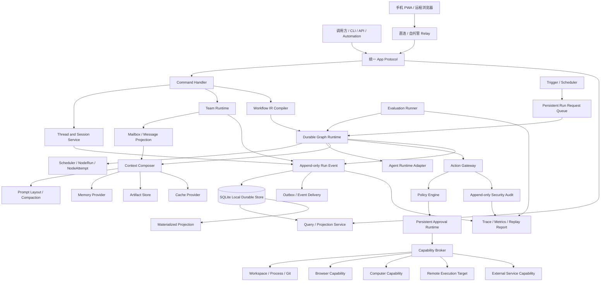

# Operant 多 Agent Harness 项目架构

> 文档状态：目标架构方案，尚不代表当前代码已经全部实现
> 文档日期：2026-08-25
> 适用范围：Operant 下一阶段至中长期演进
> 当前实现权威说明：`docs/PROJECT_ARCHITECTURE.md`
> 目标客户端设计：`docs/UI_UX_DESIGN_SPECIFICATION.md`
> 本文不包含页面布局、视觉规范或组件设计；只规定客户端必须遵守的内核契约

## 1. 文档定位

本文描述 Operant 从当前多模型 Coding Agent Runtime 演进为通用多 Agent Harness 的目标架构，重点覆盖：

- 持久会话与父子 Agent Thread；
- Agent Team、定向通信与共享任务板；
- 可版本化、可校验、可恢复的 Graph Workflow；
- Agent 上下文构造、渐进式引用、压缩和 Prompt Cache；
- Artifact、Memory、Cache 和历史数据的边界；
- 权限、自动审批、能力租约、Secret 和隔离执行；
- Plugin、Skill、Tool、MCP 和命令系统；
- 自动化、Hook、浏览器、电脑、远程操控和远程主机执行；
- 事件、持久化、恢复、审计和 Evaluation。

本文是目标架构交接材料，不替代当前实现说明。当前代码是否已经实现某项能力，必须以
`docs/PROJECT_ARCHITECTURE.md`、源码和测试为准。

GUI、桌面壳和 TUI 的目标信息架构、技术选型、交互、响应式和无障碍要求见
`docs/UI_UX_DESIGN_SPECIFICATION.md`。该客户端规范不得改变本文规定的状态权威、Action Gateway、
协议、恢复和安全边界。

## 2. 产品定位

Operant 的目标是：

> 一个单用户、本地优先、以多 Agent 协作为核心，支持持久会话、可编排工作流、受控自动化、
> 浏览器/电脑、跨设备远程操控和受控远程主机执行，并允许不同模型、Agent Runtime、Skill 和 Plugin
> 接入的通用 Harness Kernel。

Operant 不定位为：

- 仅支持单次聊天的模型客户端；
- 仅支持固定 Planner/Coder/Reviewer 的 Coding Pipeline；
- 只负责拖拽节点的低代码画布；
- 让模型直接拥有宿主机权限的命令包装器；
- 依赖某一家模型厂商内部类型的 Agent SDK；
- SaaS、多个人类用户协作或分布式 Core 平台。

Operant 2.0 默认边界：

- 单用户、单个本地 Core、本地优先；
- 本地 SQLite 是 Thread、Workflow、Approval、Audit 和恢复状态的唯一权威；
- GUI、TUI、Tauri、手机 PWA 和远程浏览器只是同一 Core 的客户端；
- 用户可通过局域网、VPN、SSH Tunnel 或自托管 Relay 远程操控自己的 Core；
- Relay 只做连接、路由和最小设备治理，不执行 Agent、不保存项目正文，也不成为恢复权威；
- 可连接用户明确授权的远程执行 Target，但不建设多 Core、Worker 集群、分布式调度或高可用；
- 以编程、项目研究和本地自动化为核心场景；
- 保留现有 CLI、API、SQLite 和固定 Coding Workflow 的兼容入口；
- 同一个代码工作区默认只有一个可写 Agent；
- 不可信任务使用隔离工作区与 Docker，后续可扩展到 VM 或远程执行 Target；
- Python 仍是核心领域与运行时语言，保持项目当前 Python 3.10+ 兼容；
- Relay 与 Host Connector 优先使用 Python；Rust 只在便携式远程执行 Helper、原生权限 Helper 或性能
  瓶颈经验证后引入。

## 3. 当前基础与演进原则

### 3.1 当前可复用基础

当前 Operant 已经具备：

- `ModelProfile`、`RolePreset` 和不可变 `RoleSnapshot`；
- `Session`、`AgentInstance` 和事件持久化；
- OpenAI-compatible Provider 与流式 Tool Call；
- 单 Agent Tool Calling Loop；
- Workspace 文件读取、搜索、补丁、命令和 Git Diff；
- Host/Docker Runner；
- Tool Policy 双层校验；
- 高风险命令审批、取消和超时；
- Planner → Explorer(s) → Coder → Reviewer → Main 固定 Workflow；
- 有界并行 Explorer、唯一可写 Coder 和有限返工；
- Workflow Event、阶段检查点、基础恢复与人工核对；
- Working、Episodic、Project Memory 与 SQLite FTS5；
- Trace、CLI、FastAPI、SSE 和本地 Web 工作台。

### 3.2 必须保留的安全资产

- 模型输出视为不可信输入；
- Role Snapshot 在一次执行中不可变；
- Runtime 与工具层重复校验 Tool Policy；
- 非 Coder 角色默认只读；
- Docker 不可用时不静默回退到 Host；
- `run_command` 使用参数数组，不隐式执行 Shell；
- 未知 Coder 写入结果不自动重放；
- Memory 默认先成为 candidate，不自动污染长期知识；
- SQLite 是本地恢复权威，Trace 不是恢复数据库。

### 3.3 演进原则

1. 保留当前 Agent Loop，把它放入通用 `AgentNodeExecutor`。
2. 把当前固定 Coding Workflow 迁移为通用 Graph Runtime 的内置模板。
3. 先稳定领域对象、状态机、事务和事件，再扩展外部能力。
4. 会话模式和协作模式共用一个 Runtime，不实现两套状态与恢复系统。
5. Team 与 Workflow 分离；会话、消息、任务板和运行状态分离。
6. Context、Memory、Artifact、Cache、Event 和 Trace 分离。
7. Agent 负责推理和提出意图，确定性 Runtime 负责调度、权限、预算和状态转换。
8. 任何外部副作用都必须经过统一 Action/Capability Gateway。
9. 所有定义、Snapshot、事件、策略和插件 Manifest 都必须版本化。
10. 本地模式每次 Run 只有一个恢复权威，避免 SQLite、第三方 Checkpointer 和外部平台同时写权威状态。
11. 远程操控与远程主机执行是两个领域能力；手机控制本地 Core 不等于把任务迁移到云端。
12. Remote Relay 被视为不可信传输基础设施，故障或失联不能改变本地 Run 的真实状态。

## 4. 总体架构



核心层次：

```text
调用协议层
    ↓
应用服务层
    ↓
会话 / Team / Graph Runtime
    ↓
Agent / Context / Action Gateway
    ↓
Capability 与执行环境
    ↓
Event / Artifact / Memory / Cache / Audit
```

## 5. 核心领域模型

### 5.1 Agent 相关对象

#### `AgentDefinition`

可复用的 Agent 模板，描述：

- 名称与职责；
- Role Preset；
- 默认模型；
- System Prompt；
- Tool Policy；
- Skills 和 Plugins；
- Memory Scope；
- 默认预算；
- 默认 Context Policy；
- 可执行 Target 类型。

#### `AgentSnapshot`

Agent 启动时生成的不可变执行配置。当前 `RoleSnapshot` 是其基础，后续可扩展：

```text
agent_definition_version
role_snapshot
model_snapshot
provider_capabilities
tool_manifest_snapshot
skill_manifest_snapshot
plugin_manifest_snapshot
context_policy_version
capability_policy_version
budget
target_ref
```

#### `AgentInstance`

某次实际运行的 Agent：

```text
agent_instance_id
agent_snapshot_id
thread_id
workflow_run_id
node_run_id
status
created_at
completed_at
```

### 5.2 Team 相关对象

#### `TeamDefinition`

Team 只描述成员与协作协议，不描述完整执行顺序：

```text
team_id
version
members
default_coordinator
mailbox_policy
task_board_policy
artifact_visibility
message_visibility_policy
max_active_agents
max_spawn_depth
```

#### `TeamRun`

Team 在某次任务中的实例，关联：

- `WorkflowRun`；
- 实际 `AgentInstance`；
- Mailbox；
- Task Board；
- Artifact Board；
- Team 事件。

### 5.3 Workflow 相关对象

#### `WorkflowDefinition`

可版本化、不可变发布的工作流定义：

```text
workflow_id
version
name
description
input_schema
output_schema
nodes
edges
graph_limits
default_budget
default_policy
required_plugins
required_capabilities
status: draft | published | deprecated
```

#### `WorkflowRun`

某个 Definition Version 的一次执行：

```text
workflow_run_id
workflow_definition_id
workflow_definition_version
input
workspace_or_target
team_run_id
status
budget_snapshot
policy_snapshot
started_at
completed_at
```

#### `NodeRun`

某个节点在一次 Workflow Run 中的持久状态：

```text
node_run_id
workflow_run_id
node_id
status
input_refs
output_refs
active_attempt_id
retry_count
worker_id
lease_id
updated_at
```

#### `NodeAttempt`

每次执行、Retry 或 Rework 都产生新的 Attempt：

```text
attempt_id
node_run_id
attempt_number
agent_instance_id
started_at
completed_at
result
failure_class
side_effect_state
idempotency_key
```

### 5.4 Thread 与上下文对象

#### `Thread`

持久会话身份：

```text
thread_id
parent_thread_id
owner
workspace_ref
default_agent_definition
status
created_at
updated_at
archived_at
```

#### `Turn` 与 `Item`

Thread 中的有序交互单元。Item 可以是：

- User Message；
- Agent Message；
- Tool Call；
- Tool Result Ref；
- Compaction；
- Artifact Ref；
- Steering；
- Sidecar Link；
- Approval Link；
- System Event。

#### `ContextRevision`

记录某次模型请求实际使用的上下文：

```text
context_revision_id
thread_id
agent_instance_id
source_item_ids
message_ids
reference_bindings
artifact_refs
memory_refs
compaction_refs
prompt_layout_version
token_estimate
created_at
```

### 5.5 Artifact、Memory 与 Cache 对象

#### `Artifact`

可验证、可引用、可设置保留策略的运行产物：

```text
artifact_id
kind
content_hash
storage_ref
media_type
size
source_run_id
source_node_run_id
source_tool_call_id
sensitivity
retention_policy_id
created_at
```

Artifact 类型包括：

- Plan；
- Checklist；
- Walkthrough；
- Finding；
- Patch；
- Diff；
- Test Report；
- Log；
- File Snapshot；
- Screenshot；
- Browser Trace；
- Remote Result；
- Tool Result。

#### `Memory`

继续保留 Working、Episodic、Project 分层，并保留：

- 来源；
- 版本；
- workspace/project/role scope；
- candidate/active/inactive；
- 确认与停用；
- FTS5 检索。

#### `CacheObservation`

只记录 Cache 命中事实，不把 Provider Cache 当作本地权威数据：

```text
provider
model
cache_scope
cache_key_hash
stable_prefix_hash
breakpoint_id
cache_read_tokens
cache_write_tokens
hit_or_miss
request_id
created_at
```

## 6. 会话与协作运行模式

产品可以提供会话视角和 Workflow 视角，但底层只有一个 Runtime：

```text
Single Operant Runtime
├── Conversation / Parent-Child Thread Projection
└── Workflow / Team / Graph Projection
```

### 6.1 `bounded_subagent`

默认子 Agent 模式：

- 独立 Thread；
- 独立 Agent Snapshot；
- 只接收有界任务包；
- 只继承显式文件、Artifact、Memory 和权限；
- 通过结构化结果返回；
- 不自动复制完整父 Context；
- 完成后父 Agent 只收到摘要和 Artifact Ref。

### 6.2 `team_mode`

持续协作模式：

- 多个独立 Agent Thread；
- Team Roster；
- 定向 Mailbox；
- 共享 Task Board；
- Artifact Board；
- 明确的消息和 Artifact 可见性；
- Workflow Coordinator 仍是状态转换权威。

### 6.3 Team 与 Workflow 的边界

- Team 定义“谁参与、如何交流”；
- Workflow 定义“执行顺序、条件、循环和失败语义”；
- 同一个 Team 可以运行多个 Workflow；
- 同一个 Workflow 可以绑定不同 Team；
- Agent 消息不能直接修改 Graph 状态；
- Task Board 更新需要经过持久化 Command Handler。

## 7. Workflow IR 与编译

### 7.1 Canonical Workflow IR

所有来源都必须生成同一种 IR：

- API；
- CLI；
- 文件导入；
- 智能 Workflow Designer；
- 外部自动化或集成。

IR 使用内部 Pydantic 类型表达，可序列化为 JSON/YAML，但 JSON/YAML 不是绕过校验的执行入口。

### 7.2 `NodeSpec`

```text
node_id
node_kind
input_ports
output_ports
agent_or_action_ref
model_override
context_policy
capability_requirements
retry_policy
timeout_policy
budget
idempotency_class
workspace_or_target
failure_policy
```

### 7.3 `EdgeSpec`

```text
edge_id
source_node
source_port
target_node
target_port
condition
join_mode
delivery_mode
```

条件必须使用可序列化、可验证的表达式或有限 DSL，不允许普通 Workflow Definition 直接嵌入任意 Python Callable。

### 7.4 第一批节点类型

- `AgentNode`；
- `ToolNode`；
- `ScriptNode`；
- `ConditionNode`；
- `FanOutNode`；
- `JoinNode`；
- `LoopNode`；
- `HumanInputNode`；
- `ApprovalNode`；
- `WaitNode`；
- `TimerNode`；
- `SubworkflowNode`；
- `ArtifactNode`。

Browser、Computer 和 Remote 早期可作为受控 Tool/Capability，只有在独立状态和调度语义稳定后再升级为专用节点类型。

### 7.5 编译检查

发布前至少检查：

- 节点和端口类型；
- 必需输入是否存在；
- 不可达节点；
- 非法循环；
- Loop 退出条件；
- 最大迭代、时间、Token、费用和 Agent 数；
- 插件和模型可用性；
- Capability 静态上限；
- 多个 Writer 是否冲突；
- Retry 是否可能重复不可幂等副作用；
- Human Input 和 Approval 是否有超时分支；
- Subworkflow 的权限是否越界；
- Definition、Role、Tool、Plugin 和 Provider 版本是否锁定。

### 7.6 智能 Workflow Designer

Designer 只能生成 `WorkflowDraft` 或 `GraphPatchProposal`：

```text
用户需求
→ WorkflowDraft
→ Schema 校验
→ 类型检查
→ Loop/预算检查
→ Plugin/Model 检查
→ 权限静态分析
→ Dry Run
→ Definition Diff
→ 用户或受控发布流程
```

Designer 不能直接：

- 发布 Definition；
- 启用 Schedule；
- 扩大 Workspace；
- 安装高权限 Plugin；
- 修改正在运行的 Definition Version；
- 绕过 Approval 或 Policy。

## 8. Graph Runtime、状态与恢复

### 8.1 Workflow 状态

```text
CREATED
QUEUED
RUNNING
WAITING_INPUT
WAITING_APPROVAL
INTERRUPTED
MANUAL_RECONCILE_REQUIRED
COMPLETED
FAILED
CANCELLED
```

### 8.2 Node 状态

```text
PENDING
READY
RUNNING
WAITING_APPROVAL
WAITING_INPUT
RETRY_WAIT
SUCCEEDED
FAILED
CANCELLED
SKIPPED
MANUAL_RECONCILE_REQUIRED
```

### 8.3 Loop 约束

任何 Loop 都必须具备：

- 最大迭代次数；
- 最大墙钟时间；
- Token 与费用上限；
- 最大子 Agent 数；
- 最大递归深度；
- 无进展签名；
- 明确退出条件；
- 超限分支；
- 外部副作用重试策略；
- 必要时的人工介入分支。

禁止无界 Loop。

### 8.4 调度权威

Agent 可以提出：

- 创建子任务；
- 请求另一个 Agent；
- 发布 Artifact；
- 建议修改计划；
- 请求 Approval；
- 建议 Retry 或 Rework。

只有 Graph Runtime 可以执行：

- Node 状态转换；
- 依赖解锁；
- Join 完成判断；
- Retry；
- Budget 扣减；
- Workflow 完成或失败；
- Graph Patch 接受；
- Worker Lease 发放；
- Cancellation 传播。

### 8.5 恢复原则

- Event 和状态先持久化，再向客户端或下游投递；
- 已提交 Node Checkpoint 可以复用；
- 模型流任意字节位置不承诺恢复；
- 未开始的节点可以安全调度；
- 已确认完成的幂等节点不得重复执行；
- 外部副作用结果未知时进入 `MANUAL_RECONCILE_REQUIRED`；
- 未知写操作不能因 Worker 失联而自动重放；
- Approval、Cancellation、Wait 和 Timer 必须是持久化状态，不依赖进程内 Future；
- 每个副作用操作携带 `operation_id` 或 `idempotency_key`。

## 9. Event、Mailbox 与投影

### 9.1 `EventEnvelope`

所有持久事件使用统一外壳，不使用一个自由文本 Message 类型承载全部数据：

```text
event_id
schema_version
run_id
node_run_id
attempt_id
sequence
event_type
actor
causation_id
correlation_id
idempotency_key
sensitivity
payload_ref_or_payload
occurred_at
```

### 9.2 `MessageEnvelope`

```text
message_id
workflow_run_id
team_run_id
sender_id
recipient_ids
audience
message_kind
schema_version
payload
artifact_refs
reply_to
causation_id
correlation_id
delivery_mode
ui_visibility
model_delivery
audit_visibility
context_effect
trust_level
requires_ack
ttl
status
created_at
delivered_at
```

消息类型至少包括：

- `TaskAssignment`；
- `Finding`；
- `ArtifactPublished`；
- `Decision`；
- `Blocker`；
- `Question`；
- `ApprovalRequested`；
- `StatusUpdate`；
- `Completion`。

### 9.3 Message Projection Service

```text
Event Store
→ Inbox / Outbox
→ Message Projection
├── Agent Context Projection
├── Team Timeline Projection
├── Task Board Projection
├── Artifact Board Projection
└── Audit Projection
```

规则：

- 定向消息只进入指定 Agent 的下一轮 Context；
- 非接收 Agent 不消耗该消息的 Context Token；
- 用户是否能审计全部 Agent 消息由 Owner/Audit Policy 决定；
- 大型日志、源码和截图保存为 Artifact，消息只传摘要和引用；
- Agent 消息默认标记为不可信输入；
- Agent 消息不能代替用户或 Policy Approval；
- 每个 Agent 使用递增 Inbox Cursor，避免每次扫描完整 Event Store；
- Ack、Retry 和重复投递必须使用幂等键。

## 10. Context Composer 与 Prompt Layout

### 10.1 数据分层

```text
Canonical History
  Thread / Turn / Item 的完整追加式历史

ContextRevision
  某次模型请求实际使用的输入

Compaction
  对历史产生的派生摘要

Artifact / Memory
  可复用产物与长期知识

Provider Prompt Cache
  只用于成本与延迟优化
```

### 10.2 Context Composer 流程

```text
加载 AgentSnapshot
→ 加载 System 与 Role 指令
→ 解析 @ 引用
→ 检查访问权限与消息可见性
→ 选择 Thread Items
→ 选择 Agent Messages
→ 选择 Artifact
→ 检索 Memory
→ 估算 Token
→ 折叠大型 Tool Result
→ 必要时生成 Compaction
→ 生成 ContextRevision
→ 按 PromptLayout 排列稳定前缀
→ Provider Adapter 添加 Cache 参数
→ 调用模型
→ 记录 Usage 与 CacheObservation
```

### 10.3 `PromptLayout`

推荐物理分块：

```text
Block 1：Provider/System 基础指令
Block 2：稳定 Tool Schema
Block 3：RoleSnapshot 指令
Block 4：本次 Run 冻结的项目规则与 Memory Snapshot
Block 5：当前任务与显式引用
Block 6：Agent 私有消息与 Tool Result Stub
Block 7：当前 Turn
```

每个 Prompt Block 记录：

```text
block_id
block_type
content_hash
source_refs
stable_until
visibility
token_count
cache_eligible
```

不同 Provider 的 Cache 能力由 Adapter 描述，不保证某个 Block 必然命中。

### 10.4 Context Watermark

阈值根据模型最大 Context、预留输出、Tool Schema 和安全余量动态计算：

```text
Green
  正常保留

Yellow
  大型 Tool Result 和旧文件内容 Artifact 化

Red
  生成结构化 Compaction

Emergency
  停止继续扩张，要求 Compact、Fork 或新 Thread
```

阈值可有默认比例，但不得在 Runtime 中硬编码为固定 60%/80%。

### 10.5 Compaction

Compaction 不能删除或原地改写 Canonical History，只创建派生记录。

结构化摘要至少包含：

```text
active_goal
constraints
decisions
completed_steps
open_tasks
failed_attempts
workspace_state
artifact_refs
memory_refs
approval_state
external_side_effects
manual_reconcile_items
next_actions
```

Tool Result 折叠后使用 Stub：

```text
artifact_id
tool_call_id
content_hash
original_size
summary
fetch_capability
```

### 10.6 `@` 引用

支持：

```text
@file
@directory
@thread
@agent
@artifact
@memory
@skill
@plugin
@workflow
@run
```

每个引用生成 `ReferenceBinding`：

```text
ref_type
user_text
resolved_target
source_snapshot_hash
line_or_byte_range
include_mode
max_tokens
visibility
resolved_at
```

默认渐进式披露：

- 小文件可内联；
- 大文件只加载相关片段；
- 目录只加载索引；
- 会话只加载摘要、时间、参与者和关键 Artifact；
- Agent 按需调用受控工具继续读取；
- 每次展开重新检查权限；
- 文件变更后通过 Snapshot Hash 区分版本。

## 11. Goal、Plan、BTW 与命令语义

### 11.1 `Goal`

Goal 是持久化领域对象，不只是文本命令：

```text
goal_id
objective
status
token_budget
cost_budget
time_budget
completion_criteria
linked_thread_ids
linked_workflow_run_ids
blocked_reason
result_ref
```

### 11.2 Plan Artifact

`/plan` 进入只读探索与计划生成流程：

```text
只读探索
→ PlanArtifact
→ Review / Approval
→ ExecutionChecklist
→ WorkflowRun
→ WalkthroughArtifact
```

`PlanArtifact` 包含：

```text
goal
scope
assumptions
constraints
open_questions
proposed_changes
risk_items
approval_requirements
verification_plan
created_from_context_revision
status
```

计划默认保存在 Artifact Store；是否导出为 Workspace 文件由用户或调用方显式决定。

### 11.3 Execution Checklist

```text
item_id
description
dependencies
status
assigned_agent
node_run_id
evidence_refs
blocker
```

Checklist 的真实状态由 Workflow/Task Command 更新，不能仅依赖 Agent 在自然语言中声明完成。

### 11.4 Walkthrough Artifact

```text
summary
changes
decisions
verification
remaining_limits
artifact_refs
approval_history
next_checkpoint
```

### 11.5 BTW Sidecar

`/btw` 是 Sidecar Turn：

- 读取当前主 Thread 的 Context Snapshot；
- 默认只读、无工具；
- 不写入主 Thread；
- 不改变主 Agent 后续 Context；
- 可以显式转为 Steering Item；
- 仍记录独立模型调用、Token 与 CacheObservation。

### 11.6 Slash Command Registry

Slash Command 是用户或调用方的显式路由入口，可映射到：

- 核心领域操作；
- Context 操作；
- Thread 操作；
- Skill；
- Plugin；
- Approval；
- Workflow Command。

命令注册不代表其实现自动进入所有 Agent Context；只在显式调用或任务需要时渐进加载。

## 12. Artifact、Memory、Cache 与 Retention

### 12.1 分类

| 数据类型 | 是否权威 | 默认策略 |
|---|---:|---|
| Thread、Turn、Event | 是 | 归档，不自动物理删除 |
| ContextRevision | 可重建 | 可按 TTL 清理 |
| Compaction | 派生但重要 | 通常随 Thread 保留 |
| Provider Prompt Cache | 否 | 由 Provider 管理，本地只记录观测 |
| Artifact | 部分权威 | 跟随 Run/Thread，可单独 Pin |
| Memory | 长期知识 | 按来源、版本、Scope 和状态管理 |
| Workspace Index | 否 | 按 Workspace Snapshot 与 LRU 清理 |
| Docker/Worktree | 否 | Run 终态后按 TTL 清理 |
| Browser Context | 高敏感临时数据 | 默认临时，持久化需显式启用 |
| Browser Profile/Cookie | 高敏感 | 独立加密、授权和 Retention |
| UI/实时广播队列 | 否 | 极短期，断线从 Event Store 回放 |
| Secret | 不属于 Cache | 禁止进入普通缓存、消息和 Trace |

### 12.2 生命周期状态

```text
RUNNING
WAITING_USER_CONFIRMATION
COMPLETED
ARCHIVED
DELETION_SCHEDULED
TRASHED
DELETED
```

Agent 可以建议进入 `WAITING_USER_CONFIRMATION`，但不能通过一句自然语言直接触发物理删除。

“确认完成后保留一小时、未回复保留三天”的默认规则只适用于：

- 临时 Context Projection；
- Docker 容器；
- 临时 Browser Context；
- 未 Pin 的 Worktree；
- 可重建索引；
- 实时传输缓存。

它不适用于：

- Canonical Thread History；
- Workflow 和 Security Audit；
- Approval；
- Memory；
- 用户 Pin 的 Artifact；
- 未知副作用证据；
- 仍可恢复的 Run。

### 12.3 Provider Prompt Cache

Provider Prompt Cache 只用于成本与延迟优化：

- 不作为 Memory；
- 不作为会话历史；
- 不作为恢复依据；
- 不假设多个 Provider 具有相同 TTL 与 Cache Key；
- 动态私有内容放在稳定 Prefix 之后；
- 本地只记录 CacheObservation，不复制 Provider 内部 Cache。

## 13. Action Gateway、Policy 与 Approval

### 13.1 总体流程

```text
Agent / Tool / Plugin / Trigger 提出动作
→ Action Normalizer
→ Policy Engine
→ DENY / ASK / ALLOW
→ ASK 灰区可交给 Approval Reviewer
→ 必要时等待用户或受权主体
→ Capability Broker 发放精确租约
→ 执行前重新验证 action_hash
→ 隔离执行
→ Append-only Audit
```

### 13.2 `ActionRequest`

```text
request_id
principal
session_id
workflow_run_id
node_run_id
agent_instance_id
tool
operation
normalized_target
normalized_arguments
workspace_id
data_classification
requested_capabilities
sandbox_profile
network_profile
secret_refs
dry_run
idempotency_key
action_hash
policy_version
```

Action Normalizer 必须在审批前解析：

- 真实 argv；
- 绝对路径和符号链接结果；
- Workspace/Target；
- 域名、IP、端口和 HTTP 方法；
- 数据发送范围；
- Secret Ref；
- 浏览器页面或桌面目标；
- 远程主机身份；
- 可恢复性与幂等等级。

### 13.3 Policy 结果与优先级

```text
DENY
ASK
ALLOW
```

优先级：

```text
系统/管理硬拒绝
> Workspace 拒绝
> Role/Agent Snapshot Policy
> Workflow Policy
> Session Policy
> 单次 Approval
> 低风险自动允许
```

下层策略只能收窄，不能扩大上层权限。LLM Reviewer 和用户普通审批都不能覆盖系统硬拒绝。

### 13.4 严格度 Policy Bundle

#### Strict

- Workspace 范围内读取、搜索和只读 Diff 可自动允许；
- 写入、命令、网络、Secret、浏览器提交、电脑输入和远程执行默认拒绝或询问；
- 只读快照、无网络、隔离执行为默认环境。

#### Balanced

- 隔离 Workspace 内编辑、测试、格式化和静态检查可自动允许；
- 网络、Workspace 外路径、Git 写、浏览器提交、电脑输入、远程执行和 Secret 使用需要明确策略或 Approval；
- 生产、高影响删除、提权和 Policy 修改为硬拒绝或更高等级人工流程。

#### Permissive

- 仅适用于用户明确标记的可信 Workspace；
- 可放宽本地执行、有限网络和低风险会话级租约；
- 仍保留生产、原始 Secret、不可恢复删除、提权、公开发布、支付、`force push`、关闭审计和 Policy 修改门禁。

### 13.5 Approval Reviewer

Approval Reviewer 是灰区风险分析器，不是安全根：

- 只处理 `ASK`；
- 只能看完成判断所需的最小脱敏信息；
- 不能读取原始 Secret；
- 不能扩大 Workspace 或网络；
- 不能覆盖 DENY；
- 不能审批自己的请求；
- 不能修改 Policy；
- 失败、超时或结构化输出无效时，高风险请求保持拒绝或等待用户。

模型配置分离 `model_id` 与 `reasoning_effort`。候选 Profile 可使用低成本、结构化输出稳定的模型，但必须经过 Provider 发现与审批基准测试。

### 13.6 `ApprovalRequest`

```text
approval_id
action_request_id
action_hash
requester
workflow_run_id
node_run_id
policy_version
risk_level
preview_ref
requested_at
expires_at
status
decided_by
decision
decided_at
```

Approval 必须持久化，不能只使用进程内 Future。参数、Target、Policy、Workspace Digest 或身份变化后必须创建新审批。

### 13.7 `CapabilityLease`

```text
lease_id
action_hash
principal
capability
target
workspace
constraints
expires_at
max_uses
policy_version
issued_by
```

批准不是永久权限。执行器只接受有效、未过期、未使用超限且与 Action Hash 完全匹配的租约。

### 13.8 Policy Denial Remediation

可修复拒绝返回结构化反馈：

```text
denied_action_hash
reason_code
policy_rule_id
denied_capabilities
allowed_scope
allowed_alternatives
retry_constraints
```

规则：

- 目标是寻找合规替代方案，不是绕过 Policy；
- 硬拒绝不允许自动重试；
- 新方案必须产生不同 Action Hash 并降低风险；
- 相同拒绝签名重复出现时触发无进展停止；
- Remediation 次数计入 Budget；
- 用户关闭人工审批时，高风险动作拒绝并寻找替代方案，不由 Reviewer 静默放行。

### 13.9 Secret Broker

真实 Secret 只通过 `secret_ref` 使用：

```text
Agent 请求 secret_ref
→ Policy 检查主体、Target、域名、操作与数据类型
→ Secret Broker 发放短 TTL 租约
→ 仅注入指定进程、FD、代理或内存通道
→ 网络出口限制目标
→ 输出脱敏
→ Audit 只记录引用和哈希
```

Secret 不进入：

- Prompt；
- 普通 Message；
- Event Payload；
- SSE/WebSocket 明文；
- Trace；
- Memory；
- Artifact；
- CacheObservation。

## 14. Capability 与 Target

### 14.1 Capability 分类

```text
workspace.read
workspace.write
workspace.delete
process.exec
process.exec.no_network
network.egress
secret.use
git.commit
git.push
browser.observe
browser.navigate
browser.submit
computer.observe
computer.input
remote.control.observe
remote.control.command
remote.control.approve
remote.target.read
remote.target.exec
external.message.send
production.mutate
policy.modify
```

工具名不是最终安全单位；同一个 Tool 在不同 Target、路径、身份和数据范围下需要不同 Capability。

### 14.2 Target

```text
Target
- target_id
- target_type
- endpoint_ref
- workspace_ref
- identity_ref
- credential_ref
- policy_ref
- lifecycle
- health
```

Target 类型：

- Local Workspace；
- Docker Workspace；
- Browser Session；
- Computer Session；
- Remote Execution Target；
- External Service；
- 后续 VM/CI Runner。

### 14.3 Workspace 与多 Writer

第一阶段保持：

- 一个共享代码工作区只有一个 Writer；
- 并行 Agent 默认只读；
- Coder 在隔离副本中修改；
- 测试和修改证据形成 Artifact。

多个 Writer 只有在以下能力完成后开放：

- 每个 Writer 独立 Worktree/Container；
- Writer Lease；
- 文件或模块所有权；
- Patch/Commit Artifact；
- Merge Node；
- 冲突检测；
- Review；
- 回滚；
- 独立测试与 `git diff --check`。

## 15. Browser Capability

### 15.1 Access Mode

```text
http_extract
isolated_ephemeral
managed_persistent
user_browser_connector
```

#### `http_extract`

适用于公开、只读、无需 JavaScript 的页面。必须限制：

- 域名和协议；
- Redirect；
- localhost、内网和 Metadata 地址；
- DNS Rebinding；
- Content Type；
- 最大响应体；
- 下载；
- 页面 Prompt Injection。

#### `isolated_ephemeral`

- 独立 Browser Context；
- 默认无持久登录态；
- 独立下载目录；
- Run 终态后按 Retention 清理；
- 适合不可信网页和自动化测试。

#### `managed_persistent`

- Operant 管理的专用 Profile；
- 按 Workspace/身份隔离；
- Cookie 和 Storage State 加密；
- 显式授权与 Retention；
- 不与用户日常 Profile 混用。

#### `user_browser_connector`

- 通过受控 Connector/Sidecar 连接用户现有浏览器；
- 用户按 Tab、域名或会话授权；
- 不默认读取完整用户目录、所有 Cookie、历史和扩展；
- 高影响操作仍经过 Approval。

禁止默认直接挂载用户日常 Chrome `user-data-dir`。

### 15.2 操作优先级

```text
业务 API / Connector
→ Playwright 语义 Locator
→ ARIA / Accessibility Tree
→ 受限 CDP
→ Vision Fallback
```

Agent 不直接获得完整 Browser 对象或任意 CDP 方法，只获得类型化动作。

每次操作使用：

```text
PageObservation
TargetRef
ObservationHash
Precondition
Postcondition
ActionReceipt
```

提交、购买、发送、删除、发布等非幂等动作禁止盲目自动重试。

## 16. Computer Capability

操作优先级：

```text
应用 API / 系统自动化接口
→ macOS AX / Windows UIA / Linux AT-SPI
→ Vision
→ 坐标操作
```

Browser 和 Computer 使用不同 Capability：

```text
browser.observe
browser.navigate
browser.submit
computer.observe
computer.input
computer.clipboard.read
computer.clipboard.write
```

执行流程：

```text
观察
→ TargetRef
→ Policy / Approval
→ 执行前复核 ObservationHash
→ 操作
→ 后置观察
→ 验证 Postcondition
→ Audit
```

密码管理器、支付软件、系统设置、隐私权限、提权终端和生产控制台默认硬拒绝或需要高等级人工确认。

## 17. Remote Control 与 Remote Execution Target

远程能力必须拆成两个独立领域：

| 能力 | 方向 | 状态权威 | 主要用途 |
|---|---|---|---|
| Remote Control | 用户远程设备 → 本地 Operant Core | 本地 Core 与 SQLite | 从手机或浏览器启动、引导、审批和审查任务 |
| Remote Execution Target | 本地 Operant Core → 授权远程主机 | 本地 Core 调度，Target 只执行租约 | 在服务器或另一台电脑的隔离 Workspace 执行动作 |

两者不能共用一个含糊的 Worker 对象。Remote Control 不会把 Workspace 或 Run 迁移到 Relay；Remote
Execution Target 也不会让远程主机成为 UI 会话和 Workflow 的恢复权威。

### 17.1 Remote Control 产品语义

Remote Control 采用“远程设备是控制面，本地电脑是执行面”的模型：

- 用户可从手机 PWA、平板、远程浏览器或 TUI 选择自己的 Host、Workspace、Thread、Team 和 Workflow；
- 可以启动或继续任务、查看 Agent/Node 状态、发送 Queue/Steer、审批、拒绝、取消和提供 Human Input；
- 可以审查 Plan、Goal、Artifact、修改文件、Diff 和测试结果；
- 可以查看并控制子 Agent、Team 消息、Task Board 和 Workflow Graph；
- 本地 Core 继续运行模型、工具、Browser、Computer 和 Workspace 动作；
- 远程客户端关闭或断线不停止本地任务；
- 远程客户端不得读取隐藏思维链，只使用与本地客户端相同的结构化 Projection。

`Queue` 等当前 Turn 完成后再提交下一条输入，是默认行为。`Steer` 只在 Agent Loop 或 NodeAttempt 的
明确安全检查点影响后续执行；它不能伪装成已经撤销正在发生的副作用，也不能在任意模型流字节位置
直接注入内容。

### 17.2 直连与自托管 Relay

Remote Control 支持两类传输路径，业务协议保持一致：

```text
局域网 / 用户 VPN：Remote Client → Local Remote Gateway → Operant Core

跨网络：Remote Client → Self-hosted Relay ← Host Connector → Operant Core
```

连接优先级是本地回环、局域网或用户 VPN 直连，其次才使用 Relay。Host Connector 与 Remote Client
都主动连接公网 Relay，因此不要求家庭或办公室网络向公网开放 Operant Core 端口。

Relay 是用户可自托管的轻量连接中转，2.0 不建设 SaaS 控制面。Relay 只允许保存或处理：

- Host/Device 公钥、短期连接和协议版本；
- 在线状态、连接心跳、撤销信息和限流计数；
- 有严格 TTL/大小上限的加密 Envelope；
- 脱敏的连接审计与可选通知路由。

Relay 不得保存 Thread 正文、代码、Diff、命令参数、Artifact 正文、模型消息、API Key 或 Secret；不得
运行 Agent、调用工具、裁决 Policy/Approval、修改 Workflow，或成为 SQLite 的替代恢复数据库。
Relay 故障时本地任务继续运行，重连后从本地 Event Cursor 恢复。

默认传输为 HTTPS/WSS over 443。Remote Gateway 可以把统一 Command、Query、Event Envelope 隧道化，
但不得发明第二套业务语义。WebRTC、QUIC 或专用二进制通道只在大型屏幕流、低延迟 Computer Control
或 Artifact 吞吐有真实瓶颈后评估。

### 17.3 Remote Control 对象

```text
HostInstance
- host_id
- display_name
- host_public_key
- core_version
- protocol_version
- capabilities
- online_state
- last_seen_at

RemoteDevice
- device_id
- display_name
- device_public_key
- scopes
- paired_at
- last_seen_at
- revoked_at

RemoteSession
- remote_session_id
- host_id
- device_id
- transport_mode
- protocol_version
- event_cursor
- expires_at
- connection_state

RelayEnvelope
- envelope_id
- route_ref
- protocol_version
- ciphertext
- nonce
- expires_at
```

远程 Command 继续使用统一 Command 类型，并额外绑定 `command_id`、`idempotency_key`、`host_id`、
`device_id`、`remote_session_id`、`issued_at`、`expires_at`、`nonce` 和签名。只有当某类 Command 能绑定
明确的权威资源版本时，才为该动作增加对应的版本前置条件；不得保留未执行校验的通用
`expected_version` 造成虚假并发保证。客户端不确定 Command 是否提交成功时必须先查询原 ID，不得直接
重复产生副作用。Core 内部执行还必须绑定可续租 owner 和 TTL；只有 owner 过期才允许把 unknown write
收口为人工核对，执行完成与人工核对均使用 CAS，旧 owner 不得覆盖新权威状态。

### 17.4 配对、身份与权限

- Remote Control 默认关闭，只能由本地用户显式开启；
- 二维码或短时配对码只携带一次性随机数、本机预授 Scope、有效期、Relay/Host 引用和临时校验信息，
  不携带长期管理 Token；设备最终 Scope 必须是该本机预授权集合的子集；
- Host 与每个 RemoteDevice 使用独立设备密钥，并为每次连接协商短期 Session Key；
- Relay 上的 TLS 不能代替 Host 与 RemoteDevice 之间的应用层端到端加密；
- 每个设备分别授予只读、发消息、启动任务、审批、终端、Browser/Computer 和设置管理 Scope；
- 新设备默认最小权限，本地界面可查看、撤销或一键禁用全部远程设备；
- 远程 Approval 必须记录 Device Identity，并继续绑定精确 Action Hash、Target、Policy Version 和有效期；
- RemoteDevice Scope、远程用户点击或 Relay 消息都不能覆盖 Policy `DENY`；
- Secret 不发送到远程客户端，敏感 Approval 参数使用脱敏摘要和受控引用。

### 17.5 断线、恢复与通知

- 手机、浏览器或 Relay 断线不改变本地 Run；
- 本地 Core 持续写 SQLite 和 Event，重连后按 Cursor 去重回放；
- `Queue`、`Steer`、Approval 和 Cancellation 只有收到 Host Ack 后才显示为已接受；
- Host 离线时 2.0 默认拒绝创建会在未来自动执行的副作用 Command，不建设无限期云端离线队列；
- Relay 只可短期缓存加密 Envelope，过期后明确失败；
- `outcome_unknown` 的人工核对必须绑定原 Action/Target，再次经过本机 Action Gateway、一次性
  Capability Lease 和安全 Audit，不能仅凭 loopback 来源改写恢复权威；
- 通知只包含脱敏状态和深链，不包含代码、完整命令、Secret、敏感路径或模型回复正文。

### 17.6 Remote Execution Target

Remote Execution Target 由本地 Controller 调度受信 Host/Connector：

- 使用独立 Workspace、身份、Policy、Artifact Namespace 和 JobLease；
- 不继承 Controller 全部环境变量、Home、SSH 私钥或 Docker Socket；
- 结果带 Artifact Checksum、幂等 ID 和后置条件证据；
- 断线时进入明确的 waiting、failed 或 manual reconcile 状态；
- Remote Target 可以与 Relay 部署在同一云主机，但必须使用独立用户/容器、目录、凭据和网络边界；
- 公网 Relay 默认不得同时拥有项目 Workspace、模型凭据或执行器权限。

```text
RemoteTargetRegistration
RemoteTargetIdentity
CapabilityManifest
Heartbeat
JobLease
WorkspaceLease
CancellationToken
ArtifactChecksum
ResultIdempotencyKey
```

### 17.7 实现顺序

1. 在协议基线阶段冻结 Host、Device、RemoteSession、加密 Envelope、Cursor 和幂等语义；
2. 使用 Python 实现单 Host 的 Host Connector 与自托管 Relay MVP；
3. 在会话 GUI/PWA 阶段交付查看、Queue/Steer、审批、Diff、Artifact、取消和断线恢复；
4. 随 Graph 和 Team 阶段增加远程 Workflow 与多 Agent 控制；
5. 再增加多 Host、Headless Connector、通知、自托管安装器和完整设备治理；
6. 最后实现 Remote Execution Target，并验证断线、取消、重复投递、Artifact 和人工核对；
7. 只有性能与发布证据证明必要时，才为便携 Target Helper 或高吞吐通道增加 Rust。

## 18. Plugin、Skill、Tool、MCP 与 Hook

### 18.1 概念边界

| 概念 | 作用 |
|---|---|
| Tool | 模型可调用的结构化动作 |
| Skill | 指令、流程、参考资料和资源 |
| Plugin | 安装并注册 Tool、Skill、Provider、Target、Trigger 等能力的包 |
| MCP | 外部工具和资源连接协议之一 |
| Slash Command | 用户或调用方显式路由到系统动作、Skill 或 Plugin 的入口 |
| Hook | 生命周期事件上的确定性或模型化处理器 |

### 18.2 固定安全内核

普通 Plugin 不得替换：

- Identity；
- Authorization；
- Workflow/Event Schema；
- State Transition；
- Policy 硬拒绝；
- Capability Broker；
- Secret Redaction；
- Audit；
- 数据库事务；
- Graph Compiler；
- Loop Limit；
- Plugin 安装权限。

### 18.3 可插件化能力

- Model Provider；
- Agent Runtime Adapter；
- Tool/Capability；
- Skill；
- MCP；
- Runner/Sandbox；
- Browser/Computer/Remote Adapter；
- Context Source；
- Compaction Strategy；
- Trigger；
- Artifact Storage；
- Evaluation Adapter。

### 18.4 Plugin Manifest

```text
plugin_id
version
protocol_version
capabilities
required_permissions
supported_os
supported_transports
risk_classes
data_sensitivity
health_check
supports_dry_run
supports_idempotency
tools
skills
triggers
```

### 18.5 运行隔离

- 内置可信 Plugin 可进程内运行；
- 第三方 Plugin 默认独立进程；
- Plugin 不直接获得 SQLite Connection、ApplicationService、完整环境变量、用户 Home 或原始 Secret；
- Plugin 通过版本化 RPC/stdio/WebSocket 接口调用；
- Plugin 动作仍经过 Action Gateway；
- MCP Server 不是安全边界；
- Plugin 版本、权限、输入摘要、结果和失败必须进入 Trace/Audit。

### 18.6 Hook

Hook 分为：

- Deterministic Hook；
- Prompt Hook；
- Agent Hook。

安全关键 Hook 默认 fail-closed：

- Secret；
- 生产资源；
- 远程执行；
- 浏览器提交；
- 电脑输入；
- 网络白名单；
- 删除；
- Policy 修改。

执行后 Hook 只能审计、补偿或阻止后续流程，不能替代执行前 Policy。

## 19. Automation、Trigger 与 Queue

### 19.1 Trigger 类型

- Cron/Calendar；
- Webhook；
- 文件变化；
- Git/CI 事件；
- 应用事件；
- 内部 Run Event；
- 手动调用。

### 19.2 执行链路

```text
Trigger
→ TriggerService
→ 签名、权限、条件与幂等检查
→ RunRequest
→ 持久化 Queue
→ 快速返回
→ Worker 获取 JobLease
→ WorkflowRun
```

Webhook 请求线程不能直接同步运行 Agent。

### 19.3 必需语义

- 时区与 DST；
- Missed Run Policy；
- 幂等键；
- 并发限制；
- Retry/Backoff；
- Dead Letter；
- Webhook 签名与防重放；
- Run-as Identity；
- Secret Scope；
- Approval Timeout；
- 失败通知；
- Trigger Definition Version；
- 生成的 Workflow Run ID。

### 19.4 本地调度边界

Operant 2.0 的本地 SQLite 模式只允许一个 Scheduler Leader 和一个 Runtime Writer。多进程、多节点、
PostgreSQL、外部队列或 Temporal 不属于 2.0；只有未来真实需求明确并单独立项时才重新评估。

## 20. Model Provider 与 Agent Runtime Adapter

### 20.1 Provider Capability

Provider Adapter 除模型调用外还应声明：

```text
supports_streaming
supports_tool_calls
supports_structured_output
supports_reasoning_effort
supported_reasoning_values
supports_prompt_cache
supports_explicit_cache_breakpoint
supports_cache_retention
supports_server_compaction
supports_images
supports_computer_actions
usage_fields
```

Model ID 与 reasoning effort 分开保存。真实运行前通过 Provider 模型发现确认精确 ID。

### 20.2 Agent Runtime Adapter

```text
AgentRuntime
├── NativeOperantAgentLoop
└── OptionalExternalAgentRuntimeAdapter
```

外部 Agent SDK 必须转换为 Operant 统一事件：

- Agent Started；
- Model Call；
- Tool Call；
- Tool Result；
- Handoff；
- Approval Required；
- Approval Decided；
- Context Revision；
- Agent Completed；
- Agent Failed。

Operant 的 AgentDefinition、Snapshot、Thread、Workflow、Policy 和 Artifact 不得被外部 SDK 类型替代。

### 20.3 模型路由

第一阶段使用显式模型和显式 fallback，不实现完全自主的模型路由。

后续路由可以参考：

- Provider 健康；
- 模型能力；
- Tool Calling 可靠性；
- Context 长度；
- 费用；
- 延迟；
- 数据边界；
- 角色要求；
- Evaluation 结果。

任何自动 fallback 都必须保存最终 Model Snapshot，不能让恢复后的同一 Attempt 静默换模型。

## 21. Persistence、事务与恢复权威

### 21.1 本地数据库

第一阶段继续使用 SQLite，但增加：

- Schema Version；
- Migration Framework；
- 外键和唯一约束；
- 单调 Event Sequence；
- 原子状态转换；
- Approval 持久化；
- Remote Device/Host Identity；
- Remote Target/Job Lease；
- Idempotency Key；
- Outbox/Inbox；
- Event Cursor；
- Retention Metadata；
- Artifact Metadata。

### 21.2 原子性

需要在同一事务中完成或通过 Outbox 保证：

```text
Node 状态更新
+ Run Event 写入
+ Outbox Item 写入
```

实时 SSE/WebSocket、自托管 Relay、Remote Target 和外部通知不是状态权威。

### 21.3 恢复权威

本地模式：

- Operant SQLite 是恢复权威；
- JSONL Trace 是脱敏导出；
- Provider Cache 不是恢复状态；
- Plugin 内部状态必须通过协议归档或声明不可恢复。

远期 Durable Backend 如果另行立项：

- 每个 Run 只能指定一个真正的执行恢复权威；
- 其他数据库只保存查询投影、业务索引和安全审计；
- 不允许 SQLite、第三方 Graph Checkpointer 和 Durable Workflow History 同时裁决同一 Run 状态。

## 22. 统一 App Protocol

本文不规定页面实现，但所有客户端必须使用同一套命令、查询和事件契约。GUI、桌面壳、TUI、
自动化入口和第三方客户端都只是 Operant Core 的调用方与状态投影。

### 22.1 Command

至少包括：

```text
create_thread
fork_thread
archive_thread
compact_thread
steer_thread
queue_thread_input
create_workflow_draft
publish_workflow
start_workflow_run
pause_workflow_run
resume_workflow_run
cancel_workflow_run
retry_node
reconcile_node
create_agent
send_agent_message
update_task
approve_action
reject_action
pair_remote_device
revoke_remote_device
register_remote_target
create_trigger
disable_trigger
```

### 22.2 Query

至少包括：

```text
get_thread
list_threads
get_context_revision
get_workflow_definition
get_workflow_run
get_node_run
list_run_events
get_team_run
list_agent_messages
get_task_board
get_artifact
list_approvals
list_host_instances
list_remote_devices
get_remote_session
list_remote_targets
get_trace
get_evaluation_report
```

### 22.3 Event

至少包括：

```text
thread.created
thread.item_added
thread.compacted
agent.started
agent.message_sent
agent.completed
agent.failed
workflow.created
workflow.started
node.ready
node.started
node.waiting_approval
node.succeeded
node.failed
node.manual_reconcile_required
workflow.completed
workflow.failed
approval.requested
approval.decided
artifact.created
host.connected
host.disconnected
remote.device_paired
remote.device_revoked
remote.command_acknowledged
remote_target.connected
remote_target.disconnected
trigger.fired
budget.warning
budget.exhausted
```

### 22.4 协议要求

- 所有 Command 有请求 ID 和幂等键；
- 所有 Event 有 Event ID、Run Sequence 和 Schema Version；
- 支持从 Cursor/Last Event ID 回放；
- 客户端断线不影响运行；
- 查询结果是持久化 Projection，不依赖内存对象；
- Approval 和 Cancellation 跨进程可恢复；
- 敏感 Payload 使用引用、脱敏和访问控制；
- Protocol Version 与 Plugin Protocol Version 分离。

### 22.5 客户端传输与 SDK

默认传输分工如下：

```text
REST Command
  创建、修改、发布、审批、取消等有副作用请求

REST Query
  列表、详情、历史和持久化 Projection

SSE
  Run、Agent、Approval、Artifact 等单向增量事件

WebSocket
  PTY 输入/输出、运行中 steering、Host Connector 与远程操控等真实双向场景
```

协议 Schema 必须生成 TypeScript Client 和 Python Client。GUI 与 TUI 共用请求 ID、幂等键、
错误类型、Event Cursor、去重和版本协商语义，不能各自手写一套相似但不一致的客户端协议。

TUI 可以使用可选的 in-process transport，但该适配器必须实现与 Python Client 相同的
Command/Query/Event 接口。它不得直接读取 Core 内部 Event Bus、持有 Runtime 内部对象或绕过持久化
Projection，否则本地 TUI 与远程 TUI 会形成两套行为和恢复语义。

手机 PWA、远程浏览器与 Host Connector 使用同一业务 Envelope。局域网/VPN 可以直连本地 Remote
Gateway；跨网络时由 Remote Client 和 Host Connector 分别建立到自托管 Relay 的出站 WSS。Relay
只能路由端到端加密 Envelope，不能把隧道内 Command、Query、Event 解释成第二套服务端状态。

远程 Command 必须带 Device/Host Identity、过期时间、nonce、签名和幂等键；Queue、Steer、Approval
和 Cancellation 在 Host Ack 前保持未确认。重连后的事实校正仍由本地 Cursor 和 Query Projection
完成，而不是依赖 Relay 缓存。

### 22.6 客户端状态权威

客户端只可自行管理选中项、面板状态、过滤条件和未提交 Draft 等临时 UI 状态。以下对象始终以服务端
持久化状态为准：

- Thread、Canonical History 和 Context Revision；
- Published Workflow Definition、Workflow Run、Node Run 和 Node Attempt；
- Team Message、Mailbox Delivery 和 Task Board；
- Approval、Capability Lease 和 Policy Decision；
- Artifact、Memory、Audit、Trace 与 Retention 状态；
- Paired RemoteDevice、RemoteSession、Remote Command Receipt 与撤销状态。

断线重连后，客户端先按 Cursor 回放事件，再使用 Query Projection 校正。客户端缓存、画布节点、
Zustand Store、Textual Widget 或 Tauri 本地状态都不能裁决 Run 已完成、审批已生效或动作已执行。

### 22.7 桌面壳与可观测边界

桌面壳只负责窗口、托盘、通知、文件选择、更新和本地 Core 发现。命令、脚本、PTY、文件写入、浏览器、
电脑和远程操作仍必须通过 Action Gateway 与 Capability Lease，不能在桌面壳中维护第二套权限系统。

客户端不得展示或存储隐藏思维链。面向用户的可观测内容应是结构化任务摘要、Action、证据引用、
Artifact、Decision、状态、Token/耗时和可审计事件。

## 23. Trace、Audit 与 Evaluation

### 23.1 数据边界

```text
Run Event
  运行事实与恢复输入

Security Audit
  主体、Policy、Approval、Capability 和副作用证据

Trace
  面向观察和诊断的派生视图

Raw Evidence Store
  受限访问的截图、浏览器 Trace、命令输出等
```

这些对象不能使用同一套保留和访问策略。

### 23.2 Trace 指标

- 模型调用次数；
- Token 与费用；
- Prompt Cache 读写；
- Agent/Node/Tool 耗时；
- Retry/Rework；
- Approval 等待；
- Policy DENY/ASK/ALLOW；
- Tool 失败；
- 测试反馈；
- Context 压缩；
- Artifact；
- Worker 断线；
- Remote Device/Relay 断线；
- Manual Reconcile；
- 最终 Verdict。

### 23.3 Evaluation Runner

Evaluation 必须成为平台能力，至少比较：

- 单 Agent 与多 Agent；
- 不同 Workflow；
- 不同模型与 Role；
- 不同 Context/Compaction 策略；
- Prompt Cache 命中率；
- Approval 模型误放行和误拒绝；
- 恢复正确性；
- 不可幂等副作用保护；
- 多 Agent 消息可见性；
- 成本、延迟、质量和成功率；
- Remote Control、Browser、Computer 和 Remote Target 后置条件验证。

Evaluation 结果必须区分：

- 静态检查；
- 单元测试；
- 隔离集成测试；
- Docker 验收；
- 真实模型验收；
- Remote Control、Browser、Computer 和 Remote Target 真实运行验收；
- 用户人工验收。

不同证据不得合并描述成一次完整端到端验收。

## 24. 当前固定 Coding Workflow 的迁移

当前流程：

```text
Planner
→ 0~4 Explorer(s)
→ Coder
→ Reviewer
→ 可选 Rework
→ 可选 Main
```

迁移后成为内置 `coding-review` Definition：

```text
Planner AgentNode
→ Explorer FanOut
→ Explorer Join
→ Coder AgentNode
→ Reviewer AgentNode
→ Condition: APPROVED / REWORK / MISSING
→ Bounded Rework Loop
→ Main AgentNode
```

兼容要求：

- 当前 CLI/API 调用方式在迁移期继续可用；
- `SequentialCodingWorkflow` 作为 Compatibility Facade；
- Explorer 最大并行和只读约束不退化；
- 唯一 Writer 约束不退化；
- Reviewer Verdict 行为不退化；
- `max_rework_rounds` 行为不退化；
- Coder 未知写入仍进入人工核对；
- 当前 Workflow Trace 能映射到 NodeRun；
- 旧 Workflow Run 可以读取，必要时只读映射到新 Projection；
- 迁移不自动修改用户 Workspace。

## 25. 实施阶段与验收门

本文使用能力阶段，不做不可靠的四周全量交付承诺。

### Phase 0：稳定兼容与安全基线

交付：

- 冻结当前 Coding Workflow 行为契约；
- 数据库 Migration；
- Approval 持久化；
- Event Cursor 与断线回放；
- Action Hash；
- HostInstance、RemoteDevice、RemoteSession 与 Remote Command Receipt Schema；
- 远程 Command 签名、幂等、过期、Ack 和加密 Envelope 契约；
- 并行 Agent 完整取消；
- Token/费用/时间/Tool Call 强制预算；
- Evaluation Runner 基础。

验收：

- 当前 CLI/API/Workflow 回归通过；
- 审批期间重启不丢状态；
- 取消覆盖全部活动 Agent；
- 相同幂等键不重复创建副作用；
- Remote Device Scope 不能覆盖本地 Policy，Relay 不成为状态权威；
- 当前质量门禁和 `git diff --check` 通过。

### Phase 1：Thread、Context 与 Artifact

交付：

- Thread/Turn/Item；
- 父子 Thread；
- ContextRevision；
- Context Composer；
- PromptLayout；
- Context Watermark；
- Compaction；
- 类型化 `@` 引用；
- BTW Sidecar；
- Artifact Store；
- Retention Policy；
- CacheObservation；
- 单 Host 的 Host Connector、自托管 Relay 与 Remote Gateway MVP；
- 手机/浏览器会话控制所需的 Queue、Steer、Approval、Diff、Artifact 和取消接口。

验收：

- 每次模型请求可解释其 Context 来源；
- 压缩不删除 Canonical History；
- 大 Tool Result 可按 Artifact Ref 恢复；
- 子 Agent 不默认继承父 Thread 全文；
- Provider Cache 失效原因可观察；
- 手机或 Relay 断线不停止本地任务，重连后从本地 Cursor 恢复；
- Relay 无法读取业务 Payload，也不能在 Host 离线时替用户排队无限期副作用。

### Phase 2：通用 Graph Runtime

交付：

- Workflow IR；
- Compiler；
- NodeRun/NodeAttempt；
- 顺序、FanOut、Join、Condition、Bounded Loop；
- Approval/Human Input/Wait/Subworkflow；
- Coding Workflow 模板迁移；
- Graph Event 与恢复。

验收：

- 当前固定 Workflow 在新 Runtime 上行为等价；
- 进程在各节点边界退出后可恢复；
- 未知副作用不自动重放；
- Loop 预算和无进展保护有效；
- 每个 Run 固定 Definition 和 Snapshot Version。

### Phase 3：Team Runtime 与 Message Projection

交付：

- TeamDefinition/TeamRun；
- Roster；
- Mailbox；
- Task Board；
- Artifact Board；
- Message Projection；
- Inbox/Outbox 和 Ack；
- bounded_subagent/team_mode；
- 远程 Team Dashboard、定向消息与子 Agent 控制 Projection。

验收：

- 定向消息只进入指定 Agent Context；
- 非接收 Agent 不产生该消息 Token；
- Agent 消息不能改变 Graph 状态或代替 Approval；
- 重复投递不重复更新任务；
- 用户/Audit 可见性符合 Policy；
- RemoteDevice 只能读取和控制其 Scope 允许的 Agent、Team 与消息投影。

### Phase 4：完整 Action/Capability 安全控制面

交付：

- Action Normalizer；
- Policy Engine；
- Approval Reviewer Adapter；
- Capability Broker；
- Secret Broker；
- Policy Denial Remediation；
- Policy Check/Explain/Test；
- 独立 Security Audit。

验收：

- DENY 不能被 LLM 或普通用户审批覆盖；
- Approval 绑定精确 Action Hash；
- 参数变化后旧租约失效；
- Secret 不进入 Prompt、Event、Trace 和 Artifact；
- Reviewer 故障时高风险动作 fail-closed；
- 相同拒绝签名触发无进展停止。

### Phase 5：Automation 与外部 Capability

交付：

- Trigger/Schedule/Queue/JobLease；
- Browser Access Mode；
- 多 Host 与 Headless Host Connector；
- Remote Execution Target；
- 自托管 Relay 安装、更新、撤销与通知 Adapter；
- Computer Capability；
- 网络出口策略；
- 高敏感 Artifact 与 Retention。

验收：

- Trigger 幂等、防重放和 Dead Letter 有效；
- Browser 提交不盲目重试；
- Remote Control 和 Remote Target 断线进入不同且正确的状态；
- Relay 故障不影响本地 Run，远程指令在 Host Ack 前不显示为已生效；
- Computer Action 有前后状态证据；
- 所有外部动作复用 Action Gateway 与 Audit。

### Phase 6：多个隔离 Writer

交付：

- Worktree/Container 隔离；
- Writer Lease；
- Patch/Commit Artifact；
- Merge Node；
- 冲突检测；
- Review、回滚和独立测试。

验收：

- 多 Writer 不直接写同一 Checkout；
- 冲突被检测而不是静默覆盖；
- Merge 前后有独立测试和 Diff 证据；
- Merge 运行态绑定 owner lease；进程崩溃或 target 外部干扰后保留隔离现场并进入人工核对，不自动
  重放或破坏性清理；
- 最终 commit 的 tree 必须等于隔离验证得到的预期 tree，并以 old HEAD 做 CAS；普通确定失败可恢复到
  明确基线。

### 远期观察项：生产 Durable 与多用户（不属于 Operant 2.0）

以下能力不是短期目标，不进入 Operant 2.0 的 Beta、RC 或完成度；未来是否立项由真实需求重新决定：

- PostgreSQL；
- 外部 Queue；
- Temporal 或其他 Durable Backend；
- 多 Worker；
- 多租户；
- RBAC；
- 云端控制面；
- 高可用和配额。

2.0 不为这些不确定需求预建 `tenant_id`、双数据库兼容、Leader Election、分布式锁或空壳 Durable
Backend。只保留稳定 ID、协议版本、Repository/Adapter 边界等本身已有价值的可演进接口。

## 26. 架构硬边界

以下规则作为目标架构的非协商边界：

1. 会话与 Graph 是两种投影视角，不是两套 Runtime。
2. Team 与 Workflow 是不同领域对象。
3. Canonical History 不因 Context Compaction 被删除或改写。
4. Provider Prompt Cache 不是 Memory 或恢复状态。
5. Agent 之间默认传结构化消息和 Artifact，不共享完整上下文。
6. Graph Definition 在一次 Run 中固定版本；动态修改必须形成受控 Revision。
7. 任意 Loop 必须有时间、次数、预算和无进展上限。
8. Agent 不能直接改变 Node 状态、发放权限或修改 Policy。
9. LLM Reviewer 只能处理 ASK，不能覆盖 DENY。
10. 用户关闭人工审批时，高风险动作拒绝并寻找合规替代方案。
11. Approval 必须绑定精确 Action Hash、Target、Policy Version 和有效期。
12. Secret 不进入模型上下文、普通事件、Trace、Artifact 或 Cache。
13. 浏览器不默认挂载用户日常 Profile；已登录浏览器通过显式 Connector 授权。
14. 不可信任务不使用 Host Runner 作为安全沙箱。
15. 同一共享 Checkout 在隔离与 Merge 能力成熟前只允许一个 Writer。
16. Remote Control 与 Remote Execution Target 是两个独立领域，不能共享含糊的 Worker 状态机。
17. Remote Relay 只路由端到端加密 Envelope，不保存项目正文、不执行 Agent、不裁决 Approval 或恢复。
18. Remote Device、Tauri、PWA 和 Relay 都不能绕过本地 Action Gateway、Policy `DENY` 和 Action Hash。
19. Remote Client/Relay 断线不改变本地 Run；只有本地 SQLite Event 与 Projection 可以裁决恢复。
20. Operant 2.0 保持单用户、单 Core，不建设 SaaS、多用户协作、分布式 Core 或高可用平台。
21. 未知副作用不自动重放。
22. 第三方 Plugin 默认独立进程，不能直接访问核心数据库和完整环境。
23. 本地模式每个 Run 只有一个恢复权威。
24. 实时 Event Transport 不是状态权威。
25. 静态检查、Docker、真实模型和用户验收必须分别报告。
26. GUI 和 TUI 物理解耦，但必须使用相同的类型化协议和状态语义。
27. TUI、桌面壳、终端视图和 Graph 画布都不能绕过 Action Gateway。
28. 客户端 Draft、缓存和画布状态不是 Published Definition 或 Run 的恢复权威。
29. 智能创建只能提交可校验的 Draft/Patch Proposal，不能直接发布、运行或扩大权限。
30. 不向客户端暴露隐藏思维链，只提供结构化摘要、证据和审计事件。

## 27. 参考项目文件

- 当前实现权威说明：`docs/PROJECT_ARCHITECTURE.md`
- 目标客户端设计：`docs/UI_UX_DESIGN_SPECIFICATION.md`
- 当前安全边界：`SECURITY.md`
- 当前项目入口与运行方法：`README.md`
- 已完成学习资料索引：`docs/learning/notes/README.md`
- Codex Remote 产品语义：`https://learn.chatgpt.com/docs/remote`
- Google Antigravity Remote Control：`https://antigravity.google/docs/remote-control/`

如果未来实际实现本文中的模块、领域模型、SQLite、Agent Loop、Provider、工具权限、
CLI/API/SSE、Workflow、安全边界或测试范围，必须在同一次任务中同步更新
`docs/PROJECT_ARCHITECTURE.md`，并以代码和验证证据更新“当前已实现状态”。
